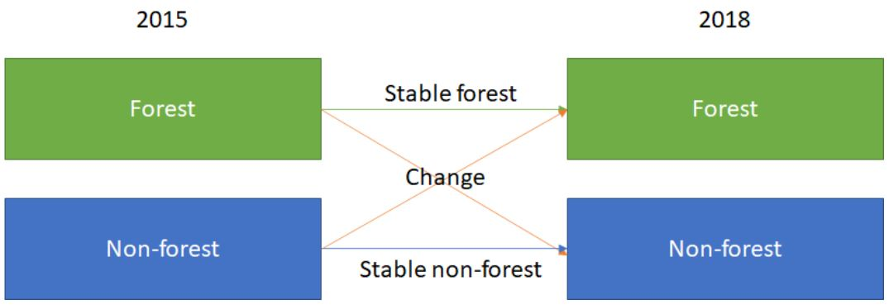
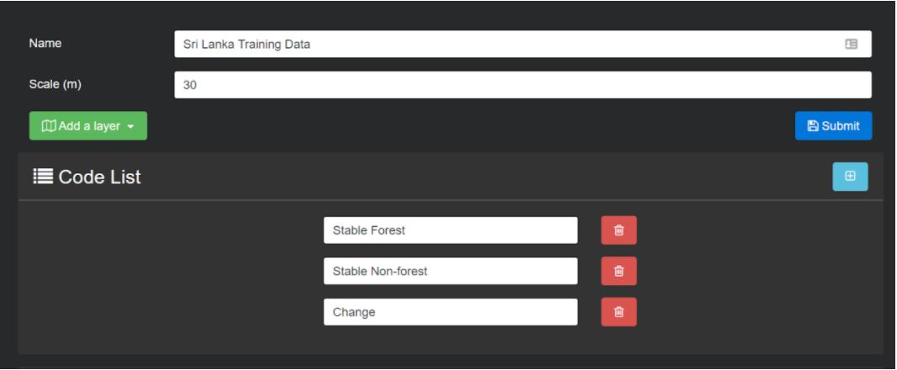
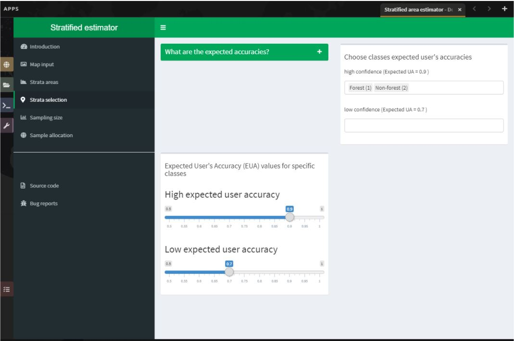
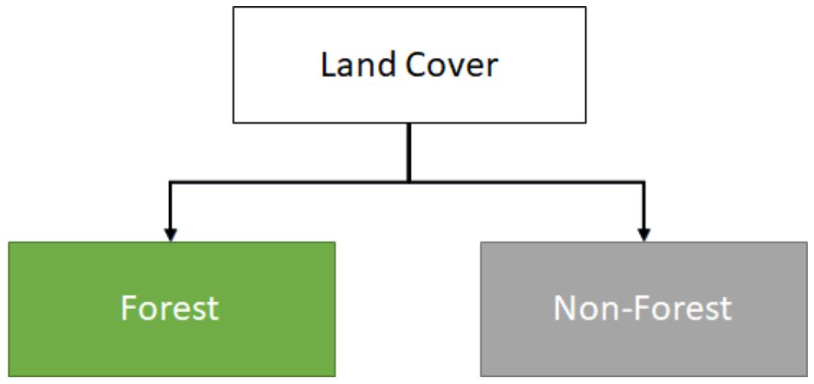
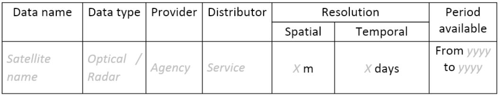
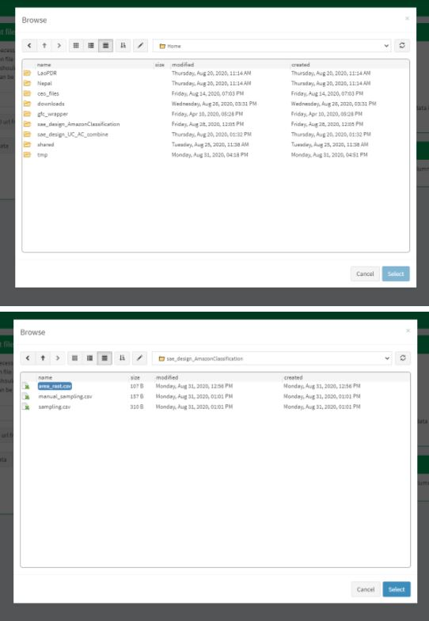

# Welcome to area estimation with SEPAL and CEO!

Welcome to area estimation with SEPAL and CEO. In this manual, you will learn how to perform area estimation for land use/land cover and two date change detection classifications. We will use sample-based approaches to area estimation. This approach is preferred over pixel-counting methods because all maps have errors. For example, maps derived from land cover land use classifications may have errors due to pixel mixing, or noise in the input data. Using pixel-counting methods will produce biased estimates of area, and you cannot tell whether these are overestimates or underestimates. Sample based approaches create unbiased estimates of area and the error associated with your map.

The goal of this manual is to teach you how to perform these tasks such that you can conduct your own area estimation for land use/land cover or change detection classifications.

In this manual, you will find four modules covering methods, and one module covering the documentation needed for replicating these methods. The modules are as follows:

* In Module 1, you will learn how to generate mosaics based on satellite imagery in SEPAL. You will learn how to build these mosaics by selecting different data sources and images based on dates and cloud cover.
* In Module 2, you will learn how to perform a land use/land cover image classification using random forest methods. You will learn how to define your land uses and land covers, collect training data, and run your model.
* In Module 3, you will learn how to perform image change detection. Building on skills from Module 1 and Module 2, you will define what change looks like, collect training data, and run your model. You will also learn about different tools to perform time series analysis.
* In Module 4, you will learn how to calculate a sample-based estimate of area and error. You will learn how to use stratified random sampling and verification image analysis in order to calculate area and error estimates based on the classification you create in Module 2. You will also learn about some key documentation steps in preparation for Module 5.
* In Module 5, you will learn about documenting and archiving your area estimation project. The information in this step is required for your project to be replicated by yourself or your colleagues in the future, either for additional areas or points in time.

These exercises include step-by-step directions and are built to facilitate learning through reading and by doing. This manual will be accompanied by short videos, which will visually illustrate the steps described in the text.

* Para ver este manual en español, vaya aquí: (add links; if using pages will need to be separate repositories)
* Pour voir ce manuel dans français, allez ici:

To visualize the flow of this manual, see below:

  {:width="250px"}

Our primary tool for this Manual is the System for Earth Observation Data Access, Processing, & Analysis for Land Monitoring (SEPAL). SEPAL is a web based cloud computing platform that enables users to create image composites, process images, download files, create stratified sampling designs, and more all from your browser. SEPAL is a system for earth observations, data access, processing & analysis for land monitoring, which is a cloud-based computing software designed by the United Nation’s Food and Agricultural Organization (FAO) to aid in remote sensing applications in developing countries. SEPAL is part of the Open Foris suite of tools. Geoprocessing is possible via Jupyter, JavaScript, R, R Shiny apps, and Rstudio. SEPAL also integrates with Collect Earth Online (CEO) and the Google Earth Engine (GEE).

SEPAL provides a platform for users to access satellite imagery (Landsat and Sentinel-2) and perform change detection and land cover classifications using a set of easy-to-use tools. SEPAL was designed to be used in developing countries where internet access is limited and computers are often outdated and, thus, inefficient for processing satellite imagery. It achieves this by drawing on a cloud-based supercomputer, which enables users to process, store, and interpret large amounts of data. Many more advanced functions than what we will cover here are available in SEPAL for more advanced users.

We will also use two other tools that SEPAL integrates with: CEO and GEE. Collect Earth Online (CEO), is a free and open-source image viewing and interpretation tool, suitable for projects requiring information about land cover and/or land use. CEO enables simultaneous visual interpretations of satellite imagery, providing global coverage from MapBox and Bing Maps, a variety of satellite data sources from Google Earth Engine, and the ability to connect to your own Web Map Service (WMS) or Web Map Tile Service (WMTS). The full functionality is implemented online, no desktop installation is necessary. CEO allows institutions to create projects and leverage their teams to collect spatial data using remote sensing imagery. Use cases include historical and near-real-time interpretation of satellite imagery and data collection for land cover/land use model validation.

Google Earth Engine (GEE) combines a multi-petabyte catalog of satellite imagery and geospatial datasets with planetary-scale analysis capabilities and makes it available for scientists, researchers, and developers to detect changes, map trends, and quantify differences on the Earth's surface. The code portion of GEE (called Code Editor) is a web-based IDE for the Earth Engine JavaScript API. Code Editor features are designed to make developing complex geospatial workflows fast and easy. The Code Editor has the following elements: JavaScript code editor; a map display for visualizing geospatial datasets; an API reference documentation (Docs tab); Git-based Script Manager (Scripts tab); Console output (Console tab); Task Manager (Tasks tab) to handle long-running queries; Interactive map query (Inspector tab); search of the data archive or saved scripts; and geometry drawing tools.

You can find more information here:

* An older forest change detection manual for SEPAL: [Forest Cover Change Detection with SEPAL](https://drive.google.com/file/d/1kPE2wFNDqNpXycqTJfNUtZf9iWsQHcab/view?usp=sharing)
* Olofsson et al 2014: [FAO - SFM Tool Detail: Good practices for estimating area and assessing accuracy of land change](http://www.fao.org/sustainable-forest-management/toolbox/tools/tool-detail/en/c/411863/)
* CEO documentation: [https://collect.earth/support](https://collect.earth/support)
* GEE documentation: [ Earth Engine Code Editor from Google Earth Engine](https://developers.google.com/earth-engine/guides/playground)
* REDD Compass: [Front Page - GFOI](https://reddcompass.org/frontpage)
* Reporting and Verification: [Reporting and Verification - GFOI](https://reddcompass.org/reporting-verification)


## Getting started

  

### Sign Up to SEPAL

You can request an account by visiting [sepal.io](sepal.io) and clicking “Sign Up”. This will take you to a Google Doc signup form to fill out. You will be set up with an account within a day or so.

  

1. If you do not have a SEPAL account, you can request access [here](http://tinyurl.com/fao-sepal ).
2. To request access to SEPAL, you will simply need to enter your email address, name, institution or country and a brief explanation of why you want to use SEPAL.

### Sign Up to CEO

1. In your browser window, navigate to [https://collect.earth/](https://collect.earth). CEO supports Google Chrome, Mozilla Firefox, and Microsoft Edge.
2. Click **Login/Register** on the upper right.
3. To set up a new account, click on **Register a new account** and follow the instructions.
4. When you have an account, login with your email and password.
5. If you forget your password, click on **Forgot your password?** and follow the instructions.

### Sign up to GEE

Signing up for Google Earth Engine is required in order to properly export images and data products from SEPAL.

1. You will need to have a Google email in order to sign up. If you don’t have one already, you can set one up [here](http://mail.google.com/mail/signup).
2. To request a GEE account, please visit [https://earthengine.google.com/new_signup/](https://earthengine.google.com/new_signup/).
3. Once you have a Google Earth Engine account, you can access GEE here: [https://code.earthengine.google.com/](https://code.earthengine.google.com/)

## Project Planning Information

Project planning and methods documentation play a key role in any remote sensing analysis project. While we use example projects in this Manual, in the future you may use these techniques for your own projects. We encourage you to think about the following items to ensure your resulting products will be relevant, and that your chosen methods are well documented and transparent.

1. Descriptions and Objectives of the Project (State issues and information needs).
	1. Are you trying to conform to an IPCC Tier?
2. Descriptions of the end user product (data, information, monitoring system or map that will be created by the project).
	1. What type of information do you need? A map? An inventory? A change product? (e.g. do you need to know where different land cover types exist or do you just need an inventory of how much there is?)
3. How will success be defined for this project? Do you require specific accuracy or a certain level of detail in the final map product?
4. Description of the project area / extent (national/subnational/specific forest/etc.)
5. Description of the features/classes to be modeled or mapped.
	1. Do you have a national definition of “forest”?
	1. Are you aware of the IPCC guidelines for the recommended land use classes and how they will relate to mapping land cover?
	1. Do you have key categories that will drive different analysis techniques?
6. Considerations for measuring, reporting, and verifying:
	1. Do you have a strategy; do you know what is required? Do you know where to get the required information? Looking ahead, are you on the right path (who are the decision makers that will inform these strategies?)
	1. What field data will be required for classification and accuracy assessment?
	1. Do you have an existing National Forest Monitoring System (NFMS) in place?
7. Will you supplement your remote sensing project with existing data (local data on forest type, management intent, records of natural disturbance…)?
8. Partnerships (vendors, agencies, bureaus, etc.)

# Module 1: Mosaic image generation

Generating mosaics of remote sensing data from satellite data is the first step in our classifications. In this Module, you will learn how to navigate SEPAL and how to create mosaics using imagery from the Landsat or Sentinel satellites. At the end of this section, you will be able to create the satellite imagery mosaics you will need for Modules 2 & 3.

This module should take you approximately 1-2 hours.

## Exercise 1.1: An introduction to SEPAL

In this exercise, you will be introduced to the SEPAL interface. You will learn how to access SEPAL’s features to facilitate the remote sensing exercises in later modules.

Objectives | Prerequisites
-------------- | ---------------
Navigate the SEPAL interface | Internet access
Learn about the functionality of SEPAL | SEPAL account (see ‘Getting Started’)

### Part 1: Open SEPAL

1. Navigate to [https://sepal.io/](https://sepal.io/) to open SEPAL.
2. Type in your **Username** and **Password** and click **Login.**

  

*When working in SEPAL, do not click your browser’s back button. This will go back to the previous webpage. Use the buttons within SEPAL to navigate to previous pages. There may also be an arrow in the upper left or right-hand corner of the SEPAL interface to navigate to a previous window.*

### Part 2: SEPAL Interface Home

1. Once you are logged in, you will see the following screen. Notice that your username is displayed in the bottom right of the window.

  

2. There are four main navigation tabs in the dock on the left side of the screen.
	1. **Process:** select imagery and create mosaics.
	1. **Files:** navigate through your personal SEPAL folders. This is where you can download or delete data, as well as visualize it using the Data Visualization link.
	1. **Terminal:** access to the command line for the LINUX server.
	1. **Apps:** links to a variety of pre-loaded tools.
3. At the lower left is the red **Tasks** tab. Clicking on this brings up a list of currently running tasks.
4. **Account Information** can be found in the bottom right of the webpage by clicking the button that shows your username. This opens an overlay that displays important user account information.
5. You can edit your user account info, including Name, Password, Email and Organization here. Click **Save** to make those changes permanent. However, you cannot edit your Username in this interface.
	1. Change the Google Account associated with your SEPAL account by clicking **Use my own Google Account** and following the instructions. SEPAL relies on Google Drive as a storage space for data accessed through the platform. Any imagery tiles or mosaics that you “retrieve” will first be saved to a Google Drive account before you can visualize and process them in SEPAL.


> **Note: Be sure to connect your Google Account in order to be able to Retrieve Mosaics in the next Exercise 1.2. You should use the same account you used to sign up for Google Earth Engine.**


6. Next to your **Account Information** is a section called **User Report**, represented by the **$ X/h**. This shows you the allotted budgets you have. An instance refers to any of the various processes that you can perform in SEPAL. If you are running any processes in your current session, they will show up here under Sessions.

    


### Part 3: Process Tab


1. Click the **Process** tab on the left side of the window.

      


2. You should now see four options in the center of the screen.
	1. **Optical Mosaic** allows you to create a mosaic using Landsat and/or Sentinel 2 data. This is what we will do in Exercise 1.2.
	1. **Radar Mosaic** allows you to create a mosaic using Sentinel 1 data.
	1. **Classification** allows you to use a random forest model to classify images from SEPAL or GEE. This will be the focus of Module 2.
	1. **Time Series** allows you to download time series information to your SEPAL storage.
3. When you click on one of these options, it will open a new tab with the GUI interface that allows you to specify your desired options.

### Part 4: Files Tab

1. Click the green **Files** tab on the left side of the window. This will display all of your files in SEPAL.
2. For example, click the **downloads** folder to expand it. This will display the folders containing any of the data you have downloaded in SEPAL. If you have not downloaded mosaics in SEPAL yet, then this folder will be empty.

  

3. Notice that there are four buttons at the top right of the window. The three rightmost buttons are inactive, but activate when you select a file.

	1. The left button will show hidden files (files and folder names starting with ‘.’).
	1. The second button will download selected data to your local computer.
	1. The third button will delete the selected folder or file.
	1. The last button will clear your selection.

### Part 5: Terminal Tab

1. Click the **Terminal** tab on the left side of the screen.
2. This links you to the Linux command line that you can use in a variety of ways to manage data, load data from an outside location or process data using a series of commands.
3. When you initially load the Terminal, you will see information about your usage and the available types of instances you can initialize.
4. One of the most important features of the Terminal is the ability to increase your instance size. The default instance is not sufficient for analyzing large amounts of data, for example running a classification on a large area.
	1. To increase the size of your instance, first examine the “Available instance types” table. This is updated periodically but an example from September of 2020 is shown below.
	1. Choose an instance Type that fits your needs. Frequently a t2 or m2 is sufficient and cost effective.
	1. Next to the “Select (t1):” text, type in ‘t2’ or your chosen instance type.
	1. Press Enter on your keyboard.
	1. Wait for the new instance to start. This will take several minutes.


### Part 6: Apps Tab

1. Click the **Apps** tab on the left side of the screen. This will open up a screen that shows applications that you can access through SEPAL.


2. This will bring up a list of apps you can run in SEPAL. More information about each app is found by clicking on the “i” on the right hand side. Some of the apps include:
	* **R Studio:** provides access to R environment where you can run processing scripts and upload data to your SEPAL folder.
	* **Stratified Area Estimator- Design:** tool for creating stratified designs to estimate areas. We will use this tool in Module 4.
	* **Stratified Area Estimator- Analysis:** tool for analyzing the results of your stratified design sampling to estimate areas. We will use this tool in Module 4.
	* **Geo Processing- Beta:** offers a selection of easy-to-use change detection and segmentation tools.
	* **BFAST Explorer:** tool for performing pixel-based time series analysis of Landsat Surface Reflectance data.

**Congratulations! You have successfully completed this exercise. You now know how to navigate the SEPAL interface and access its many tools and functions.**

## Exercise 1.2: Mosaic generation (Landsat & Sentinel 2)

SEPAL provides a robust interface for generating Landsat and Sentinel 2 mosaics. Mosaic creation is the first step for the image classification and two date change detection processes covered in Modules 2 and 3 respectively. These mosaics can be downloaded locally or to your Google Drive.

In this exercise, you will create a Landsat mosaic for the Mai Ndombe region of the Democratic Republic of the Congo, where REDD+ projects are currently underway.

Objectives | Prerequisites
------------- | ----------------
Learn how to create an image mosaic | SEPAL account
Become familiar with a variety of options for selecting dates, sensors, mosaicking and download options. |  
Create a cloud-free mosaic for 2016 |  

### Part 1: Create a Landsat Mosaic

1. If SEPAL is not already open, click to open SEPAL in your browser: https://sepal.io/ and login.
2. Click on the **Processing** tab.
3. Then, click on **Optical Mosaic.**
4. When the Optical Mosaic tab opens, you will see an **Area of Interest** window in the lower right hand corner of your screen.
	1. There are three ways to choose your area of interest. Bring up the menu by clicking the carrot to the right of the window label.
		1. Select Country/Province (the default).
		1. Select from EE table
		1. Draw a polygon.

  


5. We will use the **Select a country/province** option.
	1. In the list of countries that pops up, scroll down until you see the available options for **Congo, Dem Republic of.** Note there is also the Republic of Congo, which is not what we’re looking for.
	1. Under Province/Area, notice that there are many different options.
	1. Select **Mai-Ndombe,** then click **Next.**

  


6. In the **Date** menu you can select the **Year** you are interested in or click on **More.**
	1. This interface allows you to refine the dates or seasons you are interested in.
	1. You can select a **target date** (The date in which pixels in the mosaic should ideally come from), as well as adjust the start and end date flags.
	1. You can also include additional seasons from the past or the future by adjusting the **Past Seasons** and **Future Seasons** slider. This will include additional years’ data of the same dates specified. For example, if you’re interested in August 2015, including one future season will also include data from August 2016. This is useful if you’re interested in a specific time of year but there is significant cloud cover.
	1. For this exercise, let’s create imagery for the dry season of 2019.
		1. Select July 1 of 2019 as your target date (2019-07-01), and move your date flags to May 1-September 30.
		1. Click **Apply.**


7. Now select the **Data Sources (SRC)** you’d like. Here, select the **Landsat L8 & L8 T2** option. The color of the label turns brown once it has been selected.
	1. **L8** began operating in 2012 and is continuing to collect data;
	1. **L7** began operating in 2001, but has a scan-line error that can be problematic for dates between 2005-present; and
	1. **L4-5 TM,** which collected data from July 1982-May 2012.
	1. **Sentinel 2 A+B** began operating in June 2015.
	1. Click **Done.**
8. Now SEPAL will load a preview of your data. By default it will show you where RGB band data is available. You can click on the RGB image at the bottom to choose from other combinations of bands or metadata.
	1. When it is done, examine the preview to see how much data is available. For this example, coverage is good. However, in the future when you are creating your own mosaic, if there is not enough coverage of your area of interest, you will need to adjust your parameters.
	1. To do so, notice the five tabs in the lower left. You can adjust the initial search parameters using the first three of these tabs. For example, Click on **Dat** to expand the date range if you would like.
	1. The last two tabs are for **scene selection** and **composite,** which are more advanced filtering steps. We’ll cover those now.


9. We’re now going to go through the **scene selection process.** This allows you to change which specific images to include in your mosaic.
	1. You can change the scenes that are selected using the **SCN** button on the lower right of the screen. You can use all scenes or select which are prioritized. You can revert any changes by clicking on **Use All Scenes** and then **Apply.**
	1. Change the **Scenes** by selecting **Select Scenes** with Priority: **Target Date**


10. Click Apply. The result should look like the below image.
  1. Notice the collection of circles over the Mai Ndombe study area and that they are all populated with a zero. These represent the locations of scenes in the study area and the numbers of images per scene that are selected. The number is currently 0 because we haven’t selected the scenes yet.
  1. Click the Auto-Select button to auto-select some scenes.


11. You may set a minimum and maximum number of images per scene area that will be selected. Increase the minimum to 2 and the maximum to 100. Click **Select Scenes.** If there is only one scene for an area, that will be the only one selected despite the minimum.


12. You should now see imagery overlain with circles indicating how many scenes are selected.


13. You will notice that the circles that previously displayed a zero now display a variety of numbers. These numbers represent the number of Landsat images per scene that meet your specifications.
	1. Hover your mouse over one of the circles to see the footprint (outline) of the Landsat scene that it represents. Click on that circle.


14. In the window that opens, you will see a list of selected scenes on the right side of the screen. These are the images that will be added to the mosaic. There are three pieces of information for each:
	1. Satellite (e.g. L8, L7, L5 or L4)
	1. Percent cloud cover !
	1. Number of days from the target date
	1. To expand the Landsat image, hover over one of the images and click **Preview.** Click on the image to close the zoomed in graphic and return to the list of scenes.
	1. To remove a scene from the composite, click the **Remove** button when you hover over the selected scene.


15. On the left hand side, you will see **Available Scenes,** which are images that will not be included in the mosaic but can be added to it. If you have removed an image and would like to re-add it or if there are additional scenes you would like to add, hover over the image and click **Add.**
	1. Once you are satisfied with the selected imagery for a given area, click **Close** in the bottom right corner.
  1. You can then select different scenes (represented by the circles) and evaluate the imagery for each scene.


16. You can also change the composing method using the **CMP** button on the lower right.
	1. Notice that there are several additional options including shadow tolerance, haze tolerance, NDVI importance, cloud masking and cloud buffering.
	1. For this exercise, we will leave these at their default settings.
	1. If you make changes, click Apply after you’re done.


17. Now we’ll explore the **Bands** dropdown.
	1. Click on the **Red Green Blue** at the bottom of the page.


18. The below dropdown menu will appear.
1. Select the **NIR, RED, GREEN** band combination. This band combination displays vegetation as red, with darker reds indicating dense vegetation. Bare ground and urban areas appear grey or tan, while water appears black. NIR stands for near infrared.
1. Once selected, the preview will automatically show what the composite will look like.
1. Use the scroll wheel on your mouse to zoom in to the mosaic and then click and drag to pan around the image. This will help you assess the quality of the mosaic.


19. The map now shows the complete mosaic that incorporates all of the user-defined settings.


20. Using what you’ve learned, take some time to explore adjusting some of the input parameters and examine the influence on the output. Once you have a composite you are happy with, we will download the mosaic (instructions follow).
	1. For example, if you have too many clouds in your mosaic, then you may want to adjust some of your settings or choose a different time of year when there is a lower likelihood of cloud cover.
	1. The algorithm used to create this mosaic attempts to remove all cloud cover, but is not always successful in doing so. Portions of clouds often remain in the mosaic.


### Part 2 Name and Save your Recipe and Mosaic

1. Now, we will name the ‘recipe’ for creating the mosaic and explore options for the recipe.
	1. You will use this recipe when working with the classification or change detection tools, as well as when loading SEPAL mosaics into SEPAL’s Collect Earth Online.
	1. You can make the recipe easier to find by naming it. Click on the tab in the upper right and type in a new name. For this example use *MiaNdombe_LS8_2019_Dry.*
	1. Now let's explore options for the recipe. Click on the three lines in the upper right hand corner.
		1. You can save the recipe (SEPAL will do this automatically on retrieval) so that it is available later.
		1. You can also **Duplicate the recipe.**This is useful for creating two years of data, as we will do in Module 3.
		1. Finally you can Export the recipe. This downloads a zip file with a JSON of your mosaic specifications.
	1. Click on **Save recipe….** This will also let you rename the mosaic if you choose.


2. Now if you click on the three lines icon, you should see an additional option: **Revert to old revision…**


3. Clicking on this option brings up a list of auto-saved versions from SEPAL. You can use this to revert changes if you make a mistake.
	1. Now, when you open SEPAL and click the Search option, you will see a row with this name that contains the parameters you just set.

  


4. Finally, we will save the mosaic itself. This is called ‘retrieving’ the mosaic. This step is necessary to perform analysis on the imagery.
	1. To download this imagery mosaic to your SEPAL account, click the **Retrieve** button.


	1. A window will appear with the following options:
		1. **Bands to Retrieve:** select the desired bands you would like to include in the download.
			1. Select the **Blue, Green, Red, NIR, SWIR 1 and SWIR 2** bands. These are visible spectrum and infrared data collected by Landsat.
			1. Other bands that are available include Aerosol, Thermal, Brightness, Greenness, and Wetness. More information on these can be found at: https://landsat.gsfc.nasa.gov/landsat-data-continuity-mission/.
			1. Metadata on Date, Day of Year, and Days from Target can also be selected.
		1. **Scale:** the resolution of the mosaic. Landsat data is collected at 30m resolution, so we will leave the slider there.
		1. **Retrieve to:** Sepal Workspace is the default option. Other options may appear depending on your permissions.
	1. When you have the desired bands selected, click **Retrieve.**
	1. You will notice the **Tasks** icon is now spinning. If you click on it, you will see the data retrieval is in process. This step will take some time.


*Note: This will take 25 minutes or more to finish downloading, however, you can move on to the next exercise without waiting for the download to finish. *

**Congratulations! You have successfully completed this exercise. You now know how to create a Landsat mosaic using the many customizable parameters in SEPAL.**

# Module 2: Image classification

The main goal of this Module is to construct a single-date land cover map by classification of a Landsat composite generated from Landsat images. Image classification is frequently used to map land cover, describing what the landscape is composed of (grass, trees, water, impervious surface), and to map land use, describing the organization of human systems on the landscape (farms, cities, wilderness). Learning to do image classification well is extremely important and requires experience. So here is your chance to build some experience. You will first consider the types of land cover classes you would like to map and the amount of variability within each class.

There are both supervised (uses human guidance including training data) and unsupervised (no human guidance) classification methods. The random forest approach used here uses training data and is thus a supervised classification method.

There are a number of supervised classification algorithms that can be used to assign the pixels in the image to the various map classes. One way of performing a supervised classification is to utilize a Machine Learning algorithm. Machine Learning algorithms utilize training data combined with image values to learn how to classify pixels. Using manually collected training data, these algorithms can train a classifier, and then use the relationships identified in the training process to classify the rest of the pixels in the map. The selection of image values (e.g., NDVI, elevation, etc.) used to train any statistical model should be well thought out and informed by your knowledge of the phenomenon of interest to classify your data (e.g., into forest, water, other, and clouds).

In this module, we will create a land cover map using supervised classification in SEPAL. We will train a random forest machine learning algorithm to predict land cover with a user generated reference data set. This data set is collected either in the field or manually through examination of remotely sensed data sources such as aerial imagery. The resulting model is then applied across the landscape. You will complete an accuracy assessment of the map output in Module 4.

Before starting your classification, you will need to create a response design with details about each of the land covers/land uses that you want to classify (Exercise 2.1); create mosaics for your area of interest (in Exercise 2.2 we will use a region of Brazil); and collect training data for the model (Exercise 2.3). Then, in Exercise 2.4 we will run the classification and examine our results.

The workflow in this module has been adapted from exercises and material developed by Dr. Pontus Olofsson, Christopher E. Holden, and Eric L. Bullock at the Boston Education in Earth Observation Data Analysis in the Department of Earth & Environment, Boston University. To learn more about their materials and their work, visit their github site at [https://github.com/beeoda](https://github.com/beeoda).

At the end of this module you will have a classified land use land cover map.

This module takes approximately 4 hours to complete.

## Exercise 2.1: Response Design for Classification

Creating consistent labelling protocols is necessary for creating accurate training data and later, accurate sample based estimates (see Module 4). They are especially important when more than one researcher is working on a project and for reproducible data collection. Response design helps a user assign a land cover / land use class to a spatial point. The response design is part of the metadata for the assessment and should contain the information necessary to reproduce the data collection. The response design lays out an objective procedure that interpreters can follow and that reduces interpreter bias.

In this exercise, you will build a decision tree for your classification along with much of the other documentation and decision points (for more on decision points, please see Module 5, Exercise 5.1).

Objectives | Prerequisites
-------------- | -------------------
Learn how to create a classification scheme for land cover land use classification mapping. | None

### Part 1: Specify the Classification Scheme

“Classification scheme” is the name used to describe the land cover and land use classes adopted. It should cover all of the possible classes that occur in the area of interest. Here, you will create a classification scheme with detailed definitions of the land cover and land use classes to share with interpreters.

1. Create a decision tree for your land cover or land use classes. There may be one already in use by your department.  The tree should capture the most important classifications for your study. Here is an example:


	1. This example includes a hierarchical component. For example, the green and red categories have multiple sub-categories, which might be multiple types of forest or crops or urban areas. You can also have classification schemes that are all one level with no hierarchical component.
	1. For this Exercise, we’ll use a simplified land cover and land use classification as follows:


	1. When creating your own decision tree, be sure to specify if your classification scheme was derived from a template, including the IPCC land-use categories, CLC, or LUCAS.
	1. If applicable, your classification scheme should be consistent with the national land cover and land use definitions. In cases where the classification scheme definition is different from the national definition, you will need to provide a reason.
2. Create a detailed definition for each land cover and land use and change class included in the classification scheme. We recommend you include measurable thresholds.
	1. Our classification will take place in Brazil, in an area of the Amazon rainforest undergoing deforestation.
		1. We’ll define Forest as an area with over 70% tree cover.
		1. We’ll define Non-forest as areas with less than 70% tree cover. This will capture urban areas, water, and agricultural fields.
	1. For creating your own classifications, here’s some things to keep in mind:
		1. It is important to have definitions for each of the classes. A lack of clear definitions of the land cover classes can make the quality of the resulting maps difficult to assess, and challenging for others to use. The definitions you come up with now will probably be working definitions that you find you need to modify as you move through the land cover classification process. As you become more familiar with the landscape, data limitations, and the ability of the land cover classification methods to discriminate some classes better than others, you will undoubtedly need to update your definitions.
		1. As you develop your definitions, you should be relating back to your applications. Make sure that your definitions meet your project objectives. For example, if you are creating a map to be used as part of your UNFCCC greenhouse gas reporting documents you will need to make sure that your definition of forest meets the needs of this application. The below image is an excerpt of text from the Methods and Guidance from the Global Forest Observations Initiative (GFOI) document that describes the Intergovernmental Panel on Climate Change (IPCC) 2003 Good Practice Guidance (GPG) forest definition and suggestions to consider when drafting your forest definition.
			1. When creating your own decision tree, be sure to specify if your definitions follow a specific standard, e.g., using ISO standard Land Cover Meta-Language (LCML, ISO 19144-2) or similar.
		1. During this online training course, you will be mapping land cover across the landscape using the Landsat composite, a moderate resolution data set. You may develop definitions based upon your knowledge from the field or from investigating high resolution imagery. However, when deriving your land cover class definitions, it’s also important to be aware of how the definitions relate to the data used to model the land cover. You will continue to explore this relationship throughout the exercise.
			1. Will the spectral signatures between your land cover categories differ? If the spectral signatures are not substantially different between classes, is there additional data you can use to differentiate these categories? If not, you might consider modifying your definitions.

More resources are available online, for example at [http://www.ipcc.ch/ipccreports/tar/wg2/index.php?idp=132](http://www.ipcc.ch/ipccreports/tar/wg2/index.php?idp=132)

## Exercise 2.2: Create mosaic for classification

We first need an image to classify before running a classification. For best results, we will need to create an optical mosaic with good coverage of our study area. We will build on knowledge gained in Module 1 to create an optical mosaic in SEPAL and retrieve it to Google Earth Engine.

In SEPAL you can run a classification on either a mosaic recipe or on a GEE asset. It is best practice to run a classification using an asset rather than on-the-fly with a recipe. This will improve how quickly your classification will export and avoid computational limitations.

Objectives | Prerequisites
-------------- | ------------------
Build on knowledge gained in Module 1. | SEPAL account
Create a mosaic to be the basis for your classification | Module 1

### Part 1: Creating and exporting a mosaic for a drawn AOI

We will create a mosaic for an area in the Amazon basin. If any of the steps for creating a mosaic are unfamiliar, please revisit Module 1, particularly Exercise 1.2.

1. Navigate to the Process tab, then create a new optical mosaic by selecting Optical Mosaic on the Process menu.
2. Under **Area of Interest:**
	1. Select **Draw Polygon** from the dropdown list.


	1. Navigate using the map to the State of Rondônia and either draw a polygon around it or draw a polygon within the borders. A smaller polygon will export faster.


3. Now use what you have learned in Module 1 to create a mosaic with imagery from the year 2019 (whole year or part of year, your choice). Don’t forget to consider which satellites you would like to include and which scenes you would like to include (all, some).
4. Your preview should include imagery data across your entire area of interest. This is important for your classification. Try also to get a cloud-free mosaic, as this makes your classification easier.
5. Name your mosaic for easy retrieval. Try “Module2_Amazon”.
6. When you’re satisfied with your mosaic, **Retrieve** it to Google Earth Engine. Be sure to include the red, green, blue, nir, swir1, and swir2 layers. You may choose to add the greenness, etc. layers as well.

### Part 2: Finding your Earth Engine Asset

For Exercise 2.3, you will need to know how to find your Earth Engine Asset.

1. Navigate to [https://code.earthengine.google.com/](https://code.earthengine.google.com/) and login.
2. Navigate to your **Assets** tab in the left hand column.
3. Under **Assets,** look for the name of the mosaic you just exported.
4. Click on the mosaic name.
5. You will see a window with information about your mosaic pop up.
6. Click on the two overlapping box icon to copy your asset’s location.


## Exercise 2.3: Training Data Collection in CEO-SEPAL

In this exercise, we will learn how to collect training data using the CEO-SEPAL tool. These training data points will become the foundation of our classification in Exercise 2.4. High quality training data is necessary to get good land cover map results. In the most ideal situation, training data is collected in the field by visiting each of the land cover types to be mapped and collecting attributes. When field collection is not an option, the second best choice is to digitize training data from high resolution imagery, or at the very least from the imagery to be classified.

In this assignment, you will create training data points using a combination of high-resolution imagery and the Landsat composite. These will be used to train the classifier in a supervised classification using SEPAL’s random forests algorithm. The goal of training the classifier is to provide examples of the variety of spectral signatures associated with each class in the map.


Objectives | Prerequisites
-------------- | ------------------
Create training data for your classes that can be used to train a machine learning algorithm. | SEPAL account
  | Land cover categories defined in Exercise 2.1.
  | Mosaic created in Exercise 2.2.

### Part 1: Setting Up a Training Project

To collect training data, we will need to create a ceo-sepal project from within SEPAL. There are two ways to do this. The easier way is to begin the classification and follow a link when prompted. This is the approach we will use here.

However, you can also navigate to [https://sepal.io/ceo](https://sepal.io/ceo), log in, and add a project directly through this interface (starting at Step 3a, below). If you use this route, you will need to create the classification later, using steps 1-3 below.

1. In the **Process** menu, click the green plus symbol and select **Classification.**
2. Add the Amazon optical mosaic for classification:
	1. Click **+Add** and choose **Earth Engine Asset.**
	1. Enter the Earth Engine Asset ID for the mosaic. The ID should look like “users/username/Module2_Amazon”.
		1. Remember that you can find the link to your Earth Engine Asset ID via Google Earth Engine’s Asset tab (see Exercise 2.2 Part 2).
	1. Select bands: Blue, Green, Red, NIR, SWIR1, & SWIR2. You can add other bands as well if you included them in your mosaic.
	1. Click **Apply,** then click **Next.**
3. In the Training Data menu, click **Open training data collection tool.**This will open a new window/tab.


	1. Click **Add project.**
	1. Type in a unique name for your training dataset, such as “Amazon training data”.
	1. Use **TRAINING DATA** as the **Type.**
		1. The **Training Data** option enables you to create a project from scratch. To use this method, you will need to identify a set of land cover classes to classify (code list) and you will need to add imagery that will be used to identify the types of land cover. You will then manually place your training data on the map and classify them.
		1. **CEP** stands for Collect Earth Project and it contains a collection of training data points that have already been generated and just need to be classified based on the classes defined within the project. It typically contains a customized method for classifying training data that incorporates % cover.
	1. Once you select the training data option, you will notice a new parameter: **Scale (m).** This scale refers to the spatial resolution of the imagery you will be classifying to create your map product. Type in 30, as that is the spatial resolution of Landsat. This will create a plot that is 30 m by 30 m.
	1. Click the **\+** button to the right of the section that says **Code List.** When you click the **\+** button, an empty row is added to the Code List. You need two rows.
		1. Add “Forest” and “Non Forest” to the Code List.


	1. Add imagery to the CEO project by clicking on **Add a layer.** This is where you can select the background imagery you will use to collect the training data. You can add multiple different types of imagery, as well as different band combinations of the same imagery.
		1. Select Google Earth Engine (Assets) from the drop down menu.


		1. Add your Earth Engine Asset mosaic. We will add a true-color set of bands first.
			1. Name your layer. Try ‘Landsat 8 RGB.’
			1. Paste the link to your mosaic in GEE (see Part 2 in Exercise 2.2).
			1. Type in ‘red, blue, and green’ for bands.
			1. Use 0 and 3000 for min and max. You can alter these values slightly based on band min/max in the Landsat 8 satellite.
		1. Add your Earth Engine Asset mosaic, but type in ‘swir1,nir,red’ to get SWIR, NIR, and red bands. Use a min and max of 300 and 3200.
		1. You can also add additional band combinations. If you would like to add other versions of this mosaic with different band combinations, repeat steps 5-6, but use different bands and adjust the name according to the bands. For example, try NIR, red, green.
	1. There are a number of other imagery options in the **Add a layer** drop down menu. Feel free to experiment with these.


**Note: Digital Globe imagery no longer exists.**

4. When you’ve set up the project, click on the **Submit** button.
	1. Notice that the project is now listed. You can click edit if you want to adjust any of the settings for the project.

### Part 2: Collect Training Data Points

Now that the CEO-SEPAL project is set up, you are ready to begin collecting data points for each land cover class. In most cases, it is ideal to collect a large amount of training data points for each class that capture the variability within each class and cover the different areas of the study area. However, for this exercise, you will only collect a small number of points: around 25 per class. When collecting data points, make sure that your plot contains only the land cover class of interest (no plots with a mixture of your land cover categories).

To help you understand why the random forest algorithm might get some categories you are trying to map confused with others, you will use spectral signatures charts in CEO-SEPAL to look at the NDVI signature of your different land cover classes. You should notice a few things when exploring the spectral signatures of your land cover classes. First, some classes are more spectrally distinct than others. For example, water is consistently dark in the NIR and MIR wavelengths, and much darker than the other classes. This means that it shouldn’t be difficult to separate water from the other land cover classes with high accuracy.

Second, not all pixels in the same classes have the exact same values—there is some natural variability! Looking at NDVI (and other vegetation indices) spectral signatures will help you begin to understand the inherent variability of your land cover classes. Capturing this variation will strongly influence the results of your classification.

1. First, let’s become familiar with the CEO-SEPAL Interface.
	1. Click the blue **collect** button for the **Amazon training data** project.
	1. You will immediately notice that a black and grey map appears on the screen. There are two drop down menus at the upper left and upper right of the map.


	1. In the upper left corner of the map, the **SEPAL** option is the default dark grey map. You can switch this to **SATELLITE** for satellite imagery.
	1. In the upper right corner of the map, click the drop down menu that currently reads **Default.**
	1. Select **LANDSAT 8 RGB,** or the name of your RGB map.
	1. Use the scroll wheel on your mouse to zoom in to the study area. You can click-hold and drag to pan around the map. Be careful though, as a single click will place a point on the map.
		1. If you accidentally add a point, you can delete it by clicking on the red **Delete** button in the panel on the right.
	1. Zoom in close to the imagery (until you can see individual pixels) so that you can see the amount of detail in this Landsat mosaic.
	1. While zoomed in, click the image layer drop down and select **Default.** You should see a clear difference in spatial resolution between the 30-meter Landsat and the high-resolution (sub-meter) default Satellite imagery from Google (see below).


2. Start collecting forest training data.
	1. Next, zoom into an area that is clearly forested. When you find an area that is completely forested, click it once. Notice the information on the right side of the screen that popped up.
	1. You have just placed a training data point!
	1. Now you should switch back to the Landsat mosaic to make sure that this forested area is not covered with a cloud. This is a key step that you should do for every point you collect. If you mistakenly classify a cloudy pixel as Forest, then the results will be impacted negatively if your Landsat mosaic does have cloud-covered areas.
	1. Once you are satisfied with your training point, click the **Forest** button on the right side of the screen to classify the point.
		1. If you haven’t classified the point yet, then you can just click somewhere else on the map instead of deleting the record.


	1. The information on the screen is then minimized and added to a row on the right side of the screen.
		1. If you need to modify classification of any of your data points, you can click on the point ID to return to the classification (or delete) options.
		1. You can click the **Delete** button if you are not satisfied with the placement of the point.
3. Now let’s click to create another ‘Forest’ point and use it to explore the **Charts** option.
	1. There is a **Charts** drop down menu that allows you to look at the changes in spectral values over time at this point using a variety of spectral indices.
		1. **Enhanced Vegetation Index (EVI):** highlights areas of high biomass and is particularly responsive to variations in vegetation structure (as opposed to NDVI’s sensitivity to chlorophyll content).
		1. **EVI2:** a 2-band version of EVI.
		1. **The Normalized Differenced Moisture Index (NDMI):** estimates the amount of moisture in vegetation.
		1. **The Normalized Differenced Vegetation Index (NDVI):** a common vegetation index used to measure the amount of healthy, green vegetation in a given area. Forested pixels will typically have a NDVI value between 0.7 and 1.
		1. **The Normalized Differenced Water Index (NDWI):** highlights plant water content and is most commonly used to gauge plant water stress.
1. Click the **Charts** drop down menu and select **NDVI.** You should see a chart that looks similar to the below image.
		1. This chart shows the NDVI values (derived from Landsat) of the pixel you selected for all dates where data is available. These time series charts are important when identifying seasonal (e.g., flooding or leaf senescence of deciduous trees) or permanent land cover changes.
		1. The chart will take a minute or more to appear.
		1. Notice that there is a lot more data available for more recent years, while there are only a few data points in the graph for years prior to 2000.
		1. Place your mouse over the graph and move it from left to right. You’ll see that information on the acquisition date and an NDVI value pops up for each data point.
		1. Zoom into a temporal subset to see seasonal differences in NDVI values. Click on the chart near the year 2013 and drag it to the right to highlight a year or two worth of data. Release the click. Now you will see the chart has been zoomed into that subset time range making the data trends easier to read.
			1. Note that the Y-axis will scale to the range of values for the available data. Keep an eye on the Y-axis when analyzing different spectral signatures.
			1. Click the **Reset zoom** button to return to the full time series view.


	1. To close the chart, click anywhere outside of the chart.
	1. Explore some of the other vegetation or water indices using the Charts drop down.
	1. When you are done, click the **Forest** button again to close the class selection options.
4. Begin collecting the rest of the 25 **Forest** training data points throughout other parts of the study area.
	1. The study area contains an abundance of forested land, so it should be pretty easy to identify places that can be confidently classified as forest. If you’d like, use the charts function to ensure that there is a relatively high NDVI value for the point.
	1. Continue to switch back and forth between the Landsat mosaic and the base **Satellite** imagery to ensure that:
		1. you are placing data points within the extent of the mosaic and
		1. that you aren’t placing a point over a cloud in the mosaic.
	1. You will notice that the quality of the base **Satellite** imagery varies. This is where the charts can come in particularly handy. You may also find it useful to zoom out and zoom back in, as the imagery changes based on your zoom scale. The images below show the same general area, but at slightly different zoom scales.


	1. Collect about 25 points for the **Forest** land cover class.
	1. When you are done, zoom out to the full extent of the Amazon Landsat 8 image. Did you place data points somewhat equally across the full region? Are all points clustered in the same region? It’s best to make sure you have data points covering the full spatial extent of the study region, add more points in areas that are sparsely represented if needed.
3. Once you are satisfied with your array of forested training data points, move on to the **Non-Forest** training points.
	1. Since we are using a very basic set of land cover classes for this exercise, this should include agricultural areas, water, and buildings and roads. Therefore, it will be important that you focus on collecting a variety of points from different types of land cover throughout the study area.
	1. **Water** is one of the easiest classes to identify and the easiest to model, due to the distinct spectral signature of water.
		1. Look for water bodies within your Landsat image. On your **Landsat 8 SWIR** image, they will appear black.
		1. Collect 10-15 data points for Water and be sure to spread them throughout Lake Mai Ndombe, the water sources feeding into it, and a couple of the water bodies/rivers to the eastern side of the mosaic. Be sure to put 2-3 points on rivers.
		1. Look at the Chart of NDWI and NDVI to see if the points you are classifying are covered in water year-round.
		1. The spectral signature for water will be relatively low (0-0.4) when looking at the NDVI chart.
		1. Some wetland areas may have varying amounts of water throughout the year, so it is important to check the time series charts. If you encounter areas that look like water but have seasonally high NDVI, place your point in a different area that has a more distinct water signature. It is ideal to give the classifier points that are homogenous and unambiguous.


Let’s now collect some building and road non-forest Training Data.
	1. There are not very many residential areas in the region. However, if you look you can find homes with dirt roads, and there are some airports as well.


		1. Place a point or points within these areas and classify them as Non-forest. Do your best to avoid placing the points over areas of the town with lots of trees.
		1. Find some roads, and place points and classify as Non-forest. These may look like areas of bare soil. Both bare soil and roads are classified as Non-forest, so place some points on both.
	1. Next, place several points in grassland/pasture, shrub, and agricultural areas around the study area.
		1. As you’ve done before, look at the NDVI signature of the points you place before you actually classify them. Grasslands may have NDVI values between 0.4 and 0.6, sometimes a little higher.
	1. Shrubs or small, non-forest vegetation can sometimes be hard to identify, even with high-resolution imagery. Do your best to find vegetation that is clearly not forest. The NDVI signature of shrubs may be relatively high (0.6-0.8).
	1. The texture of the vegetation is one of the best ways to differentiate between trees and grasses/shrubs. Look at the below image and notice the clear contrast between the area where the points are placed and the other areas in the image that have rougher textures and that create shadows.


	1. Now collect **cloud** training data in the **Non-forest** class, if your Landsat has any clouds.
		1. If there are some clouds that were not removed during the Landsat mosaic creation process you will need to create training data for the clouds that remain so that the classifier knows what those pixels represent.
		1. Turn on the Landsat mosaic imagery and navigate to some distinct areas with clouds. Click to place additional **Non-forest** points.
		1. Pan around other parts of the mosaic and classify the clouds that you find. Ensure that the point you place only contains clouds and excludes any amount of vegetation. As you did with other classes, try and collect points in all parts of the study area.
		1. Sometimes clouds were detected during the mosaic process and were mostly removed. However, you can see some of the edges of those clouds remain.
		1. Note that you may not have any clouds in your Landsat imagery.


4. Continue collecting Non-forest points. Again, be sure to spread the points out across the study area.
5. Once again when you are done collecting data for these categories, zoom out to the full extent of the study region (Amazon Landsat 8 RGB data layer).
		1. Did you place data points somewhat equally across the full region?
		1. Are all points clustered in the same region?
		1. It’s best to make sure you have data points covering the full spatial extent of the study region, add more points in areas that are sparsely represented if needed.
6. When you are done collecting your training data, scroll through the list of training data that you have collected. Note that the number in parenthesis is the code that corresponds to the land cover type.
	1. 1=Forest;
	1. 2=Non-Forest

### Part 3: Export Data As CSV

Now we will download the training data we have collected.

1. Above your training data points you will see a blue Download CSV button.


2. Click the CSV button to download the reference data as a comma separated values format.
	1. You will either be prompted by your browser to choose a location to save the data to.
	1. Or the data will be automatically downloaded to the folder your browser uses for downloads, usually your Downloads folder.
3. Once downloaded, examine your data by opening it in an application which can view tables, such as Microsoft Excel.
	1. There are 4 different columns in the table:
		1. id—this is the same unique ID that you can see on the right side of the CEO-SEPAL interface.
		1. YCoordinate and XCoordinate—locational information for all of the training data (in the WGS 84, EPSG 4326, coordinate reference system).
		1. class—land cover class in integer form. Again, 1=Forest and 2=Non-Forest.


### Part 4: Uploading your .csv to Google Earth Engine

With all your training data points collected, you will now need to upload the data into Google Earth Engine to use it for classification.

1. To use this data in SEPAL, you need to first upload it into Google Earth Engine.
	1. Navigate to [https://code.earthengine.google.com/](https://code.earthengine.google.com/)
	1. Log into GEE using your account and then navigate to the Assets tab.
	1. Click **New.**
	1. Select **CSV file (.csv)** under the **Table Upload** section.


	1. In the new window that pops up, fill in the requested information.
		1. Select your **CSV file** from your local machine.
		1. Optionally, **rename** the asset.
		1. Choose the **asset id path.** This is the where the asset will be saved once uploaded
		1. Add XCoordinate and YCoordinate to the Advanced options **X column and Y columns.**


	1. Click Upload to initiate the upload.
		1. You may need to rename your csv if the filename has spaces. Do this in your computer’s file system and try again.
	1. After a few minutes your upload should be complete!
		1. Check the path where you uploaded your asset to confirm it has successfully uploaded.
		1. Click on the file name.
		1. Make note of your **TableID,** which you will need for Exercise 2.4.


**Congratulations! You have successfully completed this exercise. You now know how to use SEPAL’s version of Collect Earth Online to create training data for a supervised classification.**

## Exercise 2.4: Classification Using Machine Learning Algorithms (Random Forests) in SEPAL


As mentioned in the Module introduction, the classification algorithm you will be using today is called random forest.  The random forest algorithm creates numerous decision trees for each pixel. Each of these decision trees votes on what the pixel should be classified as. The land cover class that receives the most votes is then assigned as the map class for that pixel. Random forests are efficient on large data and accurate when compared to other classification algorithms.

To complete the classification of our mosaicked image you are going to use a random forests classifier contained within the easy-to-use Classification tool in SEPAL. The image values used to train the model include the Landsat mosaic values and some derivatives (such as NDVI). There are likely additional data sets that can be used to help differentiate land cover classes, such as elevational data. If that is the case, it would be good to load this into the project and include them in the model. Examples of additional data sets that would probably be quite helpful to differentiate classes include climatic and topographic (aspect, elevation) information.

After we create the map, you might find that there are some areas that are not classifying well. The classification process is iterative, and there are ways you can modify the process to get better results. One way is to collect more or better reference data to train the model. You can test different classification algorithms, explore object based approaches opposed to pixel based approaches, or be more creative with specifying the model predictor variables. In the case of being more creative with model predictor variables you can try using multiple dates of data (instead of a single date), or try using texture bands. The possibilities are many and should relate back to the nature of the classes you hope to map. Last but certainly not least is to improve the quality of your training data. Be sure to log all of these decision points in order to recreate your analysis in the future.
Objectives | Prerequisites
---------- | --------------
Run SEPAL’s classification tool. | SEPAL account
  | Land cover categories defined in Exercise 2.1.
  | Mosaic created in Exercise 2.2.
  | Training data created in Exercise 2.3.

### Part 0: Merging Asset Tables (Optional)

To get a more accurate training dataset, consider combining multiple training datasets. For example, if you’re completing these exercises as part of a group training, try combining your training data set with your neighbors’. We will show you how to do this using your .csv files, however if you are more familiar with GEE you can also combine files using code in GEE.

1. Navigate to your GEE table information as in Exercise 2.3 Part 4.
2. Click on Share.


3. Fill in your neighbor’s email address, set them as a **Reader** or **Writer,** and click **Add.**
4. Now copy the link and email it to your neighbor. Ask them to send you the link to their table.
5. Once you have their table’s address, click the table link that you were sent.
	1. Download the fusion table as a CSV just as you did with your own.
	1. Once you have your and their CSVs downloaded, open them in Microsoft Excel.
	1. Copy and paste the contents of your neighbor’s CSV to your own training data CSV.
		1. Do not include their column header.
		1. Only copy and paste the data.
	1. Save the CSV to your desired location and give it a unique name.

### Part 1: Run Supervised Classification in SEPAL

1. Ideally, your original classification output is still open in a separate tab. If so, navigate back to it and skip to Step 3.
2. If your window is not still open, navigate to SEPAL by clicking this link [https://sepal.io/](https://sepal.io/).
	1. In the **Process** menu, click the green plus symbol and select Classification.
	1. Add the Amazon optical mosaic for classification:
		1. Click **Add** and choose **Earth Engine Asset**
		1. Enter the Earth Engine Asset ID for the mosaic. The ID should look like “users/username/Module2_Amazon”
		1. Remember that you can find the link to your Earth Engine Asset ID via Google Earth Engine’s Asset tab (see Exercise 2.2 Part 2).
		1. Select bands: Blue, Green, Red, NIR, SWIR1, & SWIR2. You can add other bands as well if you included them in your mosaic.
		1. Click **Apply,** then click **Next.**
3. Now, we’ll add the Training Data we collected in Exercise 2.3 in the **TRN tab.**
	1. Enter the path to your Earth Engine asset in the EE Table ID field.


	1. In the **Class Column** field select the column name that is associated with the class. In our example this should be ‘class’.
	1. Click **Done.**
4. Now a preview will load.
5. Click on **AUX** to examine the auxiliary data sources available for the classification
	1. Auxiliary inputs are optional layers which can be added to help aid the classification. There are three additional sources available: Latitude - Includes the latitude of each pixel; Terrain - Includes elevation of each pixel from SRTM data; Water - Includes information from the JRC Global Surface water Mapping layers.
	1. Click on **Water.**
	1. Click **Apply.**
6. Again, after a few seconds, a preview of the classification will load.
	1. Your classified map may look different than the example land cover map shown below.
	1. Depending on the training data you collected, your classes may be substantially different.
	1. The quality of the output map is also dependent on the quality of the mosaic.


7. Now we’ll save our classification output.
	1. First, rename your classification by typing a new name in the tab.
	1. Click **Retrieve classification** in the upper right hand corner (cloud icon).
	1. Choose 30 m resolution.
	1. Retrieve as either a **Google Earth Engine Asset** or to your **SEPAL Workspace.** Choose to export to a GEE Asset if you would like to be able to share your results or perform additional analysis in GEE. Otherwise, export to your SEPAL workspace (recommended here for ease of use).
	1. Once the download begins, you will see the spinning wheel in the bottom left of the webpage in **Tasks.** Click the spinning wheel to observe the progress of your download.
	1. When complete, if you chose GEE Asset the file will be in your GEE Assets. If you chose SEPAL workspace, the file will be in your SEPAL downloads folder. (Browse > downloads > classification folder).


### Part 2: QA/QC considerations and methods

Quality assurance and quality control, commonly referred to as QA/QC, is a critical part of any analysis. There are two approaches to QA/QC: formal and informal. Formal QA/QC, specifically sample-based estimates of error and area are described in Module 4. Informal QA/QC involves qualitative approaches to identifying problems with your analysis and classifications to iterate and create improved classifications. Here we’ll discuss one approach to informal QA/QC.

Following analysis you should spend some time looking at your change detection in order to understand if the results make sense. We’ll do this by adding your classification to the SEPAL-CEO project we created in Part 2. This allows us to visualize the data and collect additional training points if we find areas of poor classification. Other approaches not covered here include visualizing the data in Google Earth Engine or in another program, such as QGIS or ArcMAP.

1. Check your Google Earth Engine Assets for your retrieved Amazon Classification map. Copy the **Image ID** link.
2. Navigate back to your SEPAL-CEO project at [https://sepal.io/ceo/](https://sepal.io/ceo/).
	1. Next to your Amazon project, click on **Edit.**
	1. Add a **new layer,** title it **Classification,** and add the information from your Google Earth Engine classification asset. You have two classes, so your Min should be 1, Max 2, and Bands ‘class’.
	1. Click Submit.


3. Now click Collect for your Amazon project.
4. Switch the imagery to your Classification and pan and zoom around the map. Black will be ‘Forest,’ and white is ‘Non-forest’ pixels.
5. Compare your Classification map to Landsat 8 imagery.
	1. What land cover was classified correctly?
	1. Where do you see errors on the map?
	1. What classes seem to have the most error?
	1. What do you think may have caused one class to be classified more accurately than another?
6. If your results make sense, and you are happy with them, great! Go on to the formal QA/QC in Module 4.
7. However if you are not satisfied, collect additional points of training data where you see inaccuracies following the same process as in Exercise 2.3. Then re-run the classification following the steps in Part 1.

**Congratulations! You now know how to produce map classifications in SEPAL.**

# Module 3: Image change detection

Image change detection allows us to understand differences in the landscape--or more correctly, in the satellite images taken of the landscape--over time. There are many questions that change detection methods can help answer, including “When did deforestation take place?” and “How much forest area has been converted to agriculture in the past 5 years?”

Most methods for change detection use algorithms backed by statistical methods to extract and compare information in the satellite images. To conduct change detection then, we need multiple mosaics or images, each one representing a point in time. Here, we will describe how to detect change between two dates using a simple model, however this theory can be expanded to include more dates. In addition, we’ll describe time series analysis, which generally looks at longer periods of time.

The objective of this module is to become associated with methods of detecting change for an area of interest using the SEPAL platform. This will build upon and incorporate what we have covered in the previous modules including: creating mosaics, creating training samples, and classifying imagery. This module is split into two exercises. The first addresses change detection using two dates, and the second more advanced methods using time series analysis with the BFAST algorithm and Landtrendr. At the end of this module you will know how to conduct a two-date change detection in SEPAL, have a basic understanding of the BFAST tool in SEPAL, and be familiar with TimeSYnc and LandTrendr.

This module should take you approximately 3 hours.

## Exercise 3.1: Two date change detection

In this Exercise, you will learn how to conduct a two-date change detection in SEPAL. The algorithm SEPAL uses ...

To use this algorithm, you will first need to have two imagery derived classifications, one for each point in time. In this example, you will create optical mosaics and classify them, building on skills learned in Modules 1 and 2. Alternatively, you may also use two classifications from your own research area.

Objectives | Prerequisites
---------- | -------------
Learn how to conduct a two-date change detection | SEPAL account
Build on skills learned in Modules 1 & 2 | Complete Modules 1 & 2 or be familiar with the skills covered


### Part 1: Create Mosaics for Change Detection

Before we can identify change, we first need to have images to compare. We will create two mosaics of Myanmar, generate some training data, and then classify the mosaics. This is discussed in detail in Module 1 & 2.

1. Open the **Process** menu
2. Click on **Optical Mosaic,** or click the **green plus symbol** to open the **Create Recipe** menu and then click on **Optical Mosaic.**
	1. Choose **Sri Lanka** for the Area of interest (AOI).
	1. Select 2015 for the Date (DAT).
	1. Select Landsat 8 (L8) as the source (SRC).
	1. In the Composite (CMP) menu, ensure the surface reflectance **(SR) correction** is selected and median is the compositing method.
3. Click **Retrieve Mosaic** and select **Blue, Green, Red, NIR, SWIR1, SWIR2,** then select Google Earth Engine Asset, and lastly click retrieve.

*If you don’t see the Google Earth Engine asset option, you’ll need to connect your Google account to SEPAL by clicking on your user name in the lower right.*


4. Repeat steps 2 & 3 but change the **Date** parameter to 2018.

*Notes: It may take a significant amount of time before your mosaics finish exporting.*

### Part 2: Create & Collect Change Classification Training Data

Now that we have the mosaics created, we will collect change training data. Though more complex systems can be used, we will consider two land cover classes that each pixel can be in 2015 or 2018: forest and non-forest. Thinking about change detection, we will use three options: stable forest, stable non-forest, and change. That is, between 2015 and 2018 there are four pathways: a pixel can be forest in 2015 and in 2018 (stable forest); a pixel can be non-forest in 2015 and in 2018 (stable non-forest); or it can change from forest to non-forest or from non-forest to forest. If you use this manual to guide your own change classification, remember to log your decisions including how you are thinking about change detection (what classes can change and how), and the imagery and other settings used for your classification.




1. First, we’ll create training data.
	1. In the Process menu, click the green plus symbol and select Classification.
	1. Add the 2015 and 2018 mosaics for classification:
		1. Click **Add** and choose **Earth Engine Asset**
		1. Enter the Earth Engine Asset ID for the mosaic. The ID should look like “users/username/srilanka2018”
			1. Remember that you can find the link to your Earth Engine Asset ID via Google Earth Engine’s Asset tab.
			1. For a refresher, see Module 2.
		1. Select bands: Blue, Green, Red, NIR, SWIR1, & SWIR2
		1. Click **Apply** and then repeat steps the previous steps for the 2018 mosaic.
		1. After adding both mosaics, click **Next.**
	1. Click **Open training data collection tool.** This will open a new window/tab.
		1. Click **Add project.**
		1. Create new project title “Sri Lanka Training Data” with **TRAINING DATA** as the **Type** and a **scale** of 30m.
		1. Add “Stable Forest”, “Stable Non-Forest”, and “Change” questions to the Code List





		1. Add imagery to the CEO project
			1. Add your Earth Engine Asset mosaics for both years.
			1. You can also add more than one band combination. See the example below.


		1. Add Hansen Forest Loss layers (loss, yearloss). These are found here: UMD/hansen/global_forest_change_2019_v1_7
		1. When you’ve set up the project, click on the Submit button.


	1. Collect and upload sample data
		1. Click on Collect.
		1. Collect sample data for each land cover class. Switch between your layers in 2015 and 2018 to see differences. You can also use the Hansen Forest Loss layer.
		1. When you’re done, download the **CSV.**
		1. Upload your .csv to GEE Asset.
		1. For more detailed directions, please refer back to Module 2.
2. Add training data to the classification recipe
	1. Now you can add your GEE Asset Table in the main SEPAL window. Return to the classification recipe and enter the path to your training data in the EE Table field


3. In the **Class Column** field select the column name that holds your class values. If you used SEPAL’s CEO extension this should automatically be filled as **‘class’.**
4. **Click Done.**

*If you get the following error, you need to re-upload your training data to Google Earth Engine and be sure to specify the X and Y coordinates (XCoordinate and YCoordinate columns).*


5. SEPAL will then load a preview of your classification.


6. In addition to the input features from the Landsat 8 composite, it is possible to add **Auxiliary Sources (AUX)** for the classification. There are three additional sources available:
	1. Latitude - Includes the latitude of each pixel.
	1. Terrain - Includes elevation of each pixel from SRTM data.
	1. Water - Includes information from the JRC Global Surface water Mapping layers.
	1. Select **Terrain** and **Water.**
	1. Click **Apply.**


*Note: If any of the previous sections is unclear, review Modules 1 or 2 for more detailed explanations of how to process mosaics, and collect training data with CEO.*

### Part 3: Two Date Image Processing

Now that the hard work of setting up the mosaics and creating and adding the training data is complete, all that is left to do is run and retrieve the classification.

1. Retrieve your classification as an EE asset
	1. Click the cloud icon in the upper right to open the **Retrieve** panel.
	1. Select **Google Earth Engine Asset** or **SEPAL Workspace.** Select GEE Asset if you would like to share your map or if you would like to use it for further analysis. Select SEPAL Workspace if you would like to use the map internally only.
	1. Click **Retrieve.**


### Part 4: QA/QC

Quality assurance and quality control, commonly referred to as QA/QC, is a critical part of any analysis. There are two approaches to QA/QC: formal and informal. Formal QA/QC, specifically sample-based estimates of error and area are described in Module 4. Informal QA/QC involves qualitative approaches to identifying problems with your analysis and classifications to iterate and create improved classifications. Here we’ll discuss one approach to informal QA/QC.

Following analysis you should spend some time looking at your change detection in order to understand if the results make sense. We’ll do this by adding your classification to the SEPAL-CEO project we created in Part 2. This allows us to visualize the data and collect additional training points if we find areas of poor classification. Other approaches not covered here include visualizing the data in Google Earth Engine or in another program, such as QGIS or ArcMAP.

1. Navigate back to your SEPAL-CEO project.
	1. Navigate to https://sepal.io/ceo/.
	1. Next to your Sri Lanka project, click on **Edit.**
	1. Add a new layer, title it Classification, and add the information from your Google Earth Engine classification asset.
	1. Click Submit.


2. Now click Collect for your Sri Lanka project.
3. Switch the imagery to your Classification and pan and zoom around the map. Black will be ‘stable forest,’ grey is ‘stable non forest,’ and white is ‘change’ pixels.
4. Compare your Classification map to the 2015 and 2018 imagery. Where do you see areas that are correct? Where do you see areas that are incorrect?
5. If your results make sense, and you are happy with them, great! Go on to the formal QA/QC in Module 4.
6. However, if you are not satisfied, collect additional points of training data where you see inaccuracies. Then re-run the classification following the steps in Parts 2 and 3.


## Exercise 3.2: Time series analysis

In this exercise, you will learn more about time series analysis. SEPAL has the BFAST option, described first. We also provide information on TimeSync and LandTrendr, products currently only available outside of SEPAL and CEO.

*Note: TimeSync integration is coming to CEO in late 2020 or 2021.*

Objectives | Prerequisites
Learn the basics of BFAST explorer in SEPAL | SEPAL account.
Learn about time series analysis options outside of SEPAL |  


### Part 1: BFAST Explorer

Breaks For Additive Seasonal and Trend (BFAST) is a change detection algorithm for time series which detects and characterizes changes. BFAST integrates the decomposition of time series into trend, seasonal, and remainder components with methods for detecting change within time series. BFAST iteratively estimates the time and number of changes, and characterizes change by its magnitude and direction (Verbesselt et al. 2009).

BFAST Explorer is a Shiny app, developed using R and Python, designed for the analysis of Landsat Surface Reflectance time series pixel data. Three change detection algorithms - bfastmonitor, bfast01 and bfast - are used in order to investigate temporal changes in trend and seasonal components, via breakpoint detection. If you encounter any bugs, please send a message to almeida.xan@gmail.com, or create an issue on the GitHub page.

More information can be found online at [http://bfast.r-forge.r-project.org/](http://bfast.r-forge.r-project.org/).

1. Navigate to the **Apps** menu by clicking on the wrench icon
2. Type “BFAST” into the search field and select BFAST Explorer
3. Find a location on the map that you would like to run BFAST on
	1. Click a location to drop a marker, and then click the marker to select it
	1. Select **Landsat 8 SR** from the select satellite products dropdown.


	1. Click **Get Data.** It may take a moment to download all the data for the point
4. Click the **Analysis** button at the top next to the **Map** button


5. **Satellite product:** Add your satellite data by selecting them from the satellite products dropdown menu.
	1. **Data:** The data to apply the BFAST algorithm to and plot. There are options for each band available as well as indices such as NDVI, EVI, and NDMI. Here select **ndvi.**
	1. **Change detection algorithm:** Holds three options of BFAST to calculate for the data series.
		1. **Bfastmonitor** - Monitoring the first break at the end of the time series
		1. **Bfast01** - Checking for one major break in the time series.
		1. **Bfast** - Time series decomposition and multiple breakpoint detection in tend and seasonal components

*Notes: Each BFSAT algorithm methodology has characteristics which affect when and why you may choose one over the other. For instance, if the goal of an analysis is to monitor when the last time change occurred in a forest then “Bfastmonitor” would be an appropriate choice. Bfast01 may be a good selection when trying to identify if a large disturbance event has occurred, and the full Bfast algorithm may be a good choice if there are multiple times in the time series when change has occurred.*
6. Select bfastmonitor as the algorithm.


	1. You can explore different bands (including spectral bands e.g. b1) along with the different algorithms.


	1. You can also download all the time series data by clicking the blue **Data** button. All the data will be downloaded as a .CSV, ordered by the acquisition date.
	1. You can also download the time series plot as an image, by pressing the blue **Plot** button. A window will appear offering some raster (.JPEG, .PNG) and a vectorial (.SVG) image output formats.

*Note: The black and white flashing is normal.*

### Part 2: TimeSync and LandTrendr

Here we will briefly review TimeSync and LandTrendr, two options available outside of SEPAL that may be useful to you in the future. It is outside of the scope of this manual to cover them in detail but if you’re interested in learning more we’ve provided links to additional resources.

**TimeSync**

TimeSync was created by Oregon State University, Pacific Northwest Research Station, the Forest Service Department of Agriculture, and the USFS Remote Sensing Applications Center.

From the TimeSync User manual version 3:

> “TimeSync is an application that allows researchers and managers to characterize and quantify disturbance and landscape change by facilitating plot-level interpretation of Landsat time series stacks of imagery (a plot is commonly one Landsat pixel). TimeSync was created in response to research and management needs for time series visualization tools, fueled by rapid global change affecting ecosystems, major advances in remote sensing technologies and theory, and increased availability and use of remotely sensed imagery and data products (Cohen et al., 2010).
TimeSync is a Landsat time series visualization tool (both as a web application and for desktops) that can be used to:

* Characterize the quality of land cover map products derived from Landsat time series.
* Derive independent plot-based estimates of change, including viewing change over time and estimating rates of change.
* Validate change maps.
* Explore the value of Landsat time series for understanding and visualizing change on the earth’s surface.

TimeSync is a tool that researchers and managers can use to validate remotely sensed change data products and generate independent estimates of change and disturbance rates from remotely sensed imagery. TimeSync requires basic visual interpretation skills, such as aerial photo interpretation and Landsat satellite image interpretation.”

From TimeSync’s Introduction materials, here is an example output:


For more information on TimeSync, including an online tutorial (for version 2 of TimeSync), go to:[ timesync.forestry.oregonstate.edu/tutorial.html]( timesync.forestry.oregonstate.edu/tutorial.html). There you can register for an account and work through an online tutorial with examples and watch a recorded TimeSync training session. You can also find the manual for version 3 of TimeSync here:[ http://timesync.forestry.oregonstate.edu/training/TimeSync_V3_UserManual_doc.pdf]( http://timesync.forestry.oregonstate.edu/training/TimeSync_V3_UserManual_doc.pdf), and an introductory presentation here: [https://timesync.forestry.oregonstate.edu/training/TimeSync_V3_UserManual_presentation.pdf](https://timesync.forestry.oregonstate.edu/training/TimeSync_V3_UserManual_presentation.pdf).


**LandTrendr**

LandTrendr has much the same functionality as TimeSync, but runs in Google Earth Engine. It was created by [Dr. Robert Kennedy]( https://ceoas.oregonstate.edu/people/robert-kennedy)’s lab with funding from the US Forest Service Landscape Change Monitoring System, the NASA Carbon Monitoring System, a Google Foundation Grant, and U.S. National Park Service Cooperative Agreement. Recent contributors include David Miller, Jamie Perkins, Tara Larrue, Sam Pecoraro, and Bahareh Sanaie (Department of Earth and Environment, Boston University). Foundational contributors include Zhiqiang Yang and Justin Braaten in the Laboratory for Applications of Remote Sensing in Ecology located at Oregon State University and the USDA Forest Service’s Pacific Northwest Research Station.

From Kennedy, R.E., Yang, Z., Gorelick, N., Braaten, J., Cavalcante, L., Cohen, W.B., Healey, S. (2018). Implementation of the LandTrendr Algorithm on Google Earth Engine. Remote Sensing. 10, 691.:

> “LandTrendr (LT) is a set of spectral-temporal segmentation algorithms that are useful for change detection in a time series of moderate resolution satellite imagery (primarily Landsat) and for generating trajectory-based spectral time series data largely absent of inter-annual signal noise. LT was originally implemented in IDL (Interactive Data Language), but with the help of engineers at Google, it has been ported to the GEE platform. The GEE framework nearly eliminates the onerous data management and image-preprocessing aspects of the IDL implementation. It is also light-years faster than the IDL implementation, where computing time is measured in minutes instead of days.”

From LandTrendr’s documentation, here’s an example output in the GUI. However, LandTrendr has significant non-GUI data analysis capabilities. For a comprehensive guide to running LT in GEE visit: [https://emapr.github.io/LT-GEE/landtrendr.html]( https://emapr.github.io/LT-GEE/landtrendr.html).


 
# Module 4: Sample-based estimation of area and accuracy

Once you have either a land use/land cover (LULC) map (Module 2) or a change detection map (Module 3), the next step is to estimate the area within each LULC type or change type and the error associated with your map (this Module). All maps have errors, for example model output errors from pixel mixing or input data noise. Our objective is to create unbiased estimates of the area for each mapped category.
To do this, we will use sample-based estimations of area and error instead of ‘pixel counting’ approaches. Pixel counting approaches simply sum the area belonging to each different class. However, this doesn’t account for classification errors--for example, the probability that a pixel classified as wetland should be open water. Therefore, the pixel counting approach provides no quantification of sampling errors and no assurance that estimates are unbiased or that uncertainties are reduced (Stehman, 2005; GFOI, 2016).

Sample-based estimations of area and error create estimations of errors in pixel classification and use this to inform estimations of area. Therefore, sample-based estimations are in keeping with the IPCC General Guidelines (2006) that estimates should not be over- or under- estimates, and that uncertainty should be reduced as much as practically possible. For more information on the theory behind choosing sample-based estimations of area and error over pixel counting approaches, see:

* GFOI. 2016. Integration of remote-sensing and ground-based observations for estimation of emissions and removals of greenhouse gases in forests: Methods and Guidance from the Global Forest Observations Initiative, Edition 2.0, Food and Agriculture Organization, Rome
* GOFC-GOLD. 2016. A sourcebook of methods and procedures for monitoring and reporting anthropogenic greenhouse gas emissions and removals associated with deforestation, gains and losses of carbon stocks in forests remaining forests, and forestation. GOFC-GOLD Report version COP22-1, (GOFC-GOLD Land Cover Project Office, Wageningen University, The Netherlands)
* Gallego, FJ. 2004. Remote sensing and land cover area estimation. International Journal of Remote Sensing, 25(15): 3019-3047, DOI: 10.1080/01431160310001619607
* IPCC. 2006. Guidelines for national Greenhouse Gas Inventories. Volume 4: Agriculture, Forestry and Other Land Use. [http://www.ipcc-nggip.iges.or.jp/public/2006gl/vol4.html](http://www.ipcc-nggip.iges.or.jp/public/2006gl/vol4.html)
* [https://www.reddcompass.org/](https://www.reddcompass.org/)

There are four steps to sample-based estimation of area and accuracy. First, you will use the different classes in your LULC or change detection map to create a stratified sampling design in SEPAL using the Stratified Area Estimator (SAE) - Design tool (Exercise 4.1). Then you will revisit your response design and labelling protocols to use with data collection in CEO (Exercise 4.2). Finally, you will use data generated in CEO (Exercise 4.3) to calculate the sample-based estimates in SEPAL, using the Stratified Area Estimator- Analysis tool (Exercise 4.4). This tool quantifies the agreement between the validation reference points and the map product, providing information on how well the class locations were predicted by the Random forest classifier.

This process will provide two important outputs. First, you will have estimates of the area for each LULC or change type. Second, you will have a table that describes the accuracy for each LUC or change type. This is often called a confusion matrix. These may be final products for your projects. However, if you decide that your map is not accurate enough, this information can be fed back into the classification or change detection algorithms to improve your model.

This Module takes approximately 3 hours to complete.

## Exercise 4.1: Sample design and stratification

Stratified random sampling is an easy to use, easy to understand, and well supported sampling design (for more information, see Olofsson et al. 2014. Good practices for assessing accuracy and estimating area of land change, Remote Sensing of Environment 148, 42-57). With stratified random sampling, each class (e.g. land use, land cover, change type) is treated as a strata. Then, a sample is randomly taken from each sample, either in proportion to area, in proportion to expected variance, or in equal numbers across strata.
We will use the SEPAL SAE-Design tool. You will upload your classified map and set some basic parameters, then the SAE-Design tool will generate a set of stratified random points that are placed in each of the different land cover classes represented in your map. The number of points in each class will be scaled to the area each class covers in the map. The total sample size, the number of points used to validate the map will depend on your expected overall accuracy. Be sure to log these choices as part of your documentation (Module 5).

Objectives | Prerequisites
-----------|---------------
Generate a stratified random sample based on your image classification. | Classification from Module 2.
Optional: Upload your stratification to SEPAL. | Optional: you can also use your classification from Module 3.


### Part 0: Uploading files to SEPAL (optional)

If your classification is not stored in SEPAL (for example, a classification in GEE or a classification created through CODED), you will need to upload it to SEPAL in order to use SEPAL’s stratified random sample tool.

1. Login to SEPAL.
2. Select the purple wrench **Apps** button. If you have an existing tab open, you may need to click the **plus** sign in the top right.
3. Choose the **R Studio** application.
	1. You may be prompted to enter your SEPAL username and password to enter R Studio.


	1. This will open an instance of RStudio, an IDE for the R programming language.
	1. You should see a ‘Files’ tab in the lower right window.
		1. If not, you may need to adjust the window layout. To do this, move your mouse to the right-hand side of the window where a four-way arrow will appear. Click and drag your mouse to the left to reveal the right pane.
	1. Click the **Upload** button that is located in the lower right side of the R Studio interface (see below).


	1. In the **Upload Files** window, click **Choose File.**
	1. Navigate to the correct location on your drive and add . click Open.
	1. Once you’ve selected this file, click **OK** to complete the upload (see below).
	1. You will see your file appear in the list of files in the lower right-hand pane.
	1. You may now close the RStudio instance by clicking the tab’s **x.**

### Part 1: Creating a stratified random sample

We will use SEPAL to create a stratified random sample. To begin, you can use the test dataset available in SEPAL or you can use a raster of your classification loaded into SEPAL using the instructions in Part 0.

If you have a large area you are stratifying, please first increase the size of your instance (see Module 1 Exercise 1.1 Part 5).

A well-prepared sample can provide a robust estimate of the parameters of interest for the population (percent forest cover, for example). The goal of a sample is to provide an unbiased estimate of some population measure (e.g. proportion of area), with the smallest variance possible, given constraints including resource availability. Two things to think about for sample design are: do you have a probability based sample design? That is, does every sample location have some probability of being sampled? And second, is it geographically balanced? That is, are all regions in the study area represented. These factors are required for the standard operating procedures when reporting for REDD+.
These directions will provide a stratified random sample of the proper sampling size.

1. First, navigate to https://sepal.io/ and sign in.
2. Select the **Apps** button (purple wrench).
3. Type ‘stratified’ into the search bar or scroll through the different process apps to find “Stratified Area Estimator--Design”
4. Select **Stratified Area Estimator-Design.** Note that loading the tool takes a few minutes.


**NOTE: Sometimes the tool fails to load properly (none of the text loads) as seen below. In this case, please close the tab and repeat the above steps.**


5. When the tool loads properly, it will look like the image below. Read some of the information on the **Introduction** page to acquaint yourself with the tool.
	1. On the **Introduction** page, you can change the language from English to French or Spanish.
	1. The Description, Background, and ‘How to use the tool” panels provide more information about the tool.
	1. The Reference and Documents panel provides links to other information about stratified sampling, such as REDD Compass.


6. The steps necessary to design the stratified area estimator are located on the left side of the screen and they need to be completed sequentially from top to bottom.
7. Select **Map input** on the left side of the screen.
	1. For this exercise, we’ll use the classification from Module 2. However, you can substitute another classification, such as the two date detection classification created in Module 3 if you would like.
	1. In the **Data type** section, click **Input.**
	1. In the **Browse** window that opens, navigate to the test dataset and select it.
	1. Then click **Select.**


	1. Note that the **Output folder** section shows you where in your SEPAL workspace all the files generated from this Exercise will be saved.
	1. Optionally, you can use a csv with your raster areas instead. We won’t discuss that here.
8. Next, click **Strata areas** on the left side of the screen.


9. In the **Area calculation** section, select **OFT.** OFT stands for the Open Foris Geospatial Toolkit. R is slower but avoids some errors that arise with OFT.

> NOTE: If you choose to use OFT, it will return values for the map that are incorrect if your map stored using certain formats (e.g. signed 8 bit). If this is the case, then please use the R option and it will work correctly. If using OFT, always compare the **Display map** with the **Legend labeling** values returned to make sure they match.


	1. The **“Do you want to display the map”** checkbox allows you to display your geotiff under “Display map”. Note: The colors displayed in the SAE-Design tool in this section may be different than what you see elsewhere. Additionally, if your ‘no data’ class is 0, the tool will color this as well.
	1. Click the **Area calculation and legend generation** button. This will take a few minutes to run. After it completes, notice that it has updated the **Legend labeling** section of the page.
	1. Next, you will need to adjust the class names in the **Legend labeling** section. Type in the following class names in place of the numeric codes for your Amazon (see below):
		1. 0 = No Data
		1. 1 = Forest
		1. 2 = Non-Forest
	1. Now click **Submit Legend.** The **Legend and Areas** section will now be populated with the map code, map area, and edited class name.
	1. You can now **Rename** and **Download** the area file if you would like. However it will save automatically to your Sepal workspace.
10. When you’re done, click on **Strata selection** on the left panel.
	1. Now you need to specify the expected accuracies. You will do this for each class.
		1. You can get more information by clicking the **plus** button to the right of the box that says **What are the expected accuracies?**
		1. Specifying the expected user accuracy helps the program determine which classes might need more points relative to their area.
		1. Some classes are easier to identify--including common classes and classes with clear identifiers like buildings.
		1. Classes that are hard to identify include rare classes and classes that look very similar to one another. Having more classes with low confidence will increase the sample size.
			1. Select the value for classes with high expected user accuracy with **the first slider.** This is set to 0.9 by default, and we’ll leave it there.
			1. Then, select the value for classes with low expected user accuracy with **the second slider.** This is set to 0.7 by default, and we’ll leave it there as well.
11. Now we need to assign each class to the high or the low expected user accuracy group.
	1. Think about your forest and non-forest classes. Which do you think should be high confidence? Which should be low confidence? Why?
	1. Click on the box under **“high confidence”** and assign your high confidence class(es). **For this exercise, please assign both Forest & Non-forest to the high confidence class. If you assign either to the low confidence class, you will not be able to use the CEO-SEPAL bridge in Exercise 4.2.**
	1. Then, click on the box under **“low confidence”** that appears and assign the corresponding class(es).
	1. If you make a mistake, there’s no way to remove the classes. However, just change one of the sliders slightly, move it back, and the class assignments will have been reset.
	1. **DO NOT assign your No Data class to either high or low confidence.**




11. When you’re satisfied, click on **Sampling Size** on the left panel.
	1. Now we will calculate the required sample size for each strata.
	1. You can click on the “+” button to get more information.
	1. First we need to set the **standard error of the expected overall accuracy.** It is 0.01 by default, however for this exercise we will set it to 0.05.
		1. This value affects the number of samples placed in each map class. The lower the value, the more points there are in the sample design. Test this by changing the error from 0.05 to 0.01, and then change it back to point 0.05. Alternatively, you can click the up/down button to the right of the number.
		1. Note that you can adjust this incrementally with the up/down arrows on the right side of the parameter.
	1. Then determine the **minimum sample size per strata.** By default it is 100. For the purposes of this test we will set it to 20, **but in practice this should be higher.**
	1. You can also check the “Do you want to modify the sampling size” box.
	1. If you would like, you can edit the name of the file & download a csv with the sample design. The file contains the table shown above with some additional calculations. However, SEPAL will automatically save this file.


12. When you’re ready, click on **Sample allocation** to the left.
	1. The final step will select the random points to sample.
	1. Select **Generate sampling points** and wait until the progress bar in the bottom right finishes. Depending on your map, this may take multiple minutes. A map will pop up showing the sample points. You can pan around or zoom in/out within the sample points map.
		1. The resulting **distribution of samples** should look similar to the below image. These values will vary depending on your map and the standard error of expected overall accuracy you set.
		1. Sometimes this step fails, no download button will appear, and you will need to refresh the page and restart the process.


	1. Now fill out the four fields to the right.
		1. You can add additional data by specifying which country the map is in. Here, Leave the **Choose your country name…** section blank.
		1. Specify the **number of operators,** or people who will be doing the classification. Here, leave it set to 1. For CEO, this might be the number of users you think your project will have.
		1. The **size of the interpretation box** depends on your data and corresponds to CEO’s sample plot. This value should be set to the spatial resolution of the imagery you classified (Landsat= 30 meters). Here, leave it at 30 m.

> When should you use CEO, and when should you use the CEO-SEPAL bridge? In general, **the CEO-SEPAL bridge should only be used for very simple use cases.** More specifically, CEO-SEPAL is a great option when you have only high-confidence categories, have a relatively small number of points, when you will collect the data yourself, and when the built in questions about your data points suffice. Most often, you will want to create a CEO project. Creating a CEO project through the collect.earth website is a better option when you have low-confidence categories, a larger number of points in your sample, when you want to use specific validation imagery, when multiple people will collect data and you need to track who is collecting data, and when you need more complex or custom questions about your data points.

> NOTE: CEO-SEPAL does not ask about low confidence categories--this is a problem for creating an error matrix if you have low-confidence categories.

	1. If you would like to create a project via CEO, click on **Download .csv** and follow the steps in Part 2 below. After following the directions in Part 2, you will proceed to Exercise 4.2. We highly recommend using this approach, and we will demonstrate it in this manual.
	1. To create a project via the CEO-SEPAL bridge, click on **Create CEO project.**
		1. This will create a CEO project via the CEO-SEPAL bridge.
		1. This process will take a few minutes and you should see text and completion bars in the lower right as calculations happen.
		1. Copy-paste the link into your browser window when it appears.
		1. Be sure to save this link somewhere so you can reference it later.

> **NOTE: you MUST be logged out of CEO for this pathway to work.**


	1. When the project has been created, you can skip down to Exercise 4.2.
	1. You can download a .shp file to examine your points in QGIS, ArcGIS, or another GIS program. You can also create a CEO project using a .shp file, however that is outside of the scope of this manual. Directions can be found in the Institutional manual found here: [https://collect.earth/support](https://collect.earth/support).

### Part 2: Creating a CEO project via .csv

For projects with large sample sizes, where you want to have multiple people collecting validation data, or where you want to use specific validation imagery, you will want to create a project through CEO rather than through the CEO-SEPAL bridge. Note that the TOTAL number of plots you want to sample using a .csv must be 50,000 or less. If you have more plots, break it into multiple projects.

1. Make sure you have downloaded the .csv of your stratified random sample plots (Part 1).
2. Open your downloaded .csv file in Excel or the spreadsheet program of your choice.
3. First, make sure that your data doesn’t contain a strata of ‘no data’. This can occur if your classification isn’t a perfect rectangle, as seen in this example of Nepal (the red circles are samples that the tool created in the ‘no data’ area). **If you have ‘no data’ rows, return to the SEPAL stratified estimator, and be sure to not include your no data class in the strata selection step.**


4. Right now, your stratification is grouped by land cover type (**map_class** column). To reduce the human tendency to use the order of the plots to help identify them (ie. knowing the first 100 plots were classified forest, so being more likely to verify them as forest instead of determining if thats correct) we suggest first randomizing the order of the rows.
	1. To do this, click the **Sort & Filter** button in Excel


	1. Next, Sort on the ‘id’ field by value, either smallest to largest or largest to smallest.


5. Next, we need to add the correct columns for CEO. Remember that Latitude is the Y axis and longitude is the X axis. For CEO, the first three columns must be in the following order: longitude, latitude, plotid. The spelling and order matter. If they are wrong CEO will not work correctly.
	1. Rename ‘id’ to PLOTID. You can also add a new PLOTID field by creating a new column labeled PLOTID, and fill it with values 1-(number of rows).
	1. Rename the ‘XCoordinate’ column to ‘LAT’ or ‘LATITUDE’.
	1. Rename the ‘YCoordinate’ column to ‘LONG’ or ‘LONGITUDE’.
	1. Reorder the columns in Excel so that LAT, LONG, PLOTID are the first three columns, in that order.
6. Save your updated .csv, making sure you save it as a .csv and not as an .xlsx file.
7. Navigate to collect.earth.
	1. Creating a project in CEO requires you to be the administrator of an institution.
	1. Login to your CEO account. If you’re already the administrator of an institution, navigate to your institution’s landing page by typing in the institution’s name and then clicking on the Visit button.
	1. If you’re not an admin, go ahead and create a new institution.
	1. Click on create new institution from the homepage, then fill out the form & click create institution.
8. When you’re on the institution’s page, click on the “Create New Project” button.
9. This will go to the Create Project interface. We’ll now talk about what each of the sections on this page does. For more information, please see the Institutional Manual available on the collect.earth [Support page](https://collect.earth/support).
	1. TEMPLATE: This section is used to copy all the information—including project info, area, and sampling design—from an existing published project to a new project.
		1. This is useful if you have an existing project you want to duplicate for another year or location, or if you’re iterating through project design. You can use a published or closed project from your institution or another institutions’ public project.
		1. The project id is found in the URL when you’re on the data collection page for the project.
	1. **PROJECT INFO:** Under Project Info, enter the project’s **Name** and **Description.**
		1. The **Name** should be short and will be displayed on the Home page as well as the project’s Data Collection page.
		1. You should keep the **Description** short but informative.
		1. The **Privacy Level** radio button changes who can view your project, contribute to data collection, and whether admins from your institution or others creating new projects can use your project as a template.
	1. **AOI:** The project area of interest (AOI) determines where sample plots will be drawn from for your project. This is the first step in specifying a sampling design for your project. There are two main approaches for specifying an AOI and sampling design.
		1. First, using CEO’s built in system.
		1. Second, creating a sample in another program and importing it into CEO. **This is what we have done.** You will specify the AOI in the Sample Design step instead.
		1. You should choose your Basemap source, which will be the default imagery that the user sees.
		1. (Optional) Check the box for any additional imagery you would like to add.
	1. **Sample Plot Design:** Here, click the radio button next to .csv.
		1. Click on **Upload,** and upload the .csv of your stratified random sample. Note that the number of plots you want to sample must be 5000 or less.
		1. Select if you would like round or square plots, and specify the size. For example, you might specify square plots of 30m width in order to match Landsat grid size.
	1. **Sample Point Design:** Under the Sample Design header is really determining the sample point design within each sample plot.
		1. You can choose Random or Gridded, and how many samples per plot or the sample resolution respectively. You can also choose to have one central point.
		1. Using CEO's built in system, the maximum number of sample points per plot is 200. The maximum total number of sample points for the project across all plots is 50000.
	1. **Survey Design:** This is where you design the questions that your data collectors/photo interpreters will answer for each of your survey plots. Each question creates a column of data. This raw data facilitates calculating key metrics and indicators and contributes to fulfilling your project goals.
		1. **Survey Cards** are the basic unit of organization. Each survey card creates a page of questions on the Data Collection interface.
		1. The basic workflow is: Create new top-level question (new survey card) THEN populate answers THEN create any child questions & answers THEN move to next top-level question (new survey card) & repeat until all questions have been asked.
		1. You can ask multiple types of questions (including the button—text questions from the Simple interface). You can also add survey rules in the Survey Rules Design panel.
		1. Broadly, there are four question types and three data types. They are combined into 10 different component types.
		1. The four question types are:
			* Button: This creates clickable buttons, allowing users to select one out of many answers for each sample point.
			* Input: Allows users to enter answers in the box provided. The answer text provided by the project creator becomes the default answer.
			* Radiobutton: This creates radiobuttons, allowing users to select one out of many answers for each sample point.
			* Dropdown: Allows users to select from a list of answers.
		1. The three data types allowed are:
			* Boolean: Use this when you have two options for a question (yes/no).
			* Text: Use this when you have multiple options which are text strings. They may include letters, numbers, or symbols.
			* Number: Use this when you have multiple options that are numbers, which do not contain letters or symbols.
		1. First, type in your question in the New question box, such as “Is this forest or non-forest?"
		1. Then click add survey question.
		1. A new survey card (Survey Card Number 1) will pop up with your question in it.
		1. You can now add answers.
		1. Create one answer for each of your land use types. Here we will use 1 and 2 to match our “Forest” and “Non-forest” in our classification. Be sure to include all your land use types.
		1. Note that the Stratified Area Estimator--Analysis only accepts numeric values for the land use types. If you would like to use human-readable text values (e.g. Forest instead of 1), **you MUST follow the directions in Exercise 4.3 Part 2.**
		1. You can add additional survey questions if you’d like to experiment. An example of two survey cards is shown below.


	1. When you’re done, click Create Project.
		1. If you’re successful, you’ll see the review project pane.
		1. The Project AOI will now show the location of a subset of your plots (a maximum number can be displayed).
	1. Not shown are the Plot Review and Sample Design, which show a summary of the choices you made or the .csv and .shp files you uploaded. Survey Review shows all the Survey Cards you created, along with the corresponding Component Type, Rules, and Answers.
	1. At this point, your project has been created, but it hasn’t been published so that other users can see it.
		1. There is also review project functionality. As an administrator, you review your unpublished project and make suggestions to the questions etc. before it is published for data collection.

	1. You can either click [Publish Project] or [Configure Geo-Dash]. The option to Configure Geo-Dash will be available after you publish your project, as well.
		1. For now, let’s click on Configure Geo-Dash.
		1. A new window or tab will open and you’ll now see the blank Geo-Dash configuration page.
		1. Geo-Dash is a dashboard that opens in a second window when users begin to analyze sample plots. Geo-Dash provides users with additional information to help them interpret the imagery and better classify sample points and plots. The Geo-Dash tab can be customized to show information such as NDVI time series, forest degradation tools, additional imagery, and digital elevation data.
		1. If you click on Geo-Dash Help, You’ll access information about all of the Geo-Dash widgets. This information is also in the CEO user manual.
		1. Add any widgets that you would like for your project. For example, add a NDVI widget following these steps:
			1. Click on Add Widget, then select the Image Collection type.
			1. Select your basemap imagery.
			1. Now you’ll see the data dropdown menu. Select NDVI in this menu.
			1. Now you’ll see the Title--give your widget a title that describes the data.
			1. Select the date range using the calendar widgets or by typing it in.
			1. When you’re done, click Create.
		1. You can now move the widget by clicking and dragging from the center and resize it by clicking and dragging the lower right-hand corner.
		1. When you’re done adding widgets, close the Geo-Dash window.
	1. On the project review page, click publish project.
		1. Collect earth will ask you to confirm, click OK.
		1. You can now visit your project from your institution’s page and start collecting data!

More detailed instructions, including descriptions of many useful options, can be found in the manuals for CEO: [https://collect.earth/support](https://collect.earth/support).


## Exercise 4.2: Data collection with data quality management approaches

Once you have created a stratified random sample, you will use CEO (or optionally the CEO-SEPAL tool) to visually interpret the land cover at the sample locations using a suitable source of reference data, often remote sensing data. These visual interpretations will then inform the area and error estimation (Exercise 4.3). However, to ensure accurate human interpretation of land cover, you will need to adopt data quality management approaches. Thus in this exercise, you will check your classification design (Part 1), plan your data collection (Part 2), collect your data (Part 3) and set up quality management (Parts 4 & 5).

The reason for this focus on data quality is simple: area and error estimates are based on the human interpreter’s labelling of the sample; therefore, it is important that the labels are correct. Some recommend that three interpreters examine each unit independently, while other projects just have a subsample of the data points cross checked by another interpreter. In parts 4 & 5, you will consider this and design a quality assurance plan that meets the needs and budgets of your specific mapping projects and management needs.
Much of this information is based on Standard Operating Procedures developed by Till Neeff at FAO for global application. Working these exercises will help you abide by these guidelines and meet these standards of quality for the data collected.

Objectives | Prerequisites
-----------|-----------------
Understand how to set up a successful verification project. | Stratified random sample based on your image classification from Exercise 4.1.
Collect land cover verification data about each of your sample points. | CEO-SEPAL project initiated in Exercise 4.1.
Create quality management protocols for your verification project. |   


### Part 1: Specify a classification scheme

“Classification scheme” is the name used to describe the land cover / land use classes adopted. It should cover all the possible classes that occur in interest. Just as when you are creating training data for your classification, you will need to have a response design with consistent labelling protocols when collecting data for your area and error estimates.

If you have already created a response design in Module 2, you should use that.

If you have not created a response design for the classification you are now evaluating, please refer to Exercise 2.1 to create a classification scheme. Note that if your classification was trained using training points that differ substantially from your classification scheme, you may need to collect new training data and re-run your classification.

As a reminder, our classification used to classify our Forest/Non-forest land cover map was as follows:




We defined Forest as an area with over 70% tree cover. We defined Non-forest as areas with less than 70% tree cover. This captured land covers including urban areas, water, and agricultural fields.


### Part 2: Planning data collection

Now that we have the framework for the procedure for data collection with quality in mind we can work through what it would be like setting up the process for a team. Data collection efforts require planning, particularly for large efforts with many interpreters involved. We will discuss these planning aspects here.

In this part, you will assume the role of a _coordinator_ and an interpreter for a small team working to validate the land cover classification from Module 2. A coordinator is responsible for organizing the team and tracking compliance information. An interpreter is responsible for collecting data.

Identify the reference data sources.

Ideally, you would have plots revisited in the field. However, this is rarely attainable given limited resources. An alternative is to collect reference observations through careful examination of the sample units using high resolution satellite data, or moderate resolution if high resolution is not available. The more data you have at your disposal the better.

If you have no additional data, you can use remote sensing data, such as Landsat data, for collecting reference observations, as long as the process to collect the reference data is more accurate than the process used to create the map being evaluated. Careful manual examination can be regarded as being a more accurate process than automated classification.

Consider what additional data you might be able to include in your verification. Do you have access to satellite data at a finer resolution than Landsat? Could you incorporate additional datasets such as stump data or on the ground verifications? You might try searching databases, such as [https://developers.google.com/earth-engine/datasets/](https://developers.google.com/earth-engine/datasets/).

Note that in CEO, these are the additional data sources that you have added to your CEO project. The CEO-SEPAL bridge uses only the default imagery, which is currently Mapbox Satellite.

Compile a list of your data sources and review it with your interpreters. Recording this information is important for documentation (see Module 5).




**Determine level of effort.**

1. Estimate the necessary level of effort for the data collection using the following formula:

> Minutes to interpret 1 sample unit * number of sample units = required level of effort for data collection

1. If information is available from previous inventories, use that experience to set the value on the time required for assessing sample units from previous experience using the same response design. Otherwise, carry out a test.
1. For this exercise, consider how long it took you to create your training data in Module 2 and use the formula above to estimate how long it will take to classify all your samples.

**Identify data collection participants.**

1. As coordinator, you will identify the persons who may be involved in the data collection. You should set up minimum qualifications for participating in the data collection, such as familiarity with the landscape, previous experience, etc.
	1. What qualifications do you think are important?
	1. What qualifications are essential, and which would be nice to have?
	1. How can you build capacity within your organization for data collection?
2. As coordinator, you will record names and contact information of all the participants in the data collection and training.
	1. Here’s a template:

Name | Contact | Institution | Role for data collection
-----|---------|-------------|--------------------------
Name |Email address and/or phone number | Institution name |Coordinator
Name |Email address and/or phone number | Institution name |Trainer
Name |Email address and/or phone number | Institution name |Sample interpretation
Name |Email address and/or phone number | Institution name |Sample interpretation
Name |Email address and/or phone number | Institution name |etc.

	1. And a worked example:

Name | Contact | Institution | Role for data collection
-----|---------|-------------|--------------------------
Phạm Tuân | example@example.org | Institute for Collecting Data | Coordinator
Sally Ride | example@example.org | Training Specialists Institution|Trainer
Rodolfo Vela | example@example.org | Institute for Collecting Data| Sample interpretation
Yuri Gagarin | example@example.org | Institute for Collecting Data|Sample interpretation


3. Based on this information, you will decide on the format and modality for the data collection and on a timeline.
	1. For example, the format of the data collection can be a mapathon set-up where a large group collects the data over a short amount of time or a smaller team that collects the data over long periods. The modality for the data collection concerns where the team collects the data, either in the same location or disparate locations eg. in a mapathon, the interpreters could be in the same room interpreting the data.
	1. If the data collection is set up in disparate locations, modes of communication should be specified to help improve the consistency in the data interpretation.
	1. Multiple re-measurements for all samples is another option.
3. The logistics manager (if different from the coordinator) will arrange logistics, including space for data collection, sufficient time for data collection, and salary arrangements.
4. With your fictional team (above) and your timeline laid out in the scenario, decide on the format and modality for the data collection and on a timeline.
	1. What other modalities of data collection can you think of?
	1. What are the pros and cons of these modalities?

**Organize training and calibration sessions.**

1. As a first step in the data collection, the coordinator and the trainer organize and prepare a training event for the interpreters who have confirmed their participation. The training should cover the following topics as a minimum:
	1. the response design and the interpretation key (detailing location specific examples from all the classes in the classification system with visualization from multiple data sources available),
	1. The software used for the data collection and how to ensure the data management and storage,
	1. The data sources available, and
	1. Quality management practices.
2. Knowing what you do now, consider a-d above and briefly fill in details for each topic in another document. Write this as if you were planning a training event before collecting verification data for your forest/non-forest classification. What other topics do you think should be in the training?

	The trainer should then implement the training event following these basic principles:

1. Create an environment for active participation, where participants can share questions and opinions
2. encourage communication between the interpreters
3. record attendance of the interpreters, and
4. assess the capacity of the interpreters at the end of the training and record the results.
5. Thinking about the basic principles for a training (a-d above) briefly write out how you might achieve these goals.
	Following the training, the coordinator and the trainer should prepare a report summarizing:
	1. The training actions taken,
	1. The attendance (example below), and
	1. The results of the assessment of capacity.

	This information should be documented as part of the decision making process for the verification (see Module 5).

Name | Day 1 | Day N
-----|-------|--------
Interpreter 1 | present | present
Interpreter X | present | present

**Distribute and assign sample units to interpreters.**

1. As coordinator, you will decide on a fraction of sample units to be assessed multiple times by all interpreters for cross-checking. Using approximately 2.5% of plots for cross checks is a good starting point. The samples that are duplicated should have a unique identification, and/or be recorded in some way.
	1. Note that we’ll discuss this aspect of quality management in Part 4, so don't worry about that at this time.
2. The coordinator should then allocate sample units to interpreters based on some system.
	1. Allocation modalities are the modalities by which sample units are allocated to each interpreter e.g. randomly, following experience in a specific area.
	1. What method might you prefer be used to allocate samples? Why?
3. The coordinator should use a standardized naming structure to distribute the samples to the interpreters.
	1. The coordinator should record the number of sample units, the interpreter assigned to assess those samples and the file location in a table like the one below.
	1. The naming structure can include metadata such as the date the samples are distributed, the name of the interpreter and the purpose of the data collection.
	1. Try preparing a document to distribute the sample units among interpreters like the table below:

Number of sample units | Interpreter name | File name | File archive location
--------------|--------------------|--------------------|-------------
X sample units | Interpreter 1 | collection_data_date[year/month/day]_versionnumber.csv | Link to cloud storage or folder path to repository

In CEO, multiple interpreters can work on the same project at the same time. This makes it very easy to collect data collaboratively. When you later download the data, each interpreter's email address will be attached to the point they collected. If you use CEO-SEPAL, you cannot collect this information at the time of writing.

### Part 3: Collecting data

After training and sample allocation, it is time to collect data. This can occur in the CEO-SEPAL interface (for smaller projects) or via CEO for larger or multi-user projects. Here, we will demonstrate collecting data in CEO to ensure compliance with SOP and oversight requiring interpreter names be collected for the points they collect, however the directions are largely the same for the CEO-SEPAL bridge.  How to set up a CEO project is discussed in Exercise 4.1 Part 2. How to set up a CEO-SEPAL project is discussed at the end of Exercise 4.1 Part 1.

**Data collection by interpreters.**

In general, data collection should include the following steps:
1. When interpreting the samples, use an interpretation key as a guide for assessing different land use classes and transitions. When possible, consult other interpreters and the coordinator if there are any doubts about the image interpretation.
2. The coordinator collects the data from all interpreters at defined intervals (intervals can be defined by number of samples or by time intervals) to perform quality assurance procedures, including auxiliary data checks, cold checks and hot checks, as defined in the quality assurance section.
3. During the data collection, the coordinator organizes regular discussions and group assessment of samples with all the interpreters to ensure a mutual understanding of the interpretation techniques.
4. Take notes of challenges and limitations during the data collection as well as potential sources of bias during the data collection. If working as part of a team of collectors pass this information along to the coordinator.

**Data collection in CEO**

1. To collect data in CEO, navigate to the project you created in Exercise 4.1 Part 2. Your screen should look like this:


2. Click **Go to first plot.** This will take you to your first plot.
3. Answer all of the questions for your first plot by clicking on the appropriate answers.
	1. If you created multiple questions, you can navigate between questions using the numbers above your question text.
	1. Click on **Save** to save your answers and move on to the next plot.


4. Continue answering questions until you reach the last plot.
5. When you have finished answering all of the questions, navigate to your Institution’s page.
6. Your project name should now be green, indicating that all plots have been completed. If it is yellow, click on the project name and answer the remaining questions.


7. Click on the S next to the project.
8. This will download your project’s sample data. Save it to your hard drive.

**Data collection in CEO-SEPAL bridge**

1. For this example, navigate to the web address associated with your CEO-SEPAL bridge project. It should look something like this: [https://collect.earth/collection?projectId=18301&tokenKey=b1216bbb-9395-41f8-bc02-f898c98465bf]( https://collect.earth/collection?projectId=18301&tokenKey=b1216bbb-9395-41f8-bc02-f898c98465bf). Note that you must be logged out of CEO for this link to work.
2. Answer all questions associated with your project using.
3. Your screen should look like this:


3. Click Go to first plot. This will take you to your first plot.
4. With the CEO-SEPAL bridge, there is only one question. It is “CLASS”, where you must assign the appropriate value to your point.
	1. The CEO-SEPAL bridge uses the names you typed in during the legend labelling stage of the Sample Design.
	1. Click on Save to save your answers and move on to the next plot.
5. Continue answering questions until you reach the last plot.

**Data assembly**

Data assembly is required ONLY when you have multiple data interpreters, each working on their own project. If you have used the CEO pathway above with multiple interpreters contributing to the same project, this step is not needed.

1. If you have multiple interpreters, after the data collection is completed the coordinator should create a consolidated database with all the collected sample data.
	1. The coordinator should check that all necessary metadata and sample information is archived and included in the final database.
	1. A description of the column names from the database should be archived with the database. A standardized naming structure is used for the compiled database and includes metadata in the folder and file name.
2. Each sample in the consolidated database notes the round of data collection. The database can be amended to include additional rounds of data collection. Multiple versions are recorded and explanations between versions are included in the documentation template.
3. In CEO, this is handled through the Institution’s Project interface.


Congratulations, you have successfully completed the first steps to collecting data with quality management in mind. In the following parts we will discuss how to incorporate these quality practices in detail and techniques to control for potential errors.

### Part 4: Quality management and archiving - Quality Assurance

Quality assurance and control are fundamental in ensuring that your validation and resulting area estimates are as accurate as can be and are unbiased. This part will cover the steps of how to perform quality assurance.

1. For change detection maps, you will want to check for and exclude impossible transitions through logical checks.
	1. Make sure that the changes make sense.
		1. E.x. having a transition from Water <= 20% to Aquaculture may make sense, but a transition from Water <= 20% to Developed High Intensity would not.
	1. Be sure to document all impossible transitions. These should be included in your response design tree as well.

Conduct ongoing hot, cold and auxiliary data checks during data collection and conduct regular review meetings among all interpreters. We’ll go through each of these now.

* Auxiliary data checks: use an external data source, such as externally created maps, to compare to the sample unit classification. Discrepancies between the two datasets can be flagged for rechecking. Confirmed differences between the two datasets can be documented to showcase why sample-based area estimation may give different results than other data sources.
	* For example, the Copernicus Global Land Cover Layers: CGLS-LC100 collection 2, available via GEE, can be used as a comparison layer [https://developers.google.com/earth-engine/datasets/catalog/COPERNICUS_Landcover_100m_Proba-V_Global]( https://developers.google.com/earth-engine/datasets/catalog/COPERNICUS_Landcover_100m_Proba-V_Global).
	*Ask questions when comparing your map and auxiliary maps:
		* Where do you notice agreement between the two maps?
		* Where do you notice disagreement between the two maps?
		* What are some reasons you could attribute to the discrepancies between them?
* Cold checks: sample units that are randomly selected from the data produced by interpreters. The decisions made by the interpreters are reviewed by the coordinator or group of interpreters meeting together. If the error by the interpreter reflects a systematic error in their interpretation, it is discussed directly with the interpreter and the affected sample units are corrected.
	* Review the table below that was a result of a cold check you conducted on the plots analyzed by the interpreters.
	* Based on some of these answers, what can you conclude about the data?
		* What plots should likely be reviewed?
		* What other information could you gain from examining how the interpreters are performing?
	* Cold checks can be created in CEO by creating multiple projects with the same sample plots. Multiple interpreters can each complete one of these projects, allowing for comparison.

Interpreter | Plot 1 (Forest) | Plot 2(Forest) | Plot 3 (Water)
-----------|-----------------|-----------------|------------------
Sally Ride | Non Forest Vegetation | Non Forest Vegetation | Water
Rodolfo Vela | Forest | Forest | Built Up
Yuri Gagarin | Forest | Forest | Water

* Hot checks: sample units that are flagged as low confidence. These marked sample units should be further reviewed by the coordinator or group of interpreters meeting together. Once reviewed, labels that are deemed to be incorrect on these sample units should be adjusted by the interpreter.
	* If you’re conducting this training with others, ask your colleagues about sample units that you’re unsure about.
		* Have your colleagues show you sample units that they are unsure about.
		* Discuss these sample units and make changes to the labels based on your discussion.

You must create a project using CEO to add additional questions about confidence level. If you create a project via the ceo-sepal interface, you will have only one question about land use/cover class.

## Part 5: Quality management and archiving - Quality Control

Quality control refers to the quality of interpretation through cross-validation based on a set of samples that were assessed by two or more interpreters. See also the cold data check mentioned above. These checks can be conducted in CEO by creating multiple projects with the same sample plots. Multiple interpreters can each complete one of these projects, allowing for comparison.

1. Establish a reference interpretation for each of the cross-validation sample units.
	1. Choose a reference interpretation--this should be one of the interpreter’s class assignments.
	1. This reference interpretation will be the basis for establishing the performance of individual interpreters.
2. Calculate agreement for each interpreter based on the reference interpretation.
	1. For each pair of interpreters, create a confusion matrix and include it in your project documentation.

    | Class 1 (reference)| Class 2 (reference) | Class k (reference)
____|--------------------|---------------------|---------------------
Class 1 (interpreter)|Counts of sample points |Counts of sample points |Counts of sample points
Class 2 (interpreter) |Counts of sample points |Counts of sample points |Counts of sample points
Class k (interpreter) |Counts of sample points |Counts of sample points |Counts of sample points

3. To work an example, pretend that you and another interpreter have both collected data on a set of sample units on this Amazon land cover classification. Here are the results:

Point number | Interpreter 1 (Interpreter) | Reference
---------|-------------------|-----------------
1|Forest|Forest
2|Forest|Forest
3|Forest|Non-forest
4|Non-forest|Non-forest
5|Non-forest|Forest
6|Forest|Forest
7|Non-forest|Non-forest
8|Non-forest|Non-forest
9|Non-forest|Forest
10|Forest|Forest


4. Calculate the confusion matrix below:

   |Forest (reference)|Non-forest (reference)
-----|----------------|---------------
Forest (interpreter)|    |    
Non-forest (interpreter)|    |     

5. Based on the confusion matrices, for each interpreter, overall agreement with the reference is to be calculated as follows:

> Agreement between interpreter and the majority = Sum of counts in all the diagonal cells / Sum of all counts

6. The overall agreement per interpreter can be reported as below:

Interpreter| Overall agreement
------|---------------
Interpreter 1 | Sum of counts in all of the diagonal cells/ Sum of all counts
Interpreter 2 | Sum of counts in all of the diagonal cells/ Sum of all counts
Interpreter n |Sum of counts in all of the diagonal cells/ Sum of all counts


7. Using the table below, calculate the agreement between interpreters:

  | Class 1 (reference) | Class 2 (reference) | Class 3 (reference)
--|---------------------|-------------------|---------------
Class 1 (Sally Ride)| 90|8|2
Class 2 (Rodolfo Vela)| 12|88|0
Class 3 (Yuri Gagarin)|1|4|95

Interpreter|Overall agreement
----------|---------------------
Sally Ride|Sum of counts in all of the diagonal cells/ Sum of all counts
Rodolfo Vela|Sum of counts in all of the diagonal cells/ Sum of all counts
Yuri Gagarin|Sum of counts in all of the diagonal cells/ Sum of all counts

8. Per-class agreement amongst interpreters should be analyzed and reported as follows:

…| All interpreters agreeing| One interpreter disagreeing | Two interpreters disagreeing | etc.
---|-------------------|-------------------|-------------|---------
Class 1 (reference)| Percent| Percent |Percent |Percent
Class 2 (reference) |Percent |Percent |Percent |Percent
Class 3 (reference) |Percent |Percent |Percent |Percent
Total |Percent |Percent |Percent |Percent

9. For this example, consider the following case:

Point number|Interpreter 1|	Interpreter 2|Interpreter 3|Reference
-----|------|------|-----|------
1|Forest|Forest|Forest|Forest
2|Forest|Forest|Non-forest|Forest
3|Forest|Non-forest|Non-forest|Non-forest
4|Non-forest|Non-forest|Non-forest|Non-forest
5|Non-forest|Forest|Forest|Forest
6|Forest|Forest|Non-forest|Forest
7|Non-forest|Non-forest|Non-forest|Non-forest
8|Non-forest|Non-forest|Non-forest|Non-forest
9|Non-forest|Forest|Non-forest	Forest
10|Forest|Forest|Forest|Forest


10. Calculate the per-class agreement. Note that percent should be calculated by #/10 points for this example.

     | All interpreters agreeing | One interpreter disagreeing |Two interpreters disagreeing |Three interpreters disagreeing
------|--------|----------|-----------|----------
Forest (reference) |Percent |Percent |Percent |Percent
Non-forest (reference) |Percent |Percent |Percent	 |Percent
Total |Percent |Percent |Percent |Percent

## Exercise 4.3: Area and uncertainty estimation

The final step of calculating the sample-based estimates of error and area is taking the map areas (generated in Exercise 4.1), and your verification data points from our data collection (Exercise 4.2), conducted according to the response design rules (Exercise 4.1) and using statistics to output the final estimates of area and uncertainty.

In Part 1, we provide an optional description of error matrices, also called confusion matrices. This provides the underlying theory for using the SEPAL “Stratified estimator--Analysis” tool to conduct the area and uncertainty estimation. This tool quantifies the agreement between the validation reference points and the map product, providing information on how well the class locations were predicted.
Please note that you will need to upload your collected data from CEO to Sepal using the directions found in Part 0 of Exercise 4.1. If you used the CEO-SEPAL bridge, you must log out of CEO for the “Import CEO Project” link to work.

Objectives | Prerequisites
------------|----------------
Create area estimates for your classification | Completed verification data, or reference data (Exercise 4.2)
Create uncertainty/error estimates for your classification | Map areas generated by your sampling design (Exercise 4.1)


### Part 1: Understanding the error matrix (optional)

A common tool to quantify agreement is the error matrix (sometimes called a confusion matrix). The error matrix organizes the acquired sample data in a way that summarizes key results and aids the quantification of accuracy and area. This is a simple cross-tabulation that compares the (algorithm assigned) map category labels to the (human assigned) reference category labels (your validation classification). The count for each pairwise combination are included in the blue and yellow cells in the following example.


* The main diagonal of the error matrix (blue cells) includes the count of the number of correct classifications.
* The off-diagonal elements (yellow cells) show map classification errors.
* The user’s accuracy can be quantified by dividing the number of correctly classified plots by the sum of the plots classified as the mapped class. For the forest class in the example above, this is 17 correctly identified points divided by 19 total forest plots. User’s accuracies for each class are shown in the orange cells. User’s accuracy is the complement of errors of commission (sites that are classified as forest in the map, but are not actually forest).
* The producer’s accuracy can be quantified by dividing the number of correctly classified plots by the sum of the plots classified as the mapped class in the validation reference sample. For the forest class in the example above, this is 17 correctly identified points divided by 20 samples that were classified as forest from the reference data. Producer’s accuracies for each class are shown in the pink cells. Producer’s accuracy is the complement of errors of omission (sites that are not classified as forest in the map that are actually forest).


For your own data, calculate an error matrix following the above guidelines:


Here’s a completed example for a project using 4 classes:


In this example, the user’s accuracy for Forest is 94.7%; so the error of commission is 5.3%. The user’s accuracy for water is 90%, which means the error of commission is 10%. What this means is that according to the reference data, the map creator mapped 5.3% of Forest land cover in the wrong class and 10% of water in the wrong class. The producer’s accuracy for Forest is 75%, meaning the error of omission is 25%. The producer’s accuracy for water is 90%, so the error of omission is 10%. This means that 25% of the forest reference samples were mapped in the wrong land cover class, while only 10% of water was mapped in the wrong class. Calculate the errors of omission and commission for Other and Cloud land cover classes.

Once the error matrix is created, the area estimation becomes straightforward. Essentially, we use the frequency of these errors of omission and commission for each map class to calculate updated map areas based on our knowledge of how likely each class is to be classified as something else. We can also calculate the uncertainties for the total area of each class.

At the heart of the analysis is the implementation of an unbiased area estimator. Different estimators can be implemented to assess accuracy. In the next part, you will use a stratified estimation since you have a sample stratified by the discrete map classes.

### Part 2: Preparing your CEO collected data for analysis in SEPAL (optional)

1. Open the .csv file you downloaded from Collect Earth Online in Exercise 4.2 Part 3. It will probably have a name like “ceo-project-name-sample-data-yyyy-mm-dd.csv”.
2. Inspect the column data.
	1. You should have a column named “PL_MAP_CLASS” that consists of numeric values. These are the classes assigned by the classification.
	1. You should also have a column with your question about the correct map class as the column header. In this example, it is “IS THIS FOREST OR NON-FOREST”. These are the classes you assigned manually in CEO based on map imagery. This will either be numeric (1 or 2) or text (Forest and Non-forest) depending on how you set up your Collect Earth Online project.
3. If your column for the correct map class is numeric, skip to step 5 below.
4. If your column for the correct map class is text, you will need to either:
	1. Check that your text column matches exactly the Legend Labels you added during sample design (Exercise 4.1).
		1. Check that capitalization is the same, e.g. Non-forest and Non-forest not Non-forest and non-forest.
	1. OR Create another column with the associated numeric value.
		1. First, create a new column and name it COLLECTED_CLASS.
		1. In the formula cell, type: =IF([text column letter]2="Forest",1,2). For this example, the text column letter is U.
		1. This will use an if statement to assign the number 1 to sample plots you assigned the value “Forest” to, and the number 2 to other plots (here, plots labeled Non-forest). If you have more than two classes, you will need to use nested IF statements.
		1. Press enter. You should now see either a 1 or a 2 populate the column. Double check that it is the correct value.
	1. Fill the entire column.


	1. Save your .csv file.
5. Upload your .csv file to SEPAL using the directions in Part 0: Uploading files to SEPAL of this Module.


### Part 3: Using the stratified estimator in SEPAL

The aim of this stratified sampling design tool is to analyze results from a stratified sampling design that can be used for area estimates. The idea is to combine a map (used as a stratification of the landscape of interest) with a visual map interpretation of samples to produce an area estimation.

The concept is derived from map accuracy assessment principles: characterized frequency of errors (omission and commission) for each map class may be used to compute area estimates and also to estimate the uncertainties (confidence intervals) for the areas for each class.

1. First, open the Stratified Area Estimator-Analysis Tool
	1. In the Apps SEPAL window select Stratified Area Estimator - Analysis.
	1. This tool is very similar to the Design tool that you used to create your stratified sample.
		1. You will land on the **Introduction** page which allows you to choose your language and provides background information on the tool. Note that Reference and Documents are in the same place as the Design tool.
		1. The pages that contain the necessary steps for the workflow are on the left side of the screen and need to be completed sequentially.


2. Select the **Inputs** page on the left side of the screen.
	1. You will see two data requirements under the **Select input files** section.
		1. **Reference Data** this refers to the table that you classified and exported in the previous section. It will contain a column that identifies the map output class for each point as well as a column for the value from the image interpreter (validation classification).
		1. For projects completed in CEO: Select the **Reference data** button and navigate to the .csv file you downloaded from CEO and then uploaded to SEPAL in Exercise 4.3 Part 2.
		1. For projects completed in CEO-SEPAL bridge:
			1. Check that you are logged out of the Collect Earth Online website.
			1. Paste the URL from your CEO-SEPAL bridge project into the field marked **CEO url.**
			1. Click Import CEO project.
			1. This will populate the input file for the Reference data as well as the column names.
		1. **Area data** this is a CSV that was automatically created during the Stratified Area Estimator--Design workflow. It contains area values for each mapped land cover class.
			1. Click the **Area data** button.
			1. Open the **sae_design_AmazonClassification** folder, or the folder labeled sae_design_your-name-here if you did not call your classification AmazonClassification.
			1. As a reminder, if you exported your classification to the SEPAL workspace, the file will be in your SEPAL downloads folder. (downloads > classification folder > sae_design_AmazonClassification).
			1. Within this folder, select **area_rast.csv** (see image below).




	1. Next, you will need to adjust some parameters so that the tool recognizes the column names for your reference data and area data that contain the necessary information for your accuracy assessment. You should now see a populated **Required input** panel on the right side of the screen.
		1. Choose the column with the reference data information—
			1. For projects completed in CEO: This will either be your question name or the new column name you created in Part 2 above. Here it is COLLECTED_CLASS following the directions in Part 2.
			1. For projects completed in CEO-SEPAL: ref_code?? Class???
		1. Choose the column with the map data information
			1. For projects completed in CEO: PL_MAP_CLASS;
			1. For projects completed in CEO-SEPAL: ref_code?? ERROR: Missing a column for CEO-SEPAL bridge
		1. Choose the map area column from the area file—map_area
		1. Choose the class column from the area file—map_code or map_edited_class
			1. The map_edited_class has the names you entered manually during the design phase, while the map_code has the numeric class codes.
			1. For projects completed in CEO: Use map_code if you have a column in your reference data. If you use map_edited_class you must make sure that capitalization.
			1. For projects completed in CEO-SEPAL, use map_code.
		1. You can add a **Display data** column to enable validation on the fly. You can choose any column from your CEO or CEO-SEPAL project. We recommend either your map class (e.g. PL_MAP_CLASS) or your reference data class (e.g. question name column)


2. Once you have set these input parameters, select **Check** on the left side of the window.
	1. This page will simply plot your samples on a world map.
	1. Fix the locations of your plots by specifying the correct columns to use as the X and Y coordinates in the map.
	1. Click the drop down menus and select the appropriate coordinate columns for X and Y coordinates. X coordinate should be LON; Y coordinate should be LAT.
3. Next, click the **Results** page on the left side of the screen.
	1. The **Results** page will display a few different accuracy statistics, including a **Confusion Matrix, Area Estimates,** and a **Graph** of area estimates with confidence intervals.
	1. The Confusion Matrix enables you to assess the agreement of the map and validation data sets.
		1. The rows represent your assignments while the columns represent the map classifier’s.
		1. The diagonal represents the number of samples that are in agreement, while the off diagonal cells represent points that were not mapped correctly (or potentially not interpreted correctly).


		1. Typically you would have to create the confusion table yourself and calculate the accuracies, however, the SAE-Analysis tool does this for you.
		1. If you completed Part 1, how does the SAE-Analysis tool’s calculations compare with your own?
		1. You can download confusion matrix as tabular data (.csv) using the button.
	1. Under **Area estimates,** the table shows you the area estimates, and producer’s and user’s accuracies, all of which were calculated from the error matrix and the class areas (sample weights) from the map product you are assessing.
		1. Estimations are broken up into simple and stratified estimates, each of which has its own confidence interval.
		1. In this exercise we collected validation data using a stratified sample, so the values we need to use are the stratified random values.
		1. Note that all area estimates are in map units.
		1. You can change your desired **confidence interval** using the slider at the top of the panel.
		1. You can Download area estimates as tabular data (.csv) using the button.


	1. The **Graph** plots area estimates based on: map pixel count, stratified random sample, simple random sample, unbiased stratified random and direct estimate stratified random.
		1. In this exercise we collected validation data using a stratified sample, so the values we need to use are the stratified random values.
		1. Need to define unbiased stratified random and direct estimate stratified random.
		1. Note that the Map pixel count value differs from these stratified random sample estimates. This shows how using a map pixel count is a poor estimation of actual area.


**Congratulations! You successfully completed this exercise. You now know how to perform an accuracy assessment and generate area estimates in SEPAL.**

 
# Module 5: Documentation and archiving

Documentation of your area estimate and archiving this information for future reference are critical in order to replicate your estimation process. Examples where you would want to repeat your analysis include different areas (states, provinces, ecological regions) or time periods (months, years).

We have built in documentation steps into other Modules of this Manual, however here we bring this information together. We discuss key documentation steps, including logging decision points (Exercise 5.1), Reporting (Exercise 5.2), Commenting in code (Exercise 5.3), and Version control (Exercise 5.4), as well as archiving steps (Exercise 5.5).

This module should take approximately 1 hour to read. The time taken to complete this module for your specific situation will vary depending on the size and scope of your project.

## Exercise 5.1: Logging decision points

Logging decision points is a critical part of documenting your area estimation process and being able to recreate your estimation process.

A decision point is anywhere where you make a decision about your project that can change the outcome. For example, “We decided that pixels with over 75% tree cover should be classified as Forest cover” is a decision point.

In the previous Modules, we have suggested that you document these types of decision points as you go along. This includes:

* Module 2:
	* Logging your land use decision tree (Exercise 2.1).
	* Logging your land use classification definitions (Exercise 2.1).
	* Settings used for classification, along with any refinements (Exercise 2.4).
* Module 3:
	* Logging two date change detection decisions, including what classes can change and imagery and processes used in the classification (Exercise 3.1)
* Module 4:
	* Stratification choices (Exercise 4.1).
	* Data collection procedures (Exercise 4.2).

You may also choose to follow your organization’s Standard Operating Procedures. For example [https://drive.google.com/file/d/1u4sXx6Y8qPKvbIYJFide5EI6L_ygpS5p/view?usp=sharing]( https://drive.google.com/file/d/1u4sXx6Y8qPKvbIYJFide5EI6L_ygpS5p/view?usp=sharing).

## Exercise 5.2: Reporting

Writing a report summarizing your findings is a critical part of your area estimation. If you are conducting an area estimation for internal use, this report will provide you with a blueprint for future estimations. If you are conducting an area estimation for another organization, this report will convey your results and the quality of your analysis.

Here we provide a rough outline of what you should include in your reporting.

In your report, you should include:
* An introduction, describing why the project was completed and any goals of the project.
* Your project’s methods, that is how your project was completed.
	* All tools used in your analysis.
	* All decision points (Exercise 5.1)
	* Any other information needed to recreate your project.
* Your project results.
	* Your area estimation (Exercise 4.3).
	* The error associated with your classification (Exercise 4.3).
	* A comparison of any self checks (one interpreter) and cross checks (between interpreters) with the main sets of plots.
* Any actions or next steps arising from your analysis.

Writing your report will take time and attention. Documenting your steps along the way, as discussed in Modules 1-4 and Exercise 5.1 will help you write your report more efficiently.

**Always follow your organization’s reporting guidelines.** For example, if your estimation is developed to support a National Forest Monitoring System, you will need to comply with UN reporting standards.

As another example, FAO’s Standard Operating Procedure requires reports include at least the following information about the data collection process:
1. A brief narrative on the modalities for data collection
2. The interpreters, their contact information, institutions and roles
3. Overview of sample unit allocation to interpreters and any subsequent revisions made to the allocation
4. A summary of the training conducted that details the topics covered
5. A list of attendees for the training and their attendance record
6. Challenges and limitations during the data collection
7. Potential sources of bias during the data collection
8. Impossible transitions excluded from data collection
9. The results of the assessment of interpretation quality
10. External appraisal of interpretation quality contact information and narrative report from the appraiser

## Exercise 5.3: Commenting in scripts

While none of the steps involved in this manual require writing code, more complex classification projects may use programming environments such as Google Earth Engine. This Exercise discusses best practices for commenting your code if you use tools such as Google Earth Engine.

Leaving comments in your code can be a helpful way to describe information of what a particular function does, leave warnings or considerations to other programmers (including your future self!), provide key information on licensing, or save information on what you still want to complete while coding. In this section we will briefly demonstrate both good and bad commenting techniques.

When commenting your code you should take into account your target audience. Is your code going to be used for a workshop? Will it be read by other scientists or programmers? Or will you lose access to it after submitting it to a publication or project partner? Answering these questions will help you determine what approach to take when commenting your code.

Many of these tips are derived from the suggestions laid out in Robert C. Martins’ book _Clean Code,_ which would be a good reference if you would like to learn more about coding cleanly and commenting:

1. Keep comments short.
	1. Keeping your comments short is helpful to both the writer of the comment and the reader
	1. Having multiple long comments in your code can lead to readers skipping over them and thus making them inefficient.
	1. Long comments can start to clutter your code.
2. It is best to use comments sparingly and when possible rename variables or use functions to reflect what you would like to have commented.
	1. Comments can quickly become outdated and are less of a priority to update.
	1. Comments are a representation of what your code does, but can sometimes be misleading.
3. Using comments to add some informative content or explain the intent behind your code, but don't be redundant.
	1. Informative comments are little snippets of information that aid in reading through your code
	1. A comment explaining your intent can be useful where the processing you have done is slightly complicated to read through
3. Don’t leave in commented out code.
	1. Leaving in commented out code quickly becomes confusing.
	1. Is the commented out code something new that is to be implemented? Is it something that was broken and the other code fixed? 	1. Should it be uncommented to provide a different result?
	1. It is best to use a form of version control so you can safely delete these lines and go back to them if you need to later.
4. Try to not be redundant with comments.
	1. Comments that simply reiterate what the code is doing often are not helpful and will add to clutter.
	1. Use comments to clarify what the code is doing.
	1. This is nice for when you are using code in a workshop, or perhaps in a final version which is released with a publication that will not be changed later.
5. Do be careful as just like with other comments, errors in them are just as bad as in your code!

Here are three examples of comment types:

Comments that clarify:

```
/////////////////////////////////////////////////////////
// User defined variables               ///
////////////////////////////////////////////////////////

// Main variables for defining region of interest,
// start and end period, and sensors to include

//Available sensors are : Landsat, Sentinel2, Sentinel1,
var sensor = ‘Landsat’
```

Comments that are informative:

```
// returns most recent image with time series of images as property
Return ee.Image(latestImagery)
```

Comments that describe intent:

```
// This is the best way I found to add images to the target image as a property
var processMetaData = imageCollection.map(function f (img){
    var imageDate = img.get(‘system:time_start’)
    var previousImages = otherImageCollection.filterDate(imageDate.advance(-1,’month’) , imageDate).filterBounds(img.geometry().bounds())
    return img.set(‘images’, previousImages.toList() )
});
```

And here is an example where comments (A) can be replaced by variables (B).

A.

```
// Did the user pass in a year range that is within the valid range for
// the selected satellite?

if(dateInputBox.getValue().includes(sensorDateRangeDict[sensorInputBox.getValue()]){
    // run analysis for date range
    var results = myAnalysis(dateInputBox.getValue(),sensorInputBox.getValue())
}
```

B.

```
var selectedDateRange = dateInputBox.getValue()
var selectedSensor = sensorInputBox.getValue()
var selectedSensorDateRange = sensorDateRangeDict[selectedSensor]

if( selectedDateRange.includes(selectedSensorDateRange)) {
    var results = myAnalysis(selectedDateRange, selectedSensor)
}
```

In this example above you can see that you write roughly the same number of lines of code with and without comments. However, by adding descriptive variable names, the code itself becomes simpler to understand.

Finally, note that reading the actual code will always be truer than reading the comments. In the first example it poses the question: “Did the user pass in a year range that is within the valid range for the selected satellite?“ But what if you choose to include aerial imagery or UAV data sources at some point? Chances are you won't feel compelled to go back and update your comment.

## Exercise 5.4: Transparent coding: github and saving GEE scripts

In addition to commenting your code so that future users can understand what is being done, saving your code is another important part of project documentation. As in Exercise 5.3, this exercise is only relevant if you have implemented code in your area estimation, such as through Python or Google Earth Engine.

In this exercise we will touch upon how to be transparent with your code and save your code. Any time you are writing a script or some code, it is probably a good idea to have a version control system in place so you can track your changes, and have a backup in case a mistake happens to your code. We discuss this in two contexts: Git for local code, and Google Earth Engine’s approach to version control.

### Part 1: Version Control and Git

Version control is “a system that records changes to a file or set of files over time so that you can recall specific versions later” (Git 2020; Online at: https://git-scm.com/book/en/v2/Getting-Started-About-Version-Control). Version control can be applied to many different file types, but is most commonly used with text based code, such as Python and R scripts.

The following explanation is adapted from the Software Carpentry Git lesson.

>“We’ll start by exploring how version control can be used to keep track of what one person did and when. Even if you aren’t collaborating with other people, automated version control is much better than this situation:
>
>


>“Piled Higher and Deeper” by Jorge Cham, http://www.phdcomics.com
>
>We’ve all been in this situation before: it seems ridiculous to have multiple nearly-identical versions of the same document. Some word processors let us deal with this a little better, such as Microsoft Word’s Track Changes, Google Docs’ version history, or LibreOffice’s Recording and Displaying Changes.
>
>Version control systems start with a base version of the document and then record changes you make each step of the way. You can think of it as a recording of your progress: you can rewind to start at the base document and play back each change you made, eventually arriving at your more recent version.
>
>

>Once you think of changes as separate from the document itself, you can then think about “playing back” different sets of changes on the base document, ultimately resulting in different versions of that document. For example, two users can make independent sets of changes on the same document.
>
> 

>A version control system is a tool that keeps track of these changes for us, effectively creating different versions of our files. It allows us to decide which changes will be made to the next version (each record of these changes is called a [commit](http://swcarpentry.github.io/git-novice/reference.html#commit), and keeps useful metadata about them. The complete history of commits for a particular project and their metadata make up a [repository](http://swcarpentry.github.io/git-novice/reference.html#repository). Repositories can be kept in sync across different computers, facilitating collaboration among different people.”


Of version control systems, Git (and implementation GitHub that includes a GUI Desktop version) is perhaps the most widely used. Here we provide a very basic overview of Git and links to additional resources.

Git is a popular free and open source software for a distributed version control system and is the basis of GitHub. With a GitHub account, you can create repositories to hold your code and track the changes you make to it as you develop it. GitHub stores all your code, which means that even if something happens to your computer, your code will be saved.

This is also a great way to share or collaborate on code. You can easily send a link to your repository to whomever you want, and you could have other scientists working on one portion of the code on their home computer while you do as well.

* If you would like to learn more about git or version control, you can work through the Software Carpentry workshop at your own pace here: [http://swcarpentry.github.io/git-novice/](http://swcarpentry.github.io/git-novice/).
	* You can work through how to set up a git repository system for yourself or your organization (unpaid but must run locally or on your own servers).
* Information on Git can be found here: [https://git-scm.com/]( https://git-scm.com/)
* Information on GitHub, including how to sign up, can be found here: [https://github.com/](https://github.com/)
	* GitHub has free and paid service tiers.
	* With [https://zenodo.org/](https://zenodo.org/) and GitHub together, you can create DOI numbers for versions of your code for publication.

### Part 2: Google Earth Engine version control

Google Earth Engine has implemented version control and version history for all scripts and repositories written on the platform. To access the version control, click the history icon next to a script in order to compare or revert it to an older version.


Detailed information can be found under “Development Environments: Earth Engine Code Editor” here: [https://developers.google.com/earth-engine/guides/playground]( https://developers.google.com/earth-engine/guides/playground)


## Exercise 5.5: Data archiving and creating metadata

Finally, we will discuss the information needed for proper data archiving, which overlaps significantly with creating metadata for your area estimation. Metadata is a set of data that provides information about other data, such as your classification and area estimation data.

### Part 1: Data archiving

For data archiving, the following information needs to be compiled:
1. A database of the sample data collected by the interpreters including:
	1. The geographical coordinates in define coordinate or projection system
	1. The unique identification code for each sample unit
	1. The interpretation of all sample units including the previous interpretation(s) of the sample unit in the case this was revised or corrected
2. The interpretation of sample units conducted by the coordinator
3. Metadata regarding the interpreter that collected the sample data, when the data was collected, which data sources were used.

Think about the work you did in completing Modules 1-4. What other data do you think should be archived? What would be helpful to your colleagues or yourself in the future looking to replicate your work?

You should store the data collection report, your data tables, any metadata, etc. in a standard format. When naming files you should follow a naming convention such as Data collection_data_date[year/month/day]_version number (FAO SOP). When writing your documentation report, you should include links to your data storage locations.

### Part 2: Creating metadata

This worksheet is designed to assist you in becoming more efficient and informed about documenting and archiving information relating to the planning, preparation, and management of remote sensing datasets and analysis, such as analyses conducted for forest inventory monitoring (e.g. REDD+ activities).

Documentation and archiving remote sensing analysis methods ensures there is transparency and makes it easier to replicate or improve methods as programs increase in complexity and robustness. For more information on the good practice recommendations for documentation, archiving and reporting please refer to the 2006 IPCC Guidelines Vol. 1 Chp. 6 Section 11.

Below we have provided you with headings and some questions for each step in the metadata creation process, that is, where you should provide information about your workflow in order to ensure transparency about your data and processing steps and comply with best practices. The information you provide below should be sufficient and clear enough so that someone else can understand how the analysis was conducted and would be able to replicate it.

When completing this exercise, think about the work you have completed in Modules 1-4. When you conduct your own classification and area estimation processes in the future, take the time to customize and add additional sections to this document. This exercise is designed to get you started in this practice and moving down the right path.

Preparing and Downloading Cloud-free Composite Using Google Earth |   
-------|---------------------
Data used |              
Time frame for composite |           
Software used |             
Preprocessing methods |                 
Methods for cloud removal |           
Assess RS results |                   
Assumptions (Note: Need to archive outputs before proceeding with analysis) |                        

Creating Band Ratios, Indices and Image Transformations for use in Classification and Change Detection Analysis |         
-----|-----------------
Software used |                      
Description of indices |     
Assess RS results |               
Assumptions (Note: Need to archive outputs before proceeding with analysis) |                           

Image Classification Scheme |   
-------------| ----------------
Document Clear definitions for classes or categories (i.e., land use categories defined by the IPCC as: Forest Land, Cropland, Grassland, Wetlands, Settlements, and Other Land): |               
Have you identified any categories as “Key Categories”? How is the analysis different?  Please refer to Volume 1, Chapter 4 of the 2006 IPCC Guidelines on what defines a “Key Category”. |      
Assess RS results |            
Assumptions (Note: Need to archive outputs before proceeding with analysis) |                

Collect Reference Data |          
---------------------|-----------------
What type of reference data are you using? |              
What is your sampling scheme and what is the logic for its design?|            
Assess RS results |               
Assumptions (Note: Need to archive outputs before proceeding with analysis)|                     


Perform Land Cover Classification or Land Cover Change Analysis |      
---------------|--------------------
Software|               
Analysis technique|                   
Assess RS results|             
Assumptions (Note: Need to archive outputs before proceeding with analysis)|                  


Perform Accuracy Assessment |           
---------------|----------------
Sampling approach|           
Analysis technique|             
Assess results|               
Assumptions (Note: Need to archive outputs before proceeding with analysis) |                     
