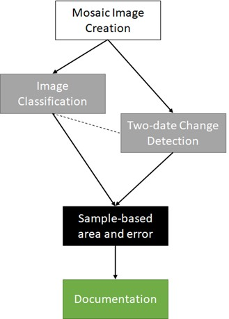
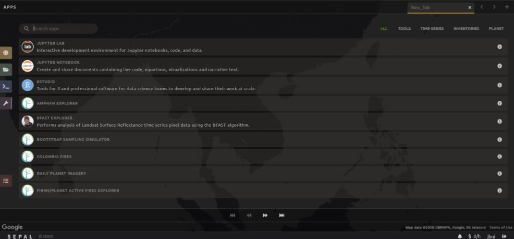
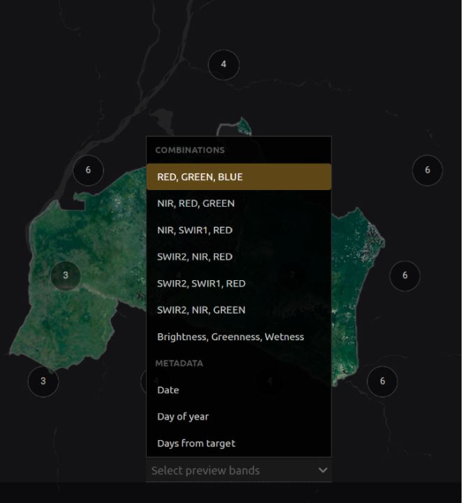
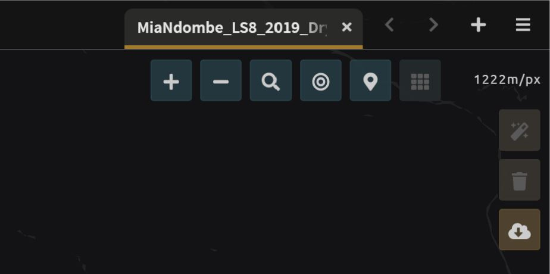
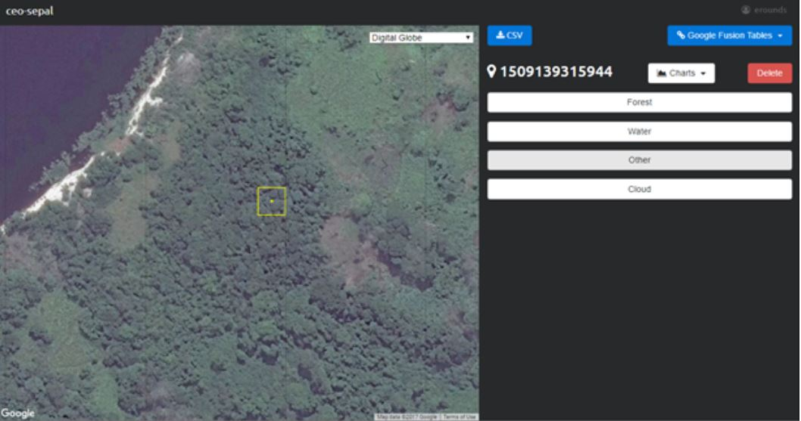
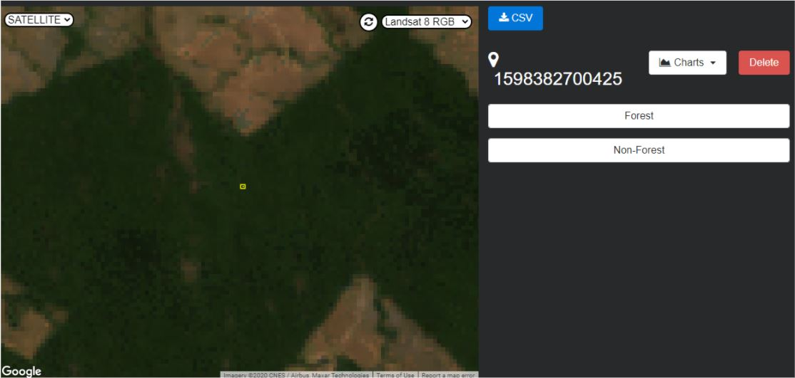
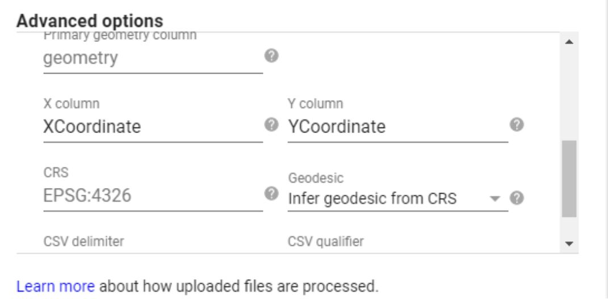

# A Step-by-Step Manual for Area Estimation using SEPAL and CEO

# Welcome to area estimation with SEPAL and CEO!

Welcome to area estimation with SEPAL and CEO. In this manual, you will learn how to perform area estimation for land use/land cover and two date change detection classifications. We will use sample-based approaches to area estimation. This approach is preferred over pixel-counting methods because all maps have errors. For example, maps derived from land cover land use classifications may have errors due to pixel mixing, or noise in the input data. Using pixel-counting methods will produce biased estimates of area, and you cannot tell whether these are overestimates or underestimates. Sample based approaches create unbiased estimates of area and the error associated with your map.

The goal of this manual is to teach you how to perform these tasks such that you can conduct your own area estimation for land use/land cover or change detection classifications.

In this manual, you will find four modules covering methods, and one module covering the documentation needed for replicating these methods. The modules are as follows:

* In Module 1, you will learn how to generate mosaics based on satellite imagery in SEPAL. You will learn how to build these mosaics by selecting different data sources and images based on dates and cloud cover.
* In Module 2, you will learn how to perform a land use/land cover image classification using random forest methods. You will learn how to define your land uses and land covers, collect training data, and run your model.
* In Module 3, you will learn how to perform image change detection. Building on skills from Module 1 and Module 2, you will define what change looks like, collect training data, and run your model. You will also learn about different tools to perform time series analysis.
* In Module 4, you will learn how to calculate a sample-based estimate of area and error. You will learn how to use stratified random sampling and verification image analysis in order to calculate area and error estimates based on the classification you create in Module 2. You will also learn about some key documentation steps in preparation for Module 5.
* In Module 5, you will learn about documenting and archiving your area estimation project. The information in this step is required for your project to be replicated by yourself or your colleagues in the future, either for additional areas or points in time.

These exercises include step-by-step directions and are built to facilitate learning through reading and by doing. This manual will be accompanied by short videos, which will visually illustrate the steps described in the text.

Para ver este manual en español, vaya aquí: (add links; if using pages will need to be separate repositories)
Pour voir ce manuel dans français, allez ici:

To visualize the flow of this manual, see below:

Our primary tool for this Manual is the System for Earth Observation Data Access, Processing, & Analysis for Land Monitoring (SEPAL). SEPAL is a web based cloud computing platform that enables users to create image composites, process images, download files, create stratified sampling designs, and more all from your browser. SEPAL is a system for earth observations, data access, processing & analysis for land monitoring, which is a cloud-based computing software designed by the United Nation’s Food and Agricultural Organization (FAO) to aid in remote sensing applications in developing countries. SEPAL is part of the Open Foris suite of tools. Geoprocessing is possible via Jupyter, JavaScript, R, R Shiny apps, and Rstudio. SEPAL also integrates with Collect Earth Online (CEO) and the Google Earth Engine (GEE).

SEPAL provides a platform for users to access satellite imagery (Landsat and Sentinel-2) and perform change detection and land cover classifications using a set of easy-to-use tools. SEPAL was designed to be used in developing countries where internet access is limited and computers are often outdated and, thus, inefficient for processing satellite imagery. It achieves this by drawing on a cloud-based supercomputer, which enables users to process, store, and interpret large amounts of data. Many more advanced functions than what we will cover here are available in SEPAL for more advanced users.

We will also use two other tools that SEPAL integrates with: CEO and GEE. Collect Earth Online (CEO), is a free and open-source image viewing and interpretation tool, suitable for projects requiring information about land cover and/or land use. CEO enables simultaneous visual interpretations of satellite imagery, providing global coverage from MapBox and Bing Maps, a variety of satellite data sources from Google Earth Engine, and the ability to connect to your own Web Map Service (WMS) or Web Map Tile Service (WMTS). The full functionality is implemented online, no desktop installation is necessary. CEO allows institutions to create projects and leverage their teams to collect spatial data using remote sensing imagery. Use cases include historical and near-real-time interpretation of satellite imagery and data collection for land cover/land use model validation.

Google Earth Engine (GEE) combines a multi-petabyte catalog of satellite imagery and geospatial datasets with planetary-scale analysis capabilities and makes it available for scientists, researchers, and developers to detect changes, map trends, and quantify differences on the Earth's surface. The code portion of GEE (called Code Editor) is a web-based IDE for the Earth Engine JavaScript API. Code Editor features are designed to make developing complex geospatial workflows fast and easy. The Code Editor has the following elements: JavaScript code editor; a map display for visualizing geospatial datasets; an API reference documentation (Docs tab); Git-based Script Manager (Scripts tab); Console output (Console tab); Task Manager (Tasks tab) to handle long-running queries; Interactive map query (Inspector tab); search of the data archive or saved scripts; and geometry drawing tools.

You can find more information here:

* An older forest change detection manual for SEPAL: [Forest Cover Change Detection with SEPAL](https://drive.google.com/file/d/1kPE2wFNDqNpXycqTJfNUtZf9iWsQHcab/view?usp=sharing)
* Olofsson et al 2014: [FAO - SFM Tool Detail: Good practices for estimating area and assessing accuracy of land change](http://www.fao.org/sustainable-forest-management/toolbox/tools/tool-detail/en/c/411863/)
* CEO documentation: [https://collect.earth/support](https://collect.earth/support)
* GEE documentation: [ Earth Engine Code Editor from Google Earth Engine](https://developers.google.com/earth-engine/guides/playground)
* REDD Compass: [Front Page - GFOI](https://reddcompass.org/frontpage)
* Reporting and Verification: [Reporting and Verification - GFOI](https://reddcompass.org/reporting-verification)

## Getting started

### Sign Up to SEPAL

You can request an account by visiting [sepal.io](sepal.io) and clicking “Sign Up”. This will take you to a Google Doc signup form to fill out. You will be set up with an account within a day or so.

1. If you do not have a SEPAL account, you can request access [here](http://tinyurl.com/fao-sepal ).
2. To request access to SEPAL, you will simply need to enter your email address, name, institution or country and a brief explanation of why you want to use SEPAL.

### Sign Up to CEO

1. In your browser window, navigate to [https://collect.earth/](https://collect.earth). CEO supports Google Chrome, Mozilla Firefox, and Microsoft Edge.
2. Click **Login/Register** on the upper right.
3. To set up a new account, click on **Register a new account** and follow the instructions.
4. When you have an account, login with your email and password.
5. If you forget your password, click on **Forgot your password?** and follow the instructions.

### Sign up to GEE

Signing up for Google Earth Engine is required in order to properly export images and data products from SEPAL.

1. You will need to have a Google email in order to sign up. If you don’t have one already, you can set one up [here](http://mail.google.com/mail/signup).
2. To request a GEE account, please visit [https://earthengine.google.com/new_signup/](https://earthengine.google.com/new_signup/).
3. Once you have a Google Earth Engine account, you can access GEE here: [https://code.earthengine.google.com/](https://code.earthengine.google.com/)

## Project Planning Information

Project planning and methods documentation play a key role in any remote sensing analysis project. While we use example projects in this Manual, in the future you may use these techniques for your own projects. We encourage you to think about the following items to ensure your resulting products will be relevant, and that your chosen methods are well documented and transparent.

1. Descriptions and Objectives of the Project (State issues and information needs).
	1. Are you trying to conform to an IPCC Tier?
2. Descriptions of the end user product (data, information, monitoring system or map that will be created by the project).
	1. What type of information do you need? A map? An inventory? A change product? (e.g. do you need to know where different land cover types exist or do you just need an inventory of how much there is?)
3. How will success be defined for this project? Do you require specific accuracy or a certain level of detail in the final map product?
4. Description of the project area / extent (national/subnational/specific forest/etc.)
5. Description of the features/classes to be modeled or mapped.
	1. Do you have a national definition of “forest”?
	1. Are you aware of the IPCC guidelines for the recommended land use classes and how they will relate to mapping land cover?
	1. Do you have key categories that will drive different analysis techniques?
6. Considerations for measuring, reporting, and verifying:
	1. Do you have a strategy; do you know what is required? Do you know where to get the required information? Looking ahead, are you on the right path (who are the decision makers that will inform these strategies?)
	1. What field data will be required for classification and accuracy assessment?
	1. Do you have an existing National Forest Monitoring System (NFMS) in place?
7. Will you supplement your remote sensing project with existing data (local data on forest type, management intent, records of natural disturbance…)?
8. Partnerships (vendors, agencies, bureaus, etc.)

# Module 1: Mosaic image generation

Generating mosaics of remote sensing data from satellite data is the first step in our classifications. In this Module, you will learn how to navigate SEPAL and how to create mosaics using imagery from the Landsat or Sentinel satellites. At the end of this section, you will be able to create the satellite imagery mosaics you will need for Modules 2 & 3.

This module should take you approximately 1-2 hours.

## Exercise 1.1: An introduction to SEPAL

In this exercise, you will be introduced to the SEPAL interface. You will learn how to access SEPAL’s features to facilitate the remote sensing exercises in later modules.

Objectives | Prerequisites
-------------- | ---------------
Navigate the SEPAL interface | Internet access
Learn about the functionality of SEPAL | SEPAL account (see ‘Getting Started’)

### Part 1: Open SEPAL

1. Navigate to [https://sepal.io/](https://sepal.io/) to open SEPAL.
2. Type in your **Username** and **Password** and click **Login.**

*When working in SEPAL, do not click your browser’s back button. This will go back to the previous webpage. Use the buttons within SEPAL to navigate to previous pages. There may also be an arrow in the upper left or right-hand corner of the SEPAL interface to navigate to a previous window.*

### Part 2: SEPAL Interface Home

1. Once you are logged in, you will see the following screen. Notice that your username is displayed in the bottom right of the window.

2. There are four main navigation tabs in the dock on the left side of the screen.
	1. **Process:** select imagery and create mosaics.
	1. **Files:** navigate through your personal SEPAL folders. This is where you can download or delete data, as well as visualize it using the Data Visualization link.
	1. **Terminal:** access to the command line for the LINUX server.
	1. **Apps:** links to a variety of pre-loaded tools.
3. At the lower left is the red **Tasks** tab. Clicking on this brings up a list of currently running tasks.
4. **Account Information* can be found in the bottom right of the webpage by clicking the button that shows your username. This opens an overlay that displays important user account information.
5. You can edit your user account info, including Name, Password, Email and Organization here. Click **Save** to make those changes permanent. However, you cannot edit your Username in this interface.
	1. Change the Google Account associated with your SEPAL account by clicking **Use my own Google Account** and following the instructions. SEPAL relies on Google Drive as a storage space for data accessed through the platform. Any imagery tiles or mosaics that you “retrieve” will first be saved to a Google Drive account before you can visualize and process them in SEPAL.

> **Note: Be sure to connect your Google Account in order to be able to Retrieve Mosaics in the next Exercise 1.2. You should use the same account you used to sign up for Google Earth Engine.**

6. Next to your **Account Information** is a section called **User Report**, represented by the **$ X/h**. This shows you the allotted budgets you have. An instance refers to any of the various processes that you can perform in SEPAL. If you are running any processes in your current session, they will show up here under Sessions.

  

### Part 3: Process Tab

1. Click the **Process** tab on the left side of the window.

  

2. You should now see four options in the center of the screen.
	1. **Optical Mosaic** allows you to create a mosaic using Landsat and/or Sentinel 2 data. This is what we will do in Exercise 1.2.
	1. **Radar Mosaic** allows you to create a mosaic using Sentinel 1 data.
	1. **Classification** allows you to use a random forest model to classify images from SEPAL or GEE. This will be the focus of Module 2.
	1. **Time Series** allows you to download time series information to your SEPAL storage.
3. When you click on one of these options, it will open a new tab with the GUI interface that allows you to specify your desired options.

###Part 4: Files Tab

1. Click the green **Files** tab on the left side of the window. This will display all of your files in SEPAL.
2. For example, click the **downloads** folder to expand it. This will display the folders containing any of the data you have downloaded in SEPAL. If you have not downloaded mosaics in SEPAL yet, then this folder will be empty.

  

3. Notice that there are four buttons at the top right of the window. The three rightmost buttons are inactive, but activate when you select a file.

	1. The left button will show hidden files (files and folder names starting with ‘.’).
	1. The second button will download selected data to your local computer.
	1. The third button will delete the selected folder or file.
	1. The last button will clear your selection.

### Part 5: Terminal Tab

1. Click the **Terminal** tab on the left side of the screen.
2. This links you to the Linux command line that you can use in a variety of ways to manage data, load data from an outside location or process data using a series of commands.
3. When you initially load the Terminal, you will see information about your usage and the available types of instances you can initialize.
4. One of the most important features of the Terminal is the ability to increase your instance size. The default instance is not sufficient for analyzing large amounts of data, for example running a classification on a large area.
	1. To increase the size of your instance, first examine the “Available instance types” table. This is updated periodically but an example from September of 2020 is shown below.
	1. Choose an instance Type that fits your needs. Frequently a t2 or m2 is sufficient and cost effective.
	1. Next to the “Select (t1):” text, type in ‘t2’ or your chosen instance type.
	1. Press Enter on your keyboard.
	1. Wait for the new instance to start. This will take several minutes.

### Part 6: Apps Tab

1. Click the **Apps** tab on the left side of the screen. This will open up a screen that shows applications that you can access through SEPAL.

2. This will bring up a list of apps you can run in SEPAL. More information about each app is found by clicking on the “i” on the right hand side. Some of the apps include:
	* **R Studio:** provides access to R environment where you can run processing scripts and upload data to your SEPAL folder.
	* **Stratified Area Estimator- Design:** tool for creating stratified designs to estimate areas. We will use this tool in Module 4.
	* **Stratified Area Estimator- Analysis:** tool for analyzing the results of your stratified design sampling to estimate areas. We will use this tool in Module 4.
	* **Geo Processing- Beta:** offers a selection of easy-to-use change detection and segmentation tools.
	* **BFAST Explorer:** tool for performing pixel-based time series analysis of Landsat Surface Reflectance data.

**Congratulations! You have successfully completed this exercise. You now know how to navigate the SEPAL interface and access its many tools and functions.**

## Exercise 1.2: Mosaic generation (Landsat & Sentinel 2)

SEPAL provides a robust interface for generating Landsat and Sentinel 2 mosaics. Mosaic creation is the first step for the image classification and two date change detection processes covered in Modules 2 and 3 respectively. These mosaics can be downloaded locally or to your Google Drive.

In this exercise, you will create a Landsat mosaic for the Mai Ndombe region of the Democratic Republic of the Congo, where REDD+ projects are currently underway.

Objectives | Prerequisites
------------- | ----------------
Learn how to create an image mosaic | SEPAL account
Become familiar with a variety of options for selecting dates, sensors, mosaicking and download options. |  
Create a cloud-free mosaic for 2016 |  

### Part 1: Create a Landsat Mosaic

1. If SEPAL is not already open, click to open SEPAL in your browser: https://sepal.io/ and login.
2. Click on the **Processing** tab.
3. Then, click on **Optical Mosaic.**
4. When the Optical Mosaic tab opens, you will see an **Area of Interest** window in the lower right hand corner of your screen.
	1. There are three ways to choose your area of interest. Bring up the menu by clicking the carrot to the right of the window label.
		1. Select Country/Province (the default).
		1. Select from EE table
		1. Draw a polygon.

  

	1. We will use the **Select a country/province** option.
		1. In the list of countries that pops up, scroll down until you see the available options for **Congo, Dem Republic of.** Note there is also the Republic of Congo, which is not what we’re looking for.
		1. Under Province/Area, notice that there are many different options.
		1. Select **Mai-Ndombe,** then click **Next.**

  

5. In the **Date** menu you can select the **Year** you are interested in or click on **More.**
	1. This interface allows you to refine the dates or seasons you are interested in.
	1. You can select a **target date** (The date in which pixels in the mosaic should ideally come from), as well as adjust the start and end date flags.
	1. You can also include additional seasons from the past or the future by adjusting the **Past Seasons** and **Future Seasons** slider. This will include additional years’ data of the same dates specified. For example, if you’re interested in August 2015, including one future season will also include data from August 2016. This is useful if you’re interested in a specific time of year but there is significant cloud cover.
	1. For this exercise, let’s create imagery for the dry season of 2019.
		1. Select July 1 of 2019 as your target date (2019-07-01), and move your date flags to May 1-September 30.
		1. Click **Apply.**

6. Now select the **Data Sources (SRC)** you’d like. Here, select the **Landsat L8 & L8 T2** option. The color of the label turns brown once it has been selected.
	1. **L8** began operating in 2012 and is continuing to collect data;
	1. **L7** began operating in 2001, but has a scan-line error that can be problematic for dates between 2005-present; and
	1. **L4-5 TM,** which collected data from July 1982-May 2012.
	1. **Sentinel 2 A+B** began operating in June 2015.
	1. Click **Done.**
7. Now SEPAL will load a preview of your data. By default it will show you where RGB band data is available. You can click on the RGB image at the bottom to choose from other combinations of bands or metadata.
	1. When it is done, examine the preview to see how much data is available. For this example, coverage is good. However, in the future when you are creating your own mosaic, if there is not enough coverage of your area of interest, you will need to adjust your parameters.
	1. To do so, notice the five tabs in the lower left. You can adjust the initial search parameters using the first three of these tabs. For example, Click on **Dat** to expand the date range if you would like.
	1. The last two tabs are for **scene selection** and **composite,** which are more advanced filtering steps. We’ll cover those now.

8. We’re now going to go through the **scene selection process.** This allows you to change which specific images to include in your mosaic.
	1. You can change the scenes that are selected using the **SCN** button on the lower right of the screen. You can use all scenes or select which are prioritized. You can revert any changes by clicking on **Use All Scenes** and then **Apply.**
	1. Change the **Scenes** by selecting **Select Scenes** with Priority: **Target Date**

1. Click Apply. The result should look like the below image.

	1. Notice the collection of circles over the Mai Ndombe study area and that they are all populated with a zero. These represent the locations of scenes in the study area and the numbers of images per scene that are selected. The number is currently 0 because we haven’t selected the scenes yet.
	1. Click the Auto-Select button to auto-select some scenes.

	1. You may set a minimum and maximum number of images per scene area that will be selected. Increase the minimum to 2 and the maximum to 100. Click **Select Scenes.** If there is only one scene for an area, that will be the only one selected despite the minimum.

	1. You should now see imagery overlain with circles indicating how many scenes are selected.

	1. You will notice that the circles that previously displayed a zero now display a variety of numbers. These numbers represent the number of Landsat images per scene that meet your specifications.
	1. Hover your mouse over one of the circles to see the footprint (outline) of the Landsat scene that it represents. Click on that circle.

	1. In the window that opens, you will see a list of selected scenes on the right side of the screen. These are the images that will be added to the mosaic. There are three pieces of information for each:
		1. Satellite (e.g. L8, L7, L5 or L4)
		1. Percent cloud cover !
		1. Number of days from the target date
		1. To expand the Landsat image, hover over one of the images and click **Preview.** Click on the image to close the zoomed in graphic and return to the list of scenes.
		1. To remove a scene from the composite, click the **Remove** button when you hover over the selected scene.

	1. On the left hand side, you will see **Available Scenes,** which are images that will not be included in the mosaic but can be added to it. If you have removed an image and would like to re-add it or if there are additional scenes you would like to add, hover over the image and click **Add.**
	1. Once you are satisfied with the selected imagery for a given area, click **Close** in the bottom right corner.

	1. You can then select different scenes (represented by the circles) and evaluate the imagery for each scene.
9. You can also change the composing method using the **CMP** button on the lower right.
	1. Notice that there are several additional options including shadow tolerance, haze tolerance, NDVI importance, cloud masking and cloud buffering.
	1. For this exercise, we will leave these at their default settings.
	1. If you make changes, click Apply after you’re done.

10. Now we’ll explore the **Bands** dropdown.
	1. Click on the **Red Green Blue** at the bottom of the page.

	1. The below dropdown menu will appear.

	1. Select the **NIR, RED, GREEN** band combination. This band combination displays vegetation as red, with darker reds indicating dense vegetation. Bare ground and urban areas appear grey or tan, while water appears black. NIR stands for near infrared.
	1. Once selected, the preview will automatically show what the composite will look like.
	1. Use the scroll wheel on your mouse to zoom in to the mosaic and then click and drag to pan around the image. This will help you assess the quality of the mosaic.
11. The map now shows the complete mosaic that incorporates all of the user-defined settings.

	1. Using what you’ve learned, take some time to explore adjusting some of the input parameters and examine the influence on the output. Once you have a composite you are happy with, we will download the mosaic (instructions follow).
		1. For example, if you have too many clouds in your mosaic, then you may want to adjust some of your settings or choose a different time of year when there is a lower likelihood of cloud cover.
		1. The algorithm used to create this mosaic attempts to remove all cloud cover, but is not always successful in doing so. Portions of clouds often remain in the mosaic.

### Part 2 Name and Save your Recipe and Mosaic

1. Now, we will name the ‘recipe’ for creating the mosaic and explore options for the recipe.
	1. You will use this recipe when working with the classification or change detection tools, as well as when loading SEPAL mosaics into SEPAL’s Collect Earth Online.
	1. You can make the recipe easier to find by naming it. Click on the tab in the upper right and type in a new name. For this example use *MiaNdombe_LS8_2019_Dry.*
	1. Now let's explore options for the recipe. Click on the three lines in the upper right hand corner.
		1. You can save the recipe (SEPAL will do this automatically on retrieval) so that it is available later.
		1. You can also **Duplicate the recipe.**This is useful for creating two years of data, as we will do in Module 3.
		1. Finally you can Export the recipe. This downloads a zip file with a JSON of your mosaic specifications.
	1. Click on **Save recipe….** This will also let you rename the mosaic if you choose.

	1. Now if you click on the three lines icon, you should see an additional option: **Revert to old revision…**

	1. Clicking on this option brings up a list of auto-saved versions from SEPAL. You can use this to revert changes if you make a mistake.

	1. Now, when you open SEPAL and click the Search option, you will see a row with this name that contains the parameters you just set.
2. Finally, we will save the mosaic itself. This is called ‘retrieving’ the mosaic. This step is necessary to perform analysis on the imagery.
	1. To download this imagery mosaic to your SEPAL account, click the **Retrieve** button.

	1. A window will appear with the following options:
		1. **Bands to Retrieve:** select the desired bands you would like to include in the download.
			1. Select the **Blue, Green, Red, NIR, SWIR 1 and SWIR 2** bands. These are visible spectrum and infrared data collected by Landsat.
			1. Other bands that are available include Aerosol, Thermal, Brightness, Greenness, and Wetness. More information on these can be found at: https://landsat.gsfc.nasa.gov/landsat-data-continuity-mission/.
			1. Metadata on Date, Day of Year, and Days from Target can also be selected.
		1. **Scale:** the resolution of the mosaic. Landsat data is collected at 30m resolution, so we will leave the slider there.
		1. **Retrieve to:** Sepal Workspace is the default option. Other options may appear depending on your permissions.
	1. When you have the desired bands selected, click **Retrieve.**
	1. You will notice the **Tasks** icon is now spinning. If you click on it, you will see the data retrieval is in process. This step will take some time.

*Note: This will take 25 minutes or more to finish downloading, however, you can move on to the next exercise without waiting for the download to finish. *

**Congratulations! You have successfully completed this exercise. You now know how to create a Landsat mosaic using the many customizable parameters in SEPAL.**

# Module 2: Image classification

The main goal of this Module is to construct a single-date land cover map by classification of a Landsat composite generated from Landsat images. Image classification is frequently used to map land cover, describing what the landscape is composed of (grass, trees, water, impervious surface), and to map land use, describing the organization of human systems on the landscape (farms, cities, wilderness). Learning to do image classification well is extremely important and requires experience. So here is your chance to build some experience. You will first consider the types of land cover classes you would like to map and the amount of variability within each class.

There are both supervised (uses human guidance including training data) and unsupervised (no human guidance) classification methods. The random forest approach used here uses training data and is thus a supervised classification method.

There are a number of supervised classification algorithms that can be used to assign the pixels in the image to the various map classes. One way of performing a supervised classification is to utilize a Machine Learning algorithm. Machine Learning algorithms utilize training data combined with image values to learn how to classify pixels. Using manually collected training data, these algorithms can train a classifier, and then use the relationships identified in the training process to classify the rest of the pixels in the map. The selection of image values (e.g., NDVI, elevation, etc.) used to train any statistical model should be well thought out and informed by your knowledge of the phenomenon of interest to classify your data (e.g., into forest, water, other, and clouds).

In this module, we will create a land cover map using supervised classification in SEPAL. We will train a random forest machine learning algorithm to predict land cover with a user generated reference data set. This data set is collected either in the field or manually through examination of remotely sensed data sources such as aerial imagery. The resulting model is then applied across the landscape. You will complete an accuracy assessment of the map output in Module 4.

Before starting your classification, you will need to create a response design with details about each of the land covers/land uses that you want to classify (Exercise 2.1); create mosaics for your area of interest (in Exercise 2.2 we will use a region of Brazil); and collect training data for the model (Exercise 2.3). Then, in Exercise 2.4 we will run the classification and examine our results.

The workflow in this module has been adapted from exercises and material developed by Dr. Pontus Olofsson, Christopher E. Holden, and Eric L. Bullock at the Boston Education in Earth Observation Data Analysis in the Department of Earth & Environment, Boston University. To learn more about their materials and their work, visit their github site at [https://github.com/beeoda](https://github.com/beeoda).

At the end of this module you will have a classified land use land cover map.

This module takes approximately 4 hours to complete.

## Exercise 2.1: Response Design for Classification

Creating consistent labelling protocols is necessary for creating accurate training data and later, accurate sample based estimates (see Module 4). They are especially important when more than one researcher is working on a project and for reproducible data collection. Response design helps a user assign a land cover / land use class to a spatial point. The response design is part of the metadata for the assessment and should contain the information necessary to reproduce the data collection. The response design lays out an objective procedure that interpreters can follow and that reduces interpreter bias.

In this exercise, you will build a decision tree for your classification along with much of the other documentation and decision points (for more on decision points, please see Module 5, Exercise 5.1).

Objectives | Prerequisites
-------------- | -------------------
Learn how to create a classification scheme for land cover land use classification mapping. | None

### Part 1: Specify the Classification Scheme

“Classification scheme” is the name used to describe the land cover and land use classes adopted. It should cover all of the possible classes that occur in the area of interest. Here, you will create a classification scheme with detailed definitions of the land cover and land use classes to share with interpreters.

1. Create a decision tree for your land cover or land use classes. There may be one already in use by your department.  The tree should capture the most important classifications for your study. Here is an example:

	1. This example includes a hierarchical component. For example, the green and red categories have multiple sub-categories, which might be multiple types of forest or crops or urban areas. You can also have classification schemes that are all one level with no hierarchical component.
	1. For this Exercise, we’ll use a simplified land cover and land use classification as follows:

	1. When creating your own decision tree, be sure to specify if your classification scheme was derived from a template, including the IPCC land-use categories, CLC, or LUCAS.
	1. If applicable, your classification scheme should be consistent with the national land cover and land use definitions. In cases where the classification scheme definition is different from the national definition, you will need to provide a reason.
2. Create a detailed definition for each land cover and land use and change class included in the classification scheme. We recommend you include measurable thresholds.
	1. Our classification will take place in Brazil, in an area of the Amazon rainforest undergoing deforestation.
		1. We’ll define Forest as an area with over 70% tree cover.
		1. We’ll define Non-forest as areas with less than 70% tree cover. This will capture urban areas, water, and agricultural fields.
	1. For creating your own classifications, here’s some things to keep in mind:
		1. It is important to have definitions for each of the classes. A lack of clear definitions of the land cover classes can make the quality of the resulting maps difficult to assess, and challenging for others to use. The definitions you come up with now will probably be working definitions that you find you need to modify as you move through the land cover classification process. As you become more familiar with the landscape, data limitations, and the ability of the land cover classification methods to discriminate some classes better than others, you will undoubtedly need to update your definitions.
		1. As you develop your definitions, you should be relating back to your applications. Make sure that your definitions meet your project objectives. For example, if you are creating a map to be used as part of your UNFCCC greenhouse gas reporting documents you will need to make sure that your definition of forest meets the needs of this application. The below image is an excerpt of text from the Methods and Guidance from the Global Forest Observations Initiative (GFOI) document that describes the Intergovernmental Panel on Climate Change (IPCC) 2003 Good Practice Guidance (GPG) forest definition and suggestions to consider when drafting your forest definition.
			1. When creating your own decision tree, be sure to specify if your definitions follow a specific standard, e.g., using ISO standard Land Cover Meta-Language (LCML, ISO 19144-2) or similar.
		1. During this online training course, you will be mapping land cover across the landscape using the Landsat composite, a moderate resolution data set. You may develop definitions based upon your knowledge from the field or from investigating high resolution imagery. However, when deriving your land cover class definitions, it’s also important to be aware of how the definitions relate to the data used to model the land cover. You will continue to explore this relationship throughout the exercise.
			1. Will the spectral signatures between your land cover categories differ? If the spectral signatures are not substantially different between classes, is there additional data you can use to differentiate these categories? If not, you might consider modifying your definitions.

More resources are available online, for example at [http://www.ipcc.ch/ipccreports/tar/wg2/index.php?idp=132](http://www.ipcc.ch/ipccreports/tar/wg2/index.php?idp=132)

## Exercise 2.2: Create mosaic for classification

We first need an image to classify before running a classification. For best results, we will need to create an optical mosaic with good coverage of our study area. We will build on knowledge gained in Module 1 to create an optical mosaic in SEPAL and retrieve it to Google Earth Engine.

In SEPAL you can run a classification on either a mosaic recipe or on a GEE asset. It is best practice to run a classification using an asset rather than on-the-fly with a recipe. This will improve how quickly your classification will export and avoid computational limitations.

Objectives | Prerequisites
-------------- | ------------------
Build on knowledge gained in Module 1. | SEPAL account
Create a mosaic to be the basis for your classification | Module 1

### Part 1: Creating and exporting a mosaic for a drawn AOI

We will create a mosaic for an area in the Amazon basin. If any of the steps for creating a mosaic are unfamiliar, please revisit Module 1, particularly Exercise 1.2.

1. Navigate to the Process tab, then create a new optical mosaic by selecting Optical Mosaic on the Process menu.
2. Under **Area of Interest:**
	1. Select **Draw Polygon** from the dropdown list.

	1. Navigate using the map to the State of Rondônia and either draw a polygon around it or draw a polygon within the borders. A smaller polygon will export faster.

3. Now use what you have learned in Module 1 to create a mosaic with imagery from the year 2019 (whole year or part of year, your choice). Don’t forget to consider which satellites you would like to include and which scenes you would like to include (all, some).
4. Your preview should include imagery data across your entire area of interest. This is important for your classification. Try also to get a cloud-free mosaic, as this makes your classification easier.
5. Name your mosaic for easy retrieval. Try “Module2_Amazon”.
6. When you’re satisfied with your mosaic, **Retrieve** it to Google Earth Engine. Be sure to include the red, green, blue, nir, swir1, and swir2 layers. You may choose to add the greenness, etc. layers as well.

### Part 2: Finding your Earth Engine Asset

For Exercise 2.3, you will need to know how to find your Earth Engine Asset.

1. Navigate to [https://code.earthengine.google.com/](https://code.earthengine.google.com/) and login.
2. Navigate to your **Assets** tab in the left hand column.
3. Under **Assets,** look for the name of the mosaic you just exported.
4. Click on the mosaic name.
5. You will see a window with information about your mosaic pop up.
6. Click on the two overlapping box icon to copy your asset’s location.

## Exercise 2.3: Training Data Collection in CEO-SEPAL

In this exercise, we will learn how to collect training data using the CEO-SEPAL tool. These training data points will become the foundation of our classification in Exercise 2.4. High quality training data is necessary to get good land cover map results. In the most ideal situation, training data is collected in the field by visiting each of the land cover types to be mapped and collecting attributes. When field collection is not an option, the second best choice is to digitize training data from high resolution imagery, or at the very least from the imagery to be classified.

In this assignment, you will create training data points using a combination of high-resolution imagery and the Landsat composite. These will be used to train the classifier in a supervised classification using SEPAL’s random forests algorithm. The goal of training the classifier is to provide examples of the variety of spectral signatures associated with each class in the map.

Objectives | Prerequisites
-------------- | ------------------
Create training data for your classes that can be used to train a machine learning algorithm. | SEPAL account
  | Land cover categories defined in Exercise 2.1.
  | Mosaic created in Exercise 2.2.

### Part 1: Setting Up a Training Project

To collect training data, we will need to create a ceo-sepal project from within SEPAL. There are two ways to do this. The easier way is to begin the classification and follow a link when prompted. This is the approach we will use here.

However, you can also navigate to [https://sepal.io/ceo](https://sepal.io/ceo), log in, and add a project directly through this interface (starting at Step 3a, below). If you use this route, you will need to create the classification later, using steps 1-3 below.

1. In the **Process** menu, click the green plus symbol and select **Classification.**
2. Add the Amazon optical mosaic for classification:
	1. Click **+Add** and choose **Earth Engine Asset.**
	1. Enter the Earth Engine Asset ID for the mosaic. The ID should look like “users/username/Module2_Amazon”.
		1. Remember that you can find the link to your Earth Engine Asset ID via Google Earth Engine’s Asset tab (see Exercise 2.2 Part 2).
	1. Select bands: Blue, Green, Red, NIR, SWIR1, & SWIR2. You can add other bands as well if you included them in your mosaic.
	1. Click **Apply,** then click **Next.**
3. In the Training Data menu, click **Open training data collection tool.**This will open a new window/tab.

	1. Click **Add project.**
	1. Type in a unique name for your training dataset, such as “Amazon training data”.
	1. Use **TRAINING DATA** as the **Type.**
		1. The **Training Data** option enables you to create a project from scratch. To use this method, you will need to identify a set of land cover classes to classify (code list) and you will need to add imagery that will be used to identify the types of land cover. You will then manually place your training data on the map and classify them.
		1. **CEP** stands for Collect Earth Project and it contains a collection of training data points that have already been generated and just need to be classified based on the classes defined within the project. It typically contains a customized method for classifying training data that incorporates % cover.
	1. Once you select the training data option, you will notice a new parameter: **Scale (m).** This scale refers to the spatial resolution of the imagery you will be classifying to create your map product. Type in 30, as that is the spatial resolution of Landsat. This will create a plot that is 30 m by 30 m.
	1. Click the **\+** button to the right of the section that says **Code List.** When you click the **\+** button, an empty row is added to the Code List. You need two rows.
		1. Add “Forest” and “Non Forest” to the Code List.

	1. Add imagery to the CEO project by clicking on **Add a layer.** This is where you can select the background imagery you will use to collect the training data. You can add multiple different types of imagery, as well as different band combinations of the same imagery.
		1. Select Google Earth Engine (Assets) from the drop down menu.

		1. Add your Earth Engine Asset mosaic. We will add a true-color set of bands first.
			1. Name your layer. Try ‘Landsat 8 RGB.’
			1. Paste the link to your mosaic in GEE (see Part 2 in Exercise 2.2).
			1. Type in ‘red, blue, and green’ for bands.
			1. Use 0 and 3000 for min and max. You can alter these values slightly based on band min/max in the Landsat 8 satellite.
		1. Add your Earth Engine Asset mosaic, but type in ‘swir1,nir,red’ to get SWIR, NIR, and red bands. Use a min and max of 300 and 3200.
		1. You can also add additional band combinations. If you would like to add other versions of this mosaic with different band combinations, repeat steps 5-6, but use different bands and adjust the name according to the bands. For example, try NIR, red, green.
	1. There are a number of other imagery options in the **Add a layer** drop down menu. Feel free to experiment with these.

**Note: Digital Globe imagery no longer exists.**

4. When you’ve set up the project, click on the **Submit** button.
	1. Notice that the project is now listed. You can click edit if you want to adjust any of the settings for the project.

### Part 2: Collect Training Data Points

Now that the CEO-SEPAL project is set up, you are ready to begin collecting data points for each land cover class. In most cases, it is ideal to collect a large amount of training data points for each class that capture the variability within each class and cover the different areas of the study area. However, for this exercise, you will only collect a small number of points: around 25 per class. When collecting data points, make sure that your plot contains only the land cover class of interest (no plots with a mixture of your land cover categories).

To help you understand why the random forest algorithm might get some categories you are trying to map confused with others, you will use spectral signatures charts in CEO-SEPAL to look at the NDVI signature of your different land cover classes. You should notice a few things when exploring the spectral signatures of your land cover classes. First, some classes are more spectrally distinct than others. For example, water is consistently dark in the NIR and MIR wavelengths, and much darker than the other classes. This means that it shouldn’t be difficult to separate water from the other land cover classes with high accuracy.

Second, not all pixels in the same classes have the exact same values—there is some natural variability! Looking at NDVI (and other vegetation indices) spectral signatures will help you begin to understand the inherent variability of your land cover classes. Capturing this variation will strongly influence the results of your classification.

1. First, let’s become familiar with the CEO-SEPAL Interface.
	1. Click the blue **collect** button for the **Amazon training data** project.
	1. You will immediately notice that a black and grey map appears on the screen. There are two drop down menus at the upper left and upper right of the map.

	1. In the upper left corner of the map, the **SEPAL** option is the default dark grey map. You can switch this to **SATELLITE** for satellite imagery.
	1. In the upper right corner of the map, click the drop down menu that currently reads **Default.**
	1. Select **LANDSAT 8 RGB,** or the name of your RGB map.
	1. Use the scroll wheel on your mouse to zoom in to the study area. You can click-hold and drag to pan around the map. Be careful though, as a single click will place a point on the map.
		1. If you accidentally add a point, you can delete it by clicking on the red **Delete** button in the panel on the right.
	1. Zoom in close to the imagery (until you can see individual pixels) so that you can see the amount of detail in this Landsat mosaic.
	1. While zoomed in, click the image layer drop down and select **Default.** You should see a clear difference in spatial resolution between the 30-meter Landsat and the high-resolution (sub-meter) default Satellite imagery from Google (see below).

2. Start collecting forest training data.
	1. Next, zoom into an area that is clearly forested. When you find an area that is completely forested, click it once. Notice the information on the right side of the screen that popped up.
	1. You have just placed a training data point!
	1. Now you should switch back to the Landsat mosaic to make sure that this forested area is not covered with a cloud. This is a key step that you should do for every point you collect. If you mistakenly classify a cloudy pixel as Forest, then the results will be impacted negatively if your Landsat mosaic does have cloud-covered areas.
	1. Once you are satisfied with your training point, click the **Forest** button on the right side of the screen to classify the point.
		1. If you haven’t classified the point yet, then you can just click somewhere else on the map instead of deleting the record.

	1. The information on the screen is then minimized and added to a row on the right side of the screen.
		1. If you need to modify classification of any of your data points, you can click on the point ID to return to the classification (or delete) options.
		1. You can click the **Delete** button if you are not satisfied with the placement of the point.
3. Now let’s click to create another ‘Forest’ point and use it to explore the **Charts** option.
	1. There is a **Charts** drop down menu that allows you to look at the changes in spectral values over time at this point using a variety of spectral indices.
		1. **Enhanced Vegetation Index (EVI):** highlights areas of high biomass and is particularly responsive to variations in vegetation structure (as opposed to NDVI’s sensitivity to chlorophyll content).
		1. **EVI2:** a 2-band version of EVI.
		1. **The Normalized Differenced Moisture Index (NDMI):** estimates the amount of moisture in vegetation.
		1. **The Normalized Differenced Vegetation Index (NDVI):** a common vegetation index used to measure the amount of healthy, green vegetation in a given area. Forested pixels will typically have a NDVI value between 0.7 and 1.
		1. **The Normalized Differenced Water Index (NDWI):** highlights plant water content and is most commonly used to gauge plant water stress.
1. Click the **Charts** drop down menu and select **NDVI.** You should see a chart that looks similar to the below image.
		1. This chart shows the NDVI values (derived from Landsat) of the pixel you selected for all dates where data is available. These time series charts are important when identifying seasonal (e.g., flooding or leaf senescence of deciduous trees) or permanent land cover changes.
		1. The chart will take a minute or more to appear.
		1. Notice that there is a lot more data available for more recent years, while there are only a few data points in the graph for years prior to 2000.
		1. Place your mouse over the graph and move it from left to right. You’ll see that information on the acquisition date and an NDVI value pops up for each data point.
		1. Zoom into a temporal subset to see seasonal differences in NDVI values. Click on the chart near the year 2013 and drag it to the right to highlight a year or two worth of data. Release the click. Now you will see the chart has been zoomed into that subset time range making the data trends easier to read.
			1. Note that the Y-axis will scale to the range of values for the available data. Keep an eye on the Y-axis when analyzing different spectral signatures.
			1. Click the **Reset zoom** button to return to the full time series view.

	1. To close the chart, click anywhere outside of the chart.
	1. Explore some of the other vegetation or water indices using the Charts drop down.
	1. When you are done, click the **Forest** button again to close the class selection options.
4. Begin collecting the rest of the 25 **Forest** training data points throughout other parts of the study area.
	1. The study area contains an abundance of forested land, so it should be pretty easy to identify places that can be confidently classified as forest. If you’d like, use the charts function to ensure that there is a relatively high NDVI value for the point.
	1. Continue to switch back and forth between the Landsat mosaic and the base **Satellite** imagery to ensure that:
		1. you are placing data points within the extent of the mosaic and
		1. that you aren’t placing a point over a cloud in the mosaic.
	1. You will notice that the quality of the base **Satellite** imagery varies. This is where the charts can come in particularly handy. You may also find it useful to zoom out and zoom back in, as the imagery changes based on your zoom scale. The images below show the same general area, but at slightly different zoom scales.

	1. Collect about 25 points for the **Forest** land cover class.
	1. When you are done, zoom out to the full extent of the Amazon Landsat 8 image. Did you place data points somewhat equally across the full region? Are all points clustered in the same region? It’s best to make sure you have data points covering the full spatial extent of the study region, add more points in areas that are sparsely represented if needed.
3. Once you are satisfied with your array of forested training data points, move on to the **Non-Forest** training points.
	1. Since we are using a very basic set of land cover classes for this exercise, this should include agricultural areas, water, and buildings and roads. Therefore, it will be important that you focus on collecting a variety of points from different types of land cover throughout the study area.
	1. **Water** is one of the easiest classes to identify and the easiest to model, due to the distinct spectral signature of water.
		1. Look for water bodies within your Landsat image. On your **Landsat 8 SWIR** image, they will appear black.
		1. Collect 10-15 data points for Water and be sure to spread them throughout Lake Mai Ndombe, the water sources feeding into it, and a couple of the water bodies/rivers to the eastern side of the mosaic. Be sure to put 2-3 points on rivers.
		1. Look at the Chart of NDWI and NDVI to see if the points you are classifying are covered in water year-round.
		1. The spectral signature for water will be relatively low (0-0.4) when looking at the NDVI chart.
		1. Some wetland areas may have varying amounts of water throughout the year, so it is important to check the time series charts. If you encounter areas that look like water but have seasonally high NDVI, place your point in a different area that has a more distinct water signature. It is ideal to give the classifier points that are homogenous and unambiguous.

Let’s now collect some building and road non-forest Training Data.
	1. There are not very many residential areas in the region. However, if you look you can find homes with dirt roads, and there are some airports as well.

		1. Place a point or points within these areas and classify them as Non-forest. Do your best to avoid placing the points over areas of the town with lots of trees.
		1. Find some roads, and place points and classify as Non-forest. These may look like areas of bare soil. Both bare soil and roads are classified as Non-forest, so place some points on both.
	1. Next, place several points in grassland/pasture, shrub, and agricultural areas around the study area.
		1. As you’ve done before, look at the NDVI signature of the points you place before you actually classify them. Grasslands may have NDVI values between 0.4 and 0.6, sometimes a little higher.
	1. Shrubs or small, non-forest vegetation can sometimes be hard to identify, even with high-resolution imagery. Do your best to find vegetation that is clearly not forest. The NDVI signature of shrubs may be relatively high (0.6-0.8).
	1. The texture of the vegetation is one of the best ways to differentiate between trees and grasses/shrubs. Look at the below image and notice the clear contrast between the area where the points are placed and the other areas in the image that have rougher textures and that create shadows.

	1. Now collect **cloud** training data in the **Non-forest** class, if your Landsat has any clouds.
		1. If there are some clouds that were not removed during the Landsat mosaic creation process you will need to create training data for the clouds that remain so that the classifier knows what those pixels represent.
		1. Turn on the Landsat mosaic imagery and navigate to some distinct areas with clouds. Click to place additional **Non-forest** points.
		1. Pan around other parts of the mosaic and classify the clouds that you find. Ensure that the point you place only contains clouds and excludes any amount of vegetation. As you did with other classes, try and collect points in all parts of the study area.
		1. Sometimes clouds were detected during the mosaic process and were mostly removed. However, you can see some of the edges of those clouds remain.
		1. Note that you may not have any clouds in your Landsat imagery.

4. Continue collecting Non-forest points. Again, be sure to spread the points out across the study area.
5. Once again when you are done collecting data for these categories, zoom out to the full extent of the study region (Amazon Landsat 8 RGB data layer).
		1. Did you place data points somewhat equally across the full region?
		1. Are all points clustered in the same region?
		1. It’s best to make sure you have data points covering the full spatial extent of the study region, add more points in areas that are sparsely represented if needed.
6. When you are done collecting your training data, scroll through the list of training data that you have collected. Note that the number in parenthesis is the code that corresponds to the land cover type.
	1. 1=Forest;
	1. 2=Non-Forest

### Part 3: Export Data As CSV

Now we will download the training data we have collected.

1. Above your training data points you will see a blue Download CSV button.

2. Click the CSV button to download the reference data as a comma separated values format.
	1. You will either be prompted by your browser to choose a location to save the data to.
	1. Or the data will be automatically downloaded to the folder your browser uses for downloads, usually your Downloads folder.
3. Once downloaded, examine your data by opening it in an application which can view tables, such as Microsoft Excel.
	1. There are 4 different columns in the table:
		1. id—this is the same unique ID that you can see on the right side of the CEO-SEPAL interface.
		1. YCoordinate and XCoordinate—locational information for all of the training data (in the WGS 84, EPSG 4326, coordinate reference system).
		1. class—land cover class in integer form. Again, 1=Forest and 2=Non-Forest.

### Part 4: Uploading your .csv to Google Earth Engine

With all your training data points collected, you will now need to upload the data into Google Earth Engine to use it for classification.

1. To use this data in SEPAL, you need to first upload it into Google Earth Engine.
	1. Navigate to [https://code.earthengine.google.com/](https://code.earthengine.google.com/)
	1. Log into GEE using your account and then navigate to the Assets tab.
	1. Click **New.**
	1. Select **CSV file (.csv)** under the **Table Upload** section.

	1. In the new window that pops up, fill in the requested information.
		1. Select your **CSV file** from your local machine.
		1. Optionally, **rename** the asset.
		1. Choose the **asset id path.** This is the where the asset will be saved once uploaded
		1. Add XCoordinate and YCoordinate to the Advanced options **X column and Y columns.**

	1. Click Upload to initiate the upload.
		1. You may need to rename your csv if the filename has spaces. Do this in your computer’s file system and try again.
	1. After a few minutes your upload should be complete!
		1. Check the path where you uploaded your asset to confirm it has successfully uploaded.
		1. Click on the file name.
		1. Make note of your **TableID,** which you will need for Exercise 2.4.

**Congratulations! You have successfully completed this exercise. You now know how to use SEPAL’s version of Collect Earth Online to create training data for a supervised classification.**

## Exercise 2.4: Classification Using Machine Learning Algorithms (Random Forests) in SEPAL

As mentioned in the Module introduction, the classification algorithm you will be using today is called random forest.  The random forest algorithm creates numerous decision trees for each pixel. Each of these decision trees votes on what the pixel should be classified as. The land cover class that receives the most votes is then assigned as the map class for that pixel. Random forests are efficient on large data and accurate when compared to other classification algorithms.

To complete the classification of our mosaicked image you are going to use a random forests classifier contained within the easy-to-use Classification tool in SEPAL. The image values used to train the model include the Landsat mosaic values and some derivatives (such as NDVI). There are likely additional data sets that can be used to help differentiate land cover classes, such as elevational data. If that is the case, it would be good to load this into the project and include them in the model. Examples of additional data sets that would probably be quite helpful to differentiate classes include climatic and topographic (aspect, elevation) information.

After we create the map, you might find that there are some areas that are not classifying well. The classification process is iterative, and there are ways you can modify the process to get better results. One way is to collect more or better reference data to train the model. You can test different classification algorithms, explore object based approaches opposed to pixel based approaches, or be more creative with specifying the model predictor variables. In the case of being more creative with model predictor variables you can try using multiple dates of data (instead of a single date), or try using texture bands. The possibilities are many and should relate back to the nature of the classes you hope to map. Last but certainly not least is to improve the quality of your training data. Be sure to log all of these decision points in order to recreate your analysis in the future.
Objectives | Prerequisites
---------- | --------------
Run SEPAL’s classification tool. | SEPAL account
  | Land cover categories defined in Exercise 2.1.
  | Mosaic created in Exercise 2.2.
  | Training data created in Exercise 2.3.

### Part 0: Merging Asset Tables (Optional)

To get a more accurate training dataset, consider combining multiple training datasets. For example, if you’re completing these exercises as part of a group training, try combining your training data set with your neighbors’. We will show you how to do this using your .csv files, however if you are more familiar with GEE you can also combine files using code in GEE.

1. Navigate to your GEE table information as in Exercise 2.3 Part 4.
2. Click on Share.

3. Fill in your neighbor’s email address, set them as a **Reader** or **Writer,** and click **Add.**
4. Now copy the link and email it to your neighbor. Ask them to send you the link to their table.
5. Once you have their table’s address, click the table link that you were sent.
	1. Download the fusion table as a CSV just as you did with your own.
	1. Once you have your and their CSVs downloaded, open them in Microsoft Excel.
	1. Copy and paste the contents of your neighbor’s CSV to your own training data CSV.
		1. Do not include their column header.
		1. Only copy and paste the data.
	1. Save the CSV to your desired location and give it a unique name.

### Part 1: Run Supervised Classification in SEPAL

1. Ideally, your original classification output is still open in a separate tab. If so, navigate back to it and skip to Step 3.
2. If your window is not still open, navigate to SEPAL by clicking this link [https://sepal.io/](https://sepal.io/).
	1. In the **Process** menu, click the green plus symbol and select Classification.
	1. Add the Amazon optical mosaic for classification:
		1. Click **Add** and choose **Earth Engine Asset**
		1. Enter the Earth Engine Asset ID for the mosaic. The ID should look like “users/username/Module2_Amazon”
		1. Remember that you can find the link to your Earth Engine Asset ID via Google Earth Engine’s Asset tab (see Exercise 2.2 Part 2).
		1. Select bands: Blue, Green, Red, NIR, SWIR1, & SWIR2. You can add other bands as well if you included them in your mosaic.
		1. Click **Apply,** then click **Next.**
3. Now, we’ll add the Training Data we collected in Exercise 2.3 in the **TRN tab.**
	1. Enter the path to your Earth Engine asset in the EE Table ID field.

	1. In the **Class Column** field select the column name that is associated with the class. In our example this should be ‘class’.
	1. Click **Done.**
4. Now a preview will load.
5. Click on **AUX** to examine the auxiliary data sources available for the classification
	1. Auxiliary inputs are optional layers which can be added to help aid the classification. There are three additional sources available: Latitude - Includes the latitude of each pixel; Terrain - Includes elevation of each pixel from SRTM data; Water - Includes information from the JRC Global Surface water Mapping layers.
	1. Click on **Water.**
	1. Click **Apply.**
6. Again, after a few seconds, a preview of the classification will load.
	1. Your classified map may look different than the example land cover map shown below.
	1. Depending on the training data you collected, your classes may be substantially different.
	1. The quality of the output map is also dependent on the quality of the mosaic.

7. Now we’ll save our classification output.
	1. First, rename your classification by typing a new name in the tab.
	1. Click **Retrieve classification** in the upper right hand corner (cloud icon).
	1. Choose 30 m resolution.
	1. Retrieve as either a **Google Earth Engine Asset** or to your **SEPAL Workspace.** Choose to export to a GEE Asset if you would like to be able to share your results or perform additional analysis in GEE. Otherwise, export to your SEPAL workspace (recommended here for ease of use).
	1. Once the download begins, you will see the spinning wheel in the bottom left of the webpage in **Tasks.** Click the spinning wheel to observe the progress of your download.
	1. When complete, if you chose GEE Asset the file will be in your GEE Assets. If you chose SEPAL workspace, the file will be in your SEPAL downloads folder. (Browse > downloads > classification folder).

### Part 2: QA/QC considerations and methods

Quality assurance and quality control, commonly referred to as QA/QC, is a critical part of any analysis. There are two approaches to QA/QC: formal and informal. Formal QA/QC, specifically sample-based estimates of error and area are described in Module 4. Informal QA/QC involves qualitative approaches to identifying problems with your analysis and classifications to iterate and create improved classifications. Here we’ll discuss one approach to informal QA/QC.

Following analysis you should spend some time looking at your change detection in order to understand if the results make sense. We’ll do this by adding your classification to the SEPAL-CEO project we created in Part 2. This allows us to visualize the data and collect additional training points if we find areas of poor classification. Other approaches not covered here include visualizing the data in Google Earth Engine or in another program, such as QGIS or ArcMAP.

1. Check your Google Earth Engine Assets for your retrieved Amazon Classification map. Copy the **Image ID** link.
2. Navigate back to your SEPAL-CEO project at [https://sepal.io/ceo/](https://sepal.io/ceo/).
	1. Next to your Amazon project, click on **Edit.**
	1. Add a **new layer,** title it **Classification,** and add the information from your Google Earth Engine classification asset. You have two classes, so your Min should be 1, Max 2, and Bands ‘class’.
	1. Click Submit.

3. Now click Collect for your Amazon project.
4. Switch the imagery to your Classification and pan and zoom around the map. Black will be ‘Forest,’ and white is ‘Non-forest’ pixels.
5. Compare your Classification map to Landsat 8 imagery.
	1. What land cover was classified correctly?
	1. Where do you see errors on the map?
	1. What classes seem to have the most error?
	1. What do you think may have caused one class to be classified more accurately than another?
6. If your results make sense, and you are happy with them, great! Go on to the formal QA/QC in Module 4.
7. However if you are not satisfied, collect additional points of training data where you see inaccuracies following the same process as in Exercise 2.3. Then re-run the classification following the steps in Part 1.

**Congratulations! You now know how to produce map classifications in SEPAL.**
