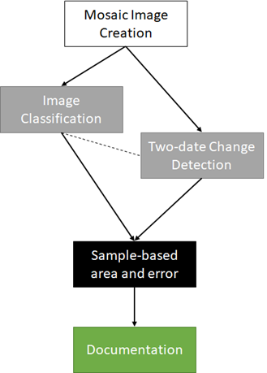

===============================================
Welcome to area estimation with SEPAL and CEO!
===============================================

In this manual, you will learn how to perform area estimation for land use/land cover and two date change detection classifications. We will use sample-based approaches to area estimation. This approach is preferred over pixel-counting methods because all maps have errors. For example, maps derived from land cover land use classifications may have errors due to pixel mixing, or noise in the input data. Using pixel-counting methods will produce biased estimates of area, and you cannot tell whether these are overestimates or underestimates. Sample based approaches create unbiased estimates of area and the error associated with your map.

The manual is available on Read the Docs at: https://sepal-ceo.readthedocs.io/en/latest/intro.html

The goal of this manual is to teach you how to perform these tasks such that you can conduct your own area estimation for land use/land cover or change detection classifications.

In this manual, you will find four modules covering methods, and one module covering the documentation needed for replicating these methods. The modules are as follows:

* In Module 1, you will learn how to generate mosaics based on satellite imagery in SEPAL. You will learn how to build these mosaics by selecting different data sources and images based on dates and cloud cover.
* In Module 2, you will learn how to perform a land use/land cover image classification using random forest methods. You will learn how to define your land uses and land covers, collect training data, and run your model.
* In Module 3, you will learn how to perform image change detection. Building on skills from Module 1 and Module 2, you will define what change looks like, collect training data, and run your model. You will also learn about different tools to perform time series analysis.
* In Module 4, you will learn how to calculate a sample-based estimate of area and error. You will learn how to use stratified random sampling and verification image analysis in order to calculate area and error estimates based on the classification you create in Module 2. You will also learn about some key documentation steps in preparation for Module 5.
* In Module 5, you will learn about documenting and archiving your area estimation project. The information in this step is required for your project to be replicated by yourself or your colleagues in the future, either for additional areas or points in time.

These exercises include step-by-step directions and are built to facilitate learning through reading and by doing. This manual will be accompanied by short videos, which will visually illustrate the steps described in the text.

To visualize the flow of this manual, see below:

|

Our primary tool for this Manual is the System for Earth Observation Data Access, Processing, & Analysis for Land Monitoring (SEPAL). SEPAL is a web based cloud computing platform that enables users to create image composites, process images, download files, create stratified sampling designs, and more all from your browser. SEPAL is a system for earth observations, data access, processing & analysis for land monitoring, which is a cloud-based computing software designed by the United Nation’s Food and Agricultural Organization (FAO) to aid in remote sensing applications in developing countries. SEPAL is part of the Open Foris suite of tools. Geoprocessing is possible via Jupyter, JavaScript, R, R Shiny apps, and Rstudio. SEPAL also integrates with Collect Earth Online (CEO) and the Google Earth Engine (GEE).

SEPAL provides a platform for users to access satellite imagery (Landsat and Sentinel-2) and perform change detection and land cover classifications using a set of easy-to-use tools. SEPAL was designed to be used in developing countries where internet access is limited and computers are often outdated and, thus, inefficient for processing satellite imagery. It achieves this by drawing on a cloud-based supercomputer, which enables users to process, store, and interpret large amounts of data. Many more advanced functions than what we will cover here are available in SEPAL for more advanced users.

We will also use two other tools that SEPAL integrates with: CEO and GEE. Collect Earth Online (CEO), is a free and open-source image viewing and interpretation tool, suitable for projects requiring information about land cover and/or land use. CEO enables simultaneous visual interpretations of satellite imagery, providing global coverage from MapBox and Bing Maps, a variety of satellite data sources from Google Earth Engine, and the ability to connect to your own Web Map Service (WMS) or Web Map Tile Service (WMTS). The full functionality is implemented online, no desktop installation is necessary. CEO allows institutions to create projects and leverage their teams to collect spatial data using remote sensing imagery. Use cases include historical and near-real-time interpretation of satellite imagery and data collection for land cover/land use model validation.

Google Earth Engine (GEE) combines a multi-petabyte catalog of satellite imagery and geospatial datasets with planetary-scale analysis capabilities and makes it available for scientists, researchers, and developers to detect changes, map trends, and quantify differences on the Earth's surface. The code portion of GEE (called Code Editor) is a web-based IDE for the Earth Engine JavaScript API. Code Editor features are designed to make developing complex geospatial workflows fast and easy. The Code Editor has the following elements: JavaScript code editor; a map display for visualizing geospatial datasets; an API reference documentation (Docs tab); Git-based Script Manager (Scripts tab); Console output (Console tab); Task Manager (Tasks tab) to handle long-running queries; Interactive map query (Inspector tab); search of the data archive or saved scripts; and geometry drawing tools.
