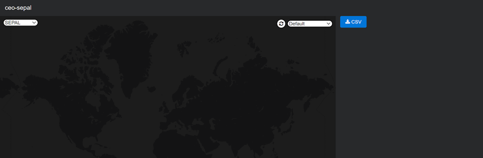
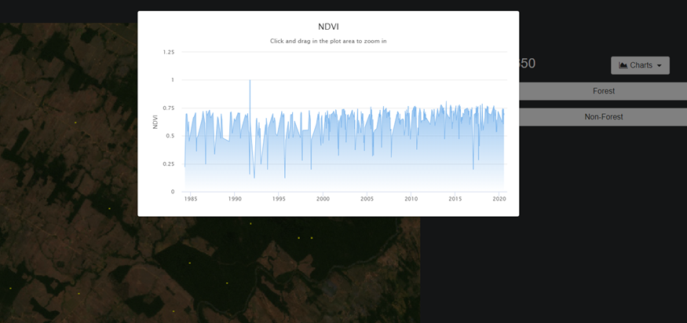
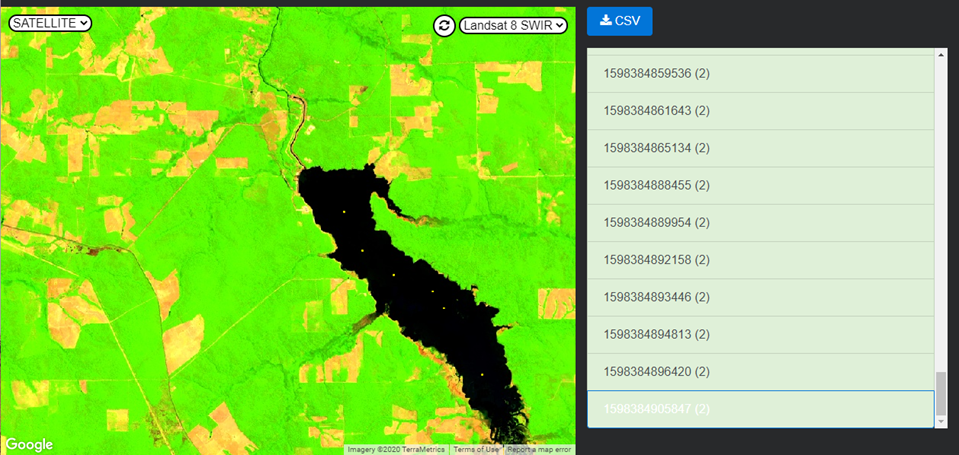
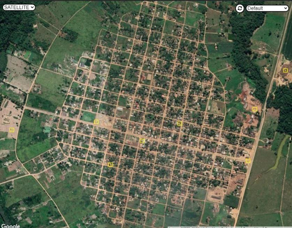
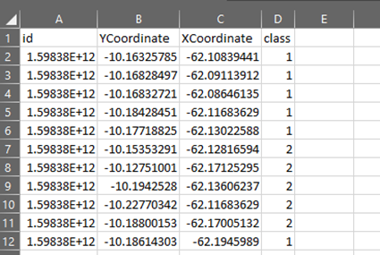
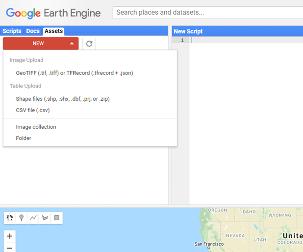
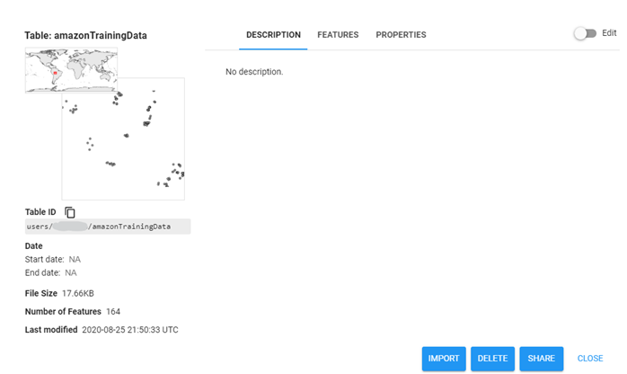
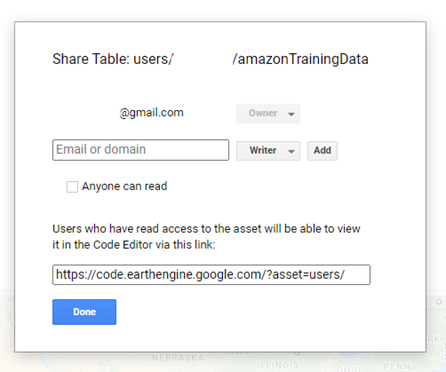
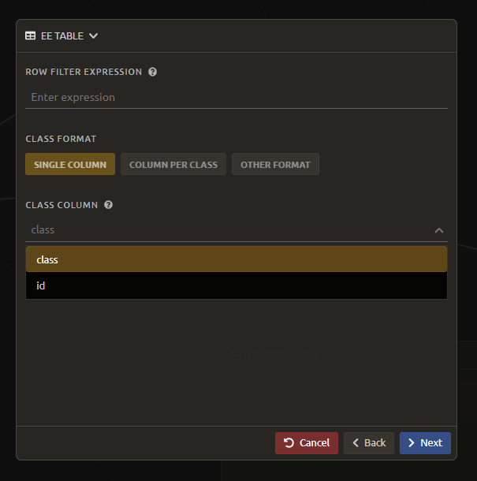
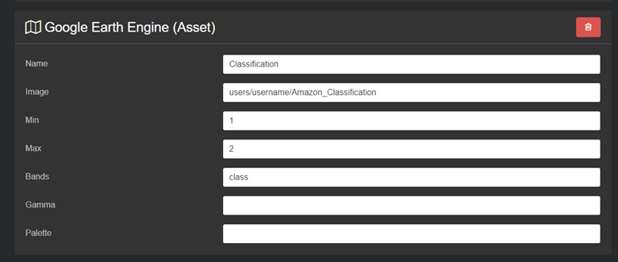

===============================
Module 2. Image classification
===============================

The main goal of this Module is to construct a single-date land cover map by classification of a Landsat composite generated from Landsat images. Image classification is frequently used to map land cover, describing what the landscape is composed of (grass, trees, water, impervious surface), and to map land use, describing the organization of human systems on the landscape (farms, cities, wilderness). Learning to do image classification well is extremely important and requires experience. So here is your chance to build some experience. You will first consider the types of land cover classes you would like to map and the amount of variability within each class.

There are both supervised (uses human guidance including training data) and unsupervised (no human guidance) classification methods. The random forest approach used here uses training data and is thus a supervised classification method.

There are a number of supervised classification algorithms that can be used to assign the pixels in the image to the various map classes. One way of performing a supervised classification is to utilize a Machine Learning algorithm. Machine Learning algorithms utilize training data combined with image values to learn how to classify pixels. Using manually collected training data, these algorithms can train a classifier, and then use the relationships identified in the training process to classify the rest of the pixels in the map. The selection of image values (e.g., NDVI, elevation, etc.) used to train any statistical model should be well thought out and informed by your knowledge of the phenomenon of interest to classify your data (e.g., into forest, water, other, and clouds).

In this module, we will create a land cover map using supervised classification in SEPAL. We will train a random forest machine learning algorithm to predict land cover with a user generated reference data set. This data set is collected either in the field or manually through examination of remotely sensed data sources such as aerial imagery. The resulting model is then applied across the landscape. You will complete an accuracy assessment of the map output in Module 4.

Before starting your classification, you will need to create a response design with details about each of the land covers / land uses that you want to classify (Exercise 2.1); create mosaics for your area of interest (in Exercise 2.2 we will use a region of Brazil); and collect training data for the model (Exercise 2.3). Then, in Exercise 2.4 we will run the classification and examine our results.

The workflow in this module has been adapted from exercises and material developed by Dr. Pontus Olofsson, Christopher E. Holden, and Eric L. Bullock at the Boston Education in Earth Observation Data Analysis in the Department of Earth & Environment, Boston University. To learn more about their materials and their work, visit their github site at https://github.com/beeoda.

At the end of this module you will have a classified land use land cover map.

This module takes approximately 4 hours to complete.

-------------------------------------------------
Exercise 2.1. Response design for classification
-------------------------------------------------

Creating consistent labelling protocols is necessary for creating accurate training data and later, accurate sample based estimates (see Module 4). They are especially important when more than one researcher is working on a project and for reproducible data collection. Response design helps a user assign a land cover / land use class to a spatial point. The response design is part of the metadata for the assessment and should contain the information necessary to reproduce the data collection. The response design lays out an objective procedure that interpreters can follow and that reduces interpreter bias.

In this exercise, you will build a decision tree for your classification along with much of the other documentation and decision points (for more on decision points, please see Module 5, Exercise 5.1).

+-------------------------------------+-----------------------------+
| Objectives                          | Prerequisites               |
+=====================================+=============================+
|Learn how to create a classification | None                        |
| scheme for land cover land use      |                             |
| classification mapping.             |                             |
+-------------------------------------+-----------------------------+

Part 1. Specify the classification scheme
------------------------------------------

“Classification scheme” is the name used to describe the land cover and land use classes adopted. It should cover all of the possible classes that occur in the area of interest. Here, you will create a classification scheme with detailed definitions of the land cover and land use classes to share with interpreters.

1. Create a decision tree for your land cover or land use classes. There may be one already in use by your department.  The tree should capture the most important classifications for your study. Here is an example:

  a. This example includes a hierarchical component. For example, the green and red categories have multiple sub-categories, which might be multiple types of forest or crops or urban areas. You can also have classification schemes that are all one level with no hierarchical component.
  b. For this Exercise, we’ll use a simplified land cover and land use classification as in the second image:

.. image:: images/land_cover_decision_tree.png
   :alt: Decision tree for land cover
   :width: 450
   :align: center

|

.. image:: images/classification_scheme.png
   :alt: The classification scheme we will use for this exercise, with two classes forest and non-forest
   :width: 450
   :align: center

|

2. When creating your own decision tree, be sure to specify if your classification scheme was derived from a template, including the IPCC (Intergovernmental Panel on Climate Change) land-use categories, CLC (CORINE land cover), or LUCAS (land cover and land use, landscape).

  a. If applicable, your classification scheme should be consistent with the national land cover and land use definitions.
  b. In cases where the classification scheme definition is different from the national definition, you will need to provide a reason.

3. Create a detailed definition for each land cover and land use and change class included in the classification scheme. We recommend you include measurable thresholds.

  a. Our classification will take place in Brazil, in an area of the Amazon rainforest undergoing deforestation.

    i. We’ll define Forest as an area with over 70% tree cover.
    ii. We’ll define Non-forest as areas with less than 70% tree cover. This will capture urban areas, water, and agricultural fields.

  b. For creating your own classifications, here’s some things to keep in mind:

    i. It is important to have definitions for each of the classes. A lack of clear definitions of the land cover classes can make the quality of the resulting maps difficult to assess, and challenging for others to use. The definitions you come up with now will probably be working definitions that you find you need to modify as you move through the land cover classification process.

       As you become more familiar with the landscape, data limitations, and the ability of the land cover classification methods to discriminate some classes better than others, you will undoubtedly need to update your definitions.

    ii. As you develop your definitions, you should be relating back to your applications. Make sure that your definitions meet your project objectives. For example, if you are creating a map to be used as part of your UNFCCC greenhouse gas reporting documents you will need to make sure that your definition of forest meets the needs of this application.

        The above image is an excerpt of text from the Methods and Guidance from the Global Forest Observations Initiative (GFOI) document that describes the Intergovernmental Panel on Climate Change (IPCC) 2003 Good Practice Guidance (GPG) forest definition and suggestions to consider when drafting your forest definition. When creating your own decision tree, be sure to specify if your definitions follow a specific standard, e.g., using ISO standard Land Cover Meta-Language (LCML, ISO 19144-2) or similar.

    iii. During this online training course, you will be mapping land cover across the landscape using the Landsat composite, a moderate resolution data set. You may develop definitions based upon your knowledge from the field or from investigating high resolution imagery. However, when deriving your land cover class definitions, it’s also important to be aware of how the definitions relate to the data used to model the land cover.

         You will continue to explore this relationship throughout the exercise. Will the spectral signatures between your land cover categories differ? If the spectral signatures are not substantially different between classes, is there additional data you can use to differentiate these categories? If not, you might consider modifying your definitions.

More resources are available online, for example at http://www.ipcc.ch/ipccreports/tar/wg2/index.php?idp=132.

-------------------------------------------------
Exercise 2.2. Create a mosaic for classification
-------------------------------------------------

We first need an image to classify before running a classification. For best results, we will need to create an optical mosaic with good coverage of our study area. We will build on knowledge gained in Module 1 to create an optical mosaic in SEPAL and retrieve it to Google Earth Engine.

In SEPAL you can run a classification on either a mosaic recipe or on a GEE asset. It is best practice to run a classification using an asset rather than on-the-fly with a recipe. This will improve how quickly your classification will export and avoid computational limitations.

+--------------------------------------------+-----------------------------+
| Objectives                                 | Prerequisites               |
+============================================+=============================+
| Build on knowledge gained in Module 1.     | SEPAL account               |
+--------------------------------------------+-----------------------------+
| Create a mosaic to be the basis for        | Module 1                    |
| your classification                        |                             |
+--------------------------------------------+-----------------------------+

Part 1. Creating and exporting a mosaic for a drawn AOI
--------------------------------------------------------

We will create a mosaic for an area in the Amazon basin. If any of the steps for creating a mosaic are unfamiliar, please revisit Module 1, particularly Exercise 1.2.

1. Navigate to the Process tab, then create a new optical mosaic by selecting Optical Mosaic on the Process menu.
2. Under **Area of Interest:**

  a. Select **Draw Polygon** from the dropdown list.

.. image:: images/aoi_dropdown.png
   :alt: Area of interest dropdown menu.
   :width: 450px
   :align: center

|

  b. Navigate using the map to the State of Rondonia and either draw a polygon around it or draw a polygon within the borders. A smaller polygon will export faster.

.. image:: images/rondonia.png
   :alt: A polygon drawn around the State of Rondonia.
   :align: center

|

3. Now use what you have learned in Module 1 to create a mosaic with imagery from the year 2019 (whole year or part of year, your choice). Don’t forget to consider which satellites you would like to include and which scenes you would like to include (all, some).
4. Your preview should include imagery data across your entire area of interest. This is important for your classification. Try also to get a cloud-free mosaic, as this makes your classification easier.
5. Name your mosaic for easy retrieval. Try “Module2_Amazon”.
6. When you’re satisfied with your mosaic, **Retrieve** it to Google Earth Engine. Be sure to include the red, green, blue, nir, swir1, and swir2 layers. You may choose to add the greenness, etc. layers as well.

Part 2. Finding your Earth Engine Asset
----------------------------------------

For future exercises, you may need to know how to find your Earth Engine Asset.

1. Navigate to https://code.earthengine.google.com/ and login.
2. Navigate to your **Assets** tab in the left hand column.
3. Under **Assets,** look for the name of the mosaic you just exported.
4. Click on the mosaic name.
5. You will see a window with information about your mosaic pop up.
6. Click on the two overlapping box icon to copy your asset’s location.

.. image:: images/mosaic_information.png
   :alt: Your mosaic’s information pane.
   :align: center

|

----------------------------------------------------
Exercise 2.3. Training data collection in CEO-SEPAL
----------------------------------------------------

In this exercise, we will learn how to collect training data using the CEO-SEPAL tool. These training data points will become the foundation of our classification in Exercise 2.4. High quality training data is necessary to get good land cover map results. In the most ideal situation, training data is collected in the field by visiting each of the land cover types to be mapped and collecting attributes. When field collection is not an option, the second best choice is to digitize training data from high resolution imagery, or at the very least for the imagery to be classified.

In this assignment, you will create training data points using a combination of high-resolution imagery and the Landsat composite. These will be used to train the classifier in a supervised classification using SEPAL’s random forests algorithm. The goal of training the classifier is to provide examples of the variety of spectral signatures associated with each class in the map.

.. image:: images/ceo_sepal_interface.png
   :alt: The CEO SEPAL interface
   :align: center

|

+--------------------------------------+---------------------------------+
| Objectives                           | Prerequisites                   |
+======================================+=================================+
| Create training data for your        | SEPAL account                   |
| classes that can be used to train a  |                                 |
| machine learning algorithm.          |                                 |
+--------------------------------------+---------------------------------+
|                                      | Land cover categories defined   |
|                                      | in Exercise 2.1.                |
+--------------------------------------+---------------------------------+
|                                      | Mosaic created in Exercise 2.2. |
+--------------------------------------+---------------------------------+

Part 1. Setting up a training project
--------------------------------------

1. Navigate to https://sepal.io/ceo. You may need to log into SEPAL.
2. Click **Add project.**
3. Type in a unique name for your training dataset, such as “Amazon training data”.
4. Use **TRAINING DATA** as the **Type.**

  * The **Training Data** option enables you to create a project from scratch. To use this method, you will need to identify a set of land cover classes to classify (code list) and you will need to add imagery that will be used to identify the types of land cover. You will then manually place your training data on the map and classify them.
  * **CEP** stands for Collect Earth Project and it contains a collection of training data points that have already been generated and just need to be classified based on the classes defined within the project. It typically contains a customized method for classifying training data that incorporates % cover.

5. Once you select the training data option, you will notice a new parameter: **Scale (m).** This scale refers to the spatial resolution of the imagery you will be classifying to create your map product. Type in 30, as that is the spatial resolution of Landsat. This will create a plot that is 30 m by 30 m.
6. Click the **\+** button to the right of the section that says **Code List.** When you click the **\+** button, an empty row is added to the Code List. You need two rows.

   Add “Forest” and “Non Forest” to the Code List.

.. image:: images/training_data_project_setup.png
   :alt: Training data project setup.
   :align: center

|

7. Add imagery to the CEO project by clicking on **Add a layer.** This is where you can select the background imagery you will use to collect the training data. You can add multiple different types of imagery, as well as different band combinations of the same imagery.

   Select Google Earth Engine (Assets) from the drop down menu.

.. image:: images/add_imagery_layers.png
   :alt: Adding imagery layers.
   :width: 400
   :align: center

|

8. Add your Earth Engine Asset mosaic. We will add a true-color set of bands first.

  a. Name your layer. Try ‘Landsat 8 RGB.’
  b. Paste the link to your mosaic in GEE (see Part 2 in Exercise 2.2).
  c. Type in ‘red, blue, and green’ for bands.
  d. Use 0 and 3000 for min and max. You can alter these values slightly based on band min/max in the Landsat 8 satellite.

9. Now add another Earth Engine Asset mosaic by repeating steps 7 and 8. Alter the parameters from number 8 to the following:

  a. Name your layer. Try ‘Landsat 8 SWIR.’
  b. Paste the link to your mosaic in GEE (see Part 2 in Exercise 2.2).
  c. Use 300 and 3200 for min and max. You can alter these values slightly based on band min/max in the Landsat 8 satellite.
  d. Type in ‘swir1,nir,red’ to get SWIR, NIR, and red bands.

10. You can also add additional band combinations. If you would like to add other versions of this mosaic with different band combinations, repeat steps 5-6, but use different bands and adjust the name according to the bands. For example, try NIR, red, green.
11. There are a number of other imagery options in the **Add a layer** drop down menu. Feel free to experiment with these.

.. note::
   Digital Globe imagery no longer exists.

.. image:: images/GEE_asset_setup.png
   :alt: Google Earth Engine Asset setup
   :align: center

|

12. When you’ve set up the project, click on the **Submit** button.

    Notice that the project is now listed. You can click edit if you want to adjust any of the settings for the project.

Part 2. Collect training data points
-------------------------------------

Now that the CEO-SEPAL project is set up, you are ready to begin collecting data points for each land cover class. In most cases, it is ideal to collect a large amount of training data points for each class that capture the variability within each class and cover the different areas of the study area. However, for this exercise, you will only collect a small number of points: around 25 per class. When collecting data points, make sure that your plot contains only the land cover class of interest (no plots with a mixture of your land cover categories).

To help you understand why the random forest algorithm might get some categories you are trying to map confused with others, you will use spectral signatures charts in CEO-SEPAL to look at the NDVI signature of your different land cover classes. You should notice a few things when exploring the spectral signatures of your land cover classes. First, some classes are more spectrally distinct than others. For example, water is consistently dark in the NIR and MIR wavelengths, and much darker than the other classes. This means that it shouldn’t be difficult to separate water from the other land cover classes with high accuracy.

Second, not all pixels in the same classes have the exact same values—there is some natural variability! Looking at NDVI (and other vegetation indices) spectral signatures will help you begin to understand the inherent variability of your land cover classes. Capturing this variation will strongly influence the results of your classification.

1. First, let’s become familiar with the CEO-SEPAL Interface.

  a. Click the blue **collect** button for the **Amazon training data** project.
  b. You will immediately notice that a black and grey map appears on the screen. There are two drop down menus at the upper left and upper right of the map.

|

2. In the upper left corner of the map, the **SEPAL** option is the default dark grey map. You can switch this to **SATELLITE** for satellite imagery.

  a. In the upper right corner of the map, click the drop down menu that currently reads **Default.**
  b. Select **LANDSAT 8 RGB,** or the name of your RGB map.
  c. Use the scroll wheel on your mouse to zoom in to the study area. You can click-hold and drag to pan around the map. Be careful though, as a single click will place a point on the map.

     If you accidentally add a point, you can delete it by clicking on the red **Delete** button in the panel on the right.

  d. Zoom in close to the imagery (until you can see individual pixels) so that you can see the amount of detail in this Landsat mosaic.
  e. While zoomed in, click the image layer drop down and select **Default.** You should see a clear difference in spatial resolution between the 30-meter Landsat and the high-resolution (sub-meter) default Satellite imagery from Google (see below).

.. image:: images/landsat_google_imagery.png
  :alt: Mid resolution Landsat data and high resolution google imagery.
  :align: center

|

3. Start collecting forest training data.

  a. Next, zoom into an area that is clearly forested. When you find an area that is completely forested, click it once. Notice the information on the right side of the screen that popped up.
  b. You have just placed a training data point!
  c. Now you should switch back to the Landsat mosaic to make sure that this forested area is not covered with a cloud. This is a key step that you should do for every point you collect. If you mistakenly classify a cloudy pixel as Forest, then the results will be impacted negatively if your Landsat mosaic does have cloud-covered areas.
  d. Once you are satisfied with your training point, click the **Forest** button on the right side of the screen to classify the point.

     If you haven’t classified the point yet, then you can just click somewhere else on the map instead of deleting the record.

.. image:: images/ceo_sepal_collecting_data.png
   :alt: Collecting data in the CEO SEPAL interface.
   :align: center

|

4. The information on the screen is then minimized and added to a row on the right side of the screen.

  a. If you need to modify classification of any of your data points, you can click on the point ID to return to the classification (or delete) options.
  b. You can click the **Delete** button if you are not satisfied with the placement of the point.

5. Now let’s click to create another ‘Forest’ point and use it to explore the **Charts** option.

   There is a **Charts** drop down menu that allows you to look at the changes in spectral values over time at this point using a variety of spectral indices.

  * **Enhanced Vegetation Index (EVI):** highlights areas of high biomass and is particularly responsive to variations in vegetation structure (as opposed to NDVI’s sensitivity to chlorophyll content).
  * **EVI2:** a 2-band version of EVI.
  * **The Normalized Differenced Moisture Index (NDMI):** estimates the amount of moisture in vegetation.
  * **The Normalized Differenced Vegetation Index (NDVI):** a common vegetation index used to measure the amount of healthy, green vegetation in a given area. Forested pixels will typically have a NDVI value between 0.7 and 1.
  * **The Normalized Differenced Water Index (NDWI):** highlights plant water content and is most commonly used to gauge plant water stress.

6. Click the **Charts** drop down menu and select **NDVI.** You should see a chart that looks similar to the below image.

  a. This chart shows the NDVI values (derived from Landsat) of the pixel you selected for all dates where data is available. These time series charts are important when identifying seasonal (e.g., flooding or leaf senescence of deciduous trees) or permanent land cover changes.
  b. The chart will take a minute or more to appear.
  c. Notice that there is a lot more data available for more recent years, while there are only a few data points in the graph for years prior to 2000.
  d. Place your mouse over the graph and move it from left to right. You’ll see that information on the acquisition date and an NDVI value pops up for each data point.
  e. Zoom into a temporal subset to see seasonal differences in NDVI values. Click on the chart near the year 2013 and drag it to the right to highlight a year or two worth of data. Release the click. Now you will see the chart has been zoomed into that subset time range making the data trends easier to read.

    i. Note that the Y-axis will scale to the range of values for the available data. Keep an eye on the Y-axis when analyzing different spectral signatures.
    ii. Click the **Reset zoom** button to return to the full time series view.
    iii. To close the chart, click anywhere outside of the chart.

|

6. Explore some of the other vegetation or water indices using the Charts drop down.

   When you are done, click the **Forest** button again to close the class selection options.

7. Begin collecting the rest of the 25 **Forest** training data points throughout other parts of the study area.

  a. The study area contains an abundance of forested land, so it should be pretty easy to identify places that can be confidently classified as forest. If you’d like, use the charts function to ensure that there is a relatively high NDVI value for the point.
  b. Continue to switch back and forth between the Landsat mosaic and the base **Satellite** imagery to ensure that:

    i. you are placing data points within the extent of the mosaic and
    ii. that you aren’t placing a point over a cloud in the mosaic.

  c. You will notice that the quality of the base **Satellite** imagery varies. This is where the charts can come in particularly handy. You may also find it useful to zoom out and zoom back in, as the imagery changes based on your zoom scale. The images below show the same general area, but at slightly different zoom scales.

.. image:: images/collect_training_data.png
   :alt: Collecting training data in the CEO SEPAL interface.
   :align: center

|

8. Collect about 25 points for the **Forest** land cover class.

   When you are done, zoom out to the full extent of the Amazon Landsat 8 image. Did you place data points somewhat equally across the full region? Are all points clustered in the same region? It’s best to make sure you have data points covering the full spatial extent of the study region, add more points in areas that are sparsely represented if needed.

9. Once you are satisfied with your array of forested training data points, move on to the **Non-Forest** training points.

  a. Since we are using a very basic set of land cover classes for this exercise, this should include agricultural areas, water, and buildings and roads. Therefore, it will be important that you focus on collecting a variety of points from different types of land cover throughout the study area.
  b. **Water** is one of the easiest classes to identify and the easiest to model, due to the distinct spectral signature of water.

    i. Look for water bodies within your Landsat image. On your **Landsat 8 SWIR** image, they will appear black.
    ii. Collect 10-15 data points for Water and be sure to spread them throughout Lake Mai Ndombe, the water sources feeding into it, and a couple of the water bodies/rivers to the eastern side of the mosaic. Be sure to put 2-3 points on rivers.
    iii. Look at the Chart of NDWI and NDVI to see if the points you are classifying are covered in water year-round.
    iv. The spectral signature for water will be relatively low (0-0.4) when looking at the NDVI chart.
    v. Some wetland areas may have varying amounts of water throughout the year, so it is important to check the time series charts. If you encounter areas that look like water but have seasonally high NDVI, place your point in a different area that has a more distinct water signature. It is ideal to give the classifier points that are homogenous and unambiguous.

|

10. Let’s now collect some building and road non-forest Training Data.

  a. There are not very many residential areas in the region. However, if you look you can find homes with dirt roads, and there are some airports as well.
  b. Place a point or points within these areas and classify them as Non-forest. Do your best to avoid placing the points over areas of the town with lots of trees.
  c. Find some roads, and place points and classify as Non-forest. These may look like areas of bare soil. Both bare soil and roads are classified as Non-forest, so place some points on both.

.. image:: images/data_points_airport.png
   :alt: Collecting residential and other human settlement area data points.
   :width: 450px
   :align: center

|

|

11. Next, place several points in grassland/pasture, shrub, and agricultural areas around the study area.

  a. As you’ve done before, look at the NDVI signature of the points you place before you actually classify them. Grasslands may have NDVI values between 0.4 and 0.6, sometimes a little higher.
  b. Shrubs or small, non-forest vegetation can sometimes be hard to identify, even with high-resolution imagery. Do your best to find vegetation that is clearly not forest. The NDVI signature of shrubs may be relatively high (0.6-0.8).
  c. The texture of the vegetation is one of the best ways to differentiate between trees and grasses/shrubs. Look at the below image and notice the clear contrast between the area where the points are placed and the other areas in the image that have rougher textures and that create shadows.

.. image:: images/low_vegetation_data.png
   :alt: Collecting low vegetation data
   :width: 450
   :align: center

|

.. image:: images/low_vegetation_data_2.png
   :alt: Collecting low vegetation data.
   :width: 450
   :align: center

|

12. Now collect **cloud** training data in the **Non-forest** class, if your Landsat has any clouds.

  a. If there are some clouds that were not removed during the Landsat mosaic creation process you will need to create training data for the clouds that remain so that the classifier knows what those pixels represent.
  b. Turn on the Landsat mosaic imagery and navigate to some distinct areas with clouds. Click to place additional **Non-forest** points.
  c. Pan around other parts of the mosaic and classify the clouds that you find. Ensure that the point you place only contains clouds and excludes any amount of vegetation. As you did with other classes, try and collect points in all parts of the study area.
  d. Sometimes clouds were detected during the mosaic process and were mostly removed. However, you can see some of the edges of those clouds remain.
  e. Note that you may not have any clouds in your Landsat imagery.

.. image:: images/cloud_data.png
   :alt: Collecting cloud data.
   :width: 450
   :align: center

|

13. Continue collecting Non-forest points. Again, be sure to spread the points out across the study area.
14. Once again when you are done collecting data for these categories, zoom out to the full extent of the study region (Amazon Landsat 8 RGB data layer).

  a. Did you place data points somewhat equally across the full region?
  b. Are all points clustered in the same region?
  c. It’s best to make sure you have data points covering the full spatial extent of the study region, add more points in areas that are sparsely represented if needed.

15. When you are done collecting your training data, scroll through the list of training data that you have collected. Note that the number in parenthesis is the code that corresponds to the land cover type.

   1=Forest

   2=Non-Forest

Part 3. Export data As CSV
---------------------------

Now we will download the training data we have collected.

1. Above your training data points you will see a blue Download CSV button.

.. image:: images/training_data_points.png
   :alt: Training data points.
   :width: 450
   :align: center

|

2. Click the CSV button to download the reference data as a comma separated values format.

  a. You will either be prompted by your browser to choose a location to save the data to.
  b. Or the data will be automatically downloaded to the folder your browser uses for downloads, usually your Downloads folder.

3. Once downloaded, examine your data by opening it in an application which can view tables, such as Microsoft Excel.

   There are 4 different columns in the table:

  a. id—this is the same unique ID that you can see on the right side of the CEO-SEPAL interface.
  b. YCoordinate and XCoordinate—locational information for all of the training data (in the WGS 84, EPSG 4326, coordinate reference system).
  c. class—land cover class in integer form. Again, 1=Forest and 2=Non-Forest.

|

Part 4. [Optional] Uploading your CSV to Google Earth Engine
--------------------------------------------------

For classification, you can either use the CSV we just downloaded or upload your CSV to  Google Earth Engine. To upload it into Google Earth Engine:

1. Navigate to https://code.earthengine.google.com/.

  a. Log into GEE using your account and then navigate to the Assets tab.
  b. Click **New.**
  c. Select **CSV file (.csv)** under the **Table Upload** section.

|

2. In the new window that pops up, fill in the requested information.

  a. Select your **CSV file** from your local machine.
  b. Optionally, **rename** the asset.
  c. Choose the **asset id path.** This is the where the asset will be saved once uploaded
  d. Add XCoordinate and YCoordinate to the Advanced options **X column and Y columns.**

.. image:: images/X_Y_fields.png
   :alt: Filling out the X and Y column fields.
   :width: 450

|

3. Click Upload to initiate the upload.

   You may need to rename your csv if the filename has spaces. Do this in your computer’s file system and try again.

4. After a few minutes your upload should be complete!

  a. Check the path where you uploaded your asset to confirm it has successfully uploaded.
  b. Click on the file name.
  c. Make note of your **TableID,** which you will need for Exercise 2.4.

|

**Congratulations! You have successfully completed this exercise. You now know how to use SEPAL’s version of Collect Earth Online to create training data for a supervised classification.**

-----------------------------------------------------------------------------------------
Exercise 2.4. Classification using machine learning algorithms (Random Forests) in SEPAL
-----------------------------------------------------------------------------------------

|

.. image:: images/random_forest_model_outcome.png
   :alt: The outcome of a random forest model.
   :align: center

|

As mentioned in the Module introduction, the classification algorithm you will be using today is called random forest.  The random forest algorithm creates numerous decision trees for each pixel. Each of these decision trees votes on what the pixel should be classified as. The land cover class that receives the most votes is then assigned as the map class for that pixel. Random forests are efficient on large data and accurate when compared to other classification algorithms.

To complete the classification of our mosaicked image you are going to use a random forests classifier contained within the easy-to-use Classification tool in SEPAL. The image values used to train the model include the Landsat mosaic values and some derivatives (such as NDVI). There are likely additional data sets that can be used to help differentiate land cover classes, such as elevational data. If that is the case, it would be good to load this into the project and include them in the model. Examples of additional data sets that would probably be quite helpful to differentiate classes include climatic and topographic (aspect, elevation) information.

After we create the map, you might find that there are some areas that are not classifying well. The classification process is iterative, and there are ways you can modify the process to get better results. One way is to collect more or better reference data to train the model. You can test different classification algorithms, explore object based approaches opposed to pixel based approaches, or be more creative with specifying the model predictor variables. In the case of being more creative with model predictor variables you can try using multiple dates of data (instead of a single date), or try using texture bands. The possibilities are many and should relate back to the nature of the classes you hope to map. Last but certainly not least is to improve the quality of your training data. Be sure to log all of these decision points in order to recreate your analysis in the future.

+-----------------------------------------+------------------------------------+
| Objectives                              | Prerequisites                      |
+=========================================+====================================+
| Run SEPAL’s classification tool.        | SEPAL account                      |
+-----------------------------------------+------------------------------------+
|                                         | Land cover categories defined in   |
|                                         | Exercise 2.1.                      |
+-----------------------------------------+------------------------------------+
|                                         | Mosaic created in Exercise 2.2.    |
+-----------------------------------------+------------------------------------+
|                                         | Training data created in Exercise  |
|                                         | 2.3.                               |
+-----------------------------------------+------------------------------------+

Part 0. [Optional] Merging Asset Tables
----------------------------------------

To get a more accurate training dataset, consider combining multiple training datasets. For example, if you’re completing these exercises as part of a group training, try combining your training data set with your neighbors’. We will show you how to do this using your .csv files, however if you are more familiar with GEE you can also combine files using code in GEE.

1. Navigate to your GEE table information as in Exercise 2.3 Part 4.

|

2. Click on Share.

|

3. Fill in your neighbor’s email address, set them as a **Reader** or **Writer,** and click **Add.**
4. Now copy the link and email it to your neighbor. Ask them to send you the link to their table.
5. Once you have their table’s address, click the table link that you were sent.

  a. Download the fusion table as a CSV just as you did with your own.
  b. Once you have your and their CSVs downloaded, open them in Microsoft Excel.
  c. Copy and paste the contents of your neighbor’s CSV to your own training data CSV.

    i. Do not include their column header.
    ii. Only copy and paste the data.

  d. Save the CSV to your desired location and give it a unique name.

Part 1. Run supervised classification in SEPAL
-----------------------------------------------

1. In the **Process** menu, click the green plus symbol and select **Classification.**
2. Add the Amazon optical mosaic for classification:

  a. Click **+Add** and choose either **Saved Sepal Recipe** or **Earth Engine Asset.**

    i. If you choose **Saved Sepal Recipe**, simply select your Module 2 Amazon recipe.
    ii. If you choose **Earth Engine Asset**, enter the Earth Engine Asset ID for the mosaic. The ID should look like “users/username/Module2_Amazon”.

        Remember that you can find the link to your Earth Engine Asset ID via Google Earth Engine’s Asset tab (see Exercise 2.2 Part 2).

  c. Select bands: Blue, Green, Red, NIR, SWIR1, & SWIR2. You can add other bands as well if you included them in your mosaic.
  d. You can also include **Derived bands** by clicking on the green button on the lower left.
  e. Click **Apply,** then click **Next.**

3. In the Legend menu, click **Add** This will add a place for you to write your class label.

  a. You will need two legend entries.
  b. The first should have the number 1 and a Class label of Forest.
  c. The second should have the number 2 and a Class  label of Non-forest.
  d. Choose colors for each class as you see fit.
  e. Click **Done**.

.. image:: images/classification_legend.png
   :alt: Classification legend.
   :align: center

|

4. Now, we’ll add the Training Data we collected in Exercise 2.3 in the **TRN tab.**

  a. Click on the green **Add** button.

    i You can upload your CSV file.
    ii. Or you can select Earth Engine Table and enter the path to your Earth Engine asset in the EE Table ID field.

  b. Click **Next**.
  c. For **Location Type**, select GEOJSON column. Select ".geo" in the dropdown menu for **GEOJSON Column** and click **Next**.
  d. Leave the **Row filter expression** blank. For Class format, select **Single Column**.
  e. In the **Class Column** field select the column name that is associated with the class. In our example this should be "class".
  f. Click **Next**.

|

5. Now you will be asked to confirm the link between the legend you input in step 3. and your classification. You should see a screen as follows. If you need to change anything, click the green plus buttons. Otherwise, clifck **Done**, then click **Close**.

.. image:: images/link.png
   :alt: link between legend and classification
   :align: center

|

6. Click on **AUX** to examine the auxiliary data sources available for the classification.

  a. Auxiliary inputs are optional layers which can be added to help aid the classification. There are three additional sources available: Latitude - Includes the latitude of each pixel; Terrain - Includes elevation of each pixel from SRTM data; Water - Includes information from the JRC Global Surface water Mapping layers.
  b. Click on **Water.**
  c. Click **Apply.**

7. Click on **CLS** to examine the classifier being used.

  a. The default is a random forest with 25 trees.
  b. Other options include classification and regression trees (CART), Naive Bayes, support vector machine (SVM), minimum distance, and decision trees (requires a CSV).
  c. Additional parameters for each of these can be specified by clicking on the **More** button in the lower left.
  d. For this example, we will use the default random forest.

8. Now we’ll save our classification output.

  a. First, rename your classification by typing a new name in the tab.
  b. Click **Retrieve classification** in the upper right hand corner (cloud icon).
  c. Choose 30 m resolution.
  d. Select the Class, Class probability, Forest % and Non-forest % bands.
  d. Retrieve as either a **Google Earth Engine Asset** or to your **SEPAL Workspace.** Choose to export to a GEE Asset if you would like to be able to share your results or perform additional analysis in GEE. Otherwise, export to your SEPAL workspace (recommended here for ease of use).
  e. Once the download begins, you will see the spinning wheel in the bottom left of the webpage in **Tasks.** Click the spinning wheel to observe the progress of your download.
  f. When complete, if you chose GEE Asset the file will be in your GEE Assets. If you chose SEPAL workspace, the file will be in your SEPAL downloads folder. (Browse > downloads > classification folder).

.. image:: images/retrieval_interface.png
   :alt: The retrieval interface.
   :width: 450
   :align: center

|

Part 2. QA/QC considerations and methods
-----------------------------------------

Quality assurance and quality control, commonly referred to as QA/QC, is a critical part of any analysis. There are two approaches to QA/QC: formal and informal. Formal QA/QC, specifically sample-based estimates of error and area are described in Module 4. Informal QA/QC involves qualitative approaches to identifying problems with your analysis and classifications to iterate and create improved classifications. Here we’ll discuss one approach to informal QA/QC.

Following analysis you should spend some time looking at your change detection in order to understand if the results make sense. We’ll do this by adding your classification to the SEPAL-CEO project we created in Part 2. This allows us to visualize the data and collect additional training points if we find areas of poor classification. Other approaches not covered here include visualizing the data in Google Earth Engine or in another program, such as QGIS or ArcMAP.

1. Check your Google Earth Engine Assets for your retrieved Amazon Classification map. Copy the **Image ID** link.
2. Navigate back to your SEPAL-CEO project at https://sepal.io/ceo/.

  a. Next to your Amazon project, click on **Edit.**
  b. Add a **new layer,** title it **Classification,** and add the information from your Google Earth Engine classification asset. You have two classes, so your Min should be 1, Max 2, and Bands ‘class’.
  c. Click **Submit.**

|

3. Now click Collect for your Amazon project.
4. Switch the imagery to your Classification and pan and zoom around the map. Black will be ‘Forest,’ and white is ‘Non-forest’ pixels.
5. Compare your Classification map to Landsat 8 imagery.

  a. What land cover was classified correctly?
  b. Where do you see errors on the map?
  c. What classes seem to have the most error?
  d. What do you think may have caused one class to be classified more accurately than another?

6. If your results make sense, and you are happy with them, great! Go on to the formal QA/QC in Module 4.
7. However if you are not satisfied, collect additional points of training data where you see inaccuracies following the same process as in Exercise 2.3. Then re-run the classification following the steps in Part 1.

**Congratulations! You now know how to produce map classifications in SEPAL.**
