=================================
Module 3. Image change detection
=================================

Image change detection allows us to understand differences in the landscape--or more correctly, in the satellite images taken of the landscape--over time. There are many questions that change detection methods can help answer, including “When did deforestation take place?” and “How much forest area has been converted to agriculture in the past 5 years?”

Most methods for change detection use algorithms backed by statistical methods to extract and compare information in the satellite images. To conduct change detection then, we need multiple mosaics or images, each one representing a point in time. Here, we will describe how to detect change between two dates using a simple model, however this theory can be expanded to include more dates. In addition, we’ll describe time series analysis, which generally looks at longer periods of time.

The objective of this module is to become associated with methods of detecting change for an area of interest using the SEPAL platform. This will build upon and incorporate what we have covered in the previous modules including: creating mosaics, creating training samples, and classifying imagery. This module is split into two exercises. The first addresses change detection using two dates, and the second more advanced methods using time series analysis with the BFAST algorithm and LandTrendr. At the end of this module you will know how to conduct a two-date change detection in SEPAL, have a basic understanding of the BFAST tool in SEPAL, and be familiar with TimeSync and LandTrendr.

This module should take you approximately 3 hours.

----------------------------------------
Exercise 3.1. Two date change detection
----------------------------------------

In this Exercise, you will learn how to conduct a two-date change detection in SEPAL.

To use this algorithm, you will first need to have two imagery derived classifications, one for each point in time. In this example, you will create optical mosaics and classify them, building on skills learned in Modules 1 and 2. Alternatively, you may also use two classifications from your own research area.

+------------------------------------+-----------------------------------+
| Objectives                         | Prerequisites                     |
+====================================+===================================+
| Learn how to conduct a two-date    | SEPAL account                     |
| change detection                   |                                   |
+------------------------------------+-----------------------------------+
| Build on skills learned in         | Complete Modules 1 & 2 or be      |
| Modules 1 & 2                      | familiar with the skills covered  |
+------------------------------------+-----------------------------------+

Part 1. Create mosaics for change detection
--------------------------------------------

Before we can identify change, we first need to have images to compare. We will create two mosaics of Myanmar, generate some training data, and then classify the mosaics. This is discussed in detail in Module 1 & 2.

1. Open the **Process** menu
2. Click on **Optical Mosaic,** or click the **green plus symbol** to open the **Create Recipe** menu and then click on **Optical Mosaic.**

  a. Choose **Sri Lanka** for the Area of interest (AOI).
  b. Select 2015 for the Date (DAT).
  c. Select Landsat 8 (L8) as the source (SRC).
  d. In the Composite (CMP) menu, ensure the surface reflectance **(SR) correction** is selected and median is the compositing method.

3. Click **Retrieve Mosaic** and select **Blue, Green, Red, NIR, SWIR1, SWIR2,** then select Google Earth Engine Asset, and lastly click retrieve.

*If you don’t see the Google Earth Engine asset option, you’ll need to connect your Google account to SEPAL by clicking on your user name in the lower right.*

..

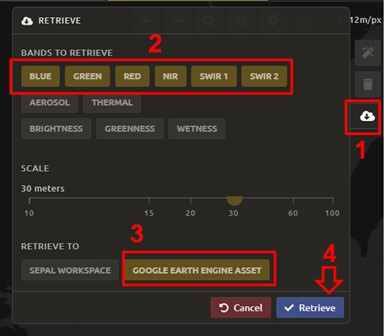

**this image isn't working for some reason...**

4. Repeat steps 2 & 3 but change the **Date** parameter to 2018.

**It may take a significant amount of time before your mosaics finish exporting.**

Part 2: Create and collect change classification training data
-------------------------------------------------------------

Now that we have the mosaics created, we will collect change training data. Though more complex systems can be used, we will consider two land cover classes that each pixel can be in 2015 or 2018: forest and non-forest. Thinking about change detection, we will use three options: stable forest, stable non-forest, and change. That is, between 2015 and 2018 there are four pathways: a pixel can be forest in 2015 and in 2018 (stable forest); a pixel can be non-forest in 2015 and in 2018 (stable non-forest); or it can change from forest to non-forest or from non-forest to forest. If you use this manual to guide your own change classification, remember to log your decisions including how you are thinking about change detection (what classes can change and how), and the imagery and other settings used for your classification.

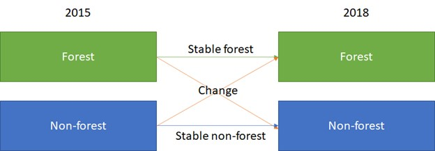

1. First, we’ll create training data.

  a. In the Process menu, click the green plus symbol and select Classification.
  b. Add the 2015 and 2018 mosaics for classification:

    i. Click **Add** and choose **Earth Engine Asset**
    ii. Enter the Earth Engine Asset ID for the mosaic. The ID should look like “users/username/srilanka2018”

        Remember that you can find the link to your Earth Engine Asset ID via Google Earth Engine’s Asset tab. For a refresher, see Module 2.

    iii. Select bands: Blue, Green, Red, NIR, SWIR1, & SWIR2
    iv. Click **Apply** and then repeat steps the previous steps for the 2018 mosaic.
    v. After adding both mosaics, click **Next.**

2. Click **Open training data collection tool.** This will open a new window/tab.

  a. Click **Add project.**
  b. Create new project title “Sri Lanka Training Data” with **TRAINING DATA** as the **Type** and a **scale** of 30m.

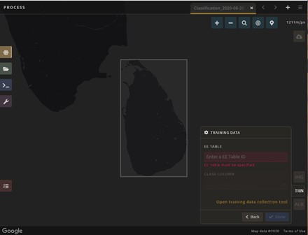

  c. Add “Stable Forest”, “Stable Non-Forest”, and “Change” questions to the Code List

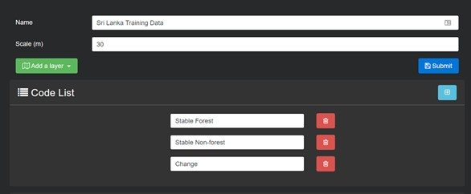

3. Add imagery to the CEO project.

  a. Add your Earth Engine Asset mosaics for both years.
  b. You can also add more than one band combination. See the example below.

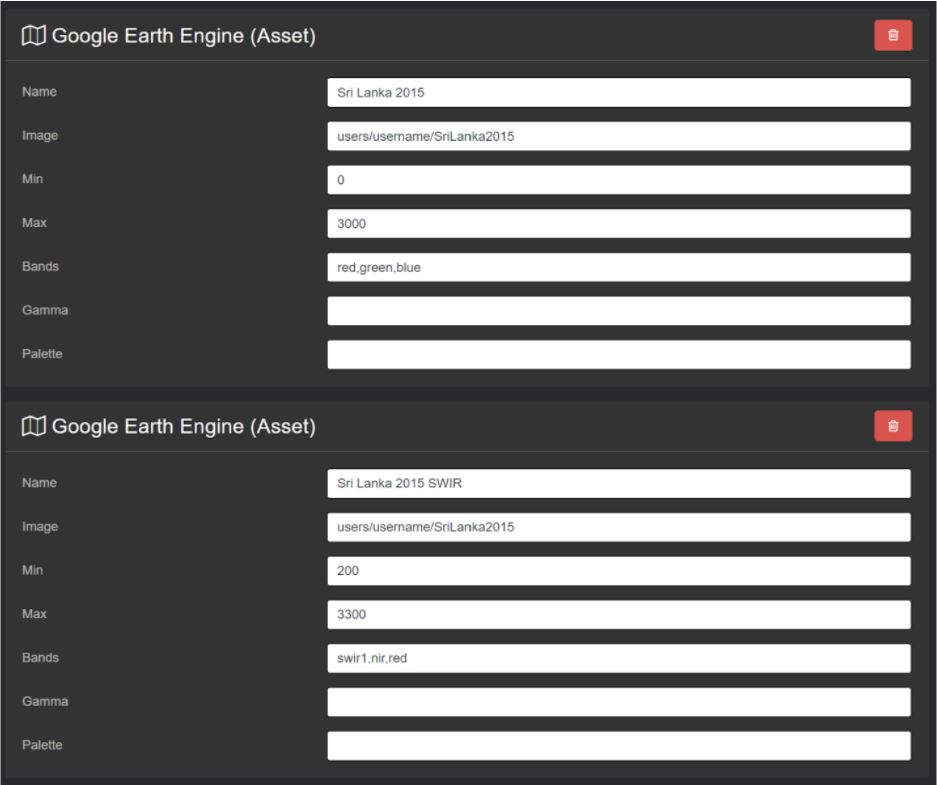

4. Add Hansen Forest Loss layers (loss, yearloss). These are found here: UMD/hansen/global_forest_change_2019_v1_7

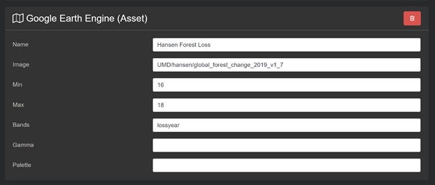

5. When you’ve set up the project, click on the Submit button.
6. Collect and upload sample data.

  a. Click on Collect.
  b. Collect sample data for each land cover class. Switch between your layers in 2015 and 2018 to see differences. You can also use the Hansen Forest Loss layer.
  c. When you’re done, download the **CSV.**
  d. Upload your .csv to GEE Asset.
  e. For more detailed directions, please refer back to Module 2.

7. Add training data to the classification recipe.

   Now you can add your GEE Asset Table in the main SEPAL window. Return to the classification recipe and enter the path to your training data in the EE Table field.

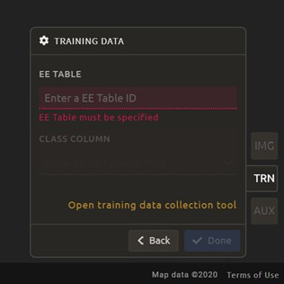

  a. In the **Class Column** field select the column name that holds your class values. If you used SEPAL’s CEO extension this should automatically be filled as **‘class’.**
  b. **Click Done.**

     *If you get the following error, you need to re-upload your training data to Google Earth Engine and be sure to specify the X and Y coordinates (XCoordinate and YCoordinate columns).*

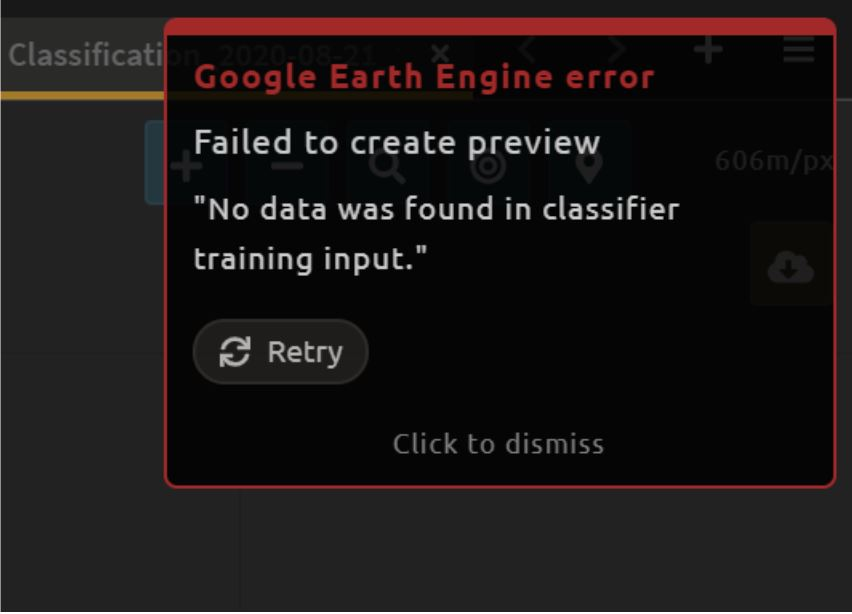

8. SEPAL will then load a preview of your classification.

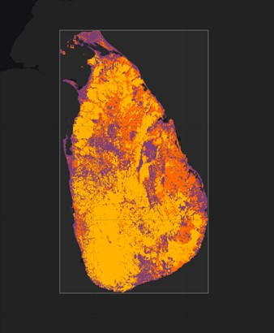

9. In addition to the input features from the Landsat 8 composite, it is possible to add **Auxiliary Sources (AUX)** for the classification. There are three additional sources available:

  a. Latitude - Includes the latitude of each pixel.
  b. Terrain - Includes elevation of each pixel from SRTM data.
  c. Water - Includes information from the JRC Global Surface water Mapping layers.

10. Select **Terrain** and **Water.**
11. Click **Apply.**

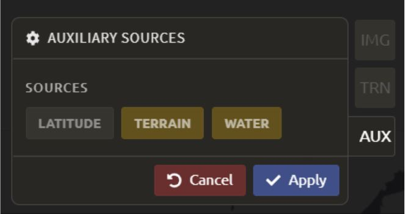

    *If any of the previous sections is unclear, review Modules 1 or 2 for more detailed explanations of how to process mosaics, and collect training data with CEO.*

Part 3. Two date image processing
----------------------------------

Now that the hard work of setting up the mosaics and creating and adding the training data is complete, all that is left to do is run and retrieve the classification.

..

.. image::images/retrieve_change_detection_map.JPEG
   :alt: Retrieving the change detection map.
   :align: center

..

**missing retrieve change detection map.JPG here--not sure why**

1. To retrieve your classification as an EE asset, click the cloud icon in the upper right to open the **Retrieve** panel.
2. Select **Google Earth Engine Asset** or **SEPAL Workspace.** Select GEE Asset if you would like to share your map or if you would like to use it for further analysis. Select SEPAL Workspace if you would like to use the map internally only.
3. Click **Retrieve.**

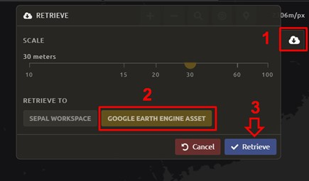

Part 4: Quality assurance and quality control
----------------------------------------------

Quality assurance and quality control, commonly referred to as QA/QC, is a critical part of any analysis. There are two approaches to QA/QC: formal and informal. Formal QA/QC, specifically sample-based estimates of error and area are described in Module 4. Informal QA/QC involves qualitative approaches to identifying problems with your analysis and classifications to iterate and create improved classifications. Here we’ll discuss one approach to informal QA/QC.

Following analysis you should spend some time looking at your change detection in order to understand if the results make sense. We’ll do this by adding your classification to the SEPAL-CEO project we created in Part 2. This allows us to visualize the data and collect additional training points if we find areas of poor classification. Other approaches not covered here include visualizing the data in Google Earth Engine or in another program, such as QGIS or ArcMAP.

1. Navigate back to your SEPAL-CEO project.

  a. Navigate to https://sepal.io/ceo/.
  b. Next to your Sri Lanka project, click on **Edit.**
  c. Add a new layer, title it Classification, and add the information from your Google Earth Engine classification asset.
  d. Click Submit.

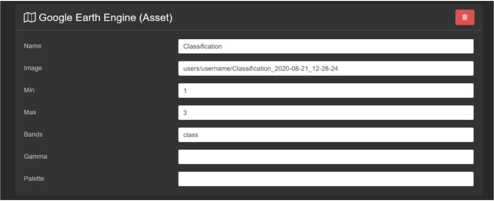

2. Now click Collect for your Sri Lanka project.
3. Switch the imagery to your Classification and pan and zoom around the map. Black will be ‘stable forest,’ grey is ‘stable non forest,’ and white is ‘change’ pixels.
4. Compare your Classification map to the 2015 and 2018 imagery. Where do you see areas that are correct? Where do you see areas that are incorrect?
5. If your results make sense, and you are happy with them, great! Go on to the formal QA/QC in Module 4.
6. However, if you are not satisfied, collect additional points of training data where you see inaccuracies. Then re-run the classification following the steps in Parts 2 and 3.

Here is an example.

High resolution image:

.. image:: images/high_resolution_image.JPG
   :alt: High resolution image.
   :width: 450
   :align: center

2015 imagery:

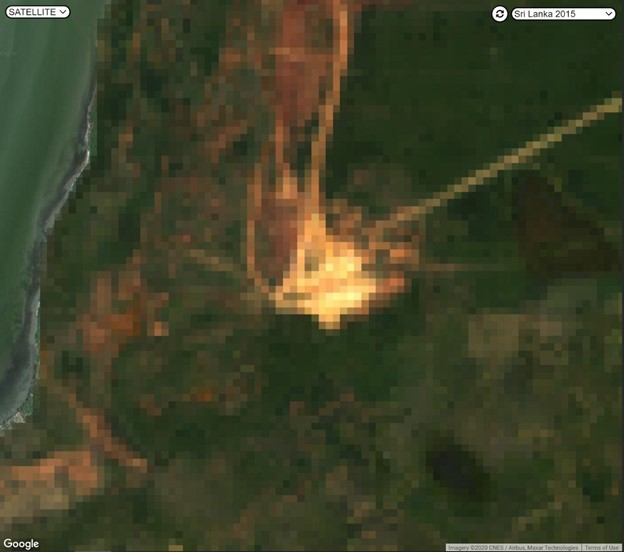

2018 imagery:

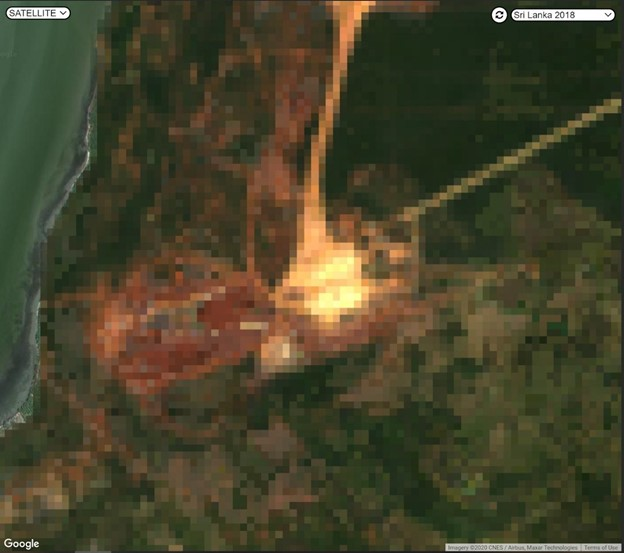

Change detection map:

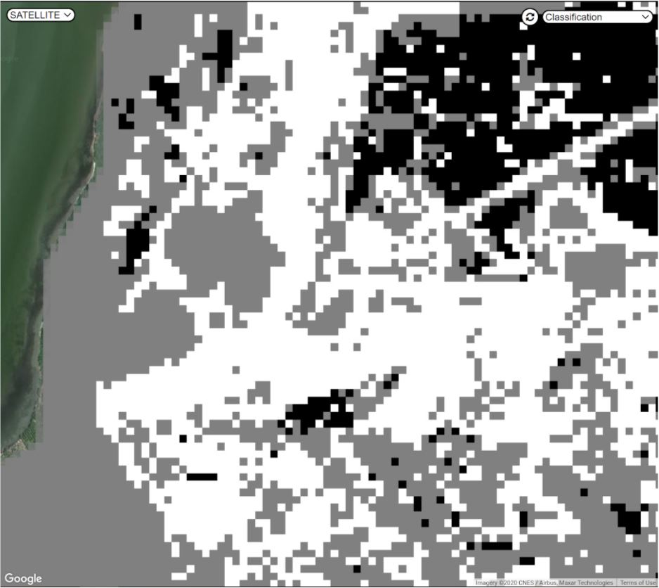

**Congratulations! You have learned how to conduct a two-date change detection classification in SEPAL.**

-----------------------------------
Exercise 3.2. Time series analysis
-----------------------------------

In this exercise, you will learn more about time series analysis. SEPAL has the BFAST option, described first. We also provide information on TimeSync and LandTrendr, products currently only available outside of SEPAL and CEO.

TimeSync integration is coming to CEO in 2021.

+----------------------------------+-----------------------------+
| Objectives                       | Prerequisites               |
+==================================+=============================+
| Learn the basics of BFAST        | SEPAL account               |
| explorer in SEPAL                |                             |
+----------------------------------+-----------------------------+
| Learn about time series analysis |                             |
| options outside of SEPAL         |                             |
+----------------------------------+-----------------------------+

Part 1: BFAST Explorer
-----------------------

Breaks For Additive Seasonal and Trend (BFAST) is a change detection algorithm for time series which detects and characterizes changes. BFAST integrates the decomposition of time series into trend, seasonal, and remainder components with methods for detecting change within time series. BFAST iteratively estimates the time and number of changes, and characterizes change by its magnitude and direction (Verbesselt et al. 2009).

BFAST Explorer is a Shiny app, developed using R and Python, designed for the analysis of Landsat Surface Reflectance time series pixel data. Three change detection algorithms - bfastmonitor, bfast01 and bfast - are used in order to investigate temporal changes in trend and seasonal components, via breakpoint detection. If you encounter any bugs, please send a message to almeida.xan@gmail.com, or create an issue on the GitHub page.

More information can be found online at http://bfast.r-forge.r-project.org/.

1. Navigate to the **Apps** menu by clicking on the wrench icon
2. Type “BFAST” into the search field and select BFAST Explorer
3. Find a location on the map that you would like to run BFAST on.

  a. Click a location to drop a marker, and then click the marker to select it
  b. Select **Landsat 8 SR** from the select satellite products dropdown.
  c. Click **Get Data.** It may take a moment to download all the data for the point

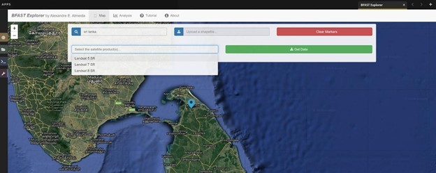

4. Click the **Analysis** button at the top next to the **Map** button.
5. **Satellite product:** Add your satellite data by selecting them from the satellite products dropdown menu.
6. **Data:** The data to apply the BFAST algorithm to and plot. There are options for each band available as well as indices such as NDVI, EVI, and NDMI. Here select **ndvi.**
7. **Change detection algorithm:** Holds three options of BFAST to calculate for the data series.

  a. **Bfastmonitor** - Monitoring the first break at the end of the time series.
  b. **Bfast01** - Checking for one major break in the time series.
  c. **Bfast** - Time series decomposition and multiple breakpoint detection in tend and seasonal components.

Each BFSAT algorithm methodology has characteristics which affect when and why you may choose one over the other. For instance, if the goal of an analysis is to monitor when the last time change occurred in a forest then “Bfastmonitor” would be an appropriate choice. Bfast01 may be a good selection when trying to identify if a large disturbance event has occurred, and the full Bfast algorithm may be a good choice if there are multiple times in the time series when change has occurred.

7. Select bfastmonitor as the algorithm.

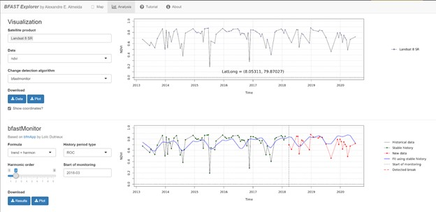

8. You can explore different bands (including spectral bands e.g. b1) along with the different algorithms.

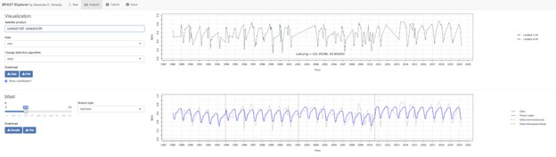

9. You can also download all the time series data by clicking the blue **Data** button. All the data will be downloaded as a .CSV, ordered by the acquisition date.
10. You can also download the time series plot as an image, by pressing the blue **Plot** button. A window will appear offering some raster (.JPEG, .PNG) and a vectorial (.SVG) image output formats.

*The black and white flashing is normal.*

Part 2. TimeSync and LandTrendr
---------------------------------

Here we will briefly review TimeSync and LandTrendr, two options available outside of SEPAL that may be useful to you in the future. It is outside of the scope of this manual to cover them in detail but if you’re interested in learning more we’ve provided links to additional resources.

**TimeSync**

TimeSync was created by Oregon State University, Pacific Northwest Research Station, the Forest Service Department of Agriculture, and the USFS Remote Sensing Applications Center.

From the TimeSync User manual version 3:

  "TimeSync is an application that allows researchers and managers to characterize and quantify disturbance and landscape change by facilitating plot-level interpretation of Landsat time series stacks of imagery (a plot is commonly one Landsat pixel). TimeSync was created in response to research and management needs for time series visualization tools, fueled by rapid global change affecting ecosystems, major advances in remote sensing technologies and theory, and increased availability and use of remotely sensed imagery and data products..."

TimeSync is a Landsat time series visualization tool (both as a web application and for desktops) that can be used to:

* Characterize the quality of land cover map products derived from Landsat time series.
* Derive independent plot-based estimates of change, including viewing change over time and estimating rates of change.
* Validate change maps.
* Explore the value of Landsat time series for understanding and visualizing change on the earth’s surface.

TimeSync is a tool that researchers and managers can use to validate remotely sensed change data products and generate independent estimates of change and disturbance rates from remotely sensed imagery. TimeSync requires basic visual interpretation skills, such as aerial photo interpretation and Landsat satellite image interpretation.”

From TimeSync’s Introduction materials, here is an example output:

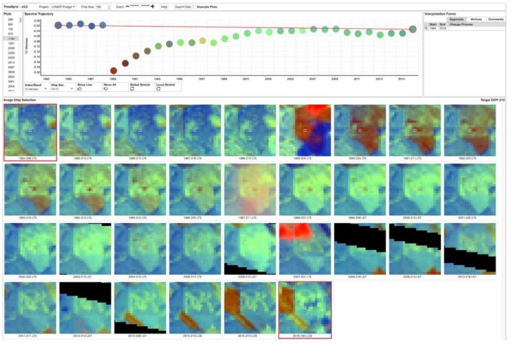

For more information on TimeSync, including an online tutorial (for version 2 of TimeSync), go to: https://www.timesync.forestry.oregonstate.edu/tutorial.html. There you can register for an account and work through an online tutorial with examples and watch a recorded TimeSync training session. You can also find the manual for version 3 of TimeSync here: http://timesync.forestry.oregonstate.edu/training/TimeSync_V3_UserManual_doc.pdf, and an introductory presentation here: https://timesync.forestry.oregonstate.edu/training/TimeSync_V3_UserManual_presentation.pdf.

**LandTrendr**

LandTrendr has much the same functionality as TimeSync, but runs in Google Earth Engine. It was created by `Dr. Robert Kennedy <https://ceoas.oregonstate.edu/people/robert-kennedy>`_’s lab with funding from the US Forest Service Landscape Change Monitoring System, the NASA Carbon Monitoring System, a Google Foundation Grant, and U.S. National Park Service Cooperative Agreement. Recent contributors include David Miller, Jamie Perkins, Tara Larrue, Sam Pecoraro, and Bahareh Sanaie (Department of Earth and Environment, Boston University). Foundational contributors include Zhiqiang Yang and Justin Braaten in the Laboratory for Applications of Remote Sensing in Ecology located at Oregon State University and the USDA Forest Service’s Pacific Northwest Research Station.

From Kennedy, R.E., Yang, Z., Gorelick, N., Braaten, J., Cavalcante, L., Cohen, W.B., Healey, S. (2018). Implementation of the LandTrendr Algorithm on Google Earth Engine. Remote Sensing. 10, 691.:

  "LandTrendr (LT) is a set of spectral-temporal segmentation algorithms that are useful for change detection in a time series of moderate resolution satellite imagery (primarily Landsat) and for generating trajectory-based spectral time series data largely absent of inter-annual signal noise. LT was originally implemented in IDL (Interactive Data Language), but with the help of engineers at Google, it has been ported to the GEE platform. The GEE framework nearly eliminates the onerous data management and image-preprocessing aspects of the IDL implementation. It is also light-years faster than the IDL implementation, where computing time is measured in minutes instead of days."

From LandTrendr’s documentation, here’s an example output in the GUI. However, LandTrendr has significant non-GUI data analysis capabilities. For a comprehensive guide to running LT in GEE visit: https://emapr.github.io/LT-GEE/landtrendr.html.

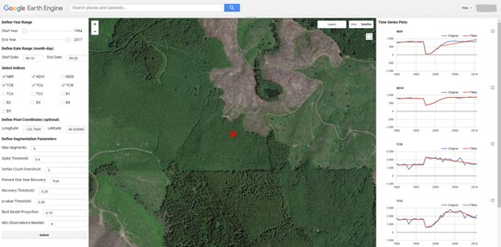

**Congratulations! You have completed this introduction to time-series analysis tools.**
