=======================================================
Module 4. Sample-based estimation of area and accuracy
=======================================================

Once you have either a land use/land cover (LULC) map (Module 2) or a change detection map (Module 3), the next step is to estimate the area within each LULC type or change type and the error associated with your map (this Module). All maps have errors, for example model output errors from pixel mixing or input data noise. Our objective is to create unbiased estimates of the area for each mapped category.

To do this, we will use sample-based estimations of area and error instead of ‘pixel counting’ approaches. Pixel counting approaches simply sum the area belonging to each different class. However, this doesn’t account for classification errors--for example, the probability that a pixel classified as wetland should be open water. Therefore, the pixel counting approach provides no quantification of sampling errors and no assurance that estimates are unbiased or that uncertainties are reduced (Stehman, 2005; GFOI, 2016).

Sample-based estimations of area and error create estimations of errors in pixel classification and use this to inform estimations of area. Therefore, sample-based estimations are in keeping with the IPCC General Guidelines (2006) that estimates should not be over- or under- estimates, and that uncertainty should be reduced as much as practically possible. For more information on the theory behind choosing sample-based estimations of area and error over pixel counting approaches, see:

* GFOI. 2016. Integration of remote-sensing and ground-based observations for estimation of emissions and removals of greenhouse gases in forests: Methods and Guidance from the Global Forest Observations Initiative, Edition 2.0, Food and Agriculture Organization, Rome
* GOFC-GOLD. 2016. A sourcebook of methods and procedures for monitoring and reporting anthropogenic greenhouse gas emissions and removals associated with deforestation, gains and losses of carbon stocks in forests remaining forests, and forestation. GOFC-GOLD Report version COP22-1, (GOFC-GOLD Land Cover Project Office, Wageningen University, The Netherlands)
* Gallego, FJ. 2004. Remote sensing and land cover area estimation. International Journal of Remote Sensing, 25(15): 3019-3047, DOI: 10.1080/01431160310001619607
* IPCC. 2006. Guidelines for national Greenhouse Gas Inventories. Volume 4: Agriculture, Forestry and Other Land Use. http://www.ipcc-nggip.iges.or.jp/public/2006gl/vol4.html
* REDD Compass: https://www.reddcompass.org/

There are four steps to sample-based estimation of area and accuracy. First, you will use the different classes in your LULC or change detection map to create a stratified sampling design in SEPAL using the Stratified Area Estimator (SAE) - Design tool (Exercise 4.1). Then you will revisit your response design and labelling protocols to use with data collection in CEO (Exercise 4.2). Finally, you will use data generated in CEO (Exercise 4.3) to calculate the sample-based estimates in SEPAL, using the Stratified Area Estimator- Analysis tool (Exercise 4.4). This tool quantifies the agreement between the validation reference points and the map product, providing information on how well the class locations were predicted by the Random forest classifier.

This process will provide two important outputs. First, you will have estimates of the area for each LULC or change type. Second, you will have a table that describes the accuracy for each LUC or change type. This is often called a confusion matrix. These may be final products for your projects. However, if you decide that your map is not accurate enough, this information can be fed back into the classification or change detection algorithms to improve your model.

This Module takes approximately 3 hours to complete.

-----------------------------------------------
Exercise 4.1. Sample design and stratification
-----------------------------------------------

Stratified random sampling is an easy to use, easy to understand, and well supported sampling design (for more information, see Olofsson et al. 2014. Good practices for assessing accuracy and estimating area of land change, Remote Sensing of Environment 148, 42-57). With stratified random sampling, each class (e.g. land use, land cover, change type) is treated as a strata. Then, a sample is randomly taken from each sample, either in proportion to area, in proportion to expected variance, or in equal numbers across strata.

We will use the SEPAL SAE-Design tool. You will upload your classified map and set some basic parameters, then the SAE-Design tool will generate a set of stratified random points that are placed in each of the different land cover classes represented in your map. The number of points in each class will be scaled to the area each class covers in the map. The total sample size, the number of points used to validate the map will depend on your expected overall accuracy. Be sure to log these choices as part of your documentation (Module 5).

+-------------------------------------+----------------------------------+
| Objectives                          | Prerequisites                    |
+=====================================+==================================+
| Generate a stratified random sample |                                  |
| based on your image classification. | Classification from Module 2.    |
+-------------------------------------+----------------------------------+
| Optional: Upload your               | Optional: you can also use your  |
| stratification to SEPAL.            |  classification from Module 3.   |
+-------------------------------------+----------------------------------+

Part 0. Uploading files to SEPAL (optional)
--------------------------------------------

If your classification is not stored in SEPAL (for example, a classification in GEE or a classification created through CODED), you will need to upload it to SEPAL in order to use SEPAL’s stratified random sample tool.

1. Login to SEPAL.
2. Select the purple wrench **Apps** button. If you have an existing tab open, you may need to click the **plus** sign in the top right.
3. Choose the **R Studio** application. You may be prompted to enter your SEPAL username and password to enter R Studio.

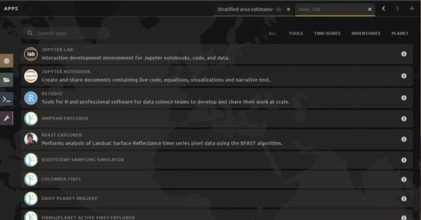

|

4. This will open an instance of RStudio, an IDE for the R programming language.
5. You should see a ‘Files’ tab in the lower right window.

   If not, you may need to adjust the window layout. To do this, move your mouse to the right-hand side of the window where a four-way arrow will appear. Click and drag your mouse to the left to reveal the right pane.

6. Click the **Upload** button that is located in the lower right side of the R Studio interface (see below).

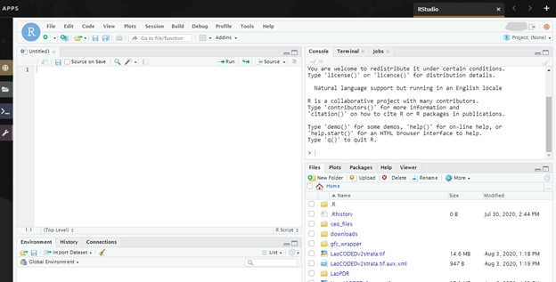

|

7. In the **Upload Files** window, click **Choose File.**
8. Navigate to the correct location on your drive and add . click Open.
9. Once you’ve selected this file, click **OK** to complete the upload (see below).
10. You will see your file appear in the list of files in the lower right-hand pane.
11. You may now close the RStudio instance by clicking the tab’s **x.**

Part 1. Creating a stratified random sample
--------------------------------------------

We will use SEPAL to create a stratified random sample. To begin, you can use the test dataset available in SEPAL or you can use a raster of your classification loaded into SEPAL using the instructions in Part 0.

If you have a large area you are stratifying, please first increase the size of your instance (see Module 1 Exercise 1.1 Part 5).

A well-prepared sample can provide a robust estimate of the parameters of interest for the population (percent forest cover, for example). The goal of a sample is to provide an unbiased estimate of some population measure (e.g. proportion of area), with the smallest variance possible, given constraints including resource availability. Two things to think about for sample design are: do you have a probability based sample design? That is, does every sample location have some probability of being sampled? And second, is it geographically balanced? That is, are all regions in the study area represented. These factors are required for the standard operating procedures when reporting for REDD+.

These directions will provide a stratified random sample of the proper sampling size.

1. First, navigate to https://sepal.io/ and sign in.
2. Select the **Apps** button (purple wrench).
3. Type ‘stratified’ into the search bar or scroll through the different process apps to find “Stratified Area Estimator--Design”
4. Select **Stratified Area Estimator-Design.** Note that loading the tool takes a few minutes.

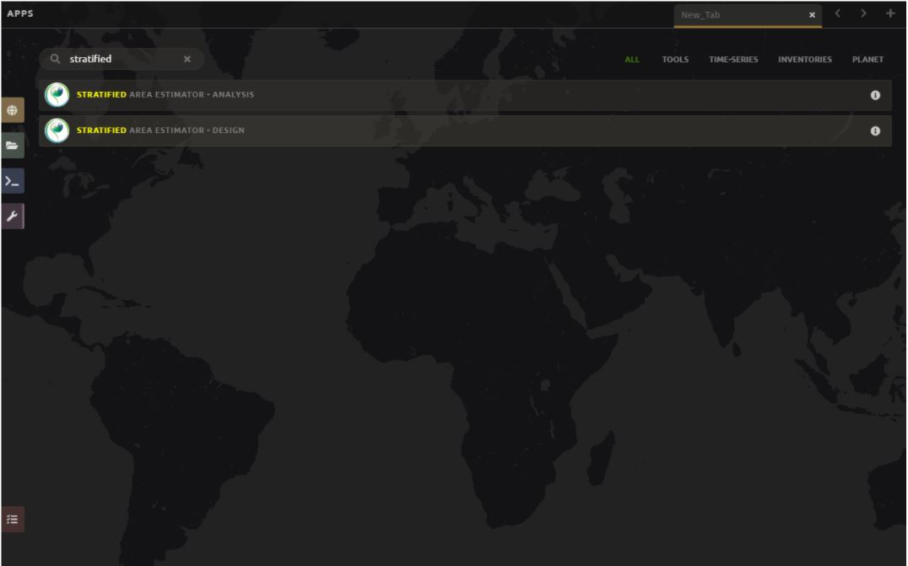

|

*Sometimes the tool fails to load properly (none of the text loads) as seen below. In this case, please close the tab and repeat the above steps.*

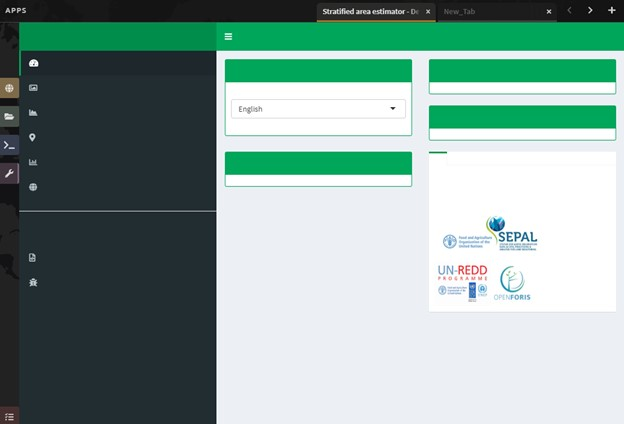

|

5. When the tool loads properly, it will look like the image below. Read some of the information on the **Introduction** page to acquaint yourself with the tool.

  a. On the **Introduction** page, you can change the language from English to French or Spanish.
  b. The Description, Background, and ‘How to use the tool” panels provide more information about the tool.
  c. The Reference and Documents panel provides links to other information about stratified sampling, such as REDD Compass.

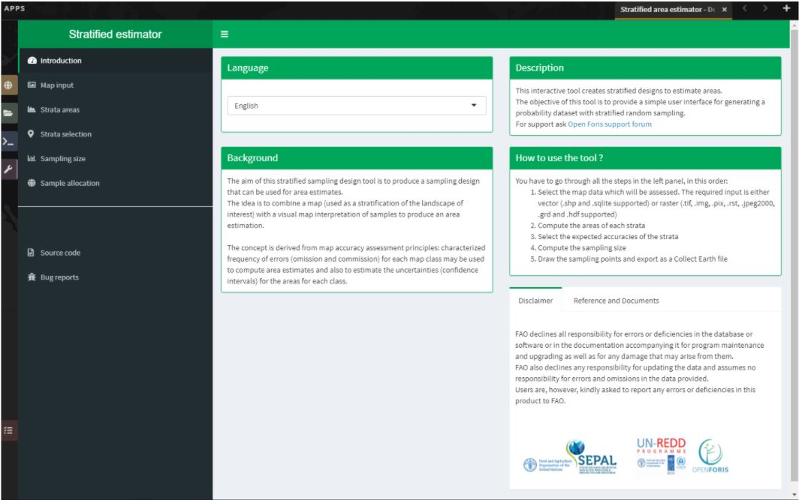

|

6. The steps necessary to design the stratified area estimator are located on the left side of the screen and they need to be completed sequentially from top to bottom.
7. Select **Map input** on the left side of the screen.

  a. For this exercise, we’ll use the classification from Module 2. However, you can substitute another classification, such as the two date detection classification created in Module 3 if you would like.
  b. In the **Data type** section, click **Input.**
  c. In the **Browse** window that opens, navigate to the test dataset and select it.
  d. Then click **Select.**
  e. Note that the **Output folder** section shows you where in your SEPAL workspace all the files generated from this Exercise will be saved.
  f. Optionally, you can use a csv with your raster areas instead. We won’t discuss that here.

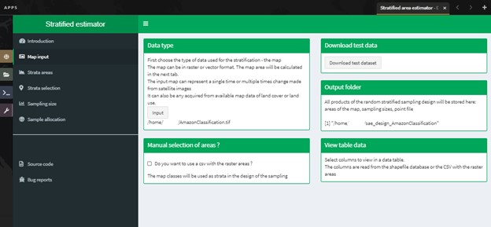

|

8. Next, click **Strata areas** on the left side of the screen.

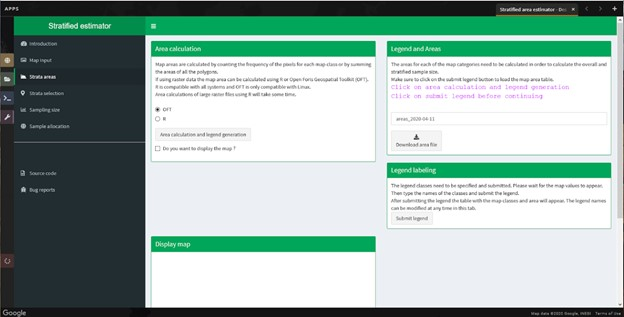

|

9. In the **Area calculation** section, select **OFT.** OFT stands for the Open Foris Geospatial Toolkit. R is slower but avoids some errors that arise with OFT.

   If you choose to use OFT, it will return values for the map that are incorrect if your map stored using certain formats (e.g. signed 8 bit). If this is the case, then please use the R option and it will work correctly. If using OFT, always compare the **Display map** with the **Legend labeling** values returned to make sure they match.

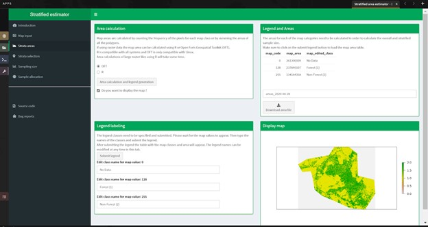

|

10. The **“Do you want to display the map”** checkbox allows you to display your geotiff under “Display map”.

    The colors displayed in the SAE-Design tool in this section may be different than what you see elsewhere. Additionally, if your ‘no data’ class is 0, the tool will color this as well.

11. Click the **Area calculation and legend generation** button. This will take a few minutes to run. After it completes, notice that it has updated the **Legend labeling** section of the page.

  a. Next, you will need to adjust the class names in the **Legend labeling** section. Type in the following class names in place of the numeric codes for your Amazon:

     0 = No Data

     1 = Forest

     2 = Non-Forest

  b. Now click **Submit Legend.** The **Legend and Areas** section will now be populated with the map code, map area, and edited class name.
  c. You can now **Rename** and **Download** the area file if you would like. However it will save automatically to your Sepal workspace.

12. When you’re done, click on **Strata selection** on the left panel.
13. Now you need to specify the expected accuracies. You will do this for each class.

  a. You can get more information by clicking the **plus** button to the right of the box that says **What are the expected accuracies?**
  b. Specifying the expected user accuracy helps the program determine which classes might need more points relative to their area.
  c. Some classes are easier to identify--including common classes and classes with clear identifiers like buildings.
  d. Classes that are hard to identify include rare classes and classes that look very similar to one another. Having more classes with low confidence will increase the sample size.

    i. Select the value for classes with high expected user accuracy with **the first slider.** This is set to 0.9 by default, and we’ll leave it there.
    ii. Then, select the value for classes with low expected user accuracy with **the second slider.** This is set to 0.7 by default, and we’ll leave it there as well.

14. Now we need to assign each class to the high or the low expected user accuracy group.

  a. Think about your forest and non-forest classes. Which do you think should be high confidence? Which should be low confidence? Why?
  b. Click on the box under **“high confidence”** and assign your high confidence class(es). **For this exercise, please assign both Forest & Non-forest to the high confidence class. If you assign either to the low confidence class, you will not be able to use the CEO-SEPAL bridge in Exercise 4.2.**
  c. Then, click on the box under **“low confidence”** that appears and assign the corresponding class(es).
  d. If you make a mistake, there’s no way to remove the classes. However, just change one of the sliders slightly, move it back, and the class assignments will have been reset.
  e. **DO NOT assign your No Data class to either high or low confidence.**

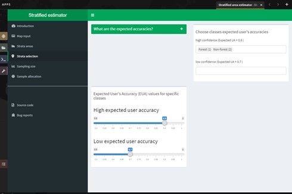

|

15. When you’re satisfied, click on **Sampling Size** on the left panel.

  a. Now we will calculate the required sample size for each strata.
  b. You can click on the “+” button to get more information.
  c. First we need to set the **standard error of the expected overall accuracy.** It is 0.01 by default, however for this exercise we will set it to 0.05.

    i. This value affects the number of samples placed in each map class. The lower the value, the more points there are in the sample design. Test this by changing the error from 0.05 to 0.01, and then change it back to point 0.05. Alternatively, you can click the up/down button to the right of the number.
    ii. Note that you can adjust this incrementally with the up/down arrows on the right side of the parameter.

  d. Then determine the **minimum sample size per strata.** By default it is 100. For the purposes of this test we will set it to 20, **but in practice this should be higher.**
  e. You can also check the “Do you want to modify the sampling size” box.
  f. If you would like, you can edit the name of the file & download a csv with the sample design. The file contains the table shown above with some additional calculations. However, SEPAL will automatically save this file.

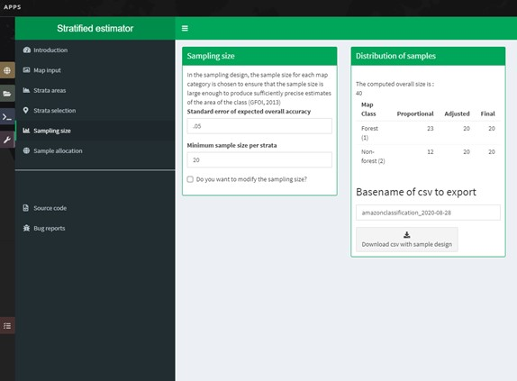

|

16. When you’re ready, click on **Sample allocation** to the left.

  a. The final step will select the random points to sample.
  b. Select **Generate sampling points** and wait until the progress bar in the bottom right finishes. Depending on your map, this may take multiple minutes. A map will pop up showing the sample points. You can pan around or zoom in/out within the sample points map.

    i. The resulting **distribution of samples** should look similar to the below image. These values will vary depending on your map and the standard error of expected overall accuracy you set.
    ii. Sometimes this step fails, no download button will appear, and you will need to refresh the page and restart the process.

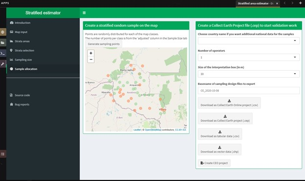

|

17. Now fill out the four fields to the right.

  a. You can add additional data by specifying which country the map is in. Here, Leave the **Choose your country name…** section blank.
  b. Specify the **number of operators,** or people who will be doing the classification. Here, leave it set to 1. For CEO, this might be the number of users you think your project will have.
  c. The **size of the interpretation box** depends on your data and corresponds to CEO’s sample plot. This value should be set to the spatial resolution of the imagery you classified (Landsat= 30 meters). Here, leave it at 30 m.

   When should you use CEO, and when should you use the CEO-SEPAL bridge? In general, **the CEO-SEPAL bridge should only be used for very simple use cases.** More specifically, CEO-SEPAL is a great option when you have only high-confidence categories, have a relatively small number of points, when you will collect the data yourself, and when the built in questions about your data points suffice. Most often, you will want to create a CEO project. Creating a CEO project through the collect.earth website is a better option when you have low-confidence categories, a larger number of points in your sample, when you want to use specific validation imagery, when multiple people will collect data and you need to track who is collecting data, and when you need more complex or custom questions about your data points.

   CEO-SEPAL does not ask about low confidence categories--this is a problem for creating an error matrix if you have low-confidence categories.

18. If you would like to create a project via CEO, click on **Download .csv** and follow the steps in Part 2 below. After following the directions in Part 2, you will proceed to Exercise 4.2. We highly recommend using this approach, and we will demonstrate it in this manual.
19. To create a project via the CEO-SEPAL bridge, click on **Create CEO project.**

  a. This will create a CEO project via the CEO-SEPAL bridge.
  b. This process will take a few minutes and you should see text and completion bars in the lower right as calculations happen.
  c. Copy-paste the link into your browser window when it appears.
  d. Be sure to save this link somewhere so you can reference it later.

**You MUST be logged out of CEO for this pathway to work.**

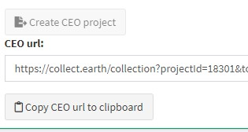

|

20. When the project has been created, you can skip down to Exercise 4.2.
21. You can download a .shp file to examine your points in QGIS, ArcGIS, or another GIS program. You can also create a CEO project using a .shp file, however that is outside of the scope of this manual. Directions can be found in the Institutional manual found here: https://collect.earth/support.

Part 2. Creating a CEO project via CSV
----------------------------------------

For projects with large sample sizes, where you want to have multiple people collecting validation data, or where you want to use specific validation imagery, you will want to create a project through CEO rather than through the CEO-SEPAL bridge. Note that the TOTAL number of plots you want to sample using a .csv must be 50,000 or less. If you have more plots, break it into multiple projects.

1. Make sure you have downloaded the .csv of your stratified random sample plots (Part 1).
2. Open your downloaded .csv file in Excel or the spreadsheet program of your choice.
3. First, make sure that your data doesn’t contain a strata of ‘no data’. This can occur if your classification isn’t a perfect rectangle, as seen in this example of Nepal (the red circles are samples that the tool created in the ‘no data’ area). **If you have ‘no data’ rows, return to the SEPAL stratified estimator, and be sure to not include your no data class in the strata selection step.**

.. image:: images/example_data_sepal_classification.JPG
   :alt: Example data from the SEPAL classification.
   :align: center

|

4. Right now, your stratification is grouped by land cover type (**map_class** column). To reduce the human tendency to use the order of the plots to help identify them (i.e. knowing the first 100 plots were classified forest, so being more likely to verify them as forest instead of determining if that is correct) we suggest first randomizing the order of the rows.

   To do this, click the **Sort & Filter** button in Excel

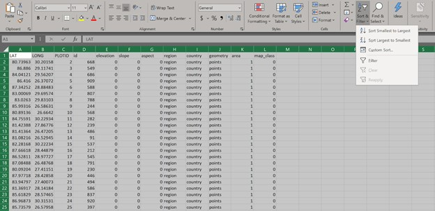

|

5. Next, Sort on the ‘id’ field by value, either smallest to largest or largest to smallest.

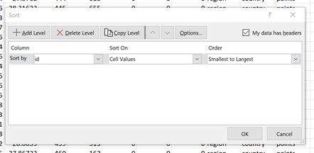

|

6. Now we need to add the correct columns for CEO. Remember that Latitude is the Y axis and longitude is the X axis. For CEO, the first three columns must be in the following order: longitude, latitude, plotid. The spelling and order matter. If they are wrong CEO will not work correctly.

  a. Rename ‘id’ to PLOTID. You can also add a new PLOTID field by creating a new column labeled PLOTID, and fill it with values 1-(number of rows).
  b. Rename the ‘XCoordinate’ column to ‘LAT’ or ‘LATITUDE’.
  c. Rename the ‘YCoordinate’ column to ‘LONG’ or ‘LONGITUDE’.
  d. Reorder the columns in Excel so that LAT, LONG, PLOTID are the first three columns, in that order.

7. Save your updated .csv, making sure you save it as a .csv and not as an .xlsx file.
8. Navigate to collect.earth.

  a. Creating a project in CEO requires you to be the administrator of an institution.
  b. Login to your CEO account. If you’re already the administrator of an institution, navigate to your institution’s landing page by typing in the institution’s name and then clicking on the Visit button.
  c. If you’re not an admin, go ahead and create a new institution.
  d. Click on create new institution from the homepage, then fill out the form & click create institution.

9. When you’re on the institution’s page, click on the “Create New Project” button.
10. This will go to the Create Project interface. We’ll now talk about what each of the sections on this page does. For more information, please see the Institutional Manual available on the collect.earth Support page https://collect.earth/support.

  a. **TEMPLATE:** This section is used to copy all the information—including project info, area, and sampling design—from an existing published project to a new project.

    i. This is useful if you have an existing project you want to duplicate for another year or location, or if you’re iterating through project design. You can use a published or closed project from your institution or another institutions’ public project.
    ii. The project id is found in the URL when you’re on the data collection page for the project.

  b. **PROJECT INFO:** Under Project Info, enter the project’s **Name** and **Description.**

    i. The **Name** should be short and will be displayed on the Home page as well as the project’s Data Collection page.
    ii. You should keep the **Description** short but informative.
    iii. The **Privacy Level** radio button changes who can view your project, contribute to data collection, and whether admins from your institution or others creating new projects can use your project as a template.

  c. **AOI:** The project area of interest (AOI) determines where sample plots will be drawn from for your project. This is the first step in specifying a sampling design for your project. There are two main approaches for specifying an AOI and sampling design.

    i. First, using CEO’s built in system.
    ii. Second, creating a sample in another program and importing it into CEO. **This is what we have done.** You will specify the AOI in the Sample Design step instead.
    iii. You should choose your Basemap source, which will be the default imagery that the user sees.
    iv. (Optional) Check the box for any additional imagery you would like to add.

  d. **Sample Plot Design:** Here, click the radio button next to .csv.

    i. Click on **Upload,** and upload the .csv of your stratified random sample. Note that the number of plots you want to sample must be 5000 or less.
    ii. Select if you would like round or square plots, and specify the size. For example, you might specify square plots of 30m width in order to match Landsat grid size.

  e. **Sample Point Design:** Under the Sample Design header is really determining the sample point design within each sample plot.

    i. You can choose Random or Gridded, and how many samples per plot or the sample resolution respectively. You can also choose to have one central point.
    ii. Using CEO's built in system, the maximum number of sample points per plot is 200. The maximum total number of sample points for the project across all plots is 50000.

  f. **Survey Design:** This is where you design the questions that your data collectors/photo interpreters will answer for each of your survey plots. Each question creates a column of data. This raw data facilitates calculating key metrics and indicators and contributes to fulfilling your project goals.

    i. **Survey Cards** are the basic unit of organization. Each survey card creates a page of questions on the Data Collection interface.
    ii. The basic workflow is: Create new top-level question (new survey card) THEN populate answers THEN create any child questions & answers THEN move to next top-level question (new survey card) & repeat until all questions have been asked.
    iii. You can ask multiple types of questions (including the button—text questions from the Simple interface). You can also add survey rules in the Survey Rules Design panel.
    iv. Broadly, there are four question types and three data types. They are combined into 10 different component types.
    v. The four question types are:

      * Button: This creates clickable buttons, allowing users to select one out of many answers for each sample point.
      * Input: Allows users to enter answers in the box provided. The answer text provided by the project creator becomes the default answer.
      * Radiobutton: This creates radiobuttons, allowing users to select one out of many answers for each sample point.
      * Dropdown: Allows users to select from a list of answers.

    vi. The three data types allowed are:

      * Boolean: Use this when you have two options for a question (yes/no).
      * Text: Use this when you have multiple options which are text strings. They may include letters, numbers, or symbols.
      * Number: Use this when you have multiple options that are numbers, which do not contain letters or symbols.

    vii. First, type in your question in the New question box, such as “Is this forest or non-forest?"
    viii. Then click add survey question.
    ix. A new survey card (Survey Card Number 1) will pop up with your question in it.
    x. You can now add answers.
    xi. Create one answer for each of your land use types. Here we will use 1 and 2 to match our “Forest” and “Non-forest” in our classification. Be sure to include all your land use types.
    xii. Note that the Stratified Area Estimator--Analysis only accepts numeric values for the land use types. If you would like to use human-readable text values (e.g. Forest instead of 1), **you MUST follow the directions in Exercise 4.3 Part 2.**
    xiii. You can add additional survey questions if you’d like to experiment. An example of two survey cards is shown below.

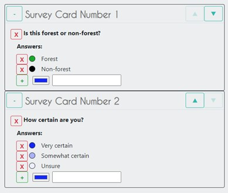

|

11. When you’re done, click Create Project.

  a. If you’re successful, you’ll see the review project pane.
  b. The Project AOI will now show the location of a subset of your plots (a maximum number can be displayed).

12. Not shown are the Plot Review and Sample Design, which show a summary of the choices you made or the .csv and .shp files you uploaded. Survey Review shows all the Survey Cards you created, along with the corresponding Component Type, Rules, and Answers.
13. At this point, your project has been created, but it hasn’t been published so that other users can see it.

    There is also review project functionality. As an administrator, you review your unpublished project and make suggestions to the questions etc. before it is published for data collection.

14. You can either click [Publish Project] or [Configure Geo-Dash]. The option to Configure Geo-Dash will be available after you publish your project, as well.

  a. For now, let’s click on Configure Geo-Dash.
  b. A new window or tab will open and you’ll now see the blank Geo-Dash configuration page.
  c. Geo-Dash is a dashboard that opens in a second window when users begin to analyze sample plots. Geo-Dash provides users with additional information to help them interpret the imagery and better classify sample points and plots. The Geo-Dash tab can be customized to show information such as NDVI time series, forest degradation tools, additional imagery, and digital elevation data.
  d. If you click on Geo-Dash Help, You’ll access information about all of the Geo-Dash widgets. This information is also in the CEO user manual.
  e. Add any widgets that you would like for your project. For example, add a NDVI widget following these steps:

    i. Click on Add Widget, then select the Image Collection type.
    ii. Select your basemap imagery.
    iii. Now you’ll see the data dropdown menu. Select NDVI in this menu.
    iv. Now you’ll see the Title--give your widget a title that describes the data.
    v. Select the date range using the calendar widgets or by typing it in.
    vi. When you’re done, click Create.

  f. You can now move the widget by clicking and dragging from the center and resize it by clicking and dragging the lower right-hand corner.
  g. When you’re done adding widgets, close the Geo-Dash window.

15. On the project review page, click publish project.

  a. Collect earth will ask you to confirm, click OK.
  b. You can now visit your project from your institution’s page and start collecting data!

More detailed instructions, including descriptions of many useful options, can be found in the manuals for CEO: https://collect.earth/support.

**Congratulations! You have created a stratified random sampling design for your map and a project (CEO or CEO-SEPAL) to collect reference data.**

----------------------------------------------------------------------
Exercise 4.2. Data collection with data quality management approaches
----------------------------------------------------------------------

Once you have created a stratified random sample, you will use CEO (or optionally the CEO-SEPAL tool) to visually interpret the land cover at the sample locations using a suitable source of reference data, often remote sensing data. These visual interpretations will then inform the area and error estimation (Exercise 4.3). However, to ensure accurate human interpretation of land cover, you will need to adopt data quality management approaches. Thus in this exercise, you will check your classification design (Part 1), plan your data collection (Part 2), collect your data (Part 3) and set up quality management (Parts 4 & 5).

The reason for this focus on data quality is simple: area and error estimates are based on the human interpreter’s labelling of the sample; therefore, it is important that the labels are correct. Some recommend that three interpreters examine each unit independently, while other projects just have a subsample of the data points cross checked by another interpreter. In parts 4 & 5, you will consider this and design a quality assurance plan that meets the needs and budgets of your specific mapping projects and management needs.

Much of this information is based on Standard Operating Procedures developed by Till Neeff at FAO for global application. Working these exercises will help you abide by these guidelines and meet these standards of quality for the data collected.

+---------------------------------------+-------------------------------------+
| Objectives                            | Prerequisites                       |
+=======================================+=====================================+
| Understand how to set up a successful | Stratified random sample based on   |
| verification project.                 | your image classification from      |
|                                       | Exercise 4.1.                       |
+---------------------------------------+-------------------------------------+
| Collect land cover verification data  | CEO-SEPAL project initiated         |
| about each of your sample points.     | in Exercise 4.1.                    |
+---------------------------------------+-------------------------------------+
| Create quality management protocols   |                                     |
| for your verification project.        |                                     |
+---------------------------------------+-------------------------------------+

Part 1. Specify a classification scheme
----------------------------------------

“Classification scheme” is the name used to describe the land cover / land use classes adopted. It should cover all the possible classes that occur in interest. Just as when you are creating training data for your classification, you will need to have a response design with consistent labelling protocols when collecting data for your area and error estimates.

If you have already created a response design in Module 2, you should use that.

If you have not created a response design for the classification you are now evaluating, please refer to Exercise 2.1 to create a classification scheme. Note that if your classification was trained using training points that differ substantially from your classification scheme, you may need to collect new training data and re-run your classification.

As a reminder, our classification used to classify our Forest/Non-forest land cover map was as follows:

.. image:: images/classification_tree.JPG
   :alt: The classification tree.
   :width: 450
   :align: center

|

We defined Forest as an area with over 70% tree cover. We defined Non-forest as areas with less than 70% tree cover. This captured land covers including urban areas, water, and agricultural fields.

Part 2. Planning data collection
---------------------------------

Now that we have the framework for the procedure for data collection with quality in mind we can work through what it would be like setting up the process for a team. Data collection efforts require planning, particularly for large efforts with many interpreters involved. We will discuss these planning aspects here.

In this part, you will assume the role of a _coordinator_ and an interpreter for a small team working to validate the land cover classification from Module 2. A coordinator is responsible for organizing the team and tracking compliance information. An interpreter is responsible for collecting data.

Identify the reference data sources.

Ideally, you would have plots revisited in the field. However, this is rarely attainable given limited resources. An alternative is to collect reference observations through careful examination of the sample units using high resolution satellite data, or moderate resolution if high resolution is not available. The more data you have at your disposal the better.

If you have no additional data, you can use remote sensing data, such as Landsat data, for collecting reference observations, as long as the process to collect the reference data is more accurate than the process used to create the map being evaluated. Careful manual examination can be regarded as being a more accurate process than automated classification.

Consider what additional data you might be able to include in your verification. Do you have access to satellite data at a finer resolution than Landsat? Could you incorporate additional datasets such as stump data or on the ground verifications? You might try searching databases, such as https://developers.google.com/earth-engine/datasets/.

In CEO, these are the additional data sources that you have added to your CEO project. The CEO-SEPAL bridge uses only the default imagery, which is currently Mapbox Satellite.

Compile a list of your data sources and review it with your interpreters. Recording this information is important for documentation (see Module 5).

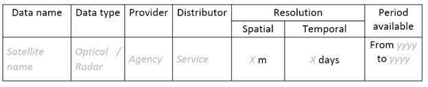

|

**Determine level of effort.**

1. Estimate the necessary level of effort for the data collection using the following formula:

   Minutes to interpret 1 sample unit * number of sample units = required level of effort for data collection

2. If information is available from previous inventories, use that experience to set the value on the time required for assessing sample units from previous experience using the same response design. Otherwise, carry out a test.
3. For this exercise, consider how long it took you to create your training data in Module 2 and use the formula above to estimate how long it will take to classify all your samples.

**Identify data collection participants.**

1. As coordinator, you will identify the persons who may be involved in the data collection. You should set up minimum qualifications for participating in the data collection, such as familiarity with the landscape, previous experience, etc.

  a. What qualifications do you think are important?
  b. What qualifications are essential, and which would be nice to have?
  c. How can you build capacity within your organization for data collection?

2. As coordinator, you will record names and contact information of all the participants in the data collection and training.

  a. Here’s a template:

+------+-----------------------------------+------------------+--------------------------+
| Name | Contact                           | Institution      | Role for data collection |
+======+===================================+==================+==========================+
| Name | Email address and/or phone number | Institution name | Coordinator              |
+------+-----------------------------------+------------------+--------------------------+
| Name | Email address and/or phone number | Institution name | Trainer                  |
+------+-----------------------------------+------------------+--------------------------+
| Name | Email address and/or phone number | Institution name | Sample interpretation    |
+------+-----------------------------------+------------------+--------------------------+
| Name | Email address and/or phone number | Institution name | Sample interpretation    |
+------+-----------------------------------+------------------+--------------------------+
| Name | Email address and/or phone number | Institution name | etc.                     |
+------+-----------------------------------+------------------+--------------------------+

  b. And a worked example:

+--------------+---------------------+---------------------------------+--------------------------+
| Name         | Contact             | Institution                     | Role for data collection |
+==============+=====================+=================================+==========================+
| Phạm Tuân    | example@example.org | Institute for Collecting Data   | Coordinator              |
+--------------+---------------------+---------------------------------+--------------------------+
| Sally Ride   | example@example.org | Training Specialists Institution| Trainer                  |
+--------------+---------------------+---------------------------------+--------------------------+
| Rodolfo Vela | example@example.org | Institute for Collecting Data   | Sample interpretation    |
+--------------+---------------------+---------------------------------+--------------------------+
| Yuri Gagarin | example@example.org | Institute for Collecting Data   | Sample interpretation    |
+--------------+---------------------+---------------------------------+--------------------------+

3. Based on this information, you will decide on the format and modality for the data collection and on a timeline.

  a. For example, the format of the data collection can be a mapathon set-up where a large group collects the data over a short amount of time or a smaller team that collects the data over long periods. The modality for the data collection concerns where the team collects the data, either in the same location or disparate locations eg. in a mapathon, the interpreters could be in the same room interpreting the data.
  b. If the data collection is set up in disparate locations, modes of communication should be specified to help improve the consistency in the data interpretation.
  c. Multiple re-measurements for all samples is another option.

4. The logistics manager (if different from the coordinator) will arrange logistics, including space for data collection, sufficient time for data collection, and salary arrangements.
5. With your fictional team (above) and your timeline laid out in the scenario, decide on the format and modality for the data collection and on a timeline.

  a. What other modalities of data collection can you think of?
  b. What are the pros and cons of these modalities?

**Organize training and calibration sessions.**

1. As a first step in the data collection, the coordinator and the trainer organize and prepare a training event for the interpreters who have confirmed their participation. The training should cover the following topics as a minimum:

  a. the response design and the interpretation key (detailing location specific examples from all the classes in the classification system with visualization from multiple data sources available),
  b. The software used for the data collection and how to ensure the data management and storage,
  c. The data sources available, and
  d. Quality management practices.

2. Knowing what you do now, consider a-d above and briefly fill in details for each topic in another document. Write this as if you were planning a training event before collecting verification data for your forest/non-forest classification. What other topics do you think should be in the training?

The trainer should then implement the training event following these basic principles:

1. Create an environment for active participation, where participants can share questions and opinions
2. encourage communication between the interpreters
3. record attendance of the interpreters, and
4. assess the capacity of the interpreters at the end of the training and record the results.
5. Thinking about the basic principles for a training (a-d above) briefly write out how you might achieve these goals.

   Following the training, the coordinator and the trainer should prepare a report summarizing:

  a. The training actions taken,
  b. The attendance (example below), and
  c. The results of the assessment of capacity.

This information should be documented as part of the decision making process for the verification (see Module 5).

+---------------+---------+---------+
| Name          | Day 1   | Day N   |
+===============+=========+=========+
| Interpreter 1 | present | present |
+---------------+---------+---------+
| Interpreter X | present | present |
+---------------+---------+---------+

**Distribute and assign sample units to interpreters.**

1. As coordinator, you will decide on a fraction of sample units to be assessed multiple times by all interpreters for cross-checking. Using approximately 2.5% of plots for cross checks is a good starting point. The samples that are duplicated should have a unique identification, and/or be recorded in some way.

   Note that we’ll discuss this aspect of quality management in Part 4, so don't worry about that at this time.

2. The coordinator should then allocate sample units to interpreters based on some system.

  a. Allocation modalities are the modalities by which sample units are allocated to each interpreter e.g. randomly, following experience in a specific area.
  b. What method might you prefer be used to allocate samples? Why?

3. The coordinator should use a standardized naming structure to distribute the samples to the interpreters.

  a. The coordinator should record the number of sample units, the interpreter assigned to assess those samples and the file location in a table like the one below.
  b. The naming structure can include metadata such as the date the samples are distributed, the name of the interpreter and the purpose of the data collection.
  c. Try preparing a document to distribute the sample units among interpreters like the table below:

+------------------------+------------------+--------------------------------------------+-----------------------------+
| Number of sample units | Interpreter name | File name                                  | File archive location       |
+========================+==================+============================================+=============================+
| X sample units         | Interpreter 1    | e.g. collection_data_date                  | Link to cloud storage or    |
|                        |                  | [year/month/day]                           | folder path to repository   |
|                        |                  | _versionnumber.csv                         |                             |
+------------------------+------------------+--------------------------------------------+-----------------------------+

In CEO, multiple interpreters can work on the same project at the same time. This makes it very easy to collect data collaboratively. When you later download the data, each interpreter's email address will be attached to the point they collected. If you use CEO-SEPAL, you cannot collect this information at the time of writing.

Part 3. Collecting data
------------------------

After training and sample allocation, it is time to collect data. This can occur in the CEO-SEPAL interface (for smaller projects) or via CEO for larger or multi-user projects. Here, we will demonstrate collecting data in CEO to ensure compliance with SOP and oversight requiring interpreter names be collected for the points they collect, however the directions are largely the same for the CEO-SEPAL bridge.  How to set up a CEO project is discussed in Exercise 4.1 Part 2. How to set up a CEO-SEPAL project is discussed at the end of Exercise 4.1 Part 1.

**Data collection by interpreters.**

In general, data collection should include the following steps:

1. When interpreting the samples, use an interpretation key as a guide for assessing different land use classes and transitions. When possible, consult other interpreters and the coordinator if there are any doubts about the image interpretation.
2. The coordinator collects the data from all interpreters at defined intervals (intervals can be defined by number of samples or by time intervals) to perform quality assurance procedures, including auxiliary data checks, cold checks and hot checks, as defined in the quality assurance section.
3. During the data collection, the coordinator organizes regular discussions and group assessment of samples with all the interpreters to ensure a mutual understanding of the interpretation techniques.
4. Take notes of challenges and limitations during the data collection as well as potential sources of bias during the data collection. If working as part of a team of collectors pass this information along to the coordinator.

**Data collection in CEO**

1. To collect data in CEO, navigate to the project you created in Exercise 4.1 Part 2. Your screen should look like this:

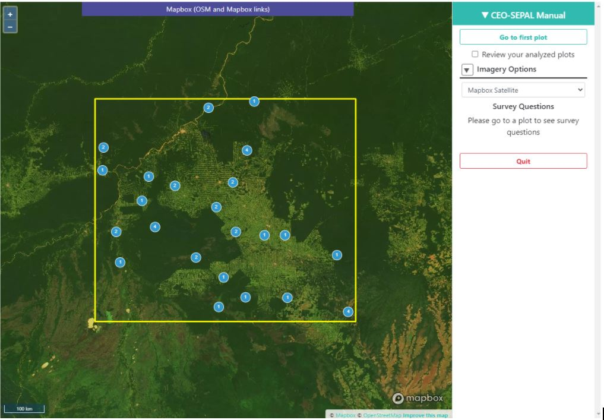

|

2. Click **Go to first plot.** This will take you to your first plot.
3. Answer all of the questions for your first plot by clicking on the appropriate answers.

  a. If you created multiple questions, you can navigate between questions using the numbers above your question text.
  b. Click on **Save** to save your answers and move on to the next plot.

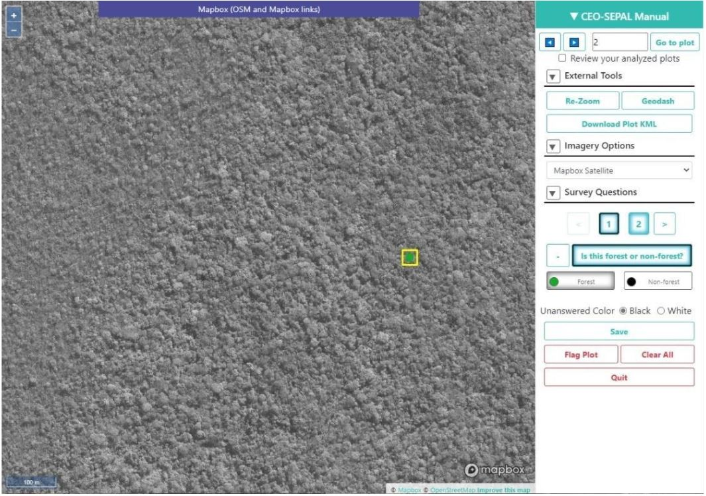

|

4. Continue answering questions until you reach the last plot.
5. When you have finished answering all of the questions, navigate to your Institution’s page.
6. Your project name should now be green, indicating that all plots have been completed. If it is yellow, click on the project name and answer the remaining questions.

|

7. Click on the S next to the project.
8. This will download your project’s sample data. Save it to your hard drive.

**Data collection in CEO-SEPAL bridge**

1. For this example, navigate to the web address associated with your CEO-SEPAL bridge project. It should look something like this: https://collect.earth/collection?projectId=18301&tokenKey=b1216bbb-9395-41f8-bc02-f898c98465bf. You must be logged out of CEO for this link to work.
2. Answer all questions associated with your project using.
3. Your screen should look like this:

.. image:: images/project_overview_ceo.JPG
   :alt: The project overview screen in CEO.
   :align: center

|

3. Click Go to first plot. This will take you to your first plot.
4. With the CEO-SEPAL bridge, there is only one question. It is “CLASS”, where you must assign the appropriate value to your point.

  a. The CEO-SEPAL bridge uses the names you typed in during the legend labelling stage of the Sample Design.
  b. Click on Save to save your answers and move on to the next plot.

5. Continue answering questions until you reach the last plot.

**Data assembly**

Data assembly is required ONLY when you have multiple data interpreters, each working on their own project. If you have used the CEO pathway above with multiple interpreters contributing to the same project, this step is not needed.

1. If you have multiple interpreters, after the data collection is completed the coordinator should create a consolidated database with all the collected sample data.

  a. The coordinator should check that all necessary metadata and sample information is archived and included in the final database.
  b. A description of the column names from the database should be archived with the database. A standardized naming structure is used for the compiled database and includes metadata in the folder and file name.

2. Each sample in the consolidated database notes the round of data collection. The database can be amended to include additional rounds of data collection. Multiple versions are recorded and explanations between versions are included in the documentation template.
3. In CEO, this is handled through the Institution’s Project interface.

**Congratulations, you have successfully completed the first steps to collecting data with quality management in mind. In the following parts we will discuss how to incorporate these quality practices in detail and techniques to control for potential errors.**

Part 4. Quality management and archiving - Quality Assurance
-------------------------------------------------------------

Quality assurance and control are fundamental in ensuring that your validation and resulting area estimates are as accurate as can be and are unbiased. This part will cover the steps of how to perform quality assurance.

For change detection maps, you will want to check for and exclude impossible transitions through logical checks. Make sure that the changes make sense. E.x. having a transition from Water <= 20% to Aquaculture may make sense, but a transition from Water <= 20% to Developed High Intensity would not.

Also be sure to document all impossible transitions. These should be included in your response design tree as well.

Conduct ongoing hot, cold and auxiliary data checks during data collection and conduct regular review meetings among all interpreters. We’ll go through each of these now.

* Auxiliary data checks: use an external data source, such as externally created maps, to compare to the sample unit classification. Discrepancies between the two datasets can be flagged for rechecking. Confirmed differences between the two datasets can be documented to showcase why sample-based area estimation may give different results than other data sources.

  * For example, the Copernicus Global Land Cover Layers: CGLS-LC100 collection 2, available via GEE, can be used as a comparison layer https://developers.google.com/earth-engine/datasets/catalog/COPERNICUS_Landcover_100m_Proba-V_Global.
  * Ask questions when comparing your map and auxiliary maps:

    * Where do you notice agreement between the two maps?
    * Where do you notice disagreement between the two maps?
    * What are some reasons you could attribute to the discrepancies between them?

* Cold checks: sample units that are randomly selected from the data produced by interpreters. The decisions made by the interpreters are reviewed by the coordinator or group of interpreters meeting together. If the error by the interpreter reflects a systematic error in their interpretation, it is discussed directly with the interpreter and the affected sample units are corrected.

  * Review the table below that was a result of a cold check you conducted on the plots analyzed by the interpreters.
  * Based on some of these answers, what can you conclude about the data?

    * What plots should likely be reviewed?
    * What other information could you gain from examining how the interpreters are performing?

* Cold checks can be created in CEO by creating multiple projects with the same sample plots. Multiple interpreters can each complete one of these projects, allowing for comparison.

+--------------+-----------------------+-----------------------+-----------------+
| Interpreter  | Plot 1 (Forest)       | Plot 2(Forest)        | Plot 3 (Water)  |
+==============+=======================+=======================+=================+
| Sally Ride   | Non Forest Vegetation | Non Forest Vegetation | Water           |
+--------------+-----------------------+-----------------------+-----------------+
| Rodolfo Vela | Forest                | Forest                | Built Up        |
+--------------+-----------------------+-----------------------+-----------------+
| Yuri Gagarin | Forest                | Forest                | Water           |
+--------------+-----------------------+-----------------------+-----------------+

* Hot checks: sample units that are flagged as low confidence. These marked sample units should be further reviewed by the coordinator or group of interpreters meeting together. Once reviewed, labels that are deemed to be incorrect on these sample units should be adjusted by the interpreter.

  * If you’re conducting this training with others, ask your colleagues about sample units that you’re unsure about.
  * Have your colleagues show you sample units that they are unsure about.
  * Discuss these sample units and make changes to the labels based on your discussion.

You must create a project using CEO to add additional questions about confidence level. If you create a project via the ceo-sepal interface, you will have only one question about land use/cover class.

Part 5. Quality management and archiving - Quality Control
-----------------------------------------------------------

Quality control refers to the quality of interpretation through cross-validation based on a set of samples that were assessed by two or more interpreters. See also the cold data check mentioned above. These checks can be conducted in CEO by creating multiple projects with the same sample plots. Multiple interpreters can each complete one of these projects, allowing for comparison.

1. Establish a reference interpretation for each of the cross-validation sample units.

  a. Choose a reference interpretation--this should be one of the interpreter’s class assignments.
  b. This reference interpretation will be the basis for establishing the performance of individual interpreters.

2. Calculate agreement for each interpreter based on the reference interpretation. For each pair of interpreters, create a confusion matrix and include it in your project documentation.

+------------------------+-------------------------+------------------------+------------------------+
|                        | Class 1 (reference)     | Class 2 (reference)    | Class k (reference)    |
+========================+=========================+========================+========================+
| Class 1 (interpreter)  | Counts of sample points |Counts of sample points |Counts of sample points |
+------------------------+-------------------------+------------------------+------------------------+
| Class 2 (interpreter)  | Counts of sample points |Counts of sample points |Counts of sample points |
+------------------------+-------------------------+------------------------+------------------------+
| Class k (interpreter)  | Counts of sample points |Counts of sample points |Counts of sample points |
+------------------------+-------------------------+------------------------+------------------------+

3. To work an example, pretend that you and another interpreter have both collected data on a set of sample units on this Amazon land cover classification. Here are the results:

+--------------+------------------------------+------------+
| Point number | Interpreter 1 (Interpreter)  | Reference  |
+==============+==============================+============+
| 1            | Forest                       | Forest     |
+--------------+------------------------------+------------+
| 2            | Forest                       | Forest     |
+--------------+------------------------------+------------+
| 3            | Forest                       | Non-forest |
+--------------+------------------------------+------------+
| 4            | Non-forest                   | Non-forest |
+--------------+------------------------------+------------+
| 5            | Non-forest                   | Forest     |
+--------------+------------------------------+------------+
| 6            | Forest                       | Forest     |
+--------------+------------------------------+------------+
| 7            | Non-forest                   | Non-forest |
+--------------+------------------------------+------------+
| 8            | Non-forest                   | Non-forest |
+--------------+------------------------------+------------+
| 9            | Non-forest                   | Forest     |
+--------------+------------------------------+------------+
| 10           | Forest                       | Forest     |
+--------------+------------------------------+------------+

4. Calculate the confusion matrix below:

+--------------------------+-------------------+------------------------+
|                          |Forest (reference) | Non-forest (reference) |
+==========================+===================+========================+
| Forest (interpreter)     |                   |                        |
+--------------------------+-------------------+------------------------+
| Non-forest (interpreter) |                   |                        |
+--------------------------+-------------------+------------------------+

5. Based on the confusion matrices, for each interpreter, overall agreement with the reference is to be calculated as follows:

   Agreement between interpreter and the majority = Sum of counts in all the diagonal cells / Sum of all counts

6. The overall agreement per interpreter can be reported as below:

+---------------+----------------------------------------------------------------+
| Interpreter   | Overall agreement                                              |
+===============+================================================================+
| Interpreter 1 | Sum of counts in all of the diagonal cells/ Sum of all counts  |
+---------------+----------------------------------------------------------------+
| Interpreter 2 | Sum of counts in all of the diagonal cells/ Sum of all counts  |
+---------------+----------------------------------------------------------------+
| Interpreter n | Sum of counts in all of the diagonal cells/ Sum of all counts  |
+---------------+----------------------------------------------------------------+

7. Using the table below, calculate the agreement between interpreters:

+------------------------+---------------------+---------------------+---------------------+
|                        | Class 1 (majority)  | Class 2 (majority)  | Class 3 (majority)  |
+========================+=====================+=====================+=====================+
| Class 1 (Sally Ride)   | 90                  | 8                   | 2                   |
+------------------------+---------------------+---------------------+---------------------+
| Class 2 (Sally Ride)   | 6                   | 84                  | 10                  |
+------------------------+---------------------+---------------------+---------------------+
| Class 3 (Sally Ride)   | 2                   | 6                   | 92                  |
+------------------------+---------------------+---------------------+---------------------+
| Class 1 (Rodolfo Vela) | 89                  | 9                   | 2                   |
+------------------------+---------------------+---------------------+---------------------+
| Class 2 (Rodolfo Vela) | 12                  | 88                  | 0                   |
+------------------------+---------------------+---------------------+---------------------+
| Class 3 (Rodolfo Vela) | 3                   | 0                   | 97                  |
+------------------------+---------------------+---------------------+---------------------+
| Class 1 (Yuri Gagarin) | 94                  | 6                   | 0                   |
+------------------------+---------------------+---------------------+---------------------+
| Class 2 (Yuri Gagarin) | 7                   | 86                  | 7                   |
+------------------------+---------------------+---------------------+---------------------+
| Class 3 (Yuri Gagarin) | 1                   | 4                   | 95                  |
+------------------------+---------------------+---------------------+---------------------+

|

+---------------+---------------------------------------------------------------+
| Interpreter   |  Overall agreement                                            |
+===============+===============================================================+
| Sally Ride    | Sum of counts in all of the diagonal cells/ Sum of all counts |
+---------------+---------------------------------------------------------------+
| Rodolfo Vela  | Sum of counts in all of the diagonal cells/ Sum of all counts |
+---------------+---------------------------------------------------------------+
| Yuri Gagarin  | Sum of counts in all of the diagonal cells/ Sum of all counts |
+---------------+---------------------------------------------------------------+

8. Per-class agreement amongst interpreters should be analyzed and reported as follows:

+---------------------+---------------------------+-----------------------------+------------------------------+---------+
|                     | All interpreters agreeing | One interpreter disagreeing | Two interpreters disagreeing | etc.    |
+=====================+===========================+=============================+==============================+=========+
| Class 1 (reference) | Percent                   | Percent                     | Percent                      | Percent |
+---------------------+---------------------------+-----------------------------+------------------------------+---------+
| Class 2 (reference) | Percent                   | Percent                     | Percent                      | Percent |
+---------------------+---------------------------+-----------------------------+------------------------------+---------+
| Class 3 (reference) | Percent                   | Percent                     | Percent                      | Percent |
+---------------------+---------------------------+-----------------------------+------------------------------+---------+
| Total               | Percent                   | Percent                     | Percent                      | Percent |
+---------------------+---------------------------+-----------------------------+------------------------------+---------+

For this example, consider the following case:

+--------------+---------------+---------------+---------------+------------+
| Point number | Interpreter 1 | Interpreter 2 | Interpreter 3 | Reference  |
+==============+===============+===============+===============+============+
| 1            | Forest        | Forest        | Forest        | Forest     |
+--------------+---------------+---------------+---------------+------------+
| 2            | Forest        | Forest        | Non-forest    | Forest     |
+--------------+---------------+---------------+---------------+------------+
| 3            | Forest        | Non-forest    | Non-forest    | Non-forest |
+--------------+---------------+---------------+---------------+------------+
| 4            | Non-forest    | Non-forest    | Non-forest    | Non-forest |
+--------------+---------------+---------------+---------------+------------+
| 5            | Non-forest    | Forest        | Forest        | Forest     |
+--------------+---------------+---------------+---------------+------------+
| 6            | Forest        | Forest        | Non-forest    | Forest     |
+--------------+---------------+---------------+---------------+------------+
| 7            | Non-forest    | Non-forest    | Non-forest    | Non-forest |
+--------------+---------------+---------------+---------------+------------+
| 8            | Non-forest    | Non-forest    | Non-forest    | Non-forest |
+--------------+---------------+---------------+---------------+------------+
| 9            | Non-forest    | Forest        | Non-forest    | Forest     |
+--------------+---------------+---------------+---------------+------------+
| 10           | Forest        | Forest        | Forest        | Forest     |
+--------------+---------------+---------------+---------------+------------+

Now calculate the per-class agreement. Note that percent should be calculated by #/10 points for this example.

+------------------------+------------------+-----------------+------------------+---------------------+
|                        | All interpreters | One interpreter | Two interpreters | Three interpreters  |
|                        | agreeing         | disagreeing     | disagreeing      | disagreeing         |
+========================+==================+=================+==================+=====================+
| Forest (reference)     | Percent          | Percent         | Percent          | Percent             |
+------------------------+------------------+-----------------+------------------+---------------------+
| Non-forest (reference) | Percent          | Percent         | Percent          | Percent             |
+------------------------+------------------+-----------------+------------------+---------------------+
| Total                  | Percent          | Percent         | Percent          | Percent             |
+------------------------+------------------+-----------------+------------------+---------------------+

**Congratulations! You now know how to assess important quality assurance metrics for your project.**

----------------------------------------------
Exercise 4.3. Area and uncertainty estimation
----------------------------------------------

The final step of calculating the sample-based estimates of error and area is taking the map areas (generated in Exercise 4.1), and your verification data points from our data collection (Exercise 4.2), conducted according to the response design rules (Exercise 4.1) and using statistics to output the final estimates of area and uncertainty.

In Part 1, we provide an optional description of error matrices, also called confusion matrices. This provides the underlying theory for using the SEPAL “Stratified estimator--Analysis” tool to conduct the area and uncertainty estimation. This tool quantifies the agreement between the validation reference points and the map product, providing information on how well the class locations were predicted.
Please note that you will need to upload your collected data from CEO to Sepal using the directions found in Part 0 of Exercise 4.1. If you used the CEO-SEPAL bridge, you must log out of CEO for the “Import CEO Project” link to work.

+-----------------------------------+-----------------------------------+
| Objectives                        | Prerequisites                     |
+===================================+===================================+
| Create area estimates for         | Completed verification data,      |
| your classification               | or reference data (Exercise 4.2)  |
+-----------------------------------+-----------------------------------+
| Create uncertainty/error          | Map areas generated by your       |
| estimates for your classification | sampling design (Exercise 4.1)    |
+-----------------------------------+-----------------------------------+

Part 1. Understanding the error matrix (optional)
--------------------------------------------------

A common tool to quantify agreement is the error matrix (sometimes called a confusion matrix). The error matrix organizes the acquired sample data in a way that summarizes key results and aids the quantification of accuracy and area. This is a simple cross-tabulation that compares the (algorithm assigned) map category labels to the (human assigned) reference category labels (your validation classification). The count for each pairwise combination are included in the blue and yellow cells in the following example.

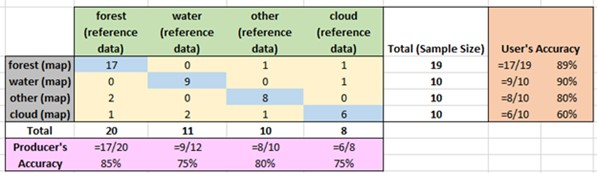

|

* The main diagonal of the error matrix (blue cells) includes the count of the number of correct classifications.
* The off-diagonal elements (yellow cells) show map classification errors.
* The user’s accuracy can be quantified by dividing the number of correctly classified plots by the sum of the plots classified as the mapped class. For the forest class in the example above, this is 17 correctly identified points divided by 19 total forest plots. User’s accuracies for each class are shown in the orange cells. User’s accuracy is the complement of errors of commission (sites that are classified as forest in the map, but are not actually forest).
* The producer’s accuracy can be quantified by dividing the number of correctly classified plots by the sum of the plots classified as the mapped class in the validation reference sample. For the forest class in the example above, this is 17 correctly identified points divided by 20 samples that were classified as forest from the reference data. Producer’s accuracies for each class are shown in the pink cells. Producer’s accuracy is the complement of errors of omission (sites that are not classified as forest in the map that are actually forest).

For your own data, calculate an error matrix following the above guidelines:

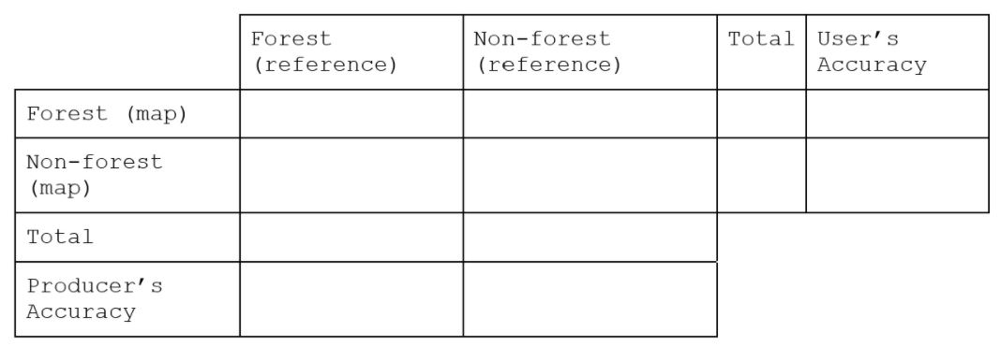

|

Here’s a completed example for a project using 4 classes:

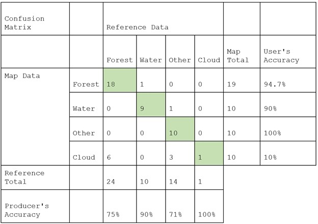

|

In this example, the user’s accuracy for Forest is 94.7%; so the error of commission is 5.3%. The user’s accuracy for water is 90%, which means the error of commission is 10%. What this means is that according to the reference data, the map creator mapped 5.3% of Forest land cover in the wrong class and 10% of water in the wrong class. The producer’s accuracy for Forest is 75%, meaning the error of omission is 25%. The producer’s accuracy for water is 90%, so the error of omission is 10%. This means that 25% of the forest reference samples were mapped in the wrong land cover class, while only 10% of water was mapped in the wrong class. Calculate the errors of omission and commission for Other and Cloud land cover classes.

Once the error matrix is created, the area estimation becomes straightforward. Essentially, we use the frequency of these errors of omission and commission for each map class to calculate updated map areas based on our knowledge of how likely each class is to be classified as something else. We can also calculate the uncertainties for the total area of each class.

At the heart of the analysis is the implementation of an unbiased area estimator. Different estimators can be implemented to assess accuracy. In the next part, you will use a stratified estimation since you have a sample stratified by the discrete map classes.

Part 2. Preparing your CEO collected data for analysis in SEPAL (optional)
---------------------------------------------------------------------------

1. Open the .csv file you downloaded from Collect Earth Online in Exercise 4.2 Part 3. It will probably have a name like “ceo-project-name-sample-data-yyyy-mm-dd.csv”.
2. Inspect the column data.

  a. You should have a column named “PL_MAP_CLASS” that consists of numeric values. These are the classes assigned by the classification.
  b. You should also have a column with your question about the correct map class as the column header. In this example, it is “IS THIS FOREST OR NON-FOREST”. These are the classes you assigned manually in CEO based on map imagery. This will either be numeric (1 or 2) or text (Forest and Non-forest) depending on how you set up your Collect Earth Online project.

3. If your column for the correct map class is numeric, skip to step 5 below.
4. If your column for the correct map class is text, you will need to either:

  a. Check that your text column matches exactly the Legend Labels you added during sample design (Exercise 4.1).
  b. Check that capitalization is the same, e.g. Non-forest and Non-forest not Non-forest and non-forest.
  c. OR Create another column with the associated numeric value.

    i. First, create a new column and name it COLLECTED_CLASS.
    ii. In the formula cell, type: =IF([text column letter]2="Forest",1,2). For this example, the text column letter is U.
    iii. This will use an if statement to assign the number 1 to sample plots you assigned the value “Forest” to, and the number 2 to other plots (here, plots labeled Non-forest). If you have more than two classes, you will need to use nested IF statements.
    iv. Press enter. You should now see either a 1 or a 2 populate the column. Double check that it is the correct value.

  d. Fill the entire column.

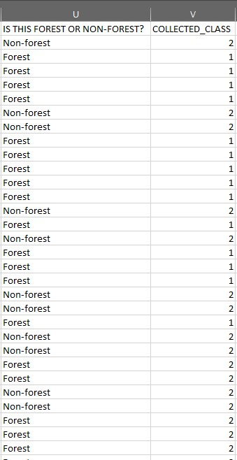

|

5. Save your .csv file.
6. Upload your .csv file to SEPAL using the directions in Part 0: Uploading files to SEPAL of this Module.

Part 3. Using the stratified estimator in SEPAL
------------------------------------------------

The aim of this stratified sampling design tool is to analyze results from a stratified sampling design that can be used for area estimates. The idea is to combine a map (used as a stratification of the landscape of interest) with a visual map interpretation of samples to produce an area estimation.

The concept is derived from map accuracy assessment principles: characterized frequency of errors (omission and commission) for each map class may be used to compute area estimates and also to estimate the uncertainties (confidence intervals) for the areas for each class.

1. First, open the Stratified Area Estimator-Analysis Tool

  a. In the Apps SEPAL window select Stratified Area Estimator - Analysis.
  b. This tool is very similar to the Design tool that you used to create your stratified sample.

    i. You will land on the **Introduction** page which allows you to choose your language and provides background information on the tool. Note that Reference and Documents are in the same place as the Design tool.
    ii. The pages that contain the necessary steps for the workflow are on the left side of the screen and need to be completed sequentially.

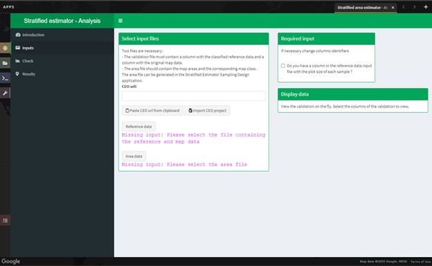

|

2. Select the **Inputs** page on the left side of the screen. You will see two data requirements under the **Select input files** section.

  a. **Reference Data** this refers to the table that you classified and exported in the previous section. It will contain a column that identifies the map output class for each point as well as a column for the value from the image interpreter (validation classification).

    i. For projects completed in CEO: Select the **Reference data** button and navigate to the .csv file you downloaded from CEO and then uploaded to SEPAL in Exercise 4.3 Part 2.
    ii. For projects completed in CEO-SEPAL bridge:

      1. Check that you are logged out of the Collect Earth Online website.
      2. Paste the URL from your CEO-SEPAL bridge project into the field marked **CEO url.** You can also click the **Paste CEO url from clipboard** button.
      3. Click **Import CEO project.**
      4. This will populate the input file for the Reference data as well as the column names.

  b. **Area data** this is a CSV that was automatically created during the Stratified Area Estimator--Design workflow. It contains area values for each mapped land cover class.

    i. Click the **Area data** button.
    ii. Open the **sae_design_AmazonClassification** folder, or the folder labeled sae_design_your-name-here if you did not call your classification AmazonClassification.
    iii. As a reminder, if you exported your classification to the SEPAL workspace, the file will be in your SEPAL downloads folder. (downloads > classification folder > sae_design_AmazonClassification).
    iv. Within this folder, select **area_rast.csv** (see image below).

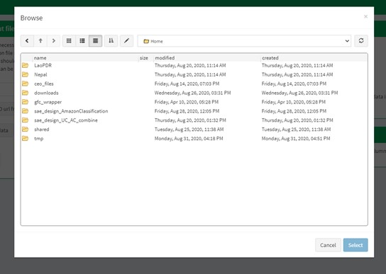

|

3. Next, you will need to adjust some parameters so that the tool recognizes the column names for your reference data and area data that contain the necessary information for your accuracy assessment. You should now see a populated **Required input** panel on the right side of the screen.

  a. Choose the column with the reference data information.

    i. For projects completed in CEO: This will either be your question name or the new column name you created in Part 2 above. Here it is COLLECTED_CLASS following the directions in Part 2.
    ii. For projects completed in CEO-SEPAL: ref_code

  b. Choose the column with the map data information

    i. For projects completed in CEO: PL_MAP_CLASS
    ii. For projects completed in CEO-SEPAL: map_code

  c. Choose the map area column from the area file—map_area
  d. Choose the class column from the area file—map_code or map_edited_class

    i. The map_edited_class has the names you entered manually during the design phase, while the map_code has the numeric class codes.
    ii. For projects completed in CEO: Use map_code if you have a column in your reference data. If you use map_edited_class you must make sure that capitalization.
    iii. For projects completed in CEO-SEPAL, use map_code.

  e. You can add a **Display data** column to enable validation on the fly. You can choose any column from your CEO or CEO-SEPAL project. We recommend either your map class (e.g. PL_MAP_CLASS) or your reference data class (e.g. question name column)

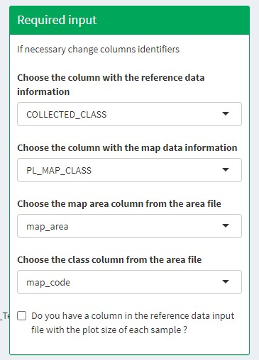

|

4. Once you have set these input parameters, select **Check** on the left side of the window.

  a. This page will simply plot your samples on a world map.
  b. Fix the locations of your plots by specifying the correct columns to use as the X and Y coordinates in the map.
  c. Click the drop down menus and select the appropriate coordinate columns for X and Y coordinates. X coordinate should be LON; Y coordinate should be LAT.

5. Next, click the **Results** page on the left side of the screen.

  a. The **Results** page will display a few different accuracy statistics, including a **Confusion Matrix, Area Estimates,** and a **Graph** of area estimates with confidence intervals.
  b. The Confusion Matrix enables you to assess the agreement of the map and validation data sets.

    i. The rows represent your assignments while the columns represent the map classifier’s.
    ii. The diagonal represents the number of samples that are in agreement, while the off diagonal cells represent points that were not mapped correctly (or potentially not interpreted correctly).

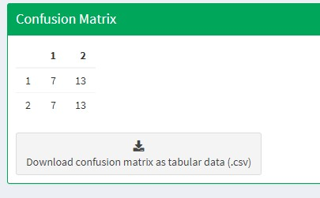

|

6. Typically you would have to create the confusion table yourself and calculate the accuracies, however, the SAE-Analysis tool does this for you.

  a. If you completed Part 1, how does the SAE-Analysis tool’s calculations compare with your own?
  b. You can download confusion matrix as tabular data (.csv) using the button.

7. Under **Area estimates,** the table shows you the area estimates, and producer’s and user’s accuracies, all of which were calculated from the error matrix and the class areas (sample weights) from the map product you are assessing.

  a. Estimations are broken up into simple and stratified estimates, each of which has its own confidence interval.
  b. In this exercise we collected validation data using a stratified sample, so the values we need to use are the stratified random values.
  c. Note that all area estimates are in map units.
  d. You can change your desired **confidence interval** using the slider at the top of the panel.
  e. You can Download area estimates as tabular data (.csv) using the button.

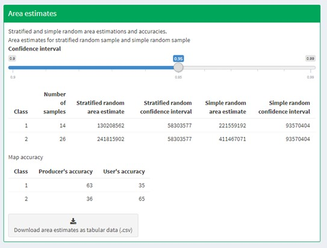

|

8. The **Graph** plots area estimates based on: map pixel count, stratified random sample, simple random sample, unbiased stratified random and direct estimate stratified random.

  a. In this exercise we collected validation data using a stratified sample, so the values we need to use are the stratified random values.
  b. Need to define unbiased stratified random and direct estimate stratified random.
  c. Note that the Map pixel count value differs from these stratified random sample estimates. This shows how using a map pixel count is a poor estimation of actual area.

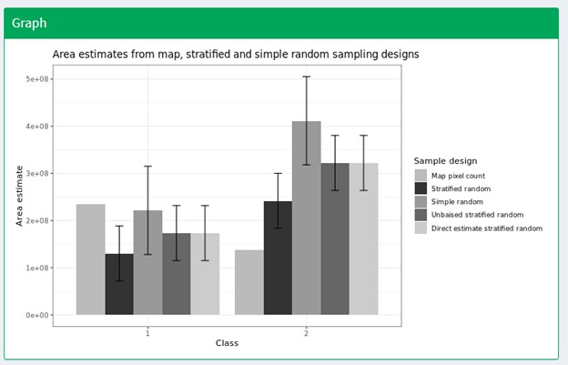

|

**Congratulations! You successfully completed this exercise. You now know how to perform an accuracy assessment and generate area estimates in SEPAL.**
