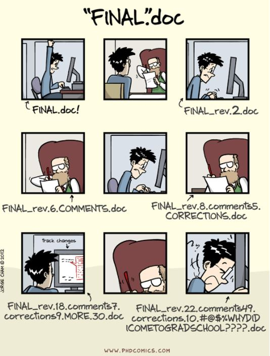
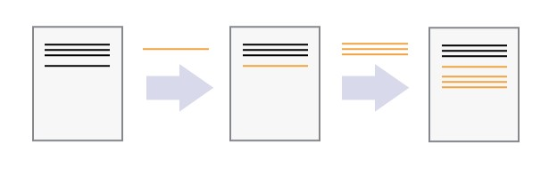
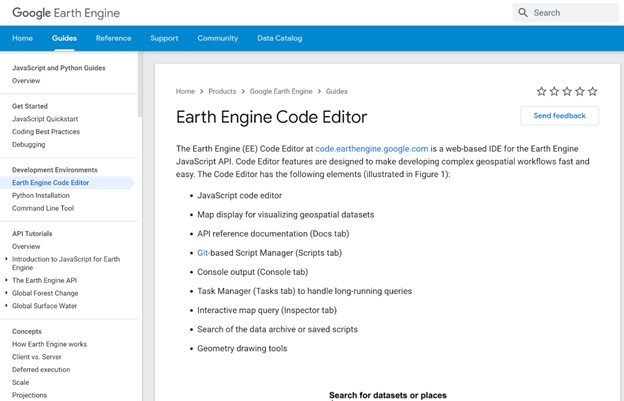

======================================
Module 5: Documentation and archiving
======================================

Documentation of your area estimate and archiving this information for future reference are critical in order to replicate your estimation process. Examples where you would want to repeat your analysis include different areas (states, provinces, ecological regions) or time periods (months, years).

We have built in documentation steps into other Modules of this Manual, however here we bring this information together. We discuss key documentation steps, including logging decision points (Exercise 5.1), Reporting (Exercise 5.2), Commenting in code (Exercise 5.3), and Version control (Exercise 5.4), as well as archiving steps (Exercise 5.5).

This module should take approximately 1 hour to read. The time taken to complete this module for your specific situation will vary depending on the size and scope of your project.

--------------------------------------
Exercise 5.1. Logging decision points
--------------------------------------

Logging decision points is a critical part of documenting your area estimation process and being able to recreate your estimation process.

A decision point is anywhere where you make a decision about your project that can change the outcome. For example, “We decided that pixels with over 75% tree cover should be classified as Forest cover” is a decision point.

In the previous Modules, we have suggested that you document these types of decision points as you go along. This includes:

* Module 2:

  * Logging your land use decision tree (Exercise 2.1).
  * Logging your land use classification definitions (Exercise 2.1).
  * Settings used for classification, along with any refinements (Exercise 2.4).

* Module 3:

  * Logging two date change detection decisions, including what classes can change and imagery and processes used in the classification (Exercise 3.1)

* Module 4:

  * Stratification choices (Exercise 4.1).
  * Data collection procedures (Exercise 4.2).

You may also choose to follow your organization’s Standard Operating Procedures. For example: https://drive.google.com/file/d/1u4sXx6Y8qPKvbIYJFide5EI6L_ygpS5p/view?usp=sharing.

**Congratulations, you are working towards logging key decision points for your project!**

---------------------------
Exercise 5.2. Reporting
---------------------------

Writing a report summarizing your findings is a critical part of your area estimation. If you are conducting an area estimation for internal use, this report will provide you with a blueprint for future estimations. If you are conducting an area estimation for another organization, this report will convey your results and the quality of your analysis.

Here we provide a rough outline of what you should include in your reporting.

In your report, you should include:

* An introduction, describing why the project was completed and any goals of the project.
* Your project’s methods, that is how your project was completed.

  * All tools used in your analysis.
  * All decision points (Exercise 5.1)
  * Any other information needed to recreate your project.

* Your project results.

  * Your area estimation (Exercise 4.3).
  * The error associated with your classification (Exercise 4.3).
  * A comparison of any self checks (one interpreter) and cross checks (between interpreters) with the main sets of plots.

* Any actions or next steps arising from your analysis.

Writing your report will take time and attention. Documenting your steps along the way, as discussed in Modules 1-4 and Exercise 5.1 will help you write your report more efficiently.

**Always follow your organization’s reporting guidelines.** For example, if your estimation is developed to support a National Forest Monitoring System, you will need to comply with UN reporting standards.

As another example, FAO’s Standard Operating Procedure requires reports include at least the following information about the data collection process:

1. A brief narrative on the modalities for data collection
2. The interpreters, their contact information, institutions and roles
3. Overview of sample unit allocation to interpreters and any subsequent revisions made to the allocation
4. A summary of the training conducted that details the topics covered
5. A list of attendees for the training and their attendance record
6. Challenges and limitations during the data collection
7. Potential sources of bias during the data collection
8. Impossible transitions excluded from data collection
9. The results of the assessment of interpretation quality
10. External appraisal of interpretation quality contact information and narrative report from the appraiser

**Congratulations, you are now working towards reporting your area estimation project.**

------------------------------------
Exercise 5.3. Commenting in Scripts
------------------------------------

While none of the steps involved in this manual require writing code, more complex classification projects may use programming environments such as Google Earth Engine. This Exercise discusses best practices for commenting your code if you use tools such as Google Earth Engine.

Leaving comments in your code can be a helpful way to describe information of what a particular function does, leave warnings or considerations to other programmers (including your future self!), provide key information on licensing, or save information on what you still want to complete while coding. In this section we will briefly demonstrate both good and bad commenting techniques.

When commenting your code you should take into account your target audience. Is your code going to be used for a workshop? Will it be read by other scientists or programmers? Or will you lose access to it after submitting it to a publication or project partner? Answering these questions will help you determine what approach to take when commenting your code.

Many of these tips are derived from the suggestions laid out in Robert C. Martins’ book *Clean Code*, which would be a good reference if you would like to learn more about coding cleanly and commenting:

1. Keep comments short.

  a. Keeping your comments short is helpful to both the writer of the comment and the reader
  b. Having multiple long comments in your code can lead to readers skipping over them and thus making them inefficient.
  c. Long comments can start to clutter your code.

2. It is best to use comments sparingly and when possible rename variables or use functions to reflect what you would like to have commented.

  a. Comments can quickly become outdated and are less of a priority to update.
  b. Comments are a representation of what your code does, but can sometimes be misleading.

3. Using comments to add some informative content or explain the intent behind your code, but don't be redundant.

  a. Informative comments are little snippets of information that aid in reading through your code
  b. A comment explaining your intent can be useful where the processing you have done is slightly complicated to read through.

3. Don’t leave in commented out code.

  a. Leaving in commented out code quickly becomes confusing.
  b. Is the commented out code something new that is to be implemented? Is it something that was broken and the other code fixed?
  c. Should it be uncommented to provide a different result?
  d. It is best to use a form of version control so you can safely delete these lines and go back to them if you need to later.

4. Try to not be redundant with comments.

  a. Comments that simply reiterate what the code is doing often are not helpful and will add to clutter.
  b. Use comments to clarify what the code is doing.
  c. This is nice for when you are using code in a workshop, or perhaps in a final version which is released with a publication that will not be changed later.

5. Do be careful as just like with other comments, errors in them are just as bad as in your code!

Here are three examples of comment types:

Comments that clarify:

::

  ////////////////////////////////////////////////////////
  // User defined variables                            ///
  ////////////////////////////////////////////////////////

  // Main variables for defining region of interest,
  // start and end period, and sensors to include

  //Available sensors are : Landsat, Sentinel2, Sentinel1,
  var sensor = ‘Landsat’

Comments that are informative:

::

  // returns most recent image with time series of images as property
  Return ee.Image(latestImagery)

Comments that describe intent:

::

  // This is the best way I found to add images to the target image as a property
  var processMetaData = imageCollection.map(function f (img){
    var imageDate = img.get(‘system:time_start’)
    var previousImages = otherImageCollection.filterDate(imageDate.advance(-1,’month’) , imageDate).filterBounds(img.geometry().bounds())
    return img.set(‘images’, previousImages.toList() )
  });

And here is an example where comments (A) can be replaced by variables (B).

A.

::

  // Did the user pass in a year range that is within the valid range for
  // the selected satellite?

  if(dateInputBox.getValue().includes(sensorDateRangeDict[sensorInputBox.getValue()]){
    // run analysis for date range
    var results = myAnalysis(dateInputBox.getValue(),sensorInputBox.getValue())
  }

B.

::

  var selectedDateRange = dateInputBox.getValue()
  var selectedSensor = sensorInputBox.getValue()
  var selectedSensorDateRange = sensorDateRangeDict[selectedSensor]

  if( selectedDateRange.includes(selectedSensorDateRange)) {
    var results = myAnalysis(selectedDateRange, selectedSensor)
  }

In this example above you can see that you write roughly the same number of lines of code with and without comments. However, by adding descriptive variable names, the code itself becomes simpler to understand.

Finally, note that reading the actual code will always be truer than reading the comments. In the first example it poses the question: “Did the user pass in a year range that is within the valid range for the selected satellite?“ But what if you choose to include aerial imagery or UAV data sources at some point? Chances are you won't feel compelled to go back and update your comment.

**Congratulations! You have learned about commenting code.**

----------------------------------------------------------------
Exercise 5.4: Transparent coding: Github and saving GEE scripts
----------------------------------------------------------------

In addition to commenting your code so that future users can understand what is being done, saving your code is another important part of project documentation. As in Exercise 5.3, this exercise is only relevant if you have implemented code in your area estimation, such as through Python or Google Earth Engine.

In this exercise we will touch upon how to be transparent with your code and save your code. Any time you are writing a script or some code, it is probably a good idea to have a version control system in place so you can track your changes, and have a backup in case a mistake happens to your code. We discuss this in two contexts: Git for local code, and Google Earth Engine’s approach to version control.

Part 1: Version Control and Git
--------------------------------

Version control is “a system that records changes to a file or set of files over time so that you can recall specific versions later” (Git 2020; Online at: https://git-scm.com/book/en/v2/Getting-Started-About-Version-Control). Version control can be applied to many different file types, but is most commonly used with text based code, such as Python and R scripts.

The following explanation is adapted from the Software Carpentry Git lesson.

  “We’ll start by exploring how version control can be used to keep track of what one person did and when. Even if you aren’t collaborating with other people, automated version control is much better than this situation:

  “Piled Higher and Deeper” by Jorge Cham, http://www.phdcomics.com

  We’ve all been in this situation before: it seems ridiculous to have multiple nearly-identical versions of the same document. Some word processors let us deal with this a little better, such as Microsoft Word’s Track Changes, Google Docs’ version history, or LibreOffice’s Recording and Displaying Changes.

  Version control systems start with a base version of the document and then record changes you make each step of the way. You can think of it as a recording of your progress: you can rewind to start at the base document and play back each change you made, eventually arriving at your more recent version.

  Once you think of changes as separate from the document itself, you can then think about “playing back” different sets of changes on the base document, ultimately resulting in different versions of that document. For example, two users can make independent sets of changes on the same document.

.. image:: images/version_control_multiple_contributors.JPG
   :alt: Version control with multiple contributors

  A version control system is a tool that keeps track of these changes for us, effectively creating different versions of our files. It allows us to decide which changes will be made to the next version (each record of these changes is called a `commit <http://swcarpentry.github.io/git-novice/reference.html#commit>`_, and keeps useful metadata about them. The complete history of commits for a particular project and their metadata make up a `repository <http://swcarpentry.github.io/git-novice/reference.html#repository>`_. Repositories can be kept in sync across different computers, facilitating collaboration among different people.”

Of version control systems, Git (and implementation GitHub that includes a GUI Desktop version) is perhaps the most widely used. Here we provide a very basic overview of Git and links to additional resources.

Git is a popular free and open source software for a distributed version control system and is the basis of GitHub. With a GitHub account, you can create repositories to hold your code and track the changes you make to it as you develop it. GitHub stores all your code, which means that even if something happens to your computer, your code will be saved.

This is also a great way to share or collaborate on code. You can easily send a link to your repository to whomever you want, and you could have other scientists working on one portion of the code on their home computer while you do as well.

* If you would like to learn more about git or version control, you can work through the Software Carpentry workshop at your own pace here: http://swcarpentry.github.io/git-novice/.

  You can work through how to set up a git repository system for yourself or your organization (unpaid but must run locally or on your own servers).

* Information on Git can be found here: https://git-scm.com/.
* Information on GitHub, including how to sign up, can be found here: https://github.com/.

  * GitHub has free and paid service tiers.
  * With https://zenodo.org/ and GitHub together, you can create DOI numbers for versions of your code for publication.

Part 2: Google Earth Engine version control
--------------------------------------------

Google Earth Engine has implemented version control and version history for all scripts and repositories written on the platform. To access the version control, click the history icon next to a script in order to compare or revert it to an older version.

.. image:: images/gee_scripts.JPG
   :alt: The GEE scripts tab.
   :width: 450
   :align: center

Detailed information can be found under “Development Environments: Earth Engine Code Editor” here: https://developers.google.com/earth-engine/guides/playground

**Congratulations, you have learned about version control options for your project!**

---------------------------------------------------
Exercise 5.5: Data archiving and creating metadata
---------------------------------------------------

Finally, we will discuss the information needed for proper data archiving, which overlaps significantly with creating metadata for your area estimation. Metadata is a set of data that provides information about other data, such as your classification and area estimation data.

Part 1: Data archiving
-----------------------

For data archiving, the following information needs to be compiled:

1. A database of the sample data collected by the interpreters including:

  a. The geographical coordinates in define coordinate or projection system.
  b. The unique identification code for each sample unit.
  c. The interpretation of all sample units including the previous interpretation(s) of the sample unit in the case this was revised or corrected.

2. The interpretation of sample units conducted by the coordinator.
3. Metadata regarding the interpreter that collected the sample data, when the data was collected, which data sources were used.

Think about the work you did in completing Modules 1-4. What other data do you think should be archived? What would be helpful to your colleagues or yourself in the future looking to replicate your work?

You should store the data collection report, your data tables, any metadata, etc. in a standard format. When naming files you should follow a naming convention such as Data collection_data_date[year/month/day]_version number (FAO SOP). When writing your documentation report, you should include links to your data storage locations.

Part 2: Creating metadata
--------------------------

This worksheet is designed to assist you in becoming more efficient and informed about documenting and archiving information relating to the planning, preparation, and management of remote sensing datasets and analysis, such as analyses conducted for forest inventory monitoring (e.g. REDD+ activities).

Documentation and archiving remote sensing analysis methods ensures there is transparency and makes it easier to replicate or improve methods as programs increase in complexity and robustness. For more information on the good practice recommendations for documentation, archiving and reporting please refer to the 2006 IPCC Guidelines Vol. 1 Chp. 6 Section 11.

Below we have provided you with headings and some questions for each step in the metadata creation process, that is, where you should provide information about your workflow in order to ensure transparency about your data and processing steps and comply with best practices. The information you provide below should be sufficient and clear enough so that someone else can understand how the analysis was conducted and would be able to replicate it.

When completing this exercise, think about the work you have completed in Modules 1-4. When you conduct your own classification and area estimation processes in the future, take the time to customize and add additional sections to this document. This exercise is designed to get you started in this practice and moving down the right path.

+-----------------------------------------+--------------------------------------+
| Preparing and Downloading               |                                      |
| Cloud-free Composite Using Google Earth |                                      |
+=========================================+======================================+
| Data used                               |                                      |
+-----------------------------------------+--------------------------------------+
| Time frame for composite                |                                      |
+-----------------------------------------+--------------------------------------+
| Software used                           |                                      |
+-----------------------------------------+--------------------------------------+
| Preprocessing methods                   |                                      |
+-----------------------------------------+--------------------------------------+
| Methods for cloud removal               |                                      |
+-----------------------------------------+--------------------------------------+
| Assess RS results                       |                                      |
+-----------------------------------------+--------------------------------------+
| Assumptions (Note: Need to archive      |                                      |
| outputs before proceeding with          |                                      |
| analysis)                               |                                      |
+-----------------------------------------+--------------------------------------+
.

+-------------------------------------------+-------------------------------------+
| Creating Band Ratios, Indices and Image   |                                     |
| Transformations for use in Classification |                                     |
| and Change Detection Analysis             |                                     |
+===========================================+=====================================+
| Software used                             |                                     |
+-------------------------------------------+-------------------------------------+
| Description of indices                    |                                     |
+-------------------------------------------+-------------------------------------+
| Assess RS results                         |                                     |
+-------------------------------------------+-------------------------------------+
| Assumptions (Note: Need to archive        |                                     |
| outputs before proceeding with            |                                     |
| analysis)                                 |                                     |
+-------------------------------------------+-------------------------------------+

.

+------------------------------------+-----------------------------------------------+
| Image Classification Scheme        |                                               |
+====================================+===============================================+
| Document Clear definitions for     |                                               |
| classes or categories (i.e.,       |                                               |
| land use categories defined by     |                                               |
| the IPCC as: Forest Land,          |                                               |
| Cropland, Grassland, Wetlands,     |                                               |
| Settlements, and Other Land):      |                                               |
+------------------------------------+-----------------------------------------------+
| Have you identified any categories |                                               |
| as “Key Categories”? How is the    |                                               |
| analysis different?  Please refer  |                                               |
| to Volume 1, Chapter 4 of the 2006 |                                               |
| IPCC Guidelines on what defines    |                                               |
| a “Key Category”.                  |                                               |
+------------------------------------+-----------------------------------------------+
| Assess RS results                  |                                               |
+------------------------------------+-----------------------------------------------+
| Assumptions (Note: Need to archive |                                               |
| outputs before proceeding with     |                                               |
| analysis)                          |                                               |
+------------------------------------+-----------------------------------------------+

.

+------------------------------------+-----------------------------------------------+
| Collect Reference Data             |                                               |
+====================================+===============================================+
| What type of reference data are    |                                               |
| you using?                         |                                               |
+------------------------------------+-----------------------------------------------+
| What is your sampling scheme and   |                                               |
| what is the logic for its design?  |                                               |
+------------------------------------+-----------------------------------------------+
| Assess RS results                  |                                               |
+------------------------------------+-----------------------------------------------+
| Assumptions (Note: Need to archive |                                               |
| outputs before proceeding with     |                                               |
| analysis)                          |                                               |
+------------------------------------+-----------------------------------------------+

.

+------------------------------------+-----------------------------------------------+
| Perform Land Cover Classification  |                                               |
| or Land Cover Change Analysis      |                                               |
+====================================+===============================================+
| Software                           |                                               |
+------------------------------------+-----------------------------------------------+
| Analysis technique                 |                                               |
+------------------------------------+-----------------------------------------------+
| Assess RS results                  |                                               |
+------------------------------------+-----------------------------------------------+
| Assumptions (Note: Need to archive |                                               |
| outputs before proceeding with     |                                               |
| analysis)                          |                                               |
+------------------------------------+-----------------------------------------------+

.

+------------------------------------+-----------------------------------------------+
| Perform Accuracy Assessment        |                                               |
+====================================+===============================================+
| Sampling approach                  |                                               |
+------------------------------------+-----------------------------------------------+
| Analysis technique                 |                                               |
+------------------------------------+-----------------------------------------------+
| Assess results                     |                                               |
+------------------------------------+-----------------------------------------------+
| Assumptions (Note: Need to archive |                                               |
| outputs before proceeding with     |                                               |
| analysis)                          |                                               |
+------------------------------------+-----------------------------------------------+

**Congratulations! You have completed the SEPAL-CEO Area Estimation workbook!**
