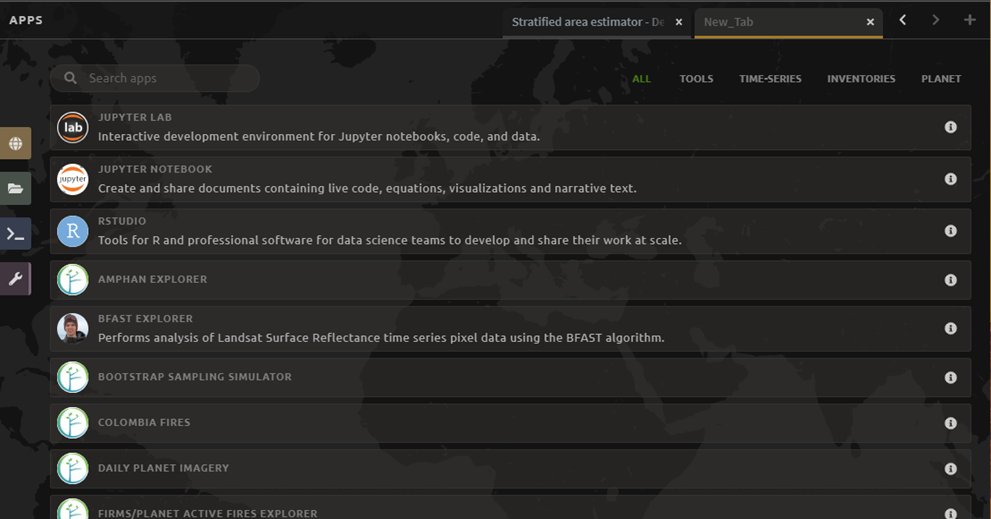
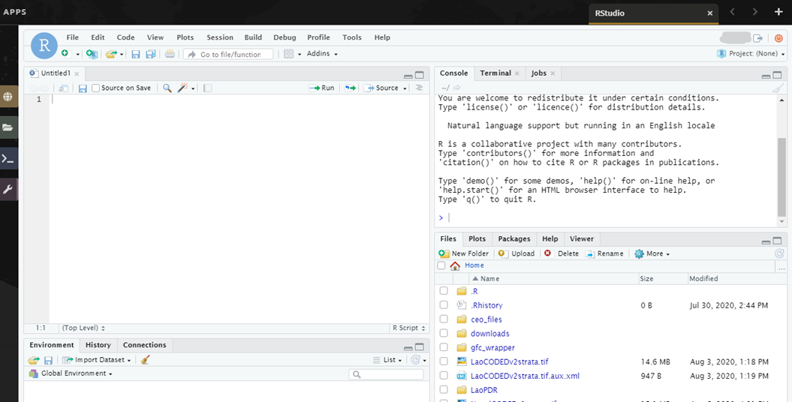

--------------------------------
Area and uncertainty estimation
--------------------------------

1. Background
--------------

All maps have errors, for example model output errors from pixel mixing or input data noise. Our objective is to create unbiased estimates of the area for each mapped category.

To do this, we will use sample-based estimations of area and error instead of ‘pixel counting’ approaches. Pixel counting approaches simply sum the area belonging to each different class. However, this doesn’t account for classification errors--for example, the probability that a pixel classified as wetland should be open water. Therefore, the pixel counting approach provides no quantification of sampling errors and no assurance that estimates are unbiased or that uncertainties are reduced (Stehman, 2005; GFOI, 2016).

Sample-based estimations of area and error create estimations of errors in pixel classification and use this to inform estimations of area. Therefore, sample-based estimations are in keeping with the IPCC General Guidelines (2006) that estimates should not be over- or under- estimates, and that uncertainty should be reduced as much as practically possible.

This tutorial will work through calculating sample-based estimates of error and area for a map. We will use an error matrix to complete this task.

Error matrices are a common tool to quantify agreement (sometimes called a confusion matrix). The error matrix organizes the acquired sample data in a way that summarizes key results and aids the quantification of accuracy and area. This is a simple cross-tabulation that compares the (algorithm assigned) map category labels to the (human assigned) reference category labels (your validation classification). The count for each pairwise combination are included in the blue and yellow cells in the following example.

.. image:: images/confusion_matrix_example.png
   :alt: A confusion matrix example.
   :align: center

|

* The main diagonal of the error matrix (blue cells) includes the count of the number of correct classifications.
* The off-diagonal elements (yellow cells) show map classification errors.
* The user’s accuracy can be quantified by dividing the number of correctly classified plots by the sum of the plots classified as the mapped class. For the forest class in the example above, this is 17 correctly identified points divided by 19 total forest plots. User’s accuracies for each class are shown in the orange cells. User’s accuracy is the complement of errors of commission (sites that are classified as forest in the map, but are not actually forest).
* The producer’s accuracy can be quantified by dividing the number of correctly classified plots by the sum of the plots classified as the mapped class in the validation reference sample. For the forest class in the example above, this is 17 correctly identified points divided by 20 samples that were classified as forest from the reference data. Producer’s accuracies for each class are shown in the pink cells. Producer’s accuracy is the complement of errors of omission (sites that are not classified as forest in the map that are actually forest).

Here’s another example for a project using 4 classes:

.. image:: images/example_error_matrix_4class.png
   :alt: Example error matrix for a 4 class project.
   :align: center

|

In this example, the user’s accuracy for Forest is 94.7%; so the error of commission is 5.3%. The user’s accuracy for water is 90%, which means the error of commission is 10%. What this means is that according to the reference data, the map creator mapped 5.3% of Forest land cover in the wrong class and 10% of water in the wrong class.

The producer’s accuracy for Forest is 75%, meaning the error of omission is 25%. The producer’s accuracy for water is 90%, so the error of omission is 10%. This means that 25% of the forest reference samples were mapped in the wrong land cover class, while only 10% of water was mapped in the wrong class. Calculate the errors of omission and commission for Other and Cloud land cover classes.

Once the error matrix is created, the area estimation becomes straightforward. Essentially, we use the frequency of these errors of omission and commission for each map class to calculate updated map areas based on our knowledge of how likely each class is to be classified as something else. We can also calculate the uncertainties for the total area of each class.

At the heart of the analysis is the implementation of an unbiased area estimator. Different estimators can be implemented to assess accuracy. In this tutorial, you will use a stratified estimator.

2. Learning Objectives
-----------------------

In this tutorial, we will use the SEPAL “Stratified estimator--Analysis” tool to conduct the area and uncertainty estimation. This tool quantifies the agreement between the validation reference points and the map product, providing information on how well the class locations were predicted.

* Create area estimates for your classification
* Create uncertainty/error estimates for your classification

2.1 Pre-requisites
===================
* A SEPAL account. Please see the tutorial here on OpenMRV under tool "SEPAL" for an introduction to SEPAL.
* A previously generated map. Please see the tutorials here on OpenMRV under process "Classification" and tools "SEPAL" and "GEE".
* A classification scheme. Please see the tutorial here on OpenMRV under process "Training data collection" and tool "SEPAL".
* A sampling design and corresponding Collect Earth Online (CEO) project. Please see the tutorial here on OpenMRV under process "Sampling design" and tool "SEPAL". You can find more information about CEO, sampling design, sample selection and other tools under processes "Sampling design" and "Sample data collection" and tools "SEPAL", "QGIS", "AREA2", "GEE", "CEO", and "CE". 
* Completed verification data or reference data. Please see the tutorial here on OpenMRV under process "Sample data collection" and tool "SEPAL". More information can be found under tools "CEO", "CE", "GEE", and "AREA2"

3. Tutorial: Area and uncertainty estimation
---------------------------------------------

3.1 Preparing CEO collected data for analysis in SEPAL
=======================================================

1. Open the .csv file you downloaded from Collect Earth Online (see the tutorial here on OpenMRV under process "Sample data collection" and tool "SEPAL"). It will probably have a name like “ceo-project-name-sample-data-yyyy-mm-dd.csv”. If you haven't gone through the tutorial mentioned, we made this csv file available `here <https://drive.google.com/file/d/1TkoVUxUOR8HTJE3IohOK6s8kwyZ77wGP/view?usp=sharing>`_ (it is highly recommended going through the tutorial for a better understanding of the whole process).
2. Inspect the column data.

  a. You should have a column named “PL_MAP_CLASS” that consists of numeric values. These are the classes assigned by the classification.
  b. You should also have a column with your question about the correct map class as the column header. In this example, it is “IS THIS FOREST OR NON-FOREST”. These are the classes you assigned manually in CEO based on map imagery. This will either be numeric (1 or 2) or text (Forest and Non-forest) depending on how you set up your Collect Earth Online project.

3. If your column for the correct map class is numeric, skip to step 5 below.
4. If your column for the correct map class is text, you will need to either:

  a. Check that your text column matches exactly the Legend Labels you added during sample design (Exercise 4.1).
  b. Check that capitalization is the same, e.g. Non-forest and Non-forest not Non-forest and non-forest.
  c. OR Create another column with the associated numeric value.

    i. First, create a new column and name it COLLECTED_CLASS.
    ii. In the formula cell, type: =IF([text column letter]2="Forest",1,2). For this example, the text column letter is U.
    iii. This will use an if statement to assign the number 1 to sample plots you assigned the value “Forest” to, and the number 2 to other plots (here, plots labeled Non-forest). If you have more than two classes, you will need to use nested IF statements.
    iv. Press enter. You should now see either a 1 or a 2 populate the column. Double check that it is the correct value.

  d. Fill the entire column.

.. image:: images/example_dataset.png
   :alt: An example dataset
   :width: 400
   :align: center

|

5. Save your .csv file.

3.2 Upload your .csv file to SEPAL
===================================

There are two tools that can be used to upload files. The first is RStudio, and the second is the File transfer management app.

1. For either approach, first select the purple wrench **Apps** button. If you have an existing tab open, you may need to click the **plus** sign in the top right.
2. To use RStudio, choose the **R Studio** application. You may be prompted to enter your SEPAL username and password to enter R Studio.

|

  a. This will open an instance of RStudio, an IDE for the R programming language.
  b. You should see a ‘Files’ tab in the lower right window.

     If not, you may need to adjust the window layout. To do this, move your mouse to the right-hand side of the window where a four-way arrow will appear. Click and drag your mouse to the left to reveal the right pane.

  c. Click the **Upload** button that is located in the lower right side of the R Studio interface (see below).

|

  d. In the **Upload Files** window, click **Choose File.**
  e. Navigate to the correct location on your drive, select your map and click Open.
  f. Once you’ve selected this file, click **OK** to complete the upload (see below).
  g. You will see your file appear in the list of files in the lower right-hand pane.
  h. You may now close the RStudio instance by clicking the tab’s **x.**

2. To use the File transfer manager, select the **File transfer management** application.

  a. Under Upload to Sepal, click on the drop down **Select table type** menu. Click on the correct file type for your map.
  b. Click on the paperclip icon.
  c. Navigate to the correct location of your map on your drive, select your map and click Open.
  d. Click **Import**

3.3 Using the stratified estimator in SEPAL
============================================

The aim of this stratified sampling design tool is to analyze results from a stratified sampling design that can be used for area estimates. The idea is to combine a map (used as a stratification of the landscape of interest) with a visual map interpretation of samples to produce an area estimation.

The concept is derived from map accuracy assessment principles: characterized frequency of errors (omission and commission) for each map class may be used to compute area estimates and also to estimate the uncertainties (confidence intervals) for the areas for each class.

1. First, open the Stratified Area Estimator-Analysis Tool.

  a. In the Apps SEPAL window select Stratified Area Estimator - Analysis.

    i. You will land on the **Introduction** page which allows you to choose your language and provides background information on the tool.
    ii. The pages that contain the necessary steps for the workflow are on the left side of the screen and need to be completed sequentially.

.. image:: images/stratified_estimator_analysis_tool.png
   :alt: The stratified estimator analysis tool.
   :align: center

|

2. Select the **Inputs** page on the left side of the screen. You will see two data requirements under the **Select input files** section.

  a. **Reference Data** this refers to the table that you classified and exported (see the tutorial on OpenMRV under process "Sample data collection" and tool "SEPAL", mentioned above). It will contain a column that identifies the map output class for each point as well as a column for the value from the image interpreter (validation classification).

    i. Select the **Reference data** button and navigate to the .csv file you downloaded from CEO and then uploaded to SEPAL.

  b. **Area data** this is a CSV that was automatically created during the Stratified Area Estimator--Design workflow. Please see the tutorial on OpenMRV under process "Sample data collection" and tool "SEPAL", mentioned above. It contains area values for each mapped land cover class. If you haven't gone through this tutorial, we made this csv file available `here <https://drive.google.com/file/d/1M7-mBI7UdlKEwzAj5DSTLuRUEGwk_5ff/view?usp=sharing>`_ (it is highly recommended going through the tutorial for a better understanding of the whole process).

    i. Click the **Area data** button.
    ii. Open the **sae_design_AmazonClassification** folder, or the folder labeled sae_design_your-name-here if you did not call your classification AmazonClassification.
    iii. As a reminder, if you exported your classification to the SEPAL workspace, the file will be in your SEPAL downloads folder. (downloads > classification folder > sae_design_AmazonClassification).
    iv. Within this folder, select **area_rast.csv** (see image below).

.. image:: images/add_classification.png
   :alt: Adding the classification
   :width: 450
   :align: center

|

3. Next, you will need to adjust some parameters so that the tool recognizes the column names for your reference data and area data that contain the necessary information for your accuracy assessment. You should now see a populated **Required input** panel on the right side of the screen.

  a. Choose the column with the reference data information. This will either be your question name or the new column name you created previously in this tutorial. Here it is COLLECTED_CLASS.
  b. Choose the column with the map data information: PL_MAP_CLASS.
  c. Choose the map area column from the area file—map_area
  d. Choose the class column from the area file—map_code or map_edited_class

    i. The map_edited_class has the names you entered manually during the design phase, while the map_code has the numeric class codes.
    ii. Use map_code if you have a column in your reference data. If you use map_edited_class you must make sure that capitalization.

  e. You can add a **Display data** column to enable validation on the fly. You can choose any column. We recommend either your map class (e.g. PL_MAP_CLASS) or your reference data class (e.g. question name column).

.. image:: images/required_input_fields.png
   :alt: The required input fields.
   :width: 450
   :align: center

|

4. Once you have set these input parameters, select **Check** on the left side of the window.

  a. This page will simply plot your samples on a world map.
  b. Fix the locations of your plots by specifying the correct columns to use as the X and Y coordinates in the map.
  c. Click the drop down menus and select the appropriate coordinate columns for X and Y coordinates. X coordinate should be LON; Y coordinate should be LAT.

5. Next, click the **Results** page on the left side of the screen.

  a. The **Results** page will display a few different accuracy statistics, including a **Confusion Matrix, Area Estimates,** and a **Graph** of area estimates with confidence intervals.
  b. The Confusion Matrix enables you to assess the agreement of the map and validation data sets.

    i. The rows represent your assignments while the columns represent the map classifier’s.
    ii. The diagonal represents the number of samples that are in agreement, while the off diagonal cells represent points that were not mapped correctly (or potentially not interpreted correctly).

.. image:: images/confusion_matrix_output_sepal.png
   :alt: The confusion matrix output by SEPAL.
   :width: 450
   :align: center

|

6. Typically you would have to create the confusion table yourself and calculate the accuracies, however, the SAE-Analysis tool does this for you. You can download confusion matrix as tabular data (.csv) using the button.

7. Under **Area estimates,** the table shows you the area estimates, and producer’s and user’s accuracies, all of which were calculated from the error matrix and the class areas (sample weights) from the map product you are assessing.

  a. Estimations are broken up into simple and stratified estimates, each of which has its own confidence interval.
  b. In the prerequisite tutorial (see the tutorial here on OpenMRV under process "Sampling Design" and tool "SEPAL") we collected validation data using a stratified sample, so the values we need to use are the stratified random values.
  c. Note that all area estimates are in map units.
  d. You can change your desired **confidence interval** using the slider at the top of the panel.
  e. You can Download area estimates as tabular data (.csv) using the button.

.. image:: images/area_estimate.png
   :alt: The area estimates screen in SEPAL.
   :align: center

|

8. The **Graph** plots area estimates based on: map pixel count, stratified random sample, simple random sample, unbiased stratified random and direct estimate stratified random.

  a. In the prerequisite tutorial (see the tutorial here on OpenMRV under process "Sample data collection" and tool "SEPAL") we collected validation data using a stratified sample, so the values we need to use are the stratified random values.
  b. Need to define unbiased stratified random and direct estimate stratified random.
  c. Note that the Map pixel count value differs from these stratified random sample estimates. This shows how using a map pixel count is a poor estimation of actual area.

.. image:: images/area_estimate_graph.png
   :alt: A graph of the area estimates based on different sample design.
   :width: 450
   :align: center

|

4. Frequently Asked Questions (FAQs)
------------------------------------

**Where can I find more information about the SEPAL tool used in this tutorial?**

In Stratified Area Estimator - Analysis tool, there is an **Introduction** page which provides background information on the tool.

5. References
--------------

Gallego, F.J., 2004. Remote sensing and land cover area estimation. International Journal of Remote Sensing, 25(15), pp.3019-3047. https://doi.org/10.1080/01431160310001619607

GFOI. 2016. Integration of remote-sensing and ground-based observations for estimation of emissions and removals of greenhouse gases in forests: Methods and Guidance from the Global Forest Observations Initiative, Edition 2.0, Food and Agriculture Organization, Rome

GOFC-GOLD. 2016. A sourcebook of methods and procedures for monitoring and reporting anthropogenic greenhouse gas emissions and removals associated with deforestation, gains and losses of carbon stocks in forests remaining forests, and forestation. GOFC-GOLD Report version COP22-1, (GOFC-GOLD Land Cover Project Office, Wageningen University, The Netherlands)

IPCC. 2006. Guidelines for national Greenhouse Gas Inventories. Volume 4: Agriculture, Forestry and Other Land Use. http://www.ipcc-nggip.iges.or.jp/public/2006gl/vol4.html

REDD Compass: https://www.reddcompass.org/

-------------------

.. image:: images/cc.png

|

This work is licensed under a `Creative Commons Attribution 3.0 IGO <https://creativecommons.org/licenses/by/3.0/igo/>`_

Copyright 2021, World Bank 

This work was developed by Karen Dyson under World Bank contract with Spatial Informatics Group, LLC for the development of new Measurement, Reporting, and Verification related resources to support countries’ MRV implementation. 

| Attribution
Dyson, K. 2021. Area and uncertainty estimation. © World Bank. License: `Creative Commons Attribution license (CC BY 3.0 IGO) <https://creativecommons.org/licenses/by/3.0/igo/>`_ 

.. image:: images/wb_fcpf_gfoi.png

|
