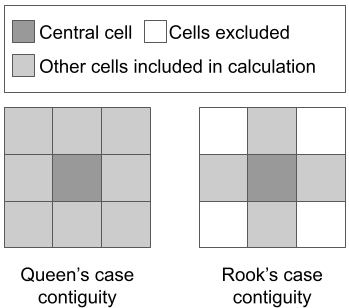

----------------------------------------------
Calculating biomass and forest change in SEPAL
----------------------------------------------

1. Background
--------------

In this exercise, you will learn how to use the BIOmass Tool for Alos (BIOTA) to calculate above-ground biomass in dry forests and savannas, as well as a change type map.

The BIOTA tool is part of the Sattelite Monitoring for Forest Management (SMFM) project by the World Bank, and it was developed by `LTS International <https://ltsi.co.uk/>`_ and the `University of Edinburgh <https://www.ed.ac.uk/geosciences>`_. The tool relies on the use of JAXA's `ALOS PALSAR <https://www.eorc.jaxa.jp/ALOS/en/about/palsar.htm>`_ L-band mosaics. The tool allows you to produce outputs of:

-   Calibrated Gamma0 backscatter
-   Forest cover
-   Above-ground biomass
-   Above-ground biomass change
-   Classified forest change types (deforestation, degradation, etc)

More information can be found online at https://www.smfm-project.com/.

2. Learning objectives
-----------------------

* Generate maps of above-ground biomass (AGB), Gamma0 backscatter, forest cover, AGB change, deforestation risk, and change type. 

2.1 Pre-requisites
===================

* A SEPAL account. Please check the tutorial "An introduction to SEPAL" under tool "SEPAL" here on OpenMRV.

3. Tutorial: The BIOTA tool
---------------------------

3.1 Opening BIOTA
=================

Navigate to the **Apps** menu by clicking on the wrench icon and typing "SMFM" into the search field. Select "SMFM Biota".

.. note::

    Sometimes the tool takes a few minutes to load. Wait until you see the tool's interface. In case the tool fails to load properly, as seen below, please close the tab and repeat the above steps. If this does not work, reload SEPAL.

    .. figure:: images/biota_fail.png
        :alt: Failure of the BIOTA tool.
        :align: center

    If none of these steps work, you might need to start another instance. Please check the tutorial "An introduction to SEPAL" under tool "SEPAL" here on OpenMRV for steps on how to use the terminal to start a higher instance. A 'm4' instance should be enough.

You should see an interface like the one below. 

.. figure:: images/biota_interface.png
    :alt: The SMFM BIOTA interface.
    :align: center

.. tip::

    Depending on your computer screen size, sometimes the left column will be on top of the content, as seen below:

    .. figure:: images/biota_column.png
        :alt: Left column on top of the tool.
        :align: center

    If this is the case, you can:
    
    -   Adjust your browser zoom level, or

    .. figure:: images/biota_chrome.png
        :alt: Example of how to adjust the zoom level on Google Chrome.
        :align: center

    -   Keep the zoom level but click outside of the column to hide it. Then, to open it again, you will need to click on the three dots located at the top right side.

    .. figure:: images/biota_three_dots.png
        :alt: How to show the left column again.
        :align: center

3.2 Downloading the ALOS mosaics
================================

The first step is to select the parameters for accessing data from ALOS (JAXA). The data is delivered in either 1x1 degree tiles or 5x5 degree collections of tile into SEPAL.

Under :code:`Required Inputs` you need the define Latitude and Longitude coordinates. To do so, click on your point of interest on the map that is shown on the right side - this will be the upper-left coordinate of the tiles. The default values are -75 degrees for Longitude and 0 degrees for Latitude. For this exercise, we will demonstrate the steps for Tanzania (Latitude -2.54, and Longitude 31.04 - a point in-between the Moyowosi Game Reserve and the Kigosi Game Reserve, next to the border of the Getta and Kigoma regions).

.. figure:: images/biota_map.png
    :alt: Selecting a point on the map.
    :align: center

.. note::

    The BIOTA tool was designed for woodlands and dry forests as it uses a generic equation to calibrate Gamma0 backscatter to forest AGB developed using forest plot data from Mozambique, Tanzania, and Malawi, in southern Africa. For global applicability, the tool supports the calibration of country-specific backscatter-AGB relationships through determined parameters that will be explained later.

Next, we define the two years of interest. For this exercise, we will leave the default values, 2016 for Year 1 and 2017 for Year 2. Year 2 is used for calculating changes.

The tool gives you the option to choose either 1x1 or 5x5 degree tile size. We will select 1x1 tile size for time purposes.

Before selecting :code:`Download Images`, we will look into the :code:`Optional Inputs` tab.

.. figure:: images/biota_optional_inputs_tab.png
    :alt: Location of the optional inputs tab.
    :align: center

Different parameters can be changed here. These include the parameters that should be calibrated according to your area of interest and specific forest characteristics. Default values are specific to southern African forests.

+----------------------------+---------------------------------------------------------------------------------------------------------------------------------------------------------------------------------------------------------------------------------------------------------------------------------------------+
| **Parameter**              | **Role**                                                                                                                                                                                                                                                                                    |
+----------------------------+---------------------------------------------------------------------------------------------------------------------------------------------------------------------------------------------------------------------------------------------------------------------------------------------+
| Lee Filter                 | Applies a Lee filter to the data. This reduces inherent speckle noise in SAR imagery. Uncheck if you do not want the filter applied.                                                                                                                                                        |
+----------------------------+---------------------------------------------------------------------------------------------------------------------------------------------------------------------------------------------------------------------------------------------------------------------------------------------+
| Window size                | Lee filter window size. Defaults to 5 x 5 pixels.                                                                                                                                                                                                                                           |
+----------------------------+---------------------------------------------------------------------------------------------------------------------------------------------------------------------------------------------------------------------------------------------------------------------------------------------+
| Downsample factor          | Applies downsampling to inputs by specifying an integer factor to downsample by. Defaults to 1 - no downsampling.                                                                                                                                                                           |
+----------------------------+---------------------------------------------------------------------------------------------------------------------------------------------------------------------------------------------------------------------------------------------------------------------------------------------+
| Forest threshold           | A forest AGB threshold (in tonnes per hectare) to separate forest from non-forest (specific to your location). Defaults to 10 tC/ha.                                                                                                                                                        |
+----------------------------+---------------------------------------------------------------------------------------------------------------------------------------------------------------------------------------------------------------------------------------------------------------------------------------------+
| Area threshold             | A minimum area threshold (in hectares) to be counted as forest (e.g. a forest patch must be greater than 1 ha in size). Defaults to 0 ha.                                                                                                                                                   |
+----------------------------+---------------------------------------------------------------------------------------------------------------------------------------------------------------------------------------------------------------------------------------------------------------------------------------------+
| Change area threshold      | A threshold for a minimum change in forest area required to be flagged as a change. Defaults to 2 ha. This is for users who aim to produce change maps.                                                                                                                                     |
+----------------------------+---------------------------------------------------------------------------------------------------------------------------------------------------------------------------------------------------------------------------------------------------------------------------------------------+
| Change magnitude threshold | The minimum absolute change in biomass (in tonnes per hectare) to be flagged as a change. Defaults to 15 tC/ha.This is for users who aim to produce change maps.                                                                                                                            |
+----------------------------+---------------------------------------------------------------------------------------------------------------------------------------------------------------------------------------------------------------------------------------------------------------------------------------------+
| Contiguity                 | The criterion of contiguity between two spatial units. The rook criterion defines neighbors by the existence of a common edge between two spatial units. The queen criterion is somewhat more encompassing and defines neighbors as spatial units sharing a common edge or a common vertex. |
+----------------------------+---------------------------------------------------------------------------------------------------------------------------------------------------------------------------------------------------------------------------------------------------------------------------------------------+
| Polarisation               | Which SAR polarisation to use. Defaults to HV.                                                                                                                                                                                                                                              |
+----------------------------+---------------------------------------------------------------------------------------------------------------------------------------------------------------------------------------------------------------------------------------------------------------------------------------------+

We will leave the parameters with default values.

.. figure:: images/biota_optional_inputs.png
    :alt: Optional parameters screen.
    :align: center

Now, go back to the :code:`Required Inputs` tab and click :code:`Download Images` at the bottom. This will download all ALOS data tiles into your SEPAL account.

.. note::

    Depending on your point coordinates, it may take a significant amount of time before your data finish downloading. For the point in Tanzania, it should take about 5 minutes.

You can see the status of the downloads at the bottom of the page.

.. figure:: images/biota_download_status.png
    :alt: Status about the download.
    :align: center

Once the downloads are finalized for both years, you are able to see the downloaded files under the SEPAL :code:`Files`. Go to :code:`module_results` > :code:`smfm` > :code:`data`. 

.. figure:: images/biota_files.png
    :alt: SEPAL Files with downloaded data.
    :align: center

You can view a demonstration of the above steps on `YouTube <https://youtu.be/d759Aqi85HE>`_.

3.3 Processing the data and producing outputs
=============================================

Now that the download finished, we can process the data to produce the desired outputs.

Click on the :code:`Process` tab on the left side.

.. figure:: images/biota_process.png
    :alt: BIOTA Process window.
    :align: center

For Year 1, we will choose "Forest property" - this will automatically check all outputs available ("Gamma0", "Biomass", "Forest Cover"). For Year 2 we will choose "Forest Change" (changes between 2016 and 2017), which will also select all available outputs ("Biomass change", "Change type", "Deforestation risk"). These will be explained later. Now, click on :code:`Get Outputs` to start the processes.

.. figure:: images/biota_process_get.png
    :alt: Select outputs and start the process by clicking on "Get outputs".
    :align: center

.. note::

    Depending on your point coordinates, it may take a significant amount of time before your data finish downloading. For the point in Tanzania, it should take about 2 minutes.

Similarly to before, the tool will show the process status at the bottom. You will also note a change of color from white to yellow next to each output. White means not started, Yellow means processing and Green means finalized.

.. figure:: images/biota_output_processing.png
    :alt: Status of outputs.
    :align: center

Once done, you will see a message similar to the one below, and all outputs will have a green "light". 

.. figure:: images/biota_output_done.png
    :alt: Process finalized.
    :align: center

You can view a demonstration of the above steps on `YouTube <https://youtu.be/OMGESeERRGo>`_.

3.4 Displaying your outputs
===========================

With the outputs processed, we can now visualize the results.

On the same window, under :code:`Display Outputs`, you can select the process to display by clicking on the dropdown 'Select process' option.

First select Biomass. Then press :code:`Display`. You will see the map pop up on your screen:

.. figure:: images/biota_display.png
    :alt: Biomass map.
    :align: center

This is showing above-ground biomass in tonnes per hectare (tC/ha) for the 1x1 degree tile in Tanzania. To go back to the interface and select the other outputs, you can click anywhere on the screen outside of the map and do the same for the other results.

If you followed these exact steps, your outputs should look similar to the ones below: 

.. figure:: images/biota_all.png
    :alt: BIOTA outputs for Tanzania.
    :align: center

A summary of each output is described in the table below:

+--------------------+------------------------------------------------------------------+
| **Output**         | **Description**                                                  |
+--------------------+------------------------------------------------------------------+
| Gamma0             | Gamma0 backscatter in decibels for the polarization specified    |
+--------------------+------------------------------------------------------------------+
| Biomass            | Biomass in tonnes per hectare                                    |
+--------------------+------------------------------------------------------------------+
| Forest/Woody cover | Binary classification of forested (1) and non-forested (0) areas |
+--------------------+------------------------------------------------------------------+
| Change type        | Change describe in 7 different types. They are specified below   |
+--------------------+------------------------------------------------------------------+
| Biomass change     | Change in biomass in tonnes per hectare                          |
+--------------------+------------------------------------------------------------------+
| Deforestation risk | Risk of deforestation from Low (1) to High (3)                   |
+--------------------+------------------------------------------------------------------+

There are 7 change types described in the BIOTA tool, each of which is defined as a number 0 to 6 and color-coded on the map. Change types are:

+-------------------+-----------------+-------------------------------------------------------------------------------------------------------------------------------------+
| **Change class**  | **Pixel value** | **Description**                                                                                                                     |
+-------------------+-----------------+-------------------------------------------------------------------------------------------------------------------------------------+
| Deforestation     | 1               | A loss of AGB from that crosses the ``forest_threshold``.                                                                           |
+-------------------+-----------------+-------------------------------------------------------------------------------------------------------------------------------------+
| Degradation       | 2               | A loss of AGB in a location above the ``forest_threshold`` in both images.                                                          |
+-------------------+-----------------+-------------------------------------------------------------------------------------------------------------------------------------+
| Minor Loss        | 3               | A loss of AGB that does not cross the ``change_area_threshold``, or ``change_magnitude_threshold``.                                 |
+-------------------+-----------------+-------------------------------------------------------------------------------------------------------------------------------------+
| Minor Gain        | 4               | A gain of AGB that does not cross the ``change_area_threshold``, or ``change_magnitude_threshold``.                                 |
+-------------------+-----------------+-------------------------------------------------------------------------------------------------------------------------------------+
| Growth            | 5               | A gain of AGB in a location above the ``forest_threshold`` in both images.                                                          |
+-------------------+-----------------+-------------------------------------------------------------------------------------------------------------------------------------+
| Aforestation      | 6               | A gain of AGB that crosses the ``forest_threshold``.                                                                                |
+-------------------+-----------------+-------------------------------------------------------------------------------------------------------------------------------------+
| Nonforest         | 0               | Below ``forest_threshold`` in both images.                                                                                          |
+-------------------+-----------------+-------------------------------------------------------------------------------------------------------------------------------------+

You can also use the :code:`Write Raster` option to save this map into your SEPAL account. Once you click on `Write Raster` you should see a message in green informing that your export has been completed.

.. figure:: images/biota_export.png
    :alt: Map export complete for the Change type output.
    :align: center

Then, the file will be located in your SEPAL Files. You can download this map by selecting it and clicking on the Download button at the top right corner. This will download the output as a TIF file that can be used in a GIS software.

.. figure:: images/biota_export_file.png
    :alt: Exported map in the Files.
    :align: center

You can view a demonstration of the above steps on `YouTube <https://youtu.be/my8U5TaV9IU>`_.

3.5 Additional Resources
========================

On the left side, you can access:

-   Source code: this takes you to the source code of the tool, which is a GitHub repository.
-   Wiki: the "README" file of the tool, you can find additional information and instructions about how to use the tool.
-   Bug report: in case you notice a bug or have issues using the tool, use this option to report the bug or issue. This will take you to an issue creation page on the GitHub repository of the tool.

.. figure:: images/biota_resources.png
    :alt: Additional Resources.
    :align: center

4. Frequently Asked Questions (FAQs)
-------------------------------------
   
**The tool doesn't load. What should I do?**
   
The easiest and fastest way to get the tool to load is to launch a higher instance. Please check the tutorial "An introduction to SEPAL" under tool "SEPAL" here on OpenMRV for steps on how to use the terminal to start a higher instance. A 'm4' instance should be enough. 

**What does "Contiguity" mean in the `Optional parameters`?**
    
The criterion of contiguity between two spatial units. The rook criterion defines neighbors by the existence of a common edge between two spatial units. The queen criterion is somewhat more encompassing and defines neighbors as spatial units sharing a common edge or a common vertex:

===================================
    
.. figure:: images/cc.png
    
This work is licensed under a `Creative Commons Attribution 3.0 IGO <https://creativecommons.org/licenses/by/3.0/igo/>`_
    
Copyright 2021, World Bank
    
This work was developed by Andrea Puzzi Nicolau under World Bank contract with the Food and Agriculture Organization and Spatial Informatics Group, LLC for the development of new Measurement, Reporting, and Verification related resources to support countries’ MRV implementation. 
    
| Attribution
Nicolau, A, P. 2021. Calculating biomass and forest change in SEPAL. © World Bank. License: `Creative Commons Attribution license (CC BY 3.0 IGO) <https://creativecommons.org/licenses/by/3.0/igo/>`_
    
.. figure:: images/wb_fcpf_gfoi.png
    
|
    