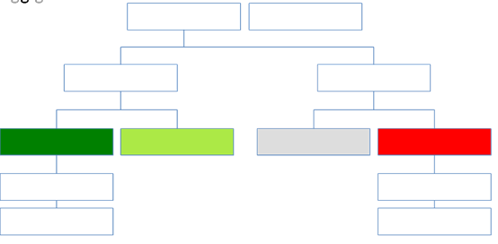

-------------------------------------------------
Exercise 2.1. Response design for classification
-------------------------------------------------

Creating consistent labelling protocols is necessary for creating accurate training data and later, accurate sample based estimates (see Module 4). They are especially important when more than one researcher is working on a project and for reproducible data collection. Response design helps a user assign a land cover / land use class to a spatial point. The response design is part of the metadata for the assessment and should contain the information necessary to reproduce the data collection. The response design lays out an objective procedure that interpreters can follow and that reduces interpreter bias.

In this exercise, you will build a decision tree for your classification along with much of the other documentation and decision points (for more on decision points, please see Module 5, Exercise 5.1).

+--------------------------------------+-----------------------------+
| Objectives                           | Prerequisites               |
+======================================+=============================+
| Learn how to create a classification | None                        |
| scheme for land cover land use       |                             |
| classification mapping.              |                             |
+--------------------------------------+-----------------------------+

Part 1. Specify the classification scheme
------------------------------------------

“Classification scheme” is the name used to describe the land cover and land use classes adopted. It should cover all of the possible classes that occur in the area of interest. Here, you will create a classification scheme with detailed definitions of the land cover and land use classes to share with interpreters.

1. Create a decision tree for your land cover or land use classes. There may be one already in use by your department.  The tree should capture the most important classifications for your study. Here is an example:

  a. This example includes a hierarchical component. For example, the green and red categories have multiple sub-categories, which might be multiple types of forest or crops or urban areas. You can also have classification schemes that are all one level with no hierarchical component.
  b. For this Exercise, we’ll use a simplified land cover and land use classification as in the second image:

|

.. image:: images/classification_scheme.png
   :alt: The classification scheme we will use for this exercise, with two classes forest and non-forest
   :width: 450
   :align: center

|

2. When creating your own decision tree, be sure to specify if your classification scheme was derived from a template, including the IPCC (Intergovernmental Panel on Climate Change) land-use categories, CLC (CORINE land cover), or LUCAS (land cover and land use, landscape).

  a. If applicable, your classification scheme should be consistent with the national land cover and land use definitions.
  b. In cases where the classification scheme definition is different from the national definition, you will need to provide a reason.

3. Create a detailed definition for each land cover and land use and change class included in the classification scheme. We recommend you include measurable thresholds.

  a. Our classification will take place in Brazil, in an area of the Amazon rainforest undergoing deforestation.

    i. We’ll define Forest as an area with over 70% tree cover.
    ii. We’ll define Non-forest as areas with less than 70% tree cover. This will capture urban areas, water, and agricultural fields.

  b. For creating your own classifications, here’s some things to keep in mind:

    i. It is important to have definitions for each of the classes. A lack of clear definitions of the land cover classes can make the quality of the resulting maps difficult to assess, and challenging for others to use. The definitions you come up with now will probably be working definitions that you find you need to modify as you move through the land cover classification process.

       As you become more familiar with the landscape, data limitations, and the ability of the land cover classification methods to discriminate some classes better than others, you will undoubtedly need to update your definitions.

    ii. As you develop your definitions, you should be relating back to your applications. Make sure that your definitions meet your project objectives. For example, if you are creating a map to be used as part of your UNFCCC greenhouse gas reporting documents you will need to make sure that your definition of forest meets the needs of this application.

        The above land cover tree is an excerpt of text from the Methods and Guidance from the Global Forest Observations Initiative (GFOI) document that describes the Intergovernmental Panel on Climate Change (IPCC) 2003 Good Practice Guidance (GPG) forest definition and suggestions to consider when drafting your forest definition. When creating your own decision tree, be sure to specify if your definitions follow a specific standard, e.g., using ISO standard Land Cover Meta-Language (LCML, ISO 19144-2) or similar.

    iii. During this online training course, you will be mapping land cover across the landscape using the Landsat composite, a moderate resolution data set. You may develop definitions based upon your knowledge from the field or from investigating high resolution imagery. However, when deriving your land cover class definitions, it’s also important to be aware of how the definitions relate to the data used to model the land cover.

         You will continue to explore this relationship throughout the exercise. Will the spectral signatures between your land cover categories differ? If the spectral signatures are not substantially different between classes, is there additional data you can use to differentiate these categories? If not, you might consider modifying your definitions.

More resources are available online, for example at http://www.ipcc.ch/ipccreports/tar/wg2/index.php?idp=132.
