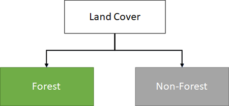

-----------------------------------
Response design for classification
-----------------------------------

1. Background
--------------

Creating consistent labelling protocols is necessary for creating accurate training data and accurate sample based estimates (see the tutorial here on OpenMRV under process "Area estimation / Accuracy Assessment" and tool "SEPAL"). They are especially important when more than one researcher is working on a project and for reproducible data collection. Response design helps a user assign a land cover / land use class to a spatial point. The response design is part of the metadata for the assessment and should contain the information necessary to reproduce the data collection. The response design lays out an objective procedure that interpreters can follow and that reduces interpreter bias.

2. Learning objectives
-----------------------

In this tutorial, you will inform your response design by building a decision tree for your classification.

2.1 Pre-requisites
===================

* None

3. Tutorial: Response design for classification
------------------------------------------------

3.1 Specify the classification scheme
======================================

“Classification scheme” is the name used to describe the land cover and land use classes adopted. It should cover all of the possible classes that occur in the area of interest. Here, you will create a classification scheme with detailed definitions of the land cover and land use classes to share with interpreters.

1. Create a decision tree for your land cover or land use classes. There may be one already in use by your department.  The tree should capture the most important classifications for your study. Here is an example:

  .. figure:: images/land_cover_decision_tree.png
     :alt: Decision tree for land cover
     :width: 450
     :align: center

  a. This example includes a hierarchical component. For example, the green and red categories have multiple sub-categories, which might be multiple types of forest or crops or urban areas. You can also have classification schemes that are all one level with no hierarchical component.
  b. For this tutorial, we’ll use a simplified land cover and land use classification as in this second image:

2. When creating your own decision tree, be sure to specify if your classification scheme was derived from a template, including the IPCC (Intergovernmental Panel on Climate Change) land-use categories, CLC (CORINE land cover), or LUCAS (land cover and land use, landscape).

  a. If applicable, your classification scheme should be consistent with the national land cover and land use definitions.
  b. In cases where the classification scheme definition is different from the national definition, you will need to provide a reason.

3. Create a detailed definition for each land cover and land use and change class included in the classification scheme. We recommend you include measurable thresholds.

  a. For example, suppose the classification will take place in Brazil, in an area of the Amazon rainforest undergoing deforestation.

    i. We’ll define Forest as an area with over 70% tree cover.
    ii. We’ll define Non-forest as areas with less than 70% tree cover. This will capture urban areas, water, and agricultural fields.
    iii. We will use these definitions for the tutorial hosted on OpenMRV under process "Classification" and tool "SEPAL".

  b. For creating your own classifications, here’s some things to keep in mind:

    i. It is important to have definitions for each of the classes. A lack of clear definitions of the land cover classes can make the quality of the resulting maps difficult to assess, and challenging for others to use. The definitions you come up with now will probably be working definitions that you find you need to modify as you move through the land cover classification process.

       As you become more familiar with the landscape, data limitations, and the ability of the land cover classification methods to discriminate some classes better than others, you will undoubtedly need to update your definitions.

    ii. As you develop your definitions, you should be relating back to your applications. Make sure that your definitions meet your project objectives. For example, if you are creating a map to be used as part of your UNFCCC greenhouse gas reporting documents you will need to make sure that your definition of forest meets the needs of this application.

        When creating your own decision tree, be sure to specify if your definitions follow a specific standard, e.g., using ISO standard Land Cover Meta-Language (LCML, ISO 19144-2) or similar.

4. References
--------------

* Chapter 2 of: GFOI (2020) Integrating remote-sensing and ground-based observations for estimation of emissions and removals of greenhouse gases in forests: Methods and Guidance from the Global Forest Observations Initiative. Edition 3.0.  Available online at https://www.reddcompass.org/download-the-mgd

=========================

.. figure:: images/cc.png

This work is licensed under a `Creative Commons Attribution 3.0 IGO <https://creativecommons.org/licenses/by/3.0/igo/>`_

Copyright 2021, World Bank

This work was developed by Karen Dyson under World Bank contract with Spatial Informatics Group, LLC for the development of new Measurement, Reporting, and Verification related resources to support countries’ MRV implementation.

| Attribution
Dyson, K. 2021. Response design for classification. © World Bank. License: `Creative Commons Attribution license (CC BY 3.0 IGO) <https://creativecommons.org/licenses/by/3.0/igo/>`_

.. figure:: images/wb_fcpf_gfoi.png
