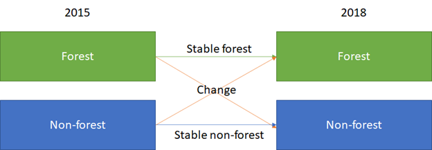

--------------------------
Two date change detection
--------------------------

1. Background
--------------

Image change detection allows us to understand differences in the landscape--or more correctly, in the satellite images taken of the landscape--over time. There are many questions that change detection methods can help answer, including “When did deforestation take place?” and “How much forest area has been converted to agriculture in the past 5 years?”

Most methods for change detection use algorithms backed by statistical methods to extract and compare information in the satellite images. To conduct change detection then, we need multiple mosaics or images, each one representing a point in time.

2. Learning objectives
-----------------------

* Create optical mosaics for change detection using SEPAL.
* Become associated with methods of detecting change for an area of interest using the SEPAL platform.
* Conduct a two-date change detection.

2.1 Pre-requisites
===================

* A SEPAL account. Please see the tutorial here on OpenMRV under tool "SEPAL" for an introduction to SEPAL.
* A GEE account. Please see the tutorial here on OpenMRV under tool "SEPAL" for an introduction to SEPAL.

3. Tutorial: Two date change detection
----------------------------------------

3.1. Create mosaics for change detection
=========================================

Before we can identify change, we first need to have images to compare. We will create two mosaics of Sri Lanka.

1. Open the **Process** menu
2. Click on **Optical Mosaic,** or click the **green plus symbol** to open the **Create Recipe** menu and then click on **Optical Mosaic.**

  a. Choose **Sri Lanka** for the Area of interest (AOI).
  b. Select 2015 for the Date (DAT).
  c. Select Landsat 8 (L8) as the source (SRC).
  d. In the Composite (CMP) menu, ensure the surface reflectance **(SR) correction** is selected and median is the compositing method.
  e. Your preview mosaic should include imagery for all of Sri Lanka. If it does not, add additional data sources (SRC).

3. Click **Retrieve Mosaic** and select **Blue, Green, Red, NIR, SWIR1, SWIR2,** then select Google Earth Engine Asset, and lastly click retrieve.

.. note::
   If you don’t see the Google Earth Engine asset option, you’ll need to connect your Google account to SEPAL by clicking on your user name in the lower right.

|

.. image:: images/retrieval_mosaic.png
   :alt: The retrieval screen for mosaics.
   :width: 450
   :align: center

|

4. Repeat steps 2 & 3 but change the **Date** parameter to 2020.

.. note::
   It may take a significant amount of time before your mosaics finish exporting.

|

3.2 Start the classification
=============================

Now we will begin the classification. There are multiple pathways for collecting training data. Using desktop GIS, including QGIS and ArcGIS, to create a layer of points is one common approach. Using GEE is another approach. You can also use CEO to create a project of random points to identify. All of these pathways will create a .csv or GEE table that you can import into SEPAL to use as your training data set.

However, SEPAL has a built-in reference data collection tool in the classifier. We will use this tool to collect training data. Even if you use a .csv or GEE table in the future, this is a helpful feature to collect additional training data points to help refine your model.

1. In the **Process** menu, click the green plus symbol and select **Classification.**
2. Add the two Sri Lanka optical mosaics for classification:

  a. Click **Add** and choose either **Saved Sepal Recipe** or **Earth Engine Asset** (recommended).

    i. If you choose **Saved Sepal Recipe**, simply select your 2015 recipe.
    ii. If you choose **Earth Engine Asset**, enter the Earth Engine Asset ID for the mosaic. The ID should look like “users/username/SriLanka2015”.

        Remember that you can find the link to your Earth Engine Asset ID via Google Earth Engine’s Asset tab.

  b. Select bands: Blue, Green, Red, NIR, SWIR1, & SWIR2. You can add other bands as well if you included them in your mosaic.
  c. You can also include **Derived bands** by clicking on the green button on the lower left.
  d. Click **Apply**.
  e. Repeat steps a-d above for your 2020 optical mosaic.

.. image:: images/two_assets.png
   :alt: Two assets ready for classification.
   :align: center

.. warning::
   Selecting **Saved Sepal Recipe** may cause an error stating "Google Earth Engine error: Failed to create preview" at the final stage of your classification. This occurs because GEE gets overloaded. If you encounter this error, please retrieve your classification to GEE.

3.3 Collect change classification training data
================================================

Now that we have the mosaics created, we will collect change training data. While more complex systems can be used, we will consider two land cover classes that each pixel can be in 2015 or 2020: forest and non-forest. Thinking about change detection, we will use three options: stable forest, stable non-forest, and change. That is, between 2015 and 2020 there are four pathways: a pixel can be forest in 2015 and in 2020 (stable forest); a pixel can be non-forest in 2015 and in 2020 (stable non-forest); or it can change from forest to non-forest or from non-forest to forest. If you use this tutorial to guide your own change classification, remember to write down your decisions including how you are thinking about change detection (what classes can change and how), and the imagery and other settings used for your classification.

|

1. In the Legend menu, click **+ Add** This will add a place for you to write your first class label.

  a. You will need three legend entries.
  b. The first should have the number 1 and a Class label of Forest.
  c. The second should have the number 2 and a Class  label of Non-forest.
  d. The third should have the number 3 and a Class label of Change.
  d. Choose colors for each class as you see fit.
  e. Click **Close**.

.. image:: images/3_classes.png
   :alt: Classification legend.
   :align: center

|

2. Now, we’ll create training data. First, let's pull up the correct imagery. Click on "Select layers to view." As a reminder, available base layers include SEPAL (Minimal dark Sepal default layer), Google Satellite, and Planet NICFI composites.

  a. We will use the Planet NICFI composites for this example. The composites are available in either RGB or false color infrared (CIR). Composites are available monthly after September 2020 and for every 6 months prior back till 2015.
  b. Select Dec 2015 (6 months). Both RGB and CIR will be useful, so choose whichever you prefer.
  c. You can also select "Show labels" to enable labels that can help you orient yourself in the landscape.
  d. You will need to switch between this Dec 2015 data and the Dec 2020 data to find stable areas and changed areas.

.. note::
   If you have collected data in QGIS, CEO, or another program, you can skip the following steps. Simply click on **TRN** in the lower right. Click **+ Add** then upload your data to SEPAL. Then skip ahead to Step 12.

3. Now click on the point icon. When you mouse over this icon, it says "Enable reference data collection."
4. With reference data collection enabled, you can start adding points to your map.
5. Use the scroll wheel on your mouse to zoom in to the study area. You can click-hold and drag to pan around the map. Be careful though, as a single click will place a point on the map.

   If you accidentally add a point, you can delete it by clicking on the red **Remove** button.

6. Collect training data for the "Stable Forest" class. Place points where there is forest in both 2015 and 2020 imagery.
7. Collect training data for the "Stable Non-forest" class. Place points where there is not forest in either 2015 or 2020. You should include water, built up areas, bare dirt, and agricultural areas in your points.
8. Collect training data for the "Change" class.

  a. If you are having a hard time finding areas of change, you can use the Google satellite imagery to help.

    i. Areas of forest loss often appear as black or dark purple patches on the landscape.
    ii. Be sure to always check the 2015 and 2020 Planet imagery to verify Change.

  b. The CIR (false color infrared) imagery from Planet can also be helpful in identifying areas of change.
  c. You can also use SEPAL's on-the-fly classification to help after collecting a few Change points.

    i. If the classification does not appear after collecting the Stable Forest and Stable Non-forest classes, click on the "Select layers to view" icon.
    ii. Toggle the "Classification" option off, and then on again.
    iii. You may need to click on "CLS" on the bottom right of the screen, then click "Close" to get the classification map to appear.
    iv. With the Classification map created, you can find change pixels and confirm whether they are change or not by comparing 2015 and 2020 imagery.

  d. One trick for determining change is to place a "Change" point in an area of suspected change. Then you can compare 2015 and 2020 imagery without losing the place you were looking at. If it is not Change, you can switch which classification you have identified the point as.

.. image:: images/finding_change.png
   :alt: Using Google imagery to examine areas for change.
   :align: center

9. Continue collecting points until you have approximately 25 points for Forest and Non-forest classes and about 5 points for the Change class. More is better. Try to have your points are spread out across Sri Lanka.
10. If you need to modify classification of any of your data points, you can click on the point to return to the classification options. You can also remove the point in this way.
11. When you are happy with your data points, click on the **AUX** button in the bottom right. Select "Terrain" and "Water". This will add auxiliary data to the classification.
12. Click on the **CLS** button in the bottom right. You can change your classification type to see how the output changes.
13. If it has not already, SEPAL will now load a preview of your classification.

.. image:: images/change_detection_model_preview.png
   :alt: A preview of the change detection model output.
   :width: 450
   :align: center

|

3.5 Two date classification retrieval
======================================

Now that the hard work of setting up the mosaics and creating and adding the training data is complete, all that is left to do is retrieve the classification.

1. To retrieve your classification as an EE asset, click the cloud icon in the upper right to open the **Retrieve** panel.
2. Select **Google Earth Engine Asset** or **SEPAL Workspace.** Select GEE Asset if you would like to share your map or if you would like to use it for further analysis. Select SEPAL Workspace if you would like to use the map internally only.
3. Choose 30 m resolution.
4. Select the Class, Class probability, Forest % and Non-forest % bands.
5. Click **Retrieve.**

3.6 Quality assurance and quality control
==========================================

Following analysis you should spend some time looking at your change detection in order to understand if the results make sense. This allows us to visualize the data and collect additional training points if we find areas of poor classification.

With SEPAL you can examine your classification and collect additional training data to improve the classification.

.. image:: images/examine_change_detection_map.png
   :alt: Examining your change detection map
   :align: center

|

1. Turn on the imagery for your Classification and pan and zoom around the map.
2. Compare your Classification map to the 2015 and 2020 imagery. Where do you see areas that are correct? Where do you see areas that are incorrect?
3. If your results make sense, and you are happy with them, great!
4. However, if you are not satisfied, collect additional points of training data where you see inaccuracies. Then re-export the classification following the steps above.

4. Frequently Asked Questions (FAQs)
-------------------------------------

**I am getting an error stating "Google Earth Engine error: Failed to create preview" at the final stage of my classification. Help!**

Selecting **Saved Sepal Recipe** may cause an error stating "Google Earth Engine error: Failed to create preview" at the final stage of your classification. This occurs because GEE gets overloaded. If you encounter this error, please retrieve your classification to GEE.

**I don't see the option to export my mosaic or classification to Google Earth Engine.**

If you don’t see the Google Earth Engine asset option, you’ll need to connect your Google account to SEPAL by clicking on your user name in the lower right.

===================================

.. image:: images/cc.png

|

This work is licensed under a `Creative Commons Attribution 3.0 IGO <https://creativecommons.org/licenses/by/3.0/igo/>`_

Copyright 2021, World Bank

This work was developed by Karen Dyson under World Bank contract with the Food and Agriculture Organization and Spatial Informatics Group, LLC for the development of new Measurement, Reporting, and Verification related resources to support countries’ MRV implementation. 

| Attribution
Dyson, K. 2021. Two date change detection. © World Bank. License: `Creative Commons Attribution license (CC BY 3.0 IGO) <https://creativecommons.org/licenses/by/3.0/igo/>`_

.. image:: images/wb_fcpf_gfoi.png

|
