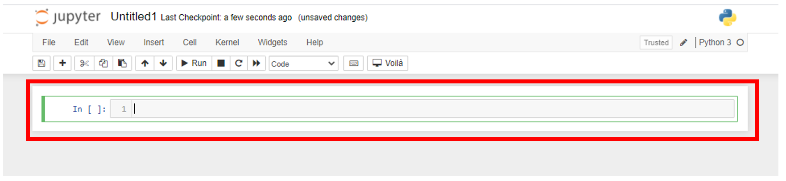
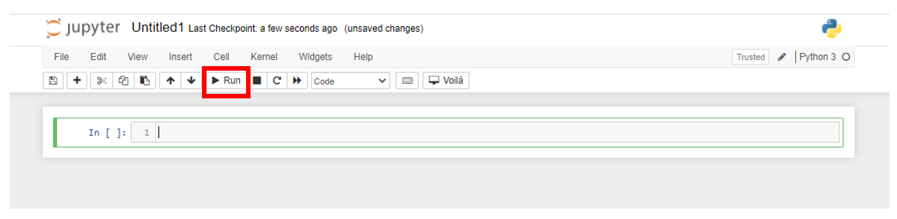
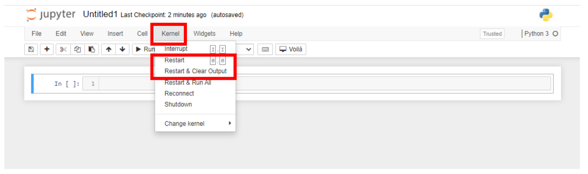
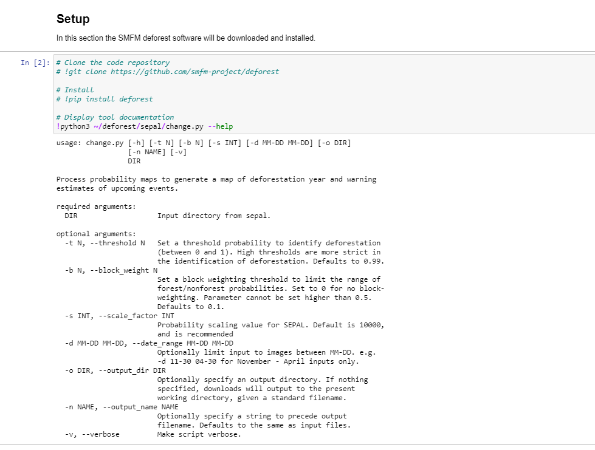
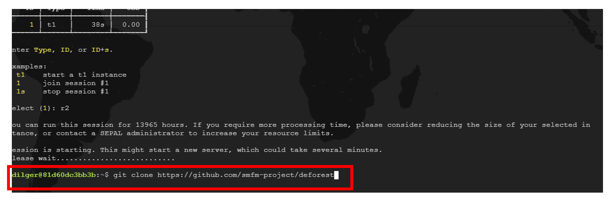
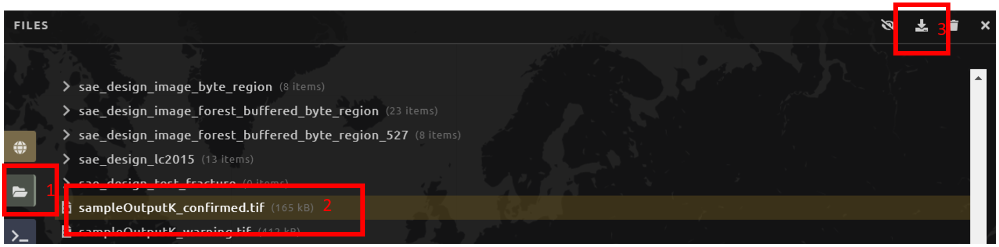
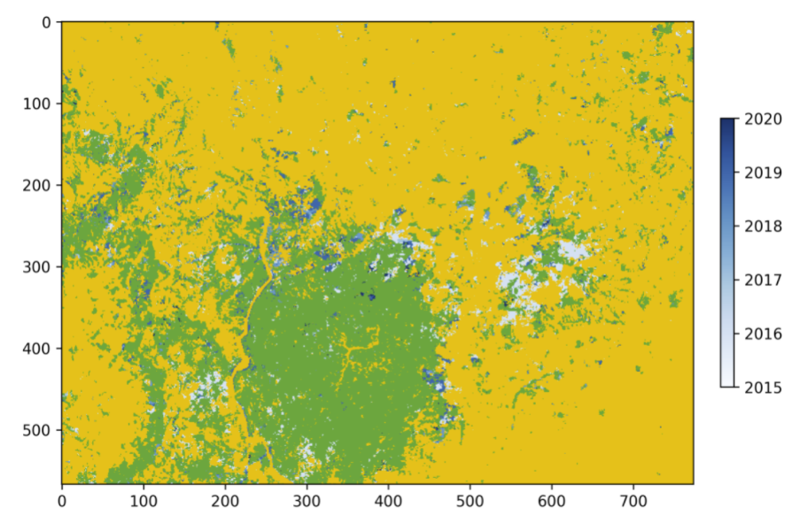
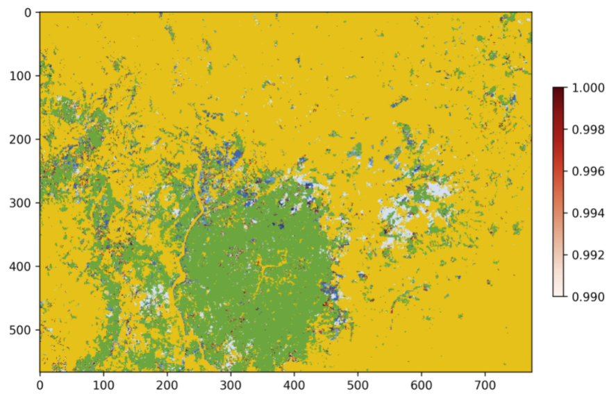

-----------------------------------------
SMFM Deforest tool
-----------------------------------------

1. Background
--------------

The DEnse FOREst Time Series (deforest) tool is a method for detecting changes in forest cover in a time series of Earth observation data. As input it takes a time series of forest probability measurements, producing a map of deforestation and an 'early warning' map of unconfirmed changes. The method is based on the 'Baysian time series' approach of `Reiche et al. (2018) <https://www.sciencedirect.com/science/article/abs/pii/S0034425717304959?via%3Dihub>`_.

The tool was designed as part of the Satellite Monitoring for Forest Management (SMFM) project. The SMFM project (2017 - 2020) aimed to address global challenges relating to the monitoring of tropical dry forest ecosystems, and was conducted in partnership with teams in Mozambique, Namibia and Zambia. For more informaton, see https://www.smfm-project.com/.

Full documentation is hosted at http://deforest.rtfd.io/.

This module should take you approximately 1-2 hours.

2. Learning objectives
-----------------------

We will use the SMFM Deforest tool to create images of deforestation by year and a probability of future deforestation based on a time series of forest probability images. 

* Map deforestation for a time period
* Map and identify areas that could possibly deforested in the future.

2.1 Pre-requisites
===================

* A SEPAL account. Please see the tutorial here on OpenMRV under tool "SEPAL" for an introduction to SEPAL.

3. Tutorial: SMFM Deforest
---------------------------

3.1 [Optional] Jupyter notebooks introduction
=============================================


If you are unfamiliar with Jupyter notebooks this section is meant to get you aquatinted enough with the system to successfully run the SMFM Deforest tool. A notebook is significantly different than most SEPAL applications, but they are a powerful tool used in data science and other disciplines.

1. Cells

   Every notebook is broken into *cells*. Cells can come in a few formats, but typically they will be either **markdown** or **code**. Markdown cells are the descriptive text and images that accompany the coded to help a user understand the context and what the code is doing. Conversely, code cells run code or a system operation. There are many different languages which can be used in a Jupyter notebook. For this tool we will be using Python. 





2. Running cells
   
   To run a cell, click on the cell then locate and click the *Run* button in the upper menu. You can run a cell more quickly using the keyboard shortcut **shift-enter**.




3. Kernel
   
   The kernel is the computation engine that executes the code in the jupyter notebook. In this case it is a python 3 kernel. For this tutorial you do not need to know much about this, but if you notebook freezes or you need to reset for any reason you can find kernel operations on the tool bar menu.

   Restarting the kernel:
     a. Navigate to the tool bar at the top of the notebook and select *Kernel*.
     b. From the dropdown menu, select *restart Kernel and Clear Outputs*




3.2 Data preparation
=====================

For this exercise we will be using the sample data that is included with the tool. Additionally, instructions are given on how to create an time series of forest probability using tools with the SEPAL platform.

.. warning::
   SMFM Deforest is still in the process of being adapted for use on SEPAL. The forest probability time series will be derived from existing methods to produce a satellite time series implemented on SEPAL. 

This tutorial will use the demo data that is packaged with the SMFM Deforest tool, but steps are presented on how to use the current SEPAL implementation with the tool. Note though, that the data preparation steps in SEPAL can take many hours to complete. If you are unfamiliar with any of the preparations steps, please consult the relevant modules.

If you already have a time series of percent forest coverage feel free to use that.

1. Download demo data

   1. Navigate to your SEPAL **Terminal**.
   2. Start a new instance or  join your current instance.
   3. Clone the deforest Github repository to your SEPAL account using the following command.
   
   ``` git clone https://github.com/smfm-project/deforest ``` 
   
2. Use SEPAL workflow to generate time series of forest probability images

   1. Create an optical mosaic for your area of interest using the Process tab Optical Mosaic process. If this is unfamiliar to you, please see the tutorials here on OpenMRV under process "Mosaic generation with SEPAL".

   2. Save the mosaic as a recipe.

   3. Open a new classification and point to the optical mosaic recipe as the image to classify. Use the Process tab Classification process. If this is unfamiliar to you, please see the tutorials here on OpenMRV under process "Classification".   

      1. Select the bands you want to include in the classification.
      2. Add forest/non-forest training data.
 
         1. Sample points directly in SEPAL.
         2. Optionally, use Earth Engine asset. 
   
      3. Apply the classifier.
      4. Select the **%forest output**.
      5. Save the classification as a recipe.
   
   1. Open a new time-series

      1.  Select the same area of interest as your mosaic. 
      2.  Choose a date range for the time series.
      3.  In the 'SRC' box select satellites you used in the previous steps and the classification to apply.
      4.  Then you can download the time series to your SEPAL workspace.

.. note::
   It will take many hours to download the classified time series to your account depending upon how large your area of interest is.

3.3 Setup Deforest tool
=======================

Navigate to the **Apps** menu by clicking on the wrench icon and typing "SMFM" into the search field. Select "SMFM Deforest".

.. note::
   Sometimes the tool takes a few minutes to load. Wait until you see the tool's interface. In case the tool fails to load properly, please close the tab and repeat the above steps. If this does not work, reload SEPAL.

1. Click and run the first cell under the **Setup** header. This cell runs two commands, the first installs the deforest Python module and the second runs the **--help** switch to display some documentation on running the tool.
   
   1. If the help text is output beneath the cell, move onto the 3rd step. If there is an error, continue to step 2. The error message might say:
   
``` python3: can't open file '/home/username/deforest/sepal/change.py': [Errno 2] No such file or directory ```



   Successful setup.

2. Install the package via the SEPAL Terminal
   
   1. Navigate to your SEPAL **Terminal**.
   2. Type *1* to access the terminal of session #1. You can think of a session as an instance of a virtual machine that is connected to your SEPAL account. 
   3. Clone the deforest github repository to your SEPAL account.
    ``` git clone https://github.com/smfm-project/deforest ``` 
   4. Return to the SMFM notebook and repeat step 1.




   

1. Once you have successfully set up the tool, take a moment to read through the help document of the deforest tool that is output below the Jupyter notebook cell you just ran. In the next part we will explain in more detail some of the parameters.


3.4 Process the time series
===========================

Processing the time series imagery can be done with a single line of code using the Deforest change.py command line interface.

1. To use the demo imagery, you do not need to change any of the inputs. However, if you are using a custom time series you will need to make some modifications. To change the command to point to a custom time series of percent forest images you will need to update the path to your time series.
Original::

   !python3 ~/deforest/sepal/change.py ~/deforest/sepal/example_data/Time_series_2021-03-24_10-53-03/0/ -o ~/ -n sampleOutput -d 12-01 04-30 -t 0.999 -s 6000 -v 

Example path to time series updated::

   !python3 ~/deforest/sepal/change.py  ~/downloads/PATH_TO_TIME_SERIES/0/ -o ~/ -n sampleOutputT -d 12-01 01-08 -t 0.999 -s 6000 -v 


.. note::
   By default the time series should be downloaded to a **downloads** folder in your home directory and should have another folder in it named **0**. 

1. Parameters

.. csv-table::
   :header: "Name","Switch","Description"
   :widths: 10, 10, 20

   "Output location","-o","output location where images will be saved on SEPAL account"
   "Output name","-n","Output file name prefix"
   "Date range","-d","A date range filter. Dates need to be formatted as '-d MM-DD MM-DD' "
   "Threshold","-t","Set a threshold probability to identify deforestation (between 0 and 1). High thresholds are more strict in the identification of deforestation. Defaults to 0.99."
   "Scale","-s","Scale inputs by a factor of 6000. In a full-scale run this should be set to 10000, here it's used to correct an inadequate classification."
   "Verbose","-v","Prints information to the console as the tool is run."

If you would like to use a time frame other than the example, update the **date range** switch. 


3. Run the **Process the time series** cell.

   1. By default the tool is set to use verbose (-v) output. With this option, as each image is processed a message will be printed to inform us of the progress.

   This cell runs two commands:
      a. The first line is running the SMFM Deforest change detection algorithm (change.py).
      b. After processing the images we print them out to ensure the program runs successfully.

   .. note::
      The exclamation mark (**!**) is used to run commands using the underlying operating system. When we run *!ls* in the notebook it is the same as running *ls* in the terminal.

   The output deforestation image will be saved to the home directory of SEPAL account(home/username) by default. If you want to save your images in a different location it can be changed by adding the new path after the **-o** switch.

   2. (Optional) Download outputs to local computer
   
      1. Navigate to the *Files* section of your SEPAL account.
      2. Locate the output image to download and click to select it. In this case the image is named *sampleOutput_confirmed*.
      3. Click the download icon.
   


      
3.5 Data visualization
======================

Now that we have run the deforestation processing chain, we can visualize our output maps. The outputs of the SMFM tool are two images **confirmed** and **warning**. We will look at the confirmed image first.

1. Run the first **Data visualization** cell of the Jupyter notebook.

   a. If you changed the name of your output file be sure to update the path on line 8 for the variable *confirmed*.



   
   The confirmed image shows the years of change that have been detected in the time series. Stable forest is colored green, non forest is colored yellow, and the change years colored by a blue gradient. 

   It is recommended that the user discards the first 2-3 years of change, or uses a very high quality forest baseline map to mask out locations that weren't forest at the start of the time series. This is needed since our input imagery is a forest probability time series which initially considers the landscape as forest.

Next, we will check out the deforest warning output.

1. Run the second **Data visualization** cell
   



   
   This image shows the combined probability of non-forest existing at the end of our time series in locations that have not yet been flagged as deforested. This can be used to provide information on locations that have not yet reached the threshold for confirmed changes, but are looking likely to be possible. 


You can view a demonstration of the above steps on `YouTube <https://youtu.be/9BswdPlncfM>`_.

3.6 Additional Resources
========================

On the left side, you can access:

-   Source code: this takes you to the source code of the tool, which is a GitHub repository.
-   Wiki: the "README" file of the tool, you can find additional information and instructions about how to use the tool.
-   Bug report: in case you notice a bug or have issues using the tool, use this option to report the bug or issue. This will take you to an issue creation page on the GitHub repository of the tool.

.. figure:: images/biota_resources.png
   :alt: Additional Resources.
   :align: center

4. Frequently Asked Questions (FAQs)
-------------------------------------

**The tool doesn't load. What should I do?**

The easiest and fastest way to get the tool to load is to launch a higher instance. Please check the tutorial "An introduction to SEPAL" under tool "SEPAL" here on OpenMRV for steps on how to use the terminal to start a higher instance. A 'm4' instance should be enough.

**Can the warning probability threshold be increased or decreased?**

The warning probability threshold can be adjusted when creating the warning image (*warn_im*.) Update the *mask* parameter so that *warning <= THRESHOLD*. Where *THRESHOLD* is a deforestation probability value between 0 - 1.

===================================
    
.. figure:: images/cc.png
    
This work is licensed under a `Creative Commons Attribution 3.0 IGO <https://creativecommons.org/licenses/by/3.0/igo/>`_
    
Copyright 2021, World Bank
    
This work was developed by John Dilger under World Bank contract with the Food and Agriculture Organization and Spatial Informatics Group, LLC for the development of new Measurement, Reporting, and Verification related resources to support countries’ MRV implementation. 
    
| Attribution
Dilger, J. 2021. Detecting deforestation with the SMFM Deforest tool in SEPAL. © World Bank. License: `Creative Commons Attribution license (CC BY 3.0 IGO) <https://creativecommons.org/licenses/by/3.0/igo/>`_
    
.. figure:: images/wb_fcpf_gfoi.png
    
|
    
